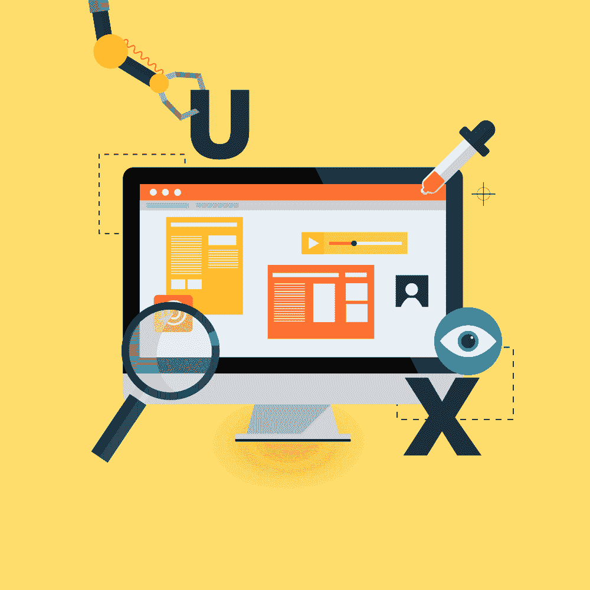
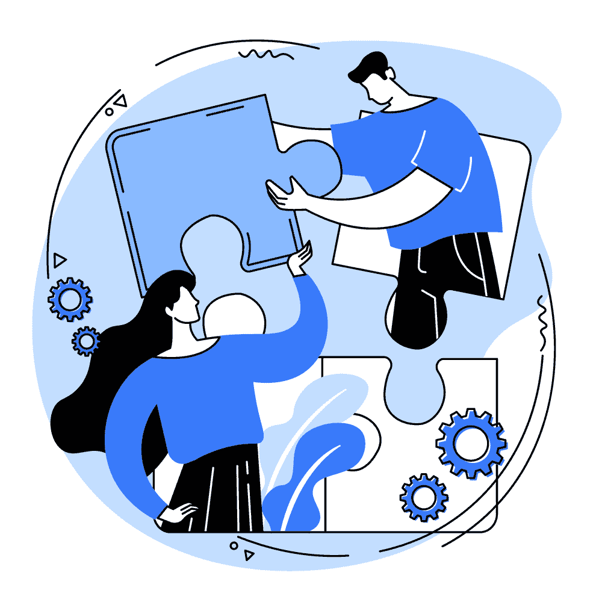

# 关于网络心理学和 UX 你需要知道的一切

> 原文：<https://simpleprogrammer.com/cyberpsychology-and-ux/>

Humans are impressionable beings. Our environment highly influences the way we interact with the world. Every decision that we make has its root in our early experiences and the surroundings we live in.

事实上，可以说我们所做的大多数决定并不完全是我们自己的，而是源于我们童年、家庭、朋友等的个人选择和外部影响的融合。

今天，我们做的很多事情都与技术有关。我们中的许多人被科技唤醒；它提醒我们吃食物，喝水，监测我们的健康，帮助我们购物，甚至让我们入睡。这导致了人类行为的转变。网络成瘾正在增加，其影响如此之大，甚至导致人们出现人格障碍的症状。

网络心理学是心理学的一个分支，旨在理解人类行为和数字技术之间的关系。在这篇文章中，我们看一看心理学的这个领域，并深入研究它，以找出吸引用户到某些设计的因素是什么。我们还将看到网络心理学如何被用来驱动用户动机，让用户参与到设计中来。

## 什么是网络心理学？

[网络心理学](https://www.amazon.com/Cyberpsychology-Introduction-Human-Computer-Kent-Norman-ebook/dp/B06X9YMBYB/ref=sr_1_3?dchild=1&keywords=cyberpsychology&qid=1600844404&s=digital-text&sr=1-3)是对人与技术互动的人类行为的研究。 *cyber* 这个词来源于*控制论*，是对控制和交流的研究，*心理学*是对人类思维和行为的研究。

这项研究涉及技术对人类的影响。对于从事与用户直接交互的技术的设计者和开发者来说，理解用户行为是很重要的。任何不考虑用户想法和行为的开发都将无法与用户建立联系和互动。

网络心理学是理解人类反应的一种手段。诸如为什么人们在网上的行为不同，或者为什么某些产品受欢迎而其他产品被抛弃等问题可以通过钻研网络心理学来回答。

## 是什么驱动了用户动机？

当谈到创造[奇妙的用户体验](https://simpleprogrammer.com/improving-ux-design/)时，驱动用户的是一个关键问题。*是什么触发了用户参与度？*当你知道这个问题的答案时，你开发设计必须走的道路就变得清晰了。一旦概念清楚了，一切就水到渠成了。

为了理解用户动机，我们将看看一个叫做**自我决定理论的心理学理论。**它涉及个人选择背后的*动机*，并表示人们被成长和获得自我实现的需求所驱动。

根据这一理论，三个因素驱动着人类的动机。它们是关联性、能力和自主性。在创造产品时考虑这三个因素将有助于设计出能激发用户参与产品的体验。让我们看看这些因素，看看它们如何适用于 UX 的情况。

### 关联性

人类有一种与生俱来的与他人相关的需求。他们喜欢与群体交往，常常是为了找到一种归属感。这就是为什么人们倾向于把自己和品牌联系在一起。成为一个品牌的成员提供了一种与志同道合的人**联系和确认**的方式。

电子商务企业利用这一点来促进销售。一旦用户联想到一个品牌，他们会反映出一种忠诚的感觉。这将导致他们成为早期采用者或品牌倡导者。

### 能力

人们喜欢通过学习新技能来提高自己。然而，他们只接受他们认为能成功的挑战。一旦他们掌握了一项新技能，他们对它的兴趣就会降低。然后他们需要一个推力来唤起他们的兴趣。

奖励系统是保持竞争精神的有用工具。实现游戏化和进度表等功能可以在用户中创造一种成就感和成长感。

### 自治

The need for control over their environment is present in every human. When an action that they take results in a real change, it empowers and motivates them. People also need freedom of choice.

在你的产品设计中围绕选择创造一个积极的环境，并使用户能够执行任务，这将满足自主的需要。使用针对用户的营销策略，提供有意义的选择，是自治在 UX 设计中得以实现的方式。

将这三个因素结合起来，就有可能激发用户参与你的产品并采取重大行动的动机。

## 用户在线角色与认知失调

在数字世界中，用户通过角色来表达自己。这些人物角色取决于*他们希望自己被如何看待*。每个人都有三个自我——私人的、公共的和理想的。这些自我展示的程度因人而异，导致不同的在线人物角色。

*   **私人自我**:私人自我展示**真实性**。诚实、可信和透明是优先考虑自我的用户应该具备的价值观。他们不太可能与看起来自命不凡的产品互动，而更可能采用正版。
*   **公众自我**:公众自我寻找**崇拜**。与他人的互动和联系是驱动他们的动力。公众自我需要不断的关注和回应。
*   **理想自我:**理想自我表现为**志向**。他们把自己与自我完善、力量和能力联系在一起。提倡这些品质的产品吸引了他们。

### 认知失调

当**与用户的信念**发生冲突时，认知失调就会出现。甚至在用户直接与产品互动之前，他们就会从广告和评论中产生一些先入为主的想法。如果他们在使用你的产品时没有达到预期，认知失调就会出现。如果不和谐变得太大，就会导致用户放弃产品。

通过创造与目标用户的在线角色相关的体验，并在尽可能少的认知失调的情况下实现这些体验，设计师可以成功地创造出用户会喜欢的产品。

## 什么是认知超载？

人脑可能会耗尽内存。当一次给出太多信息时，我们的大脑就会超负荷运转。当这种情况发生时，我们会失去注意力，工作变得不稳定。它让我们做出无能的决定。通过执行正确的 [UI/UX 设计流程](https://aufaitux.com/blog/ui-ux-design-process/)，可以减少认知过载对用户体验的伤害。

造成认知负荷的因素有哪些？让我们看一看:

*   **内在负荷:**这取决于产品的复杂性——它的熟练程度和特性。采用良好的 UI 设计有助于有效管理这一负载。
*   **外来负载:**这是指对内容没有帮助，但需要心理加工的资源。它们对提高设计的可用性没有任何作用。像图像过度使用和令人困惑的动画都是造成这种负载的原因。UX 设计师可以通过应用正确的设计策略完全消除这种负担。
*   相关负载:这是提高设计可用性时不可避免的负载。

显而易见，最小化认知负荷至关重要。让我们来看看几个可以帮助我们的策略。

## 如何最大限度地降低 UX 的认知负荷

通过了解 UX 的[定律，运用心理学来设计产品，就有可能降低认知负荷。可以遵循的一些基本步骤是:](https://www.amazon.com/Laws-UX-Psychology-Products-Services-ebook/dp/B087F24RJB/ref=sr_1_5?dchild=1&keywords=ux+design&qid=1600845293&s=digital-text&sr=1-5)

*   不要给用户过多的选择。尽管选择的自由很重要，但当用户有太多选择时，他们会更难做出决定。用户希望尽可能用最简单的方式做决定，用最少的思考。所以只提供相关的选择。
*   不要多此一举。人们对网站或应用程序应该如何工作有一个预期。当一个设计偏离了这个预期的路径，它就产生了认知上的摩擦。因此，重要的是要遵循标准，不要因为追求创新而用熟悉来赌博。
*   避免可以避免的步骤。用户迈出的每一步都有影响。因此，尽可能自动化操作，尽量减少用户的任务数量。消除冗余，为用户提供实现目标的最短路径。
*   用图像打破文本。使用文本和图像的平衡组合将提高用户的处理能力。人类大脑有独立的视觉和语言处理中心。当它们被用来相互补充时，数据处理变得简单。
*   **组织成结构。**将信息分成相关的小块。它将提高用户的处理能力，并减少认知负荷。

对于一个被用户接受的设计来说，实现高质量的用户界面或 UX 与应用开发所使用的技术一样重要。

## 设计时要考虑的性别因素

Men and women can have different behavioral traits, and this reflects in the way they interact with designs and products. Many men do activities online with a practical purpose, whereas many women are more pleasure-inclined. So while designing, to engage male users, the *goal has to be evident*, and the shortest path to achieving it should be visible. While for women, the *journey toward the goal should be enjoyable* and exciting rather than reaching the goal in haste.

从使用互联网的目的到他们在网上互动的方式，男性和女性之间的差异可能是明显的。通过观察大多数男性和女性使用社交媒体平台的方式，我们可以看到，一般来说，女性使用社交媒体平台进行交流，而男性使用社交媒体平台进行休闲。例如，女性比男性更多地使用 Instagram，与男性相比，她们更多地通过评论进行互动，而男性则主要关注喜欢。

通过了解这些性别差异，并在设计时加以考虑，就有可能创造出一个包容两性的设计。考虑到性别差异，为用户提供两条途径来创造对所有人都有吸引力的体验是最理想的。一个以中性方式迎合观众需求的设计是最佳设计。

## 面向用户的设计的关键因素

在这篇文章中，我们看到了网络心理学如何在创建以用户为中心的设计中发挥重要作用。我们讨论了人类动机的本质以及它是如何影响用户参与设计的。

我们还讨论了用户的**在线角色**以及他们在设计中对用户自我认知的吸引力。然后我们处理了**认知负荷**，看到了它是如何让设计变得复杂和不可理解的。我们讨论了最小化这种负载的方法。最后，我们看看**性别差异**如何在 UX 设计中发挥作用。

设计师可以通过理解这些因素并正确地实施它们来将设计提升到一个新的水平。

Mozilla Firefox 的联合创始人布雷克·罗斯说，“下一个大事件是使上一个大事件可用的事件。”

没有 UX，科技是乏味的。而不了解用户，UX 就是*徒劳*。