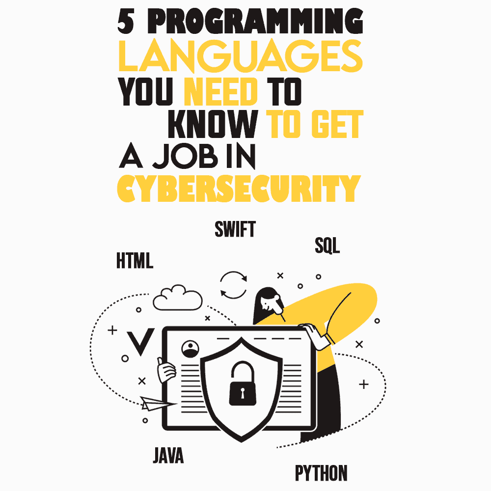

# 找网络安全工作需要知道的 5 种编程语言

> 原文:[https://simple programmer . com/cyber security-programming-languages/](https://simpleprogrammer.com/cybersecurity-programming-languages/)

Even after advancements in security technologies, cybercrimes are still ever-growing. According to a statistic, [cybercrimes are costing businesses about $2.9 million every minute](https://www.fortinet.com/resources/cyberglossary/cybersecurity-statistics). It is mainly because new technologies are regularly emerging, making it difficult to maintain security. With the increase in cyber threats, the cybersecurity field has become one of the most aspiring career choices among undergraduate students.

为了成功地在[网络安全领域建立一个程序员的职业生涯](https://simpleprogrammer.com/cybersecurity-basics-for-new-programmers/)，你需要在某些编程语言方面获得基础到中级水平的技能。了解这些特定的语言将帮助您快速发现几乎任何系统中的安全漏洞，并提供即时解决方案。

由于大多数网络攻击都是通过修改正版应用程序或网站的代码来进行的，因此良好的编码知识将有助于您找到漏洞并修复被修改的代码。此外，您还将有信心成功应对任何组织的黑客攻击企图。

在本帖中，我将列出你进入网络安全领域应该学习的顶级编程语言。

## 超文本标记语言

尽管许多专业的编码人员和程序员可能不认为 HTML 是一种编程语言，但是如果你渴望成为一名网络安全专家，那么 HTML 知识是必不可少的。几乎每一个现代和传统的网站都是用 HTML 编码的，很明显，几乎每一次网络攻击都是通过网站发起的。

网络攻击者主要使用 HTML 将恶意代码注入网页，并进行网络脚本攻击。网络钓鱼还通过操纵 HTML 代码和引诱用户进行欺诈性报价来实现。网络罪犯使用 HTML 创建假冒的真正网站，并非法获取受害者的登录凭据。HTML 知识将帮助您检测欺骗网站，并防止通过恶意网页进行的网络钓鱼尝试。

## Java Script 语言

网站的核心功能是通过 JavaScript 语言定义的。它是当今世界上最受程序员欢迎的语言之一。[超过 97%的网站使用 JavaScript](https://w3techs.com/technologies/details/cp-javascript) 作为客户端编程语言。当你访问任何网站时，弹出窗口、网络应用、搜索栏、事件处理、cookies，一切都是通过 JavaScripts 控制的。

显然，作为一种如此流行和广泛使用的编程语言，JavaScript 成为网络攻击者的热门目标。黑客可以使用 JavaScript 代码来传播脚本病毒，当您导航到受损的网站或网页时，脚本病毒会在后台加载。脚本病毒可能会导致意外下载，并使您陷入无限循环。

此外，由于您的大部分数据存储在 cookies 中，使用 JavaScript，入侵者可能会窃取机密数据并用于非法目的。

如果你精通 JavaScript，你也能控制跨站脚本(XSS)的攻击。这些攻击通过浏览器针对您网站的最终用户。因此，用户会认为你的网站是恶意的，最终造成坏名声。

理解 JavaScript 将有助于您了解黑客的思维方式，并以此帮助您的组织加强网络安全。您的组织将提前为任何脚本攻击做好准备。

## 计算机编程语言

Python 是另一种广泛使用的编程语言，主要用于创建网站、web 应用程序、任务自动化、数据分析和数据可视化。

这种高级脚本语言因其健壮性逐渐受到网络安全专家的欢迎。然而，网络罪犯也在利用它来利用它的功能。使用 Python，网络攻击者可以创建类似于 *AutoSploit* 的黑客工具。由于 Python 附带了一套丰富的现成库，黑客很容易利用这些库。

作为网络安全专家，您可以在许多方面利用 Python。大多数初学者[选择 Python](https://simpleprogrammer.com/5-benefits-of-python/) 而不是其他语言，因为与其他流行语言如 C 或 C++相比，Python 的学习曲线相对较短。程序员用它来自动化安全杂务和进行恶意软件研究。使用 Python 庞大的库，安全团队可以开发用于 web 安全的入侵检测系统和工具，并利用数据、日志和对象来分析问题的根本原因。

## 迅速发生的

Swift 是一种编译编程语言，由 Apple 为其设备(如 iOS、iPadOS、macOS、watchOS 和 tvOS)明确开发。如果你想作为网络安全专家应对 iOS 或 macOS 病毒，Swift 知识是必不可少的。练习 Swift 将有助于您理解 Apple 应用程序的核心开发，并规划保护 Apple 设备的安全程序。

由于网络犯罪分子已经开始对攻击 iOS 或 macOS 系统越来越感兴趣，了解 Swift 编程语言将始终让您在网络安全领域占据上风。

学习 Swift 的好处是，它还没有作为一种语言在程序员中流行起来。与业内其他语言相比，2014 年推出的编程语言仍然很年轻。因此，它在社区中的开发者较少。因此，通过学习并在这方面出类拔萃，你有机会成为苹果独有的网络安全专家。

## 结构化查询语言

Structured Query Language (SQL) is popularly used in managing and accessing the data stored in the database. Using SQL queries, the site administrator can easily access specific information present in the database. Since most websites use SQL for their database, cybercriminals illicitly use it to steal valuable data through SQL injections.

用户名、密码、银行账户信息、社会保险号等所有细节都存储在数据库中，可以通过 SQL 命令访问。黑客构建 SQL 查询来从数据库中获取未加密的密码和其他详细信息。

对于网络安全专业人员来说，理解 SQL 对于确保网站数据库的安全至关重要。如果您能够掌握 SQL，您就可以快速解决数据库问题，并在发生数据泄露时保护数据。

## 学习这些语言，成为网络安全专家

随着网络犯罪失去控制，对网络安全专业人员的需求非常大。如果你想成为一名专家，并在网络安全领域建立自己的事业，编程语言和编码的知识和实践是必要的。我建议你先熟悉以下五种语言，然后开始你的旅程:

HTML、JavaScript、Python、Swift 和 SQL。

虽然不要求完全理解上面列出的所有编程语言，但至少获得基本的洞察力会让你在求职面试或转向网络安全专业时占上风。然而，建议你至少掌握其中一种语言，以便掌握一种特定的专业技能。