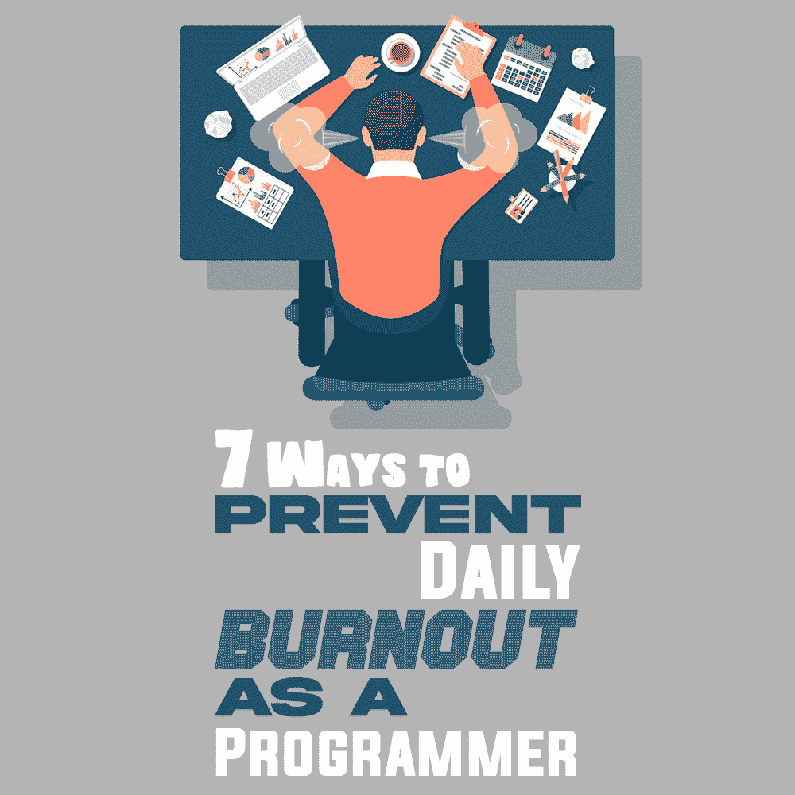
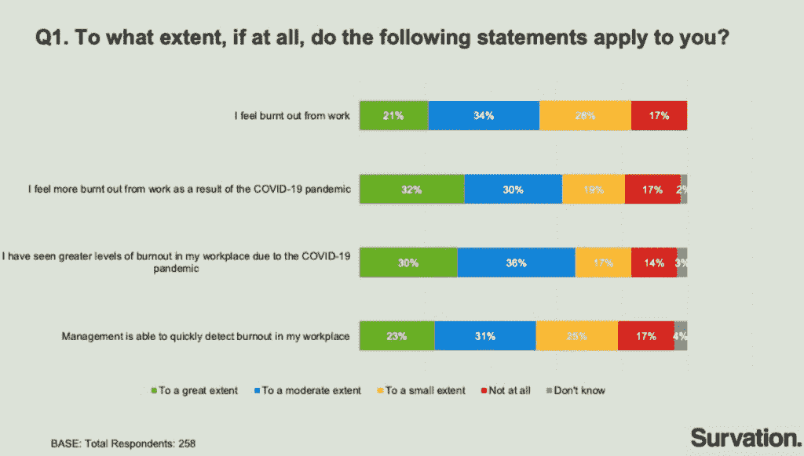
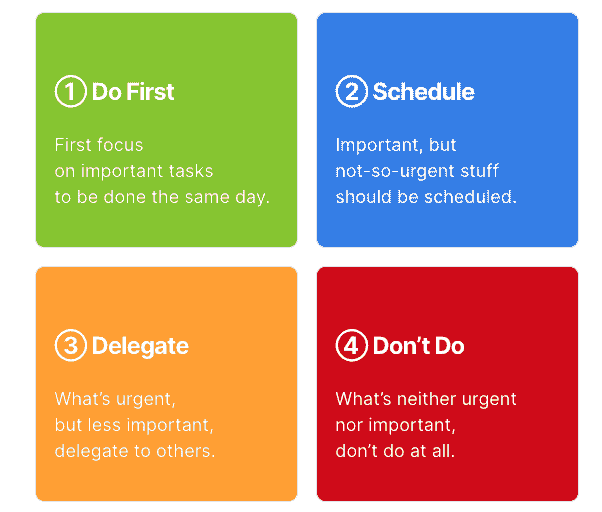
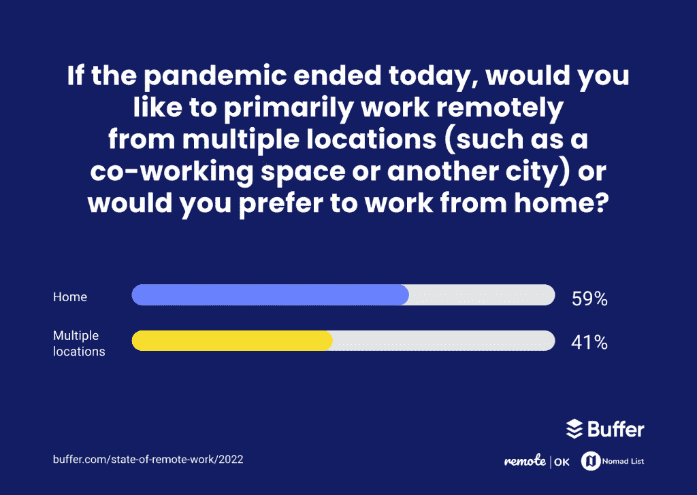

# 作为一名程序员，防止日常倦怠的 7 种方法

> 原文：<https://simpleprogrammer.com/daily-burnout-programmer/>

A programmer’s job may be a dream for many.

然而，它也有自己的压力和工作量。如果你是一名程序员——或者正在考虑成为一名程序员——你需要知道如何防止每天精疲力竭，并找到更好地管理工作生活的方法。

但是什么是日常倦怠，它与一般的倦怠有什么不同？

一般来说，倦怠会随着时间的推移而积累，然后达到一个临界点。然而，每天的精疲力竭是不同的，因为每天都是一场战斗。你可能会感到崩溃，很容易被压倒。

这种情况每天都会发生，而不是长期积累。

对于程序员来说，倦怠太常见了。大约 [83%](https://haystack-books.s3.amazonaws.com/Study+to+understand+the+impact+of+COVID-19+on+Software+Engineers+-+Full+Report.pdf) 的软件工程师报告了职业倦怠。其中，55%的人表示他们感到很大程度上筋疲力尽。

图片来自草堆

即使你还没有面临精疲力竭，知道你应该做什么来保持这种状态也是很重要的。重要的是，不仅要认识到倦怠，还要找到预防倦怠的方法。

## 程序员为什么会面临倦怠？

在我们深入研究如何防止日常倦怠之前，首先理解程序员为什么会面临倦怠是很重要的。以下是一些原因:

*   **高压。作为一名程序员，你可能会因为巨大的工作压力而面临每天的疲惫。编程是一项压力很大的工作，可能会导致精神疲劳，因为它是一项认知密集型工作。短的截止日期会让程序员的情况变得更糟。**
*   **流动性低。**与其他非案头工作不同，编程需要你在一个地方坐上几个小时。你每天都要整天坐在电脑前，这种身体上的不活动会让你感到昏昏欲睡和疲惫。反过来，这可能会导致不健康的生活方式和习惯，这可能会引起怨恨和倦怠。
*   无报酬的工作。你加入目前的工作可能有一系列原因。然而，有可能你会发现它不是很有成就感。在这种情况下，你可能会因为不喜欢自己的工作而开始经历每日疲惫。但是，即使你这样做了，如果你没有合适的同事或者公司有一个有害的环境，你可能会开始感到筋疲力尽。

考虑到这些，现在是时候看看一些警告信号，表明你可能正在经历日常倦怠。

## 你每天都感到疲惫的迹象

当你每天都感到精疲力尽时，会有一些明显的迹象出现。以下是一些你可能会遇到的常见问题:

*   **缺乏动力。你可能会开始感到没有动力，可能会觉得你对编程的热情正在下降。**
*   **疲劳。**无论是身体上还是精神上，如果你感到疲劳，这可能表明你已经筋疲力尽了。
*   **抑郁症。**如果你对工作感到沮丧或焦虑。
*   **感觉孤立无援。与工作脱节的感觉也可能意味着你快累垮了。**
*   **隔离。**如果你在一个团队中工作，并开始感到孤立，这可能意味着你每天都很疲惫。如果你是女性，你的倦怠可能与男性有很大不同。你可以参考[倦怠:解开压力循环的秘密](https://www.amazon.com/dp/1984818325/makithecompsi-20)来了解这一切。

既然你已经了解了倦怠的感觉，让我们来看看你可以做些什么来防止日常倦怠。

## 作为程序员如何防止日常倦怠

这里有一些方法，当你作为一名程序员工作时，你可以用它们来避免每天精疲力竭。

### 优先考虑你的任务

你一天的时间是有限的，所以你要好好利用它。优先处理手头的所有任务，这样你就能准确地知道下一步需要做什么。

你怎么做到的？

首先创建一个[艾森豪威尔矩阵](https://www.amazon.com/dp/B09HG2RXP3/makithecompsi-20)，Y 轴表示重要性，X 轴表示紧急程度。这样，你就有了四个象限(按优先级降序排列):紧急和重要，紧急但不重要，重要但不紧急，不紧急或不重要。

然后，你可以将你的任务分成这四个象限，并根据下面的图表来执行它们。

通过 Flexjobs 的图像

同样重要的是，要考虑你在完成一项任务时所付出的努力。那些能产生最大影响并且需要最少努力的任务能帮助你更好地安排你的工作日。完成这些任务将确保你在一天结束时获得成就感。

还有呢？

如果你必须跳过一些任务，它们不会是最重要的。因此，压力也不会增加。

### 更好地管理你的时间

作为一名程序员，时间是最重要的。如前所述，延长工作时间来完成工作是很容易的。然而，这可能会导致精疲力尽。

如果你觉得你总是缺少时间，你可以开始利用[工具进行项目管理](https://attrock.com/blog/project-management-tools/)，并使用它们来计划你的工作。

它也有助于整合时间管理软件解决方案，因为这可以帮助你跟踪你投入到一项特定任务中的时间。记录你完成每项任务所花的时间可以帮助你在不过度工作的情况下保持对工作的掌控——同时遵守截止日期。当你远程工作时，这也是阻止你整天工作的最好方法之一。

### 找点乐子

能够阻止你的工作胜过你的事情之一是尝试并给编程增加一个有趣的方面。你不必一直做与你的任务相关的编码。

相反，你可以花一点时间做一些有趣的事情，与编码有关，但与你的工作无关。从建立新网站或摆弄新图书馆，你可以做的事情太多了。

虽然你可以在工作时间休息，但这些短暂的休息时间可以在减少日常疲劳的机会方面发挥很大的作用。你甚至可以使用你的[员工参与平台](https://technologyadvice.com/employee-engagement-solutions/)与同事联系，并休息一下。

### 获得良好的工作环境

如果没有合适的设备或软件解决方案，很容易陷入困境。

质量差的设备会使编码成为一个缓慢的过程。软件解决方案也是如此，因为它们可以有很少或很多功能。这些反过来会加快或减慢你的工作效率。

如果你是自由开发人员或远程工作者，你也应该购买合适的家具。这里的原因是许多远程工作者([近 59%](https://buffer.com/state-of-remote-work/2022) )倾向于在家工作。

经由缓冲器的图像

### 充分休息

为了确保你的工作不会变成一件苦差事，开始短暂的假期休息吧。休息会帮助你把注意力放在编程以外的事情上，也会帮助你沉浸在其他的激情中。这些休息时间也可能是周末。

你可以做的事情包括运动、社交、摄影、阅读、钓鱼等等。沉迷于这些活动可以帮助你摆脱一成不变的生活，这可能是减轻你工作压力所需要的一切，反过来，也可以减少你每天的倦怠。

即使在工作时间，你也应该考虑离开办公桌短暂休息一下，因为这可以让你精神焕发，提高工作效率。每隔一两个小时，你应该试着休息 10 分钟，让你的大脑休息一下。这些休息也可以减少感觉筋疲力尽的机会。

### 更改项目

长时间在一个项目上工作会变得非常无聊。你可能会发现这份工作重复而乏味。

为了避免这种情况，你应该考虑不时地改变你的项目。也许你可以在一个项目上工作几个月，然后转到另一个项目。

对于每个项目，你都会经历新的挑战，并且必须想出不同的方法来解决它们。从事不同的项目会帮助你打破常规，可能会给你的工作注入新的活力，这反过来会减少你筋疲力尽的机会。

### 锻炼和睡眠

工作一整天后，你的身体和精神应该得到充分的休息。这就是为什么保证充足的睡眠至关重要。此外，你应该试着每周至少锻炼两到三次。锻炼也会帮助你保持健康。

您可以做的一些其他事情包括:

*   不要工作到深夜
*   尽量保证至少 7-8 小时的睡眠
*   在屏幕上使用夜间照明模式

## 不要在工作中筋疲力尽

程序员的工作压力很大，有时你可能会感到筋疲力尽。这就是为什么有必要找出背后的原因，并了解如何识别倦怠。

基于这些原因，你可以找出需要做什么来防止你经历精疲力竭的阶段。

你可以做的一些事情是更好地计划你的时间，创造一个良好的工作环境，优先考虑你的任务，休息一下找点乐子。

现在你知道如何用这些简单的方法来防止程序员的日常疲劳。所以，去吧，在工作的时候享受更充实的时光。