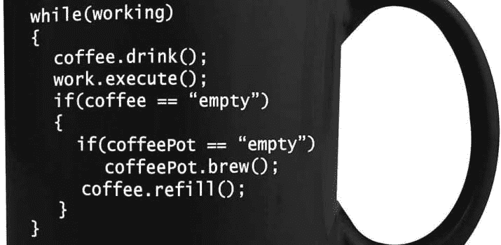

# 程序员日常生活的 12 个现实

> 原文：<https://simpleprogrammer.com/daily-life-programmer/>

程序员的日常生活是怎样的？

程序员的日常生活包括审计和调试代码、编写新软件以及监控已完成程序的性能。更重要的是，程序员必须与同事、客户和他们的老板不断沟通。开发人员的平均工作日跨度为 8 小时。

请继续阅读，了解程序员生活中的 12 个现实:

## 1.你参加每日站立会议

当你思考一个开发者的生活是什么样的时候，这一点经常被忽略。我们都想象孤独的狼在他的电脑前编码。

但是编程工作有一个重要的社会方面:

每天你都在开会讨论你当前的项目和下一步。你和你的团队进行头脑风暴，你被要求报告你的进展，或者你展示新的特性。

因此，即使你是一个更加外向的人，或者你需要每天与人交谈，你也会在编程工作中发现这一点——尽管存在刻板印象。

## 2.作为一名程序员，你花了很多时间来解决问题

作为一名软件开发人员意味着解决问题，并使用代码应用解决方案。

这是你大部分日常工作生活所围绕的:

你得到了一个需要实现的结果。然后由你来想出一个行动方案来达到那个结果。

软件开发人员很吃香，工资也很高，因为他们擅长这种高层次的方法——这是有效解决问题的关键。

它们不仅仅是“*代码自动机*”。

## 3.你每天都在学习

这份工作的本质是你会不断面临新的问题。其中一些需要你还没有的技能——所以你去学习它。

但是在成为软件开发人员的过程中，您已经习惯了:

*   从头开始掌握编程
*   发展新语言技能
*   提高你解决问题的能力

–这些让你变成了超级赢家。

一个开发人员的一生都在阅读书籍和博客，浏览代码库，拆开别人的程序来复制他们的代码原则。

## 4.你喝了很多咖啡

这是老生常谈，但也是事实:许多程序员每天都喝大量的咖啡。

一个原因是对抗睡眠不足。但主要是因为咖啡因让你的大脑高速运转。作为一名开发人员，让自己最棒的工具变得更加活跃的感觉棒极了。

很容易明白为什么这么多程序员沉迷于咖啡！

当然，总有例外。如果你在编码的时候不喝咖啡，那很好。

毕竟，你确实“负债”了，从你的身体里借了额外的“不劳而获”的能量。如果你推得太远，你可能会崩溃。

## 5.你和其他开发者交流

每天你都会和你的程序员同事有一场激烈的争论。

*   你要确保每个人都朝着正确的方向努力
*   你协调当前和未来的任务
*   你展示你的进步并交换意见

在你作为程序员的生活中，你要一起处理棘手的问题和重要的项目。这意味着你会和你的同事变得更亲密。由此可以产生超越工作的友谊。

再次强调，作为一名开发人员，软技能是你工作生涯的重要组成部分。你与他人沟通得越好，你就能更好地解决问题，协调行动，并激励你的同事。

这导致项目完成得更快，质量更高。

## 6.你到处都能看到机会

因为你是通过解决问题的视角来看待生活的，所以你会不断地看到通过使用一个软件来改进事情的方法。

许多程序员通过跟随这些直觉、构建原型并向公众发布而变得富有。总的来说，将软件工程思想应用到生活的其他领域会带来巨大的成功。

成为一个聪明的程序员是一种天赋。无论你追求什么——是攀登职业阶梯，成为环游世界的自由职业者，还是创办自己的公司——你成功的几率都高于平均水平。

## 7.你可以拥有编码之外的生活

是的，很多程序员对编码如此痴迷，以至于把一生都奉献给了编码，几乎是 24/7。下班回家后，他们开始做自己的兼职项目——直到该睡觉的时候才停下来。

但并不是所有的程序员都没有“真实生活”。

典型的开发人员工作是每周 40 小时或更少。所以你还有很多空闲时间。怎么花是你的选择。

的确，编码吸引了“书呆子”型的人——那些喜欢玩游戏、浏览互联网或者在空闲时间继续编码的人。

如果你愿意，作为一名程序员，你可以拥有一个非常外向、活跃和冒险的生活。你只需要足够渴望那种生活方式，并设定一些目标来实现它。

## 8.作为一名程序员，你的生活压力很大

每件事都比你想象的要花两倍的时间。有时候你沿着一条特定的路走下去，却发现它行不通，你需要从头开始。您发现了许多需要在调试过程中修复的 bug。

你的客户通常对你作为程序员的工作不感同身受。他们不能理解这有多难，他们希望尽快得到结果。

当你开始从高层次的角度解决问题时，通常很难确定解决方案的每个小部分，并为每个部分给出一个现实的时间框架。

结果是，作为一名开发人员，你的一生都在追逐最后期限。这是一个不太令人愉快的现实。

你需要适应这种工作:

受到挑战的激励，决心克服一切困难。

## 9.你支持你客户的软件

在你启动了新开发的软件之后，你的工作还没有完成。

你经常被要求为项目提供持续的支持。这包括客户服务、频繁测试 bug 和添加新功能。

为了让你作为开发人员的生活更容易，第一次创建一个高质量的产品是一个好主意——这样你为它服务的任务列表就会变得更短。

公司需要他们信任的人来照看他们的软件。所以，作为一名开发人员，要准备好让这成为你工作的一部分。

## 10.你的工作方式是久坐不动

作为一名软件开发人员，你一天中的大部分时间都是坐着盯着屏幕——通常姿势很糟糕。

如果你想保持身体健康，你需要采取认真的措施来对抗这种久坐不动的生活方式:

*   经常“休息一下眼睛”
*   考虑一个立式办公桌
*   经常调整你的姿势
*   偶尔起来走走

不幸的是，如果没有像这样的策略来保持健康，像“程序员的脖子”这样的情况是不可避免的。

在空闲时间也要尽可能活跃:

散步，做运动，去健身房。这样你就可以扭转每天坐着的负面影响。

## 11.你带回家很多钱

持有美元的软件工程师

程序员生活的额外津贴之一:丰厚的实得工资。

对软件开发人员的需求一直很大，而且越来越大。这是一项能让公司赚到数百万美元的技能。这是一套高级技能——不是每个人都有勇气把编程学到一个好的水平。

由于这些原因，软件开发人员每年的收入在 6 万到 12 万美元之间。自由程序员的时薪可以超过 100 美元。

因此，即使工作压力很大，金钱上的好处也是值得的:

如果你有六位数的薪水，你就能过上舒适的生活。

## 12.你可以去远程或自由职业者

作为一名程序员，并不意味着整天被困在公司的办公室里。

软件开发是一种非常适合远程工作的工作，而且有很多这样的机会。

或者，你可以自己创业——过自由职业者的生活。

然后，你就可以把高薪和在任何你想去的地方工作的自由结合起来，并自由安排自己的工作时间。

## 你的程序员生活之路

为了加快你过程序员生活的速度，请查看免费的清单“*软件开发人员最重要的 4 项技能*”: