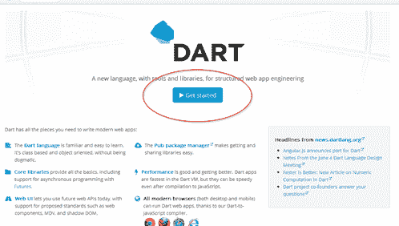
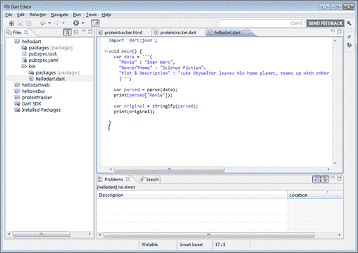
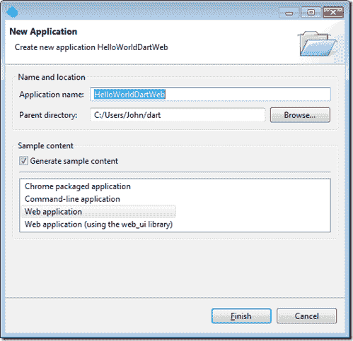
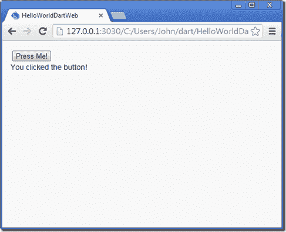

# 开始使用 Google 的 Dart 语言

> 原文：<https://simpleprogrammer.com/dart-language/>

当谷歌第一次宣布 Dart 语言时，我有点怀疑它。

当我看着这种语言的语法时，我认为它似乎并没有提供什么新的东西。

为什么要创造另一种与我们现有的语言没有太大不同的语言呢？

这实际上比 JavaScript 好多少？

但是在与 Dart now 合作了一段时间并制作了关于 Dart 的多视角课程后，我完全改变了我的想法。

## 镖语牛逼！

让 Dart 语言如此令人敬畏的是语言设计者添加到语言中的所有细微之处，而不是任何主要的新概念或想法。

当我开始写 Dart 代码的时候，感觉完全正确。感觉上，我对 C#、Java 和 JavaScript 等语言的所有小烦恼都被 Dart 语言消除了。

事实上，Dart 的真正魅力在于，如果您已经了解 C#或 Java 和 JavaScript，那么您可能能够在不到一个小时的时间内学会足够多的 Dart 语言，从而在 Dart 中高效地工作。

在我向您展示入门是多么容易之前，让我简要地告诉您什么是 Dart 语言:

*   **面向对象。一切都是对象，包括原语和空值**
*   **可选类型。**您可以添加类型注释，静态检查工具可以使用它们来帮助您找到代码中的错误，但您不必使用它们。
*   **解读。** Dart 在 VM 中运行，但没有先编译。进行更改的往返时间非常短。
*   **兼容 JavaScript。**您可以将 Dart 代码编译成 JavaScript，并在任何现代浏览器中运行 Dart 应用程序。
*   **快！Dart 非常快，几乎在所有测试中都比 JavaScript 快得多。**

我喜欢 Dart 语言的一些很酷的语言特性:

*   **Mixins。不使用继承，您可以使用 mixin 向一个类添加功能，而不直接从另一个类继承。**
*   **分离物。**Dart 语言不使用线程，而是使用隔离来实现并发。隔离实际上不能共享任何内存，它们通过消息传递信息。搬起石头砸自己的脚是很难的。
*   **简化的内置类型。**数字可以是 int，也可以是 double，不介意的话用 num 就可以了。列表和映射可以声明为文本。数组只是列表的一个特例。
*   **函数是一级对象。**你可以像传递其他物品一样传递它们。甚至有一个类似 lambda 的简写，用于创建一行程序函数。
*   **顶级函数和变量。**不想把一个函数或者变量放在一个类里？很好，你不必。在 Dart 语言中，您可以在任何地方声明它们。
*   **简化类。**声明将参数赋给类成员的构造函数有一个简写。类成员没有受保护的、私有的、公共的。成员变量自动成为属性。
*   **字符串插值。**没有更多的字符串格式方法，只是在字符串中使用$variableName 来扩展它的值。

## 使用 Dart 语言进行设置

准备好 5 分钟后开始跑步了吗？

好吧，继续读。

**第一步**:进入 http://dartlang.org[点击“开始”](http://dartlang.org)

**第二步:**下载 Dart (64 位或 32 位。)解压文件并将“dart”文件夹复制到您希望安装 Dart 的位置。

该文件夹将包含 Dart 编辑器、Dart SDK 和 Chromium web 浏览器，后者具有内置的 Dart VM。

第三步:跑 DartEditor.exe

就是这样，现在你准备好摇滚一些镖代码！

## 创建您的第一个 Dart 语言应用程序

Dart 语言实际上可以在浏览器之外使用，就像您可以在 Node.js 中使用 JavaScript 一样。但是，大多数开发人员可能希望像我们今天在 web 应用程序中使用 JavaScript 一样使用 Dart。

我将通过一个简单的例子向您展示如何创建一个基本的 Dart 应用程序，它能够响应按钮点击并操作一些 DOM 数据。关于更高级的例子，你可以看看我最近发布的关于用 Dart 创建 Web 应用程序的 [Pluralsight 课程。(在这篇帖子结束之前，我会再插一次这个…等着吧…)](https://simpleprogrammer.com/introduction-building-web-applications-dart)

**第一步:**

进入文件–>新应用程序。

填写您的应用程序名称。我会把我的叫做 HelloWorldDartWeb。

保持“生成样本内容”处于选中状态。

选择“Web 应用程序”

**第二步:**

打开 helloworlddartweb.html 文件，清除 body 元素中的所有内容，只保留底部的两个脚本标签。

第一个脚本标记导入我们实际的 Dart 文件，就像您将 JavaScript 添加到页面中一样。

第二个脚本为浏览器添加了 Dart 支持。

**第三步:**

将以下 HTML 添加到 helloworlddartweb.html 文件的 body 标记中:

这只会创建一个按钮和一个 div。我们将添加一些 Dart 代码来响应按钮单击，并用一些文本填充 div。

**第四步:**

打开 helloworlddartweb.dart 文件，清除 main()中的所有内容，并删除 reverseText 函数。

请注意，在我们的。dart 文件。只有一个导入“dart:html”，用于为 dart 导入 html 库，还有一个 main 函数，它在页面上加载 DOM 内容后立即执行。

**第五步:**

编辑 helloworldweb.dart 文件，使其如下所示:

这段代码只是使用 CSS 选择器来获取按钮。它使用查询功能来完成这项工作。

然后，我们将 *addResult* 函数注册为按钮的 *onClick* 事件的事件处理程序。

在 *addResult* 函数中，我们只需查询 *resultDiv* 并更改其文本。

运行此示例后，您应该会看到如下结果:

**第六步:**

现在更改 Dart 代码，如下所示:

尝试再次运行代码，您应该会看到它完全像以前一样工作。这里，我们只是通过使用简写函数语法将代码缩短为一行。

## 用 Dart 语言更进一步

所以，这只是飞镖的基础。我想向您展示如何快速入门，但我相信您还想了解更多关于 Dart 的内容。

当然，我们可以用 Dart 做更多的事情，尤其是在构建 web 应用程序时。有一个 Dart Web UI 库，可以用来做模板和数据绑定，所以我们可以进一步简化我们的 Dart 代码。

这种语言本身非常简单。大多数 C#和 Java 开发人员，以及 JavaScript 开发人员应该能够在没有任何帮助的情况下阅读和理解 Dart 代码。 [但是这里有一个链接是关于这种语言的概述](http://www.dartlang.org/docs/dart-up-and-running/contents/ch02.html)。

如果您正在寻找关于 Dart 语言的更深入的报道，并希望了解如何使用 Dart 构建一个真正的应用程序，请查看我在 Pluralsight 上的[关于使用 Dart 构建 Web 应用程序的介绍课程，在该课程中，我将介绍整个语言，并指导您构建一个真正的应用程序，以及一些更高级的功能，如 mixins 和 isolates。](https://simpleprogrammer.com/introduction-building-web-applications-dart)

另外，我只能找到两本关于 Dart 语言的书。

*   [克里斯·巴克特的飞镖表演](http://www.amazon.com/gp/product/1617290866/ref=as_li_ss_tl?ie=UTF8&camp=1789&creative=390957&creativeASIN=1617290866&linkCode=as2&tag=makithecompsi-20)
*   Kathy Walrath 和 Seth Ladd

我不知道 Dart 最终是否会取代 JavaScript，但我确实认为 Dart 有潜力。这真的是一种很棒的语言，开发起来很有趣。

这是来自我的强烈赞扬，因为我真的倾向于不喜欢动态语言。Dart 的创建者在创建一种简洁、快速、易于使用的语言方面做得非常好，这种语言具有强类型语言的最佳优点，同时具有 JavaScript 等动态语言的所有灵活性。

## 起床编码和 YouTube 视频

对于那些经常访问我的博客并正在寻找我最新的[起床并编写本周播客](http://getupandcode.com/)集和 YouTube 视频的人，我有一个小小的声明。

我打算每周一开始发布这些博客。

YouTube 视频会在每周三上传。

起床和编码播客将在每周五播出。

当我的新网站设计完成后，你可以在边栏上找到每一集的最新内容，所以我会停止在每周的帖子中包含它们。

但这是上周[起床编码](http://getupandcode.com/)，艾瑞斯和我谈论基础重量训练。

**起床并编码 006:基础重量训练**

[http://media.signalleaf.com/player/Get-Up-And-CODE/52e465ab5f38960200000018/](http://media.signalleaf.com/player/Get-Up-And-CODE/52e465ab5f38960200000018/)

[http://media.signalleaf.com/player/Get-Up-And-CODE/52e465ab5f38960200000018/](http://media.signalleaf.com/player/Get-Up-And-CODE/52e465ab5f38960200000018/)