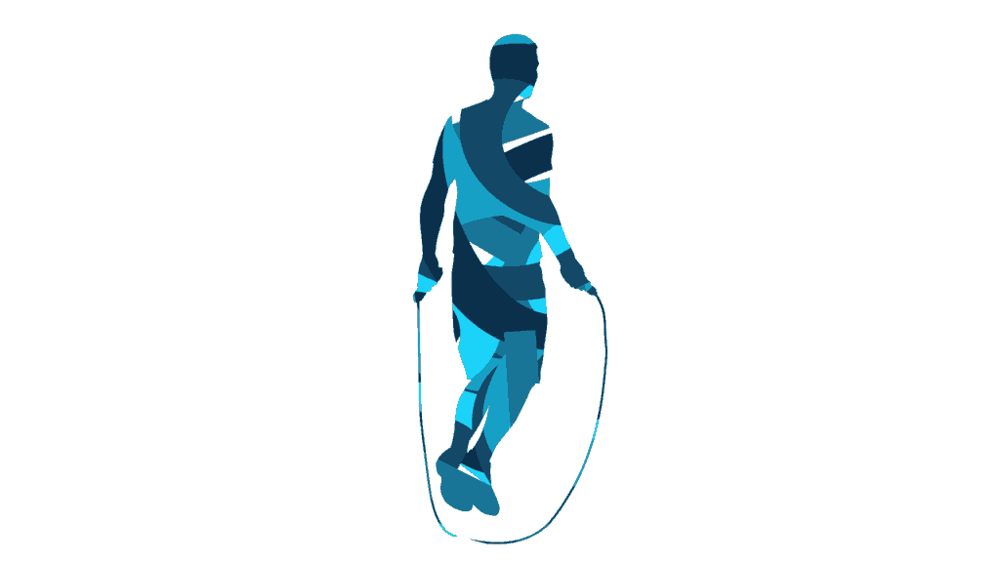
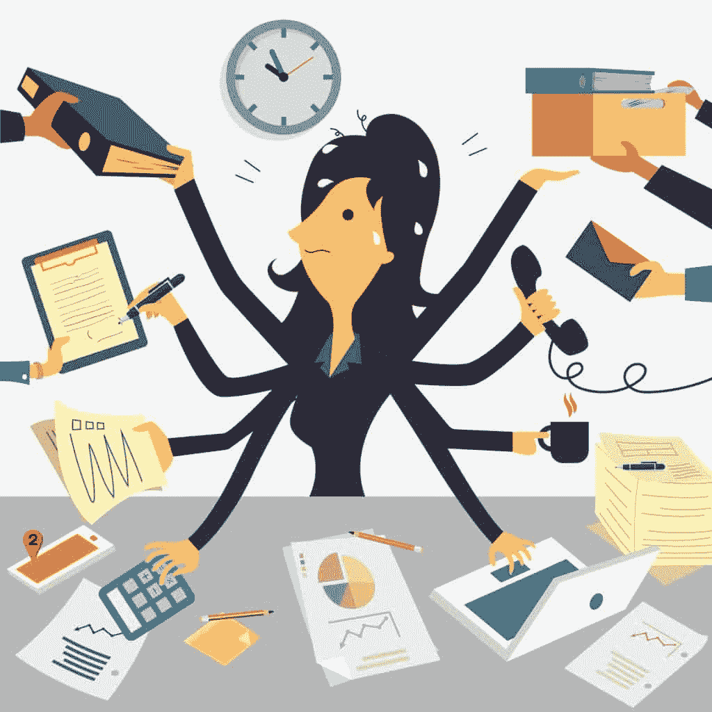
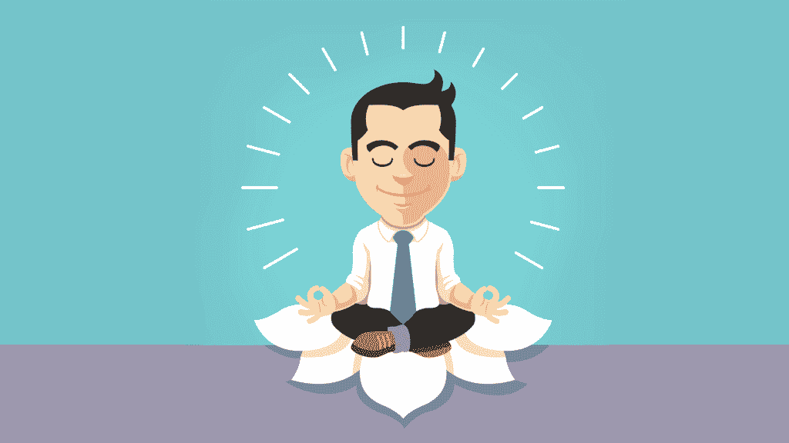
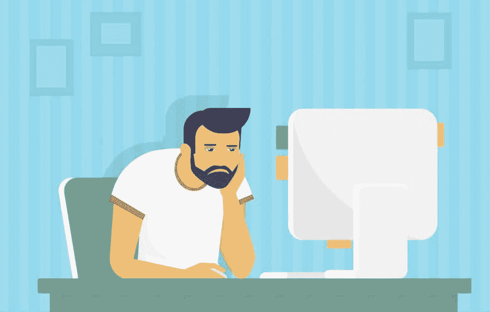
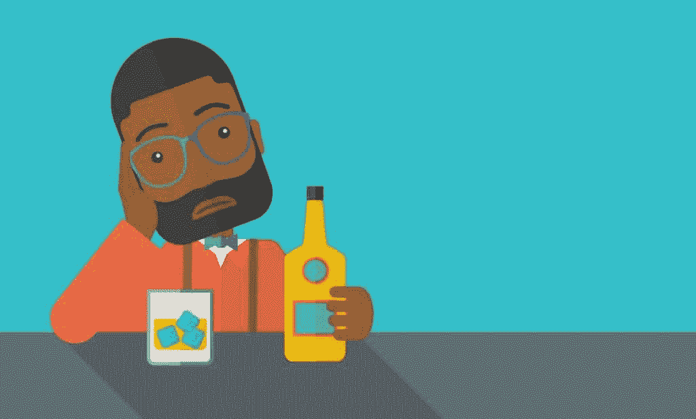

# 程序员约会:为什么没有女朋友让你如此困扰，该怎么办

> 原文：<https://simpleprogrammer.com/dating-for-programmers/>

你都二十多岁了，还没交过女朋友。我明白了。我不能让女人挡在你的路上，但我可以告诉你为什么这对你如此重要，以及你如何更好地控制自己的生活，这样你要么准备好恋爱，要么独自快乐地生活。

六个多月来，我一直是简单程序员 YouTube 频道 T1 的订户。我是一名机械工程师，但 John 的许多内容适用于各行各业的任何人，他对我的观点、态度和整体前景产生了强烈的影响。

约会、爱情和成为一个更好的男人是 Simple Programmer 创建内容的一些主题，包括如何开始一段关系。

即使有这么多好的建议，交女朋友也不是你能完全控制的事情，因为这需要双方都同意在一起发展关系。即使你是很好的恋爱材料，也可能因为你无法控制的因素而无法实现。

考虑到这一点，我想解释一下为什么我认为像我们这种情况的男人非常想要一个女朋友，以及你可以做些什么来帮助建立一段关系和/或在没有女朋友的情况下快乐地生活。

我们通常出于几个基本原因想要女朋友:认可(你是一个很棒的人)、情感释放(感情是一种安慰)、社会对我们的期望(你现在不是应该有女朋友了吗？)，以及媒体和好心的家人朋友给我们设置的外部压力(我只是想让你遇到一个好人)。

或者，你只是真的被压抑了。

所有这些原因都有一个根本原因:对自己和自己生活的掌控能力差。对自己缺乏控制会让你产生一种需求感；你需要一个女朋友来改善你的生活，因为你自己无法改善它。

我不想说你缺乏自制力，因为这可能会让我想起幼儿园时的暂停、高脚椅和站在房间角落里的情景。我的意思是对你的能量缺乏控制。

你的能量由四部分组成。

体能是你的身体健康和能力。它决定了你能否上楼梯而不气喘吁吁，你从受伤或剧烈运动中恢复的速度，你生病的可能性等等。

精神能量是你的精神和认知能力。它决定了你集中注意力、记忆信息、运用知识解决问题和完成困难任务的能力。

情绪能量由你的想法、感觉、态度和心情组成。它深受身体和精神能量的影响，也受你生活中的人的影响。

精神能量是你的整体观，是你生活的意义和方向，是你对自己的整体看法。它强烈影响其他三种能量。

因此，创造一个更加自立的你的解决方案是开始练习更好的能量控制，从而获得对你生活的控制。

能量控制更多的是一种心态，而不是一个实际的硬科学或健康计划。但我仍然认为这是你能做的促进健康、自信和自信的最有影响力的事情。

## 能量控制原理

能量控制需要在大量使用和充分休息(而不是过度休息)之间取得平衡。你全力以赴，你休息和恢复，你的能量比以前更加充沛。

人类进化成了这样的行为方式:一阵激烈的全力以赴的活动之后是无所事事的休息。回想一下史前时代。人类通常无所事事，只要有可能就会休息，在逃离食肉动物、狩猎或与敌对部落战斗时会爆发激烈的活动。

当能量使用过多时*和使用不足时*都会降低。例如，锻炼太多会让你疲劳和虚弱，但锻炼太少也会。

如果四种能量中有一种低，它会降低其他三种；如果你生病了，你就不能有效地集中注意力或保持好心情。如果你不能集中注意力，你就不能在身体上表现出最佳状态或者克服消极情绪。

然而，增加你的一种能量不一定会提高其他的能量；变得强壮、健康、有活力并不一定意味着你的思维敏锐度或情绪弹性会随之提高。你需要努力提升你所有的四种能量。

## 休息以恢复精力

睡觉。睡眠时间的数量远不如质量重要；四小时高质量的睡眠比八小时糟糕的睡眠要好。最大限度地提高睡眠质量需要几样东西:

*   合适的温度。理想的睡眠温度在华氏 70-75 度之间。
*   睡在轻薄透气的布料里。你也可以选择裸睡。我个人睡觉都是赤膊上阵。
*   绝对的黑暗。这可能需要一些时间来适应，但绝对的黑暗是睡觉的最佳条件。在你卧室的窗户前挂上遮光窗帘。
*   沉默。让你的睡眠环境尽可能安静。必要时戴上耳塞。

学会在空闲的时候尽可能间歇地休息，比如等待下载文件、等待上课、在小吃摊排队等。

通过减缓呼吸来休息。吸气两秒钟，保持两秒钟，然后呼气。放松全身，尤其是背部、颈部、腹部和肩部的肌肉，但是如果你是站着的，不要让自己摔倒。让你的头脑安静下来:什么都不要想，但也不要努力抑制你的想法。如果一个想法进入你的脑海，放松，让它慢慢消失。不要为此付出任何努力。

## 重音

人们允许他们的压力摧毁他们。压力是人类对危险情况的自然反应。在史前时期，当一只剑齿虎想把你作为它的晚餐时，或者当你与一个敌对的部落成员进行生死搏斗时，你会感受到压力；这是你逃跑或战斗的反应。一旦你能够解决危险情况(逃离或杀死剑齿虎；打败敌对的部落人)，你的身体放松；大量使用之后就是休息。

问题是，即使在没有生命危险的情况下，你也会经历这种逃跑或战斗的反应。你遇到交通堵塞，上班要迟到了，你的闹钟没有响，你还有不到 24 小时的项目期限，你还有 48 小时的工作要做，等等。人们没有正确利用他们从压力中获得的能量，能量在他们体内溃烂。这就像一根管道，积聚了过多的气压，即将爆裂。

想象任何压力或挫折，你都感觉是一个集中的能量球，位于你的中心。大多数人让这种能量积累压力。他们花费宝贵的意志力来压制这种能量，让它在他们体内翻腾。被压抑的能量很容易变得有毒并伤害你。

相反，你要利用这种能量并让它为你工作。当你呼吸时，想象能量在你全身循环和传播，给你力量和能量。

用这种新发现的能量来完成你的目标:去健身房，像疯子一样举重，戴上拳击手套，对着沉重的袋子嚎啕大哭，或者完全专注和投入地完成你的工作。一旦你耗尽了你所有的能量，休息一下来恢复它——大量使用之后是充分的休息。

## 体力

体能是通过饮食和锻炼来控制的。

为了提高体能，你吃什么和什么时候吃并不太重要。大多数人都有一个合理的想法，知道什么对他们是好的，什么是坏的。你知道每天吃麦当劳对你不好。我鼓励尝试找出最适合你的方法，并遵循你的常识。

有支持一天吃六顿小餐的阵营，也有支持一天只吃一顿大餐的阵营，以及介于两者之间的其他阵营。这个也不太重要。

饮食的唯一重要方面是不要吃得太多。为了防止暴饮暴食，慢慢吃，一旦你感到满意就停下来。不要为了吃完面前的一切而觉得需要继续吃。扔掉剩余的食物或留着以后吃比狼吞虎咽要好。

我建议每天喝一到两杯咖啡，并在中午前喝完。否则，你的回报将开始减少，你将无法充分休息，晚上睡不好觉。

锻炼是消耗体力的主要方法。在锻炼过程中努力锻炼自己，并在锻炼间隙充分休息以增强体能。

我推荐举重来达到这个目的，因为它简单有效。体重练习相对复杂，增加难度也很棘手，尤其是对初学者而言。

竞技运动员如果训练过度而没有足够的休息，可能会经历中枢神经系统疲劳。他们感到虚弱、肌肉和关节酸痛、头痛、疲惫和生病。

他们还感到自己的精神和情感能量受到损害，并可能经历抑郁、喜怒无常和易怒、失去热情以及无法集中注意力或有效记忆。

中枢神经系统疲劳实际上是一件好事，因为你已经完成了能量培养的大量使用部分。下一步是休息。从任何训练中休息一周，并遵循我的休息指示。你的身体能量会比以前更强，你的精神和情绪能量也会恢复。

对于初学者的举重疗法，可以看看[强举 5×5](https://stronglifts.com/5x5/) 和[马克·里普托的*起始力量*](http://www.amazon.com/exec/obidos/ASIN/0982522738/makithecompsi-20) 。

## 心理能量

精神能量是通过有规律地执行任务来培养的，这些任务需要注意力集中、记忆和应用知识来解决问题，然后允许适当的休息。

程序员和软件开发人员通常有着对智力要求很高的生活方式，所以努力工作并全身心地投入工作足以锻炼你的脑力。大学生应该专注于学习，做作业，完成项目，加入俱乐部和组织，这些可以给他们提供有市场价值的证书和技能，并寻找实习/全职工作，如果他们还没有的话。

阅读书籍是另一个伟大的精神能量训练方法。网上的文章都是本着可读性来写的。他们有简短的句子和段落，大量使用粗体和/或彩色字体。书籍很少或根本没有这些可读性技巧，这使得它们阅读起来需要更多的脑力。

如果你有一部智能手机，有免费的拼图游戏软件可供下载。解拼图是锻炼脑力的好方法。

试着每天阅读 30 到 60 分钟，解决一个拼图游戏。

## 精神休息和倦怠

现在，你可能不想听到这些，但使用手机，看电视或 YouTube 视频，浏览社交媒体不是休息。这些活动仍然需要一定程度的脑力劳动，而且它会在你的头脑中产生工作的幻觉。你没有充分休息和恢复精神能量。

休息和恢复精神能量的最好方法是不要使用电子设备，做非常简短的运动，并遵循我的休息指示。与身体能量不同，在这种情况下，锻炼的目的是提高精神能量。人类进化到将身体运动与对警觉和意识的需求联系起来。在史前时期，只要有可能，人类都是空闲和休息的。他们只有在必须逃离食肉动物、狩猎或与人搏斗时才会移动。运动=更大的精神能量。

像原地慢跑、做一些跳跃运动和伸展运动这样的短暂、轻度的运动足以恢复精神能量；没有必要强迫自己超越这一点。还有免费下载的移动应用程序，可以进行七分钟的简短锻炼，这对恢复精神能量非常有帮助。下面是我用的一个:

精神能量过度使用的结果就是倦怠。如果你是一名软件开发人员或计算机专业的学生，你可能会感到精疲力尽。你无法集中注意力、记忆或有效地运用你的知识来解决你面前的问题。倦怠也会降低你的身体、情感和精神能量。就像身体上过度劳累一样，你会经历喜怒无常和易怒，热情和动力下降，失去控制或无助感，以及疲惫。

就像中枢神经系统疲劳一样，倦怠可能是一件好事，因为它完成了能量培养的大量使用阶段。接下来你需要做的就是休息，恢复你的精神能量。

## 情感能量

情绪能量由积极情绪(如同情、活力、喜悦、动力、热情)和消极情绪(如愤怒、嫉妒、抑郁)组成。积极的情绪会提升你的情绪能量。负面情绪会消耗情绪能量，就像举重消耗身体能量，学习或阅读消耗精神能量一样。情绪能量来自于忍受和克服负面情绪，并有意识地激发正面情绪。

情绪能量控制建立在:

*   你的生活是怎样的:你可能正处于一段美好的感情中，或者你可能刚刚经历了分手。你可能刚刚找到了你梦寐以求的工作，或者你可能一年都找不到工作。
*   你的身心健康。
*   你周围的人。

你可能对第一部分没有绝对的控制权。所以，你应该尽可能地把重点放在第二和第三部分。

促进身体健康(严格的锻炼，正确的饮食)，有精神上的爱好(看书，解拼图)，适当的休息可以通过促进积极的情绪和减少消极的情绪来显著提高你的情绪能量。这也增强了你克服负面情绪和激发正面情绪的能力。

你也应该和合适的人成为朋友。你周围的人会极大地影响你是重新获得还是消耗情绪能量。你是愿意和约翰这样的人做朋友，还是和那些看起来和行为上都像是患有终身便秘的人做朋友？五分钟的谈话后，谁更有可能让你感觉更好？让你周围的人帮助你培养积极的情绪和动力。

“但你是与你交往最多的五个人中的平均水平，所以不要低估你的悲观、没有抱负或没有组织的朋友的影响。如果有人没有让你变得更强，那他们就是在让你变得更弱。”

―――蒂莫西·费里斯，[*4 小时工作制*](http://www.amazon.com/exec/obidos/ASIN/0307465357/makithecompsi-20)

## 精神能量

为了提升能量，精神能量是你对生活的总体方向、目的和控制。缺乏方向、目标和控制会降低精神能量。一个清晰定义的目标和对你生活的控制能提升精神能量。

你的方向和目标可能是成为一名企业家，创造下一个大型移动应用程序游戏，在某方面成为世界上最好的，成为一名出版作家，或者为你的家人提供尽可能好的生活。

我不能告诉你你的方向和目的应该是什么。这是只有你自己才能决定的事情，这将是你一生中最重要的决定之一。我可以告诉你，一旦你找到了方向，你的整体能量会变得更高。你会感觉更强大，你的思维会更敏锐，你会体验到更多积极的情绪，你会更有动力，你会对自己的生活有更强的掌控感。

## 无限的能量

还记得我给出的关于你为什么想要女朋友的最后一个理由吗？你只是太压抑了？如果你能学会疏导这种不受约束的能量并有效地利用它，那种看似无法忍受的紧张和能量会带来巨大的成就和创造。当它在你心中翻腾时，不要只是压抑它或无所事事。

我甚至断言，在某种程度上，任何文化中的任何人在整个人类历史中所完成或创造的一切，如创造艺术作品或建设文明，都是通过有效地引导那种不受约束的性能量而得到证实的。这就是为什么优秀运动员的教练和训练员在重大比赛前的几天和几周禁止性生活。这种能量是一种天赋。

## 最后的话

在我看来，为没有女朋友而难过是一个更大问题的症状:对自己和自己的生活缺乏控制。你通过首先学会控制你的能量来发展对你自己和生活的控制。

能量是通过大量使用和充足的休息来控制和建立的。你的能量有四个部分。

身体能量是通过避免暴饮暴食和从剧烈运动中恢复来建立的。

精神能量是通过定期执行需要注意力集中、记忆和应用知识来解决问题的任务来建立的，如阅读书籍或解决难题。

情绪能量来自于忍受和克服负面情绪，如愤怒、嫉妒和悲伤。

精神能量来自于为你的生活设定一个明确的目标或方向。

我坚信控制你的能量是你能做的最有影响力的事情，它能让你变得自信、自信、快乐，也能让你生活中的人更快乐。