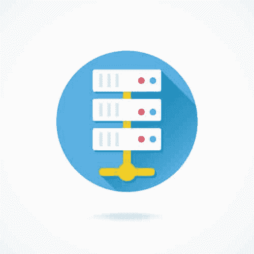
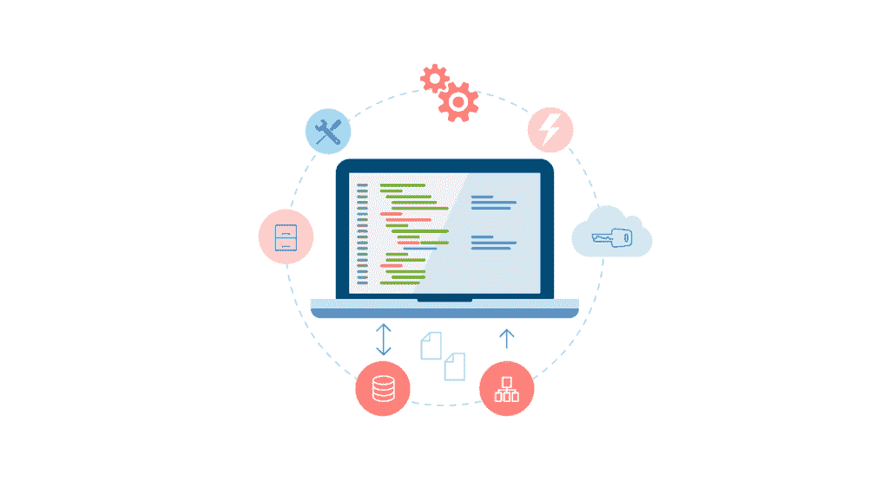

# 关于 DBA 和 DevOps，软件开发人员需要了解什么

> 原文：<https://simpleprogrammer.com/dbas-devops/>

生产工作软件不仅仅是写代码。

大多数实质性的软件应用程序都需要某种类型的数据存储，它们必须在某个地方进行构建、测试和部署。

你知道吗？

我们需要知道如何处理这类事情并去做的人。

这就是 DBA(数据库管理员)和 DevOps 的作用所在。

你可能想知道为什么你需要知道所有这些——你不能直接写代码吗？

嗯，是的，有时候你可以只写代码，**但是越来越多的团队正在变得跨学科**，软件开发人员被要求承担——或者至少贡献和合作——各种不同的角色。

软件开发，尤其是在敏捷环境中的软件开发，更像是 T2 团队的努力，我们已经加入了一大堆最好的过程和“应该做的事情”,因为这些年来我们已经学会了如何交付越来越好的软件。(或者至少我们认为我们有。)

无论如何，作为一名软件开发人员，你可能会被要求身兼数职，尤其是如果你在一家初创公司或小公司工作，那里没有专门的 DBA 或运营团队。

很可能有一天你会被要求安装一个数据库或者设置一个应用程序。

同样，您可能会被要求帮助确定获取工作应用程序代码、构建和测试它并将其部署到生产服务器的过程。

或者，你也可能被要求与这些自称为 DBA 或 DevOps 的奇怪生物一起工作……伙计们？

无论如何，不管是什么原因，你都应该对你的技术兄弟们有所了解。

哦——我们稍后会谈到质量保证；这本身就值得一整章。

## development bank of american samoa 美国萨摩亚发展银行

首先，让我们从 DBA 开始。

到底什么是 [DBA，或者数据库管理员](http://amzn.to/2aUDDFV)？

这个角色会因组织而异，但是一般来说，它会伤害开发人员的感情，告诉他们他们的代码很烂，使用了太多的数据库连接，当他们问他们是否可以做各种涉及数据库的事情时，总是说“不”。

不过，在很大程度上，**DBA 负责设置、维护、保护、优化和监控数据库**，甚至可能设置数据库模式或编写存储过程。

有些 DBA 本质上更倾向于操作性，在实际创建数据库表和编写任何类型的数据库代码方面做得不多。

其他 DBA 除了对数据库进行操作工作之外，更像是数据库程序员。

## 数据库需要维护和保养

不是每个开发团队都有 DBA。

事实上，**许多组织将会有开发人员——也就是你——承担许多 DBA 职责**,所以了解你对数据库的了解以及安装和维护数据库的一些基础知识是很有用的。

对于许多软件应用程序来说，数据库是业务的一个重要部分，所以无论维护和管理的角色是直接由 DBA 承担还是分配给开发人员，有人来做这项工作都是非常重要的。

数据库会随着时间的推移而增长，并且会占用大量资源，因此选择合适的硬件来运行数据库并确定何时升级至关重要。

数据库还包含一些非常重要的数据，因此必须小心地定期备份它们，并且需要有人制定一个灾难计划来恢复数据库或在数据库发生故障时保持运行。

我们不要忘记性能。随着时间的推移，没有很好地设计或调整的数据库可能会变得缓慢和低效，因此必须特别注意对数据库进行分析，并确定应该如何排列或索引数据，以使事情变得更快。

我可以继续说下去，但我想你明白了。数据库不会自己升起。

## 我需要成为 DBA 吗？

T2】

不，但我强烈建议您花些时间学习如何:

*   安装和设置数据库。
*   创建和恢复备份。
*   创建表和模式。
*   创建存储过程。
*   索引表和索引的工作原理。
*   执行基本操作，如查询、插入、更新等。
*   连接表。

就像我说的，**你不需要成为所有这些东西的专家**，但是作为一名软件开发人员，知道这些基础知识将对你的工作非常有帮助，无论你是必须自己做这些事情还是必须与 DBA 一起工作。

## DevOps:新角色

It 领域很少出现全新的角色，所以 DevOps 的角色既独特又有点，我们可以说，定义松散。

DevOps 到底是什么？

嗯，如果你愿意的话，这是开发和运营的聚合或混搭。

在我的脑海中，我想到了 MacGyver。

如果你问不同的人，你会得到许多答案，但是在大多数情况下，他们会同意 DevOps 是关于做任何需要做的事情来获得代码构建、测试、部署和在生产中运行。

但是要真正理解和欣赏 DevOps ，你必须理解…

## 运营:我们过去是如何做的

你看，在没有 DevOps 之前，以前只有开发者和运营(有时候叫 IT)。

开发人员编写代码，然后将代码扔给 QA。

QA 会说很烂，扔回去。

在一方或双方最终放弃之前，代码会来回几次，然后他们会一起将代码扔过另一堵墙给操作团队。

运营团队会抱怨代码的效率有多低，它会如何破坏服务器，以及开发人员对安全性没有任何线索，然后将它扔回去。

开发人员会诅咒那些试图给他们制造麻烦的运营人员，做一些小的改动，然后把它扔回去。

最后，运营团队会将代码部署到服务器上，一切都会崩溃，每个人都会互相指责。

好吧，也许我在这里有点夸张，但关键是我们过去在软件开发领域有非常分散的团队。

在过去——对于今天的一些组织来说也是如此——过去是开发人员编写代码，运营人员获取代码并进行部署，而任何一个团队都不知道另一个团队做了什么。

这确实产生了大量的问题，但是在敏捷软件开发出现之前，这些问题是可以忍受的。

现在团队每周发布一次、两次、有时三次新代码，而不是每六个月左右发布一次。

开发团队在一天中多次构建代码，并根据代码运行自动化测试和质量检查。

事情不再是写代码、构建代码、部署代码那么简单。

相反，一整套操作和过程作为一种尽可能敏捷的方式出现，并且能够快速地将代码从开发转移到生产。

## DevOps 是什么？

好了，现在你知道背景故事了，DevOps 到底是什么？

这是一个多学科的过程，从开发到生产，并在代码出现时对其进行处理。

DevOps 不是有两三个彼此不太了解、有时可能是敌对和对立的独立角色，而是在前进的每一步都拥有完全的所有权。

在一些组织中，有一些特定的 DevOps 角色，您可能有一个程序员，他知道如何构建和部署创建构建和部署系统所涉及的代码，以尽可能地自动化该过程。

在其他组织中，开发人员、测试人员和操作人员的角色仍然是分离的，但是他们都通过相互理解、合作和集体所有权来共同完成开发运维的角色。

DevOps 的重要之处在于，它是对软件应该如何交付到产品的思考的一个根本性转变。

## 这对你意味着什么

嗯，从技术上来说，作为一名软件开发人员，你是 DevOps 的一部分。

欢迎光临。恭喜你。这是你们正式的 DevOps 鸡翅。

今天，软件开发人员被期望知道的不仅仅是写代码。

你不能把你的代码扔到墙上，让它成为别人的问题，尤其是如果你在一家小公司或初创公司工作。

**你需要了解将代码从开发转移到生产的过程和工具**——以及理想情况下如何设置和使用这些工具。

显然，您应该知道如何使用 IDE 并在本地构建自己的代码；没有人会为你这么做。

然而，你还应该**知道如何使用源代码控制**来检入你的代码，并将其集成到系统中的其他代码中。

你应该知道持续集成的基础知识以及构建服务器是如何工作的。(别担心，我们将在接下来的章节中讨论大部分内容。)

你应该知道**测试的基本原理和类型**以及**各种各样的自动化测试如何适应构建和部署代码的大环境**。

您应该知道**应用程序如何打包**并准备好分发或部署。

您应该**了解部署流程**和**如何自动将代码从构建服务器移动到试运行服务器或生产服务器**和**如何在各种服务器上管理配置**。

最后，**您应该了解一些关于监控现有应用程序以检查性能问题和其他问题的知识。**

是的，我意识到要知道的东西太多了，但是你不必对所有这些东西都有深入的了解——你也不必一下子全都学会。

更重要的是，您知道这些工具和过程的用途，这样，如果您需要自己实现这个工具链的一部分或者帮助实现它们，您就可以做到。

这么想吧。

假设你是棒球队的投手。

你不需要知道团队中每个位置的一切，但是如果你不知道其他位置和他们做什么，就很难谈论任何有意义的战略。

你不想加入一个软件开发团队，却完全忘记在你签入代码后发生了什么。

许多软件开发团队不想雇佣这样的开发人员。

就像我说的，别担心。在接下来的章节中，我会给你一些关于这些主题的基本概述。

* * *

