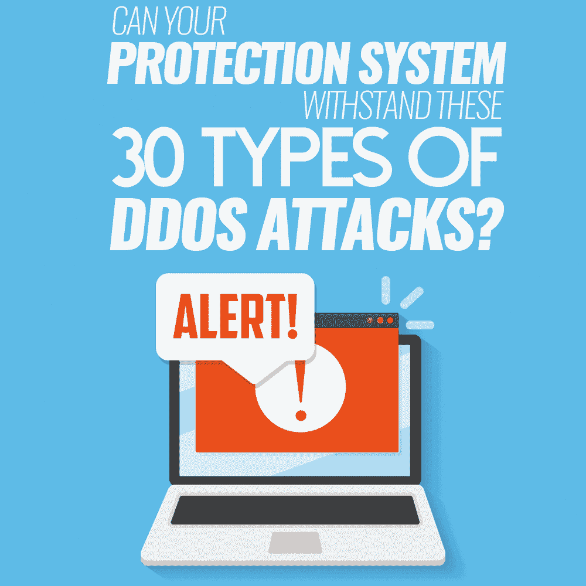

# 您的保护系统能够抵御这 30 种类型的 DDoS 攻击吗？

> 原文：<https://simpleprogrammer.com/ddos-attacks-security/>

分布式拒绝服务(DDoS)攻击现象在 20 世纪 90 年代中期首次出现，此后经历了巨大的演变。在初期，这在很大程度上是黑客行动主义者的特权，他们让主要的互联网服务离线，以此抗议在线审查和有争议的政治举措。

快进到今天，情况更加可怕。DDoS 攻击不仅高度复杂和有影响力，而且还形成了一个巨大的网络犯罪经济，其运营商越来越擅长利用他们的不法行为赚钱。

他们流派的最新成员是所谓的[赎金 DDoS](https://krebsonsecurity.com/2018/03/powerful-new-ddos-method-adds-extortion/) 。它的逻辑是对一个组织发起毁灭性的攻击，然后要求停止攻击的报酬。

乍看之下，DDoS 背后的想法似乎很简单:让网络或 web 服务器淹没在超出其处理能力的数据包中。这不是一个误解，但这个模型有点过于简化。

在恶意行为者的手册中有许多邪恶的技巧，允许他们将攻击媒介多样化，并选择利用特定受害者痛点的攻击媒介。例如，如果犯罪分子在初步侦察中探测企业网络的安全弱点时发现了易受攻击的 web 应用程序，他们可能会将其用作 DDoS 攻击的发射台。

虽然您在网上找到的大多数防御措施都与使用 Cloudflare 等交钥匙 DDoS 缓解服务有关，但部分保护措施取决于程序员。粗糙编码的[网络应用](https://simpleprogrammer.com/progressive-web-applications/)容易受到 SQL 注入的攻击，这是一种狡猾的机制，因为是 DDoS 入侵的常见来源而臭名昭著。

一旦发现了这样的漏洞，攻击者就定制一个适当的查询，并将其反复注入目标网站，使服务器崩溃。跨站脚本(XSS)漏洞也是不完美的例证，让犯罪分子用流氓查询和恶意软件淹没网站。

净化 web 应用程序的代码以消除 SQL、XSS 和其他漏洞是程序员能够也必须涉足的领域。

除了加强 web 服务对 DDoS 灾难的保护之外，这也是创建稳定代码、交付无摩擦用户体验的先决条件。

## 你知道你的 DDoS 攻击点吗？

说到网络安全，意识是成功的一半。如果您知道您组织的 IT 基础设施中可能被 DDoS 参与者利用的薄弱环节，您可以优先考虑防御措施，至少将遇到单点故障(SPOF)场景的风险降至最低。

研究人员挑选出三种主要的 DDoS 攻击类别:**体积**、**网络协议**和**应用层**攻击。它们的不同之处在于网络架构的目标组件和用于执行突袭的机制。

每一种都包含一些子类型，从 TCP 三次握手利用到将合法网络压力测试工具武器化的强大攻击。

下面的分类将让您对常见攻击方法背景下的当代 DDoS 威胁形势有所了解。如果您是一名程序员，该列表可以为您提供一些可操作的见解，帮助您集中精力防止您的代码被 DDoS 操作员错误处理。

### 体积攻击

也称为基于容量的攻击，这些 DDoS 入侵使用大量计算机和欺骗性互联网连接，向网络或网站发送超过其处理能力的流量包。这种流量放大策略的结果是合法用户无法再访问资源。

*   **UDP 洪流**。为了执行这种攻击，威胁参与者向服务器发送大量欺骗的用户数据报协议(UDP)数据包，直到服务器无法处理合法查询。由于 UDP 连接具有有限的源 IP 验证机制，这种入侵可能会在目标防御的雷达下飞行。
*   **ICMP 洪流**。也称为 Ping 泛洪，这种攻击利用大量流氓互联网控制消息协议(ICMP)Ping。服务器被配置为使用单独的流量包来回复每个这样的回送请求，因此它最终会耗尽资源并变得无响应。
*   **DNS 泛滥**。攻击者用大量模仿大量 IP 地址的虚假请求包淹没 DNS 服务器。就[预防和缓解](http://www.amazon.com/exec/obidos/ASIN/1498729649/makithecompsi-20)而言，DNS Flood 是最严重的 DDoS 攻击之一。
*   **Fraggle 攻击**。这种攻击使用多个 UDP 数据包，其中包含受害者路由器的假冒 IP 地址。当设备不停地回复自己，并试图解决如何处理这些表面上正常的请求时，它就会失败。
*   **高级持久 DoS (APDoS)** 。该术语适用于网络罪犯结合不同的放大技术使网络离线的情况。像这样的袭击可以持续数周，而且往往会比大多数对手造成更大的破坏。
*   **零时差**。这个名字不言自明:这种攻击利用网络或服务器中未记录的缺陷来破坏其运行。这解释了组织在阻止此类攻击方面准备不足的原因。

### 网络协议攻击

与容量攻击不同，网络协议攻击试图吸走服务器资源而不是带宽。它们通常以防火墙或辅助互联网通信设备(如负载平衡器)为目标。向这些实体发出的大量流氓协议请求最终会耗尽它们的所有容量。

*   **合成洪水**。为了发动这种攻击，犯罪分子错误地处理了 [TCP 三次握手](https://simpleprogrammer.com/test-your-understanding/)，该握手用于通过 TCP 协议在客户端、主机和服务器之间建立连接。SYN (synchronize)数据包在该模型中的作用是请求与服务器的连接。Crooks 从伪造的 IP 地址提交大量 SYN 请求，导致合法用户拒绝服务。
*   **陆地攻击**。首字母缩写代表局域网拒绝。这种策略包括粗略的 SYN 请求，其中源 IP 和目的 IP 是相同的。这些消息困扰着接收服务器，当它试图对自己做出响应时，最终会关闭。
*   **SYN-ACK Flood** 。这种基于协议的攻击篡改了 TCP 连接阶段，在这个阶段，服务器提交 SYN-ACK 消息来确认客户端的请求。犯罪分子用这种流氓数据包淹没服务器。服务器浪费资源试图找出为什么它以不正确的顺序接收这些消息，这与 TCP 三次握手逻辑相矛盾。
*   **ACK & PUSH ACK Flood** 。这种方法用大量传入的 ACK 和 PUSH ACK 包来混淆服务器。由于目标无法理解如何处理这些消息，它达到了其内存和 CPU 阈值。
*   **碎片化 ACK 洪流**。对手用支离破碎的 ACK 消息轰炸网络。路由器分配了过多的处理能力来尝试重组这些数据包。这种破坏性效果可以通过相对少量的这种消息来实现。雪上加霜的是，这些分裂的数据包可以偷偷通过入侵检测系统(IDS)。
*   **SSDP 洪水**。SSDP 代表简单服务发现协议。它构成了网络协议的通用即插即用(UPnP)集。为了执行 SSDP 洪水攻击，犯罪分子向使用 UPnP 服务的众多设备发送包含受害者服务器 IP 地址的小型 UDP 数据包。服务器由于从这些设备接收到无数的查询而崩溃。
*   **SNMP 洪流**。这种 DDoS 媒介寄生在简单网络管理协议(SNMP)上，SNMP 收集和组织与连接设备相关的数据。骗子向使用 SNMP 的路由器或交换机发送一组包含目标服务器假冒 IP 的小数据包。这些设备被配置为回复该源 IP。异常流量最终会导致服务器停机。
*   **NTP 洪水**。网络时间协议(NTP)旨在实现网络间的时钟同步。它可以被恶意的行为者滥用，他们利用粗糙安全的 NTP 服务器用冗余的 UDP 包淹没计算机网络。
*   **网络电话泛滥**。这款服务器采用易于访问的网络电话(VoIP)服务器。目标网络受到大量恶意 VoIP 消息的攻击，这些消息似乎来自不同的 IP，并被错误地解释为合法的。
*   

    **Media Data Flood**. When this flood is taking place, rogue video and audio files are used to waste a server’s resources. A hurdle to identifying the peril is that these media objects come from different IP addresses and therefore may not raise any red flags.
*   **CHARGEN 洪水**。上世纪 80 年代推出的字符生成器协议(CHARGEN)可能已经过时了。尽管如此，一些打印机、复印机和 DDoS 操作者仍在使用它。向支持 CHARGEN 的连接设备提交携带目标服务器 IP 地址的小数据包会导致设备向服务器发回多个 UDP 数据包，从而耗尽其容量。
*   **蓝精灵攻击**。这种攻击使用名为 Smurf 的恶意应用程序向大量连接的设备发送包含受害者 IP 地址的 ICMP 回应请求。因此，服务器会收到过多的流量数据包，无法继续正常运行。
*   **死亡攻击的乒**。犯罪分子用超过最大允许值(64 字节)的 ping 数据包淹没网络。当试图重组这些非正统的实体时，服务器崩溃。
*   **IP 空攻击**。此 raid 依赖于标头参数设置为空的 IPv4 数据包。因为接收 web 服务器可能无法处理这些奇怪的消息，所以会遇到拒绝服务的情况。

### 应用层攻击

顾名思义，这些 DDoS 攻击发生在开放系统互连(OSI)概念模型的应用层(“第 7 层”)。它们利用 web 应用程序中已知的或零日漏洞。这些攻击被认为是最复杂和最难检测的。

*   **HTTP Flood** 。攻击者用欺骗的 GET 或 POST 请求轰炸 web 应用程序，以中断其操作。这种载体通常[利用僵尸计算机组成的僵尸网络](http://www.amazon.com/exec/obidos/ASIN/B00VU1TNXS/makithecompsi-20)来模仿合法流量。
*   **单会话 HTTP 洪流**。这涉及到一个 HTTP 会话，该会话生成一系列隐藏在同一个 HTTP 数据包中的请求。这种伎俩不仅允许骗子放大影响，而且还欺骗了一些将此类流量视为良性的网络防御。
*   **递归 HTTP GET Flood** 。在这种攻击的早期阶段，对手向服务器请求大量网页并仔细检查响应。接下来，反复请求每个网站组件，直到服务器耗尽资源。
*   **随机递归得到洪水**。这种技术被用来关闭博客、论坛和其他包含递归页面的站点。攻击者从有效范围内随机选择页码来模拟普通用户，然后生成一系列 GET 请求来降低目标的性能。
*   **欺骗会话泛滥**。为了实施这种攻击，攻击者混合使用伪造的 SYN 数据包、几个 ACK 数据包以及一个或多个 RST(重置)或 FIN(连接终止)数据包。一些保护系统不检查返回流量，因此这种攻击会逃过他们的雷达。
*   **低轨道离子炮(LOIC)** 。这个开源的 LOIC 工具最初被设计成[帮助安全专家](https://simpleprogrammer.com/security-from-the-start/)运行网络压力测试的一种方式，也是 DDoS 运营商的最爱之一。它经常被滥用于向服务器发送过多的 TCP、UDP 和 HTTP 数据包。
*   **高轨道离子炮(HOIC)** 。类似于 LOIC，这是一个失控的网络压力测试工具。犯罪分子正在大量使用其巨大的能力，通过使用大量 GET 和 HTTP POST 数据包来破坏服务器。HOIC 可以同时瞄准多达 256 个域。
*   **Slowloris** 。这种复杂的入侵只需要一台电脑就能完成。Crooks 向一个 web 服务器打开多个并发连接，并通过碎片化的额外数据包和新的 HTTP 报头持续保持这些连接。由于这些请求永远不会到达完成阶段，它们会耗尽目标的资源。
*   **误用应用攻击**。威胁行为者渗透到运行资源密集型应用程序(如 P2P 软件)的计算机中，然后将大量流量从这些客户机重新路由到服务器。
*   **重做**。该术语代表“正则表达式拒绝服务”为了使这种攻击成功，犯罪分子用算法复杂的字符串搜索查询淹没特定程序，从而降低底层服务器的性能。

## 躲避威胁

即使是大公司也可能缺乏带宽来应对 DDoS 攻击者人为造成的流量激增。标准网络设备配备了有限的 DDoS 缓解机制。这个问题在中小型企业(SMB)的生态系统中表现得更加明显，在这种环境中，以有限的预算构建保护系统是一种常态。

在这种情况下，最好的防御措施是多管齐下。加强 DDoS 保护的最佳方式之一是将其外包给基于云的解决方案，如 Akamai、Sucuri、Netscout 或 Cloudflare，这些解决方案以按使用付费的方式提供高级预防和缓解服务。这是你最坏情况下的 B 计划。

为了抵御上述应用层攻击，组织内的 IT 团队应该遵循适当的代码审计实践。这将最大限度地减少部署在企业环境中的 web 应用程序中可利用的漏洞。

入侵防御系统(IPS)和网络应用防火墙(WAF)的结合将使它更上一层楼。可靠的 IPS 将保护您的网络免受漏洞利用、恶意软件和停机的影响。反过来，一个有效的 WAF 可以保护您的 web 应用程序免受 SQL 注入、跨站点脚本和跨站点伪造攻击，这些都是 DDoS 参与者的拿手好戏。

一个额外的建议是让你的系统保持最新。修补您的数字基础设施将遏制恶意行为者，为他们提供很少或没有回旋余地。

## 你的系统准备好了吗？

虽然 DDoS 是网络犯罪领域的老古董，但它仍然是一个严重的问题，您需要制定有效的对策来应对。更重要的是，它正在迅速发展。其中一些袭击依赖于[恶意软件](https://macsecurity.net/view/124-remove-safe-finder-virus-from-mac-in-safari-chrome-and-firefox)、物联网僵尸网络和开源网络压力测试框架来扩展其覆盖范围。更糟糕的是，一些新颖的攻击还加入了敲诈勒索。

从头开始评估您的 IT 基础架构，以确定最容易受到体积攻击、应用层攻击和基于协议的 DDoS 攻击的组件，这将帮助您的组织在保护方面实现飞跃。

除了正确的编码卫生之外，确保应用可用的软件补丁，并配置您的网络设备以充分利用其内置的防御。此外，考虑利用基于云的 DDoS 缓解服务和 IPS 来进一步强化贵公司的安全态势。