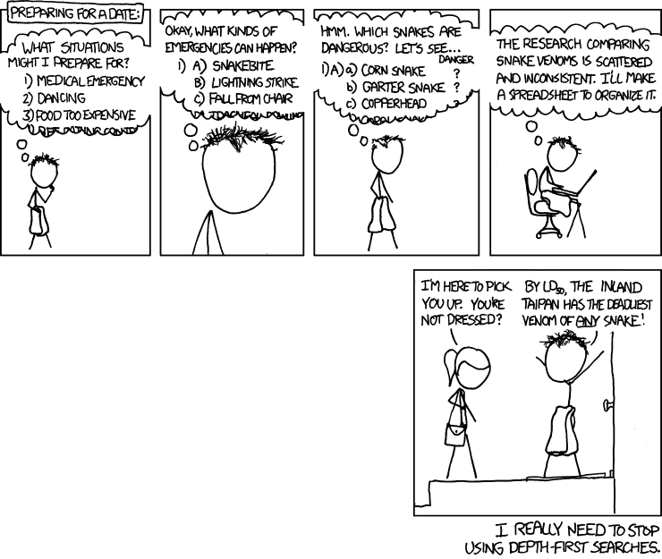

# 学习任何新技能都不会不知所措

> 原文:[https://simple programmer . com/deal-overflow-learning-new-skills/](https://simpleprogrammer.com/deal-overwhelm-learning-new-skills/)

今年，像许多其他人一样，我制定了我的新年计划。有些事情很简单，比如一周去健身房四天(反正我基本上是这样做的)，每个月和我的女朋友进行一些有趣的约会(我真的不需要太努力说服自己)。

然而，我最兴奋的目标是另一种不同的目标:[每个月学习一些新东西](https://simpleprogrammer.com/programmers-never-stop-learning/)。

我已经用[这本书](http://www.amazon.com/exec/obidos/ASIN/073520019X/makithecompsi-20)把我的阅读速度提高了一倍，把我的扑克游戏提升到比“你以前玩过这个，对吗？”，成为了下一个毕加索，并在 4 月，学会了如何做一个[倒立俯卧撑](https://www.youtube.com/watch?v=hvoQiF0kBI8)。

我的一幅三月画

当我开始这个每月学习新东西的挑战时，我意识到我有一些可能真正帮助我的背景。在我的主要工作中，我是一名[软件工程面试教练](https://www.byte-by-byte.com/coaching/)，帮助学生学习如何在面试中有效地解决问题。

因此，我对学习新技能略知一二。我有机会帮助无数学生学习在亚马逊、优步、彭博等公司找到工作所需的技能。一次又一次，当我和我的学生交谈时，他们带着同样的担忧来找我:他们完全被外面的大量资源淹没了，不知道从哪里开始。

在某些方面，我们生活在一个令人惊奇的时代。世界上几乎任何话题都有无限的资源。但这绝对是一种祝福，也是一种诅咒。有这么多的选择，挑选最好的资源会非常困难。这导致[分析瘫痪](https://en.wikipedia.org/wiki/Analysis_paralysis)，并最终压倒一切。

那种被压倒的感觉可能是绝对残酷的。它会麻痹你，阻止你取得任何进步，因为你不知道从哪里开始。这意味着你要么不开始，要么你试图同时朝 100 个方向前进。在为编码面试做准备时，我经常看到这种情况。当你有一个安排在特定日期的面试时，没有进展真的不是一个选项。

为了我的个人目标，也为了帮助我的学生，我想找出一种方法来避免在学习新技能时完全不知所措。如果你没有进步，那么一开始尝试学习新东西就没有什么意义了。这就是为什么我制定了三条规则来避免不知所措和继续进步。

## 设定目标

每个人内心深处都知道他们应该设定目标。和用牙线一样。每个人都知道他们应该这样做，但很多人不知道。清晰的目标对于处理压倒性的压力非常重要，因为它们帮助你把注意力集中在应该注意的地方。

然而，大多数人并不设定目标。而那些做的通常不会设置有帮助的。

Many people falsely assume that saying something to themselves like, “I’m going to get a good job,” constitutes setting a goal. However, there are two major problems with this. First, they didn’t write down their goal—despite the [evidence suggesting the importance of writing down your goals](https://www.huffingtonpost.com/marymorrissey/the-power-of-writing-down_b_12002348.html)—and second, it’s not a good goal.

当我说这不是一个好的目标时，我并不是说这不是他们应该为之奋斗的事情；相反，它的结构很差。“我会找到一份好工作”并不是以一种很容易实现的方式构建的。相反，目标设定者应该使用 SMART 目标框架。

SMART 目标是*具体的、可衡量的、可实现的、相关的、*和*有时限的*。让我们考虑如何让我们的目标“找到一份好工作”成为一个明智的目标:

"不出三个月，我将在四大公司找到一份工作，并拿到六位数的薪水。"

*   **具体:**这个目标比我们原来的目标具体多了。通过更明确地指定我们想要学习的内容，我们可以真正集中精力，减少我们的选择数量。我敢保证，在四大科技公司找工作的资源比任何公司都少。
*   可衡量的:我们如何衡量我们的成功？通过我们用来使我们的目标更加具体的调整，它也是可以衡量的。有了这个目标，我们是否成功就很清楚了，因为有了更具体的标准。四大是一组特定的公司，我们有一个特定的薪酬目标，所以我们知道我们是否达到了目标。
*   **可实现:**这是现实的目标吗？根据你现在所处的位置，这个[可能是也可能不是你近期的可行目标](https://www.byte-by-byte.com/realistic-goals/)。确保一个目标是可以实现的，需要你对自己诚实，知道自己需要走多远，并给自己一个合理的时间表。
*   **相关:**你在乎这个目标吗？如果你不在乎，你为什么要这么做？你必须在这里激励自己。没有人强迫你，所以你完成目标的唯一方法就是创造一个对你来说真正重要的目标。
*   有时限的:你有没有注意到，在最后期限到来之前，你可能几个月都没有进展，然后你在几天内就完成了几个月的工作？截止日期给我们压力去完成事情。给你的目标一个期限。

这个目标远比“我会找到一份好工作”更强，因为它给了我们一个清晰的路线图，告诉我们要努力实现什么。

SMART 目标可以应用于你生活的任何领域，包括技术性和非技术性的。考虑到我今年努力学习的东西，这里有一些 SMART 目标的个人例子:

*   在 1 月 31 日之前，把我阅读非小说类书籍的速度提高一倍。
*   学习德州扑克背后的基本数学和策略，这样我就可以在 2 月底实现长期收支平衡。每天至少练习 30 分钟。
*   提高自己的画图技巧，让自己在三月底前能画出自己满意的风景。
*   在四月底之前做一次严格的倒立俯卧撑。

有了这些明智的目标，我们就有了一个清晰的计划，让我们更容易避免不知所措，进入下一步。

## 选择一种资源并坚持下去

这是我看到人们在试图学习新东西时犯的最大错误之一，尤其是我的学生在准备编码面试时。他们认为他们需要知道一切，而学习一切的唯一方法就是在各种资源之间跳跃。这种跳来跳去是他们最终完全不知所措的原因。

现在，你可能需要通过大量的资源来学习每一件可能的事情，这可能是真的，但是事情是这样的:对于你将要学习的任何事情，你不需要现在就知道每一个细节。你只需要知道足够多的信息就可以开始并取得进步。

跳来跳去，试图学习一切的问题是，这是一个压倒性的处方。每个老师都有自己的风格，会用自己的方式教同样的东西。当然，它们可能包括稍微不同的信息，你可能更喜欢一种风格，但在某个点上，这一切都变成了干扰。

你也不知道你真正需要知道什么，除非你对你想学的东西有一个鸟瞰图。很容易以这样的方式结束，你掉进了一个兔子洞，错过了一大堆重要的东西:

一个更好的方法是[选择一个“足够好”的资源](https://simpleprogrammer.com/resources/)，并从头到尾坚持下去。用自律来强迫自己坚持使用一种特定的资源，无论是一本书、一门在线课程、一个研讨会还是其他任何东西。

任何像样的资源的创造者都会花时间计划出他们认为对你来说最重要的知识，并以一种合乎逻辑的方式组织它，这样你就不会不知所措。这意味着仅仅通过浏览一个资源，你就能对这个主题有一个大致的了解。从那里，你有机会在必要的时候填补空白，因为你有一个视角来真正看到最关键的空白是什么。

让我们考虑一个例子。在我以前的工作中，我需要为一个项目做 Android 开发，所以我从大书呆子牧场买了一本 [*Android 编程*](http://www.amazon.com/exec/obidos/ASIN/0134706056/makithecompsi-20) 。这本书是由一系列项目构成的，这些项目将带你了解 Android 开发的所有要点。

在第一章中，你将学习如何创建你的第一个应用程序。这非常简单，但它能让你快速上手。接下来的章节向你介绍了用于 Android 开发的[MVC](https://medium.com/upday-devs/android-architecture-patterns-part-1-model-view-controller-3baecef5f2b6)，然后第三章带你进入[活动生命周期](https://developer.android.com/guide/components/activities/activity-lifecycle)。

这些概念是理解 Android 的关键，但这本书遗漏了大量更详细的信息。只是没必要。伟大资源的最大区别因素之一是他们不会给你你不需要知道的东西。

另一个极大限制信息量的资源例子是我的免费电子书，*面试动态规划。在本书中，正如标题所示，我帮助读者有效地准备他们的动态编程面试。*

*然而，这里有一个问题:这本书只包括五个示例问题。也不是因为我懒。因为那是你真正需要的。在这本书里，我介绍了一种叫做[快速方法](https://www.byte-by-byte.com/fast-method/)的方法论，它使得解决任何动态编程问题变得容易。这意味着包含的示例问题只是演示方法的一种方式。你不需要练习大量的问题来提高面试的效率，限制问题的数量也就限制了压倒性的优势。*

*无论你想学什么，选择一个经过深思熟虑的资源可能是战胜淹没的最好方法之一。有人已经花时间删掉了所有你不需要的东西，所以你只剩下最重要的信息。*

### *如何选择资源*

**

*This section is intentionally short because I don’t want you to think too much about what you’re doing here. Action is far more important than planning, so just pick a resource and get started.

你的目标应该是在决定最适合你的资源之前，花不超过一个小时的时间查看不同的资源。事实是，不同资源的质量通常不会有太大的差异，而且质量最高的选项往往会获得最多的关注，所以它们应该是第一批结果。

以下是一些缩小范围的方法:

*   根据你的学习风格来选择。知道你是一个[视觉、听觉还是动觉学习者](https://en.wikipedia.org/wiki/Learning_styles#Learning_modalitieshttps://en.wikipedia.org/wiki/Learning_styles#Learning_modalities)可以帮助你决定什么资源最适合你。也许你更喜欢从视频中学习，而不是书本。在这种情况下，考虑像 [Udemy](https://www.udemy.com/) 这样的网站，它有一个巨大的视频课程目录。
*   阅读评论。如果你在某人的网站上看一本书或课程，你可能看不到任何评论，所以很难知道你会得到什么。谷歌“[产品名称]评论”，看看会出现什么。除非是超级小众的产品，否则应该能找到一些不错的信息。
*   当有疑问时，选择有保证的东西。如今，大多数信息产品都有某种退款保证。这意味着最糟糕的事情是什么都不会发生。你买了课程，不喜欢，退货，又回到了起点。有了保证，你就没有借口了。

在一天结束的时候，做什么没有神奇的公式。我能给你的唯一公式是不要做什么:不要浪费时间和精力去研究。随便挑一个像样的选项，然后开始吧。

## 决定如何练习

当你写下你的目标时，它是什么？你有没有写你想在某方面成为世界上最好的，或者只是为了好玩而做某件事？我最近一直在学习弹吉他，让我告诉你，我练习的方式和任何梦想成为吉米·亨德里克斯的人练习的方式有很大的不同。

为什么我们修行的方式不一样？因为我们的目标不同。我打球的目标是开心。这与对某事感到惊奇的目标是非常不同的。那么，你如何根据自己的目标来调整新技能的练习呢？

关键是决定你是想在某方面变得伟大，还是只是为了乐趣而学习它。如果你想随便学点什么，你就专注于乐趣。如果你想认真学点东西，你就把重点放在基础上。

让我们以吉他为例。对我来说，我只想在和朋友在一起的时候拿出吉他，这样我们就可以一起演奏了。

这意味着我真的不想做很多无聊的练习。我可以每天花一个小时练习音阶和琶音，我会取得更快的进步，但我不会享受这个过程。这会让学习新技能突然变成工作。

相反，我练习的方式是学习新歌。当我学一首新歌时，我不在乎它在技术上是否完美。如果我能听到 80%的声音，对我来说就足够了。这是我的目标。通过以这种方式降低我的标准，我能够在学习新技能的同时享受乐趣。

相比之下，想象一下我想成为世界级的吉他手。能够 80%正确地演奏一首歌肯定是不够的。如果我想变得伟大，我会回到基本面。

这意味着每天花数小时练习基本音阶和和弦，直到它们达到绝对完美。这意味着分解我正在学习的歌曲，这样每个音符都是完美的。然后，一旦我在技术上熟练了，这就意味着把我的心和灵魂以及我自己的天赋加入到这首歌里。

那么这对你意味着什么呢？应该怎么练？

Well, that depends on what your goal is. With [most of my clients](https://www.byte-by-byte.com/coaching/), their goal is to get a job at a top tech company like Google or Facebook. These companies don’t just hand out jobs, so you need to get really good. That means focusing on the fundamentals and putting in the hard work to become really good.

然而，如果你的目标是为了自己的成长而学习一项新技能，你可能会想把注意力集中在让学习过程尽可能愉快上，所以想办法做到这一点。立即开始播放歌曲、烹饪食谱或编写一个简单的游戏。不需要体重秤，切洋葱的教程，或者 12 周的密集编码训练营。找一个你想做的教程或者课程就可以开始了。

## 培养你的技能

学习新技能本身就是一项非常有价值和回报的技能。今年到目前为止，我的阅读率提高了一倍，在网上玩扑克赢了近 100 万美元的假钱(遗憾的是在纽约不能玩真钱)，画了一些漂亮的画，还做了我迄今为止最好的倒立。学习这些新技能给了我新的动力去完成我以前从未做过的事情。

然而，如果我让自己不知所措，我将一事无成。坐在家里看着无数我可以做的事情却什么也不做是如此的容易。通过使用这篇文章中的技巧，我能够停止不知所措，继续朝着我的目标前进。

无论你是在准备面试，还是在为工作学习一项新技能，或者只是学一些聪明的新技巧，同样的原则也适用。如果你专注于设定明确的目标，确定最适合你使用的资源，并适当地练习，你就可以停止不知所措，相对轻松地掌握任何你喜欢的技能。*