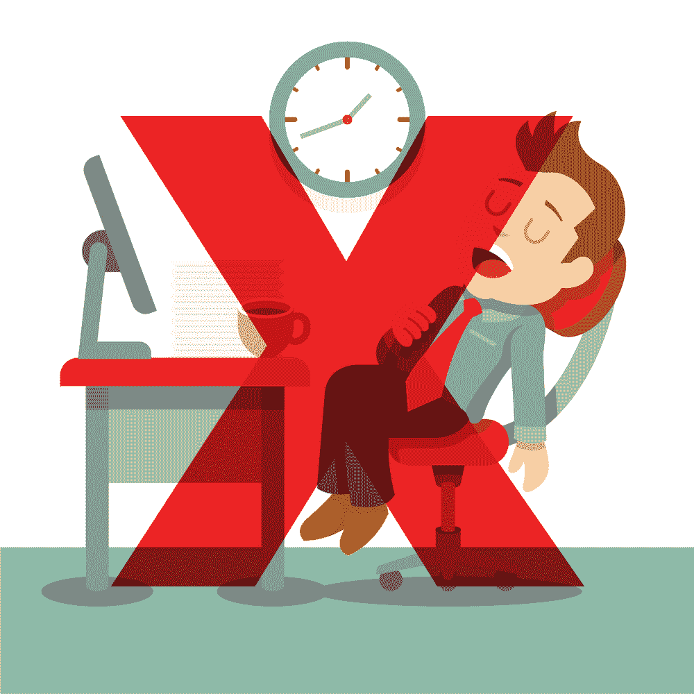
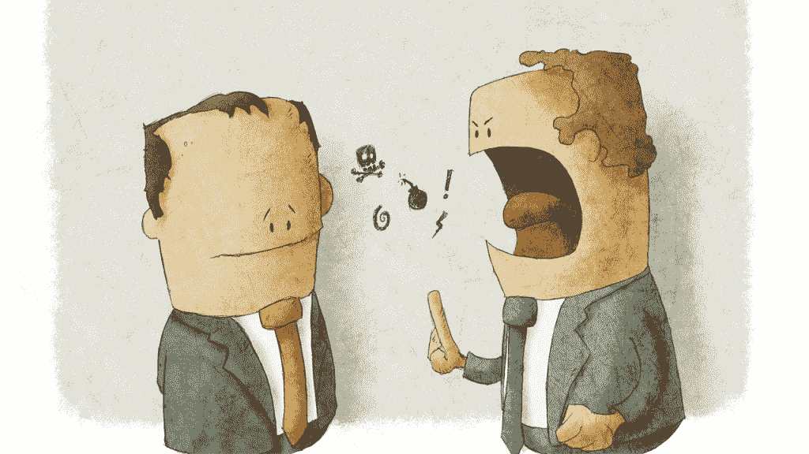

# 软件开发人员与同事相处指南

> 原文：<https://simpleprogrammer.com/dealing-with-coworkers/>

我能回忆起我有幸与之打交道的最糟糕的同事之一。

他的名字叫山姆，他很臭。

不，我是说字面上的意思。

他没有用除臭剂。

不知道他是否洗过澡。

他的口气很臭。

当他和你说话的时候，他就站在你的面前——他确实是这样和你说话的，而且是以最粗暴的方式。

就好像他不了解正常的人类互动。

他会不停地吹牛。

他会立刻宣称你的想法不如他的。

他说“的确”的次数太多了，还用 5 美元的单词让自己听起来比你更有教养，因为他相信自己的确如此。

起初我以为我必须辞职，因为我无法和他相处，他总是在我面前出现。

但后来我意识到老山姆的一些事情。

尽管他有很多缺点，但实际上他是个相当好的人。

不仅如此，他实际上相当聪明。

他很挑剔，但至少他很诚实。

当其他人会让你眼前一亮时，不管你喜不喜欢，山姆都会告诉你真相。

他缺乏机智可能是一件好事，如果你脸皮厚一点，知道如何处理。

所以，我决定改变我的方法。

我没有试图改变山姆，而是接受了他。

我实际上赞扬并承认了他的优点，这在过去很少有人这样做。

他以你无法想象的忠诚回应了我。

尽管萨姆仍然不是我一定会称之为朋友的人，但他不仅是我可以打交道的同事，而且是一个真正的盟友，帮助支持我的想法。

在你作为软件开发人员的工作中，[你会遇到很多你自己的 Sam。](https://simpleprogrammer.com/2015/05/07/my-coworkers-suck-what-should-i-do/)T3】

你还会遇到很多友好的人，你自然会与之相处。

你甚至可能会遇到有毒的人，无论你做什么，他总是会带来麻烦，你通常应该尽可能地避开他。

知道如何与所有这些类型的同事打交道是很重要的，因为根据定义，你几乎每天都要和他们一起工作。

你可以成为世界上最好的程序员，但是如果你不知道如何与你的同事相处，你不仅会在工作中过得很不愉快，你也可能不会很有效率。

这一章是关于学习如何与同事相处——包括难相处的和容易相处的。

## 第一印象很重要

[在你见过别人之后，很难改变他们对你的看法](http://amzn.to/2daXsdw)，所以当和那些可能会占据你生活相当大一部分的人打交道时，**留下一个好的第一印象可能是个好主意。**

现在，我意识到对你来说可能已经太迟了。

但你总能为下一份工作留下良好的第一印象。或者，你也可以尝试来个 180 度大转弯，重新设定人们对你的印象，从而重塑你对现有工作的第一印象。(困难，但不是不可能。)

当你第一次进入一个新的工作环境时，你要确保自己不会表现得不如人或不适合这份工作。

对自己的技能有信心非常重要，因为很多时候你的同事对你的看法会影响你的经理对你职业发展的决定。

所以，即使谦逊是一种美德，也不要因为你是新人就胆怯和默认。

你不想永远被贴上标签，被认为是新人。

我们都认识在同一份工作上工作了几年的同事，他们仍然被认为是新人，因为这是每个人对他们的第一印象，而且一直如此。

但是也不要骄傲自大。

相反，**目标是自信和好奇心的结合。T3】**

你知道自己有能力做什么，并且对自己的能力有信心，但是你在一份新的工作中，并且尊重在那里工作时间更长的同事的经验。

实现这一点的最好方法之一是**问大量聪明的问题**——尤其是有人在训练你的时候。

你也要特别注意你在工作的头几天的穿着和行为。

你可以随意穿着，并不意味着你就应该这样。

在第一周的工作环境中，穿得比平时高一两个档次，这样你会给人一种更专业的印象。

另外，确保你更加外向和友好。

对你遇到的每个人说“你好”，当你问候他们的时候，试着用他们的名字。

做所有这些事情将有助于你建立一个良好的第一印象，这将有助于你和你的同事有一个良好的开端。

## 尽可能乐于助人

在我的职业生涯中，有一件事一直让我受益匪浅，并确保我无论在哪里工作都能交到很多盟友，那就是我愿意帮助我的同事。

你在工作中的态度不应该是好斗或竞争——尽管有时一点健康的竞争没有错——而是帮助和支持。

你真的不想陷入这样的境地，你的同事总是试图打击你或者让你看起来很糟糕。

无论你做什么，有些人都会这样做——我们稍后会谈到这一点——但是，在大多数情况下，如果你被视为一个乐于助人的人，人们会以同样的方式回应你。

带来帮助，愿意帮助同事解决他们的问题也会让你受益，因为你会看起来比实际上聪明得多。

你将**在你的团队**中获得一个“去”人的名声，如果你试图获得团队领导职位或晋升，这将对你有很大帮助。

总的来说，乐于助人是一个好主意。它能解除好斗的同事的武装，让你获得更多全面的经验，并让人们以积极的眼光看待你，从而减少整体问题，创造更好的工作环境。

## 避免戏剧

即使你给人留下了很好的第一印象，并且是团队中最有帮助的人，你也很可能会在工作中遇到一些戏剧性的事情。

有人类的地方，就有戏剧。

这只是社会环境的结果。

但是仅仅因为有戏剧，并不意味着你必须完全沉浸其中。

不要让废话进入你的生活。

如果你有戏剧，你就允许胡说八道。就这么简单。

真的是。

你可以控制你生活中允许的东西，以及你选择投入你的情感和身体能量的东西。

当有人找上门来想要挑起事端时，你所要做的就是不鼓励也不承认。

不要陷入流言蜚语中。

当有人在背后说别人的坏话时，只要说那个人的好话就可以了。

当谣言四处传播时，甚至不要去听它——当然也不要去传播它。

做好自己的工作，把话题转移到工作相关的事情上就好了。

当你听到房间里的谈话充满了戏剧前的嗡嗡声时，这是戴上耳机开始打字的好时机。

当同事们试图在你周围或关于你制造戏剧性事件时，尤其如此。

所以，有人不喜欢你，他们说了你的坏话？

大不了。忽略它。向前看。

戏剧不会给你的生活带来任何积极的东西。卷入戏剧已经结束了许多编程生涯，仅仅是因为一个聪明的软件开发者不能管好自己的事情，置身事外。

## 但是不要避免冲突

戏剧是不必要的，但冲突不是。

只要有人一起努力实现一个目标，就会有某种形式的冲突。

我这样想，你那样想，你认为我是愚蠢的，我认为你是一个低能儿，所以我们有冲突。

一定程度的冲突是有益的。这在任何一种关系中都是健康的。

人们并不总是同意。

他们有不同的观点，不同的世界观等等。

如果解决得当，冲突是有益的，因为它会产生比你我用自己有限的思维所能产生的更好的结果。

所以，[不要回避冲突。](https://www.youtube.com/watch?v=oWy14ibuyO8)

如果你不同意某人的建议，要委婉，但要陈述你的观点。

冲突可能会变成戏剧，但只要解决得当，并不一定如此。

尽量保持冷静，不要心烦意乱。

冲突不应该变成个人恩怨。

如果是这样，你可能需要冷静下来，离开这种情况，直到你能以和平、建设性的方式与你的同事重新接触。

你的目标应该是找到问题的最佳解决方案，而不是证明你是对的或者比你的同事更聪明，或者他们的想法是愚蠢的。

如果同事侵犯了你的个人界限，你也可能需要陷入冲突。

阅读《界限》这本书，很好地理解什么是合理的个人界限，以及如何处理违反这些界限的人。

在这些情况下，你仍然可以通过让你的同事知道他们对你做的或说的不合适的事情来参与健康的冲突。

这可以通过友好但坚定的方式完成，不攻击对方，但明确界定你的个人边界是什么。

冲突并不好玩，但如果你回避它，它会升级为戏剧，压抑愤怒或怨恨，这会毒害你在工作和家庭中的关系。

也就是说，你应该努力避免争论。

不需要诉诸争论就能解决冲突，尤其是关于与工作无关的话题。

(我们马上会谈到其中的两个。)

正在解决的健康冲突和争论之间的区别主要在于意图。

如果你想证明自己是对的，而你的对手是错的，这就是一场争论。

如果你真的想找到一个相互理解和尊重的地方，尽你所能解决不同的观点，这是一个健康的解决冲突的方法。

戴尔·卡内基说得好，他说:

“我得出的结论是，在天堂之下，只有一种方法可以在争论中获胜，那就是避免争论。像躲避响尾蛇和地震一样躲避它。”

## 政治和宗教

说到争论，我们来谈谈政治和宗教。

哦，我们还可以在里面放点健康的性爱。

或许不是。

不是工作的时候。不要做就是了。

如果你想找一个理由，制造前所未有的敌意，那就提出其中一个话题。

人们对这些主题有着极其强烈的看法。

在这些问题上，人们通常都很狭隘。

人们对这些话题非常情绪化。

但是，最重要的是，这些科目不会以任何方式帮助你完成工作，也不会有助于营造一个良好的工作环境。

即使你认为某个同事可能同意你的某个观点，最好也不要谈论他们，因为第一，他们可能不同意；第二，其他不同意的同事可能会无意中听到谈话，参与进来，或者静静地坐在办公桌前，等待机会让你下台。

相信我，不会有什么好结果的。

当有人说你是办公室政治动荡的源头时，你也可能被贴上麻烦制造者或煽动者的标签。

我见过许多受人尊敬的聪明的程序员被带着一个纸箱送出大楼，因为他们无法将自己的激烈观点藏在心里。

把这些对话留到属于它们的餐桌上。

## 不工作的同事

几乎在每一个工作环境中，都有这样一个人，他似乎从来没有真正完成过任何工作。

他们是球队的累赘，每个人都知道。

你在办公桌前努力工作，踢屁股，记名字，而**他们只是坐在那里浏览网页**并在脸书发布政治信息。

这可能会令人恼火。

你很想给他们一巴掌，把他们拖进老板的办公室，直截了当地说他们是个懒鬼，应该被解雇。

不要这样做。

其实什么都不要做。

这个人有一根绳子，如果你允许的话，他们最终会上吊自杀。

**你担心你。**

完成你的工作。

尽可能多产。

不要担心别人做什么或不做什么。

对付这种人的最好办法是让你自己变得富有成效，以至于这种反差变得如此明显，以至于你的老板会情不自禁地注意到谁是懒鬼。

你能做的最糟糕的事情就是打他们的小报告，这让你看起来很小气，也给了他们为自己辩护的机会。

首先，你的评估可能是错误的，他们可能会拿出一个笔记本，记录他们在过去一年中每天所做的一切——这会让你看起来像个懒鬼。

另一方面，他们可能是因为某种你不知道的裙带关系而在职。

你不想去把 CEO 的侄子报告给你的老板，因为猜猜谁会赢得这场冲突，猜猜谁会被解雇？

相反，闭嘴，尽你所能做好你自己的工作。

只要有足够的时间，这些问题有办法自行解决。

如果你真的想做什么，主动帮助这个人。

没错。

伸出手**询问他们是否需要帮助**。

看看你能否用你的职业道德激励他们。

看看你能否**激励他们**并让他们关心如何做好工作。

你会惊讶于一点点鼓励的作用。

## 话太多的同事

这是我们许多人面临的另一种情况。

你想完成你的工作。

你想要有礼貌和社交。

但是，有这么一个家伙，他真的很友好，但是他就是不肯闭嘴。

你坐下来做你的工作，而他正从隔间墙上探出头来，想要谈谈你认为谁会赢得选举。

你下班回来，他又出现了，在你的隔间里等着你，这样他就可以讨论他和邻居之间长期不和的最新进展。

你甚至给他所有的信号，你很忙，他应该继续回去工作。

你反复看你的手表。

你伸手去拿耳机。

你甚至把椅子转到显示器前，把手放在键盘上，但他就是不闭嘴。

那你是做什么的？

有很多方法可以处理这种情况，但是有一个简单的方法可以减少很多潜在的干扰，那就是留出一个集中注意力的时间，并制定明确的规则。

我自己也曾使用 Pomodoro 技术专注地工作。

事实上，就在我写这一章的时候，有一个 25 分钟的计时器在计时，在此期间，我百分之百地专注于写这本书，不容许任何分心。

你不一定要使用番茄工作法。

重要的是，当你不想被打扰时，你有办法指定专注的时间。

在过去，我做过一些简单的事情，比如[制作一个小的悬挂标志](https://www.youtube.com/watch?v=J5xzybYysy8)，一面写着“随意打断”，另一面写着“专心，请不要打断。”

我简单地向我的老板和同事解释说，我看过一项研究，表明由打断引起的上下文切换会导致生产力的巨大损失，所以我正在尝试一个实验来提高我的生产力。

然后我向他们解释了这个标志，并说我知道这很傻，但请他们迁就我，让我的工作更有成效。

没有人争论或有任何问题。

它非常有效。

话太多先生明白了我的意思，我甚至不用和他对质。

我的工作效率确实大幅提升，因为我没有一直被打扰。

所以，我强烈建议做一些类似的事情，不仅仅是为了解决这个问题，而是为了提高你的整体生产力。

多任务处理和干扰确实会导致巨大的生产力损失。

唉，如果这种技术不起作用，或者你拒绝尝试，我推荐的下一件事是非常明显的，但它需要一些勇气。

记得我说过不要避免冲突吗？

这是其中的一次。

简单地面对夸夸其谈的先生，告诉他你是来工作的，如果他在工作时不谈论与工作无关的事情，你会很感激。

告诉他你很奇怪，你知道这是一个奇怪的请求，但你只是在分心的时候很难工作，而且你很容易分心。

让它看起来像是你的缺陷。不是说他是个说得多做得少，听不进任何暗示的无知蠢驴。

## 有毒的人

我真的不能在结束这一章的时候不谈论那种最糟糕的同事，那种无法相处的同事。

我称他们为有毒的人。

有些人你无论如何都帮不了，你应该一起避开他们。

有些人似乎总是有不好的事情发生在他们身上，带着五个装满行李和戏剧的行李箱，似乎总是无法抓住机会的无助的受害者。

你可以通过这些人留下的一系列尸体来辨认他们。

他们态度恶劣，不可理喻，只是竭尽所能让自己的生活和周围人的生活成为人间地狱。

他们不能和他们的同事相处。

他们不能和家人相处。

甚至他们自己的狗都认为他们是混蛋。

这种人的危险在于你同情他们，你想帮助他们。

看起来他们真的很不走运，他们拿到了一手烂牌。

但是命运在他们的困境中是否有任何作用，这不是你能决定的。

你最好完全避开它们。

如果你必须和他们交流，尽量保持简短。

如果你能完全避开它们，那就去做。

如果你和这些人在一个团队，并且你必须不断地和他们交流，实际上可以考虑换团队甚至换工作。

我知道这看起来有些极端，但在这一点上相信我，就像《黑客帝国》中墨菲斯告诉尼奥当他看到一个特工时要做的:跑。

## X 呢？

我意识到这短短的一章不足以涵盖所有的情况。

我试图概述最常见的情况和实用的一般建议，但可以说可以就这个主题写一整本书。

我不会写一本，我会推荐给你一本我认为是处理人际关系的经典书籍——我会在本书中多次提到——*[如何赢得朋友和影响他人](http://amzn.to/2cYrwhT)* 戴尔·卡耐基著。

说到与人打交道？

你的老板怎么样？

别担心，我们接下来会谈到这个棘手的话题。

* * *

