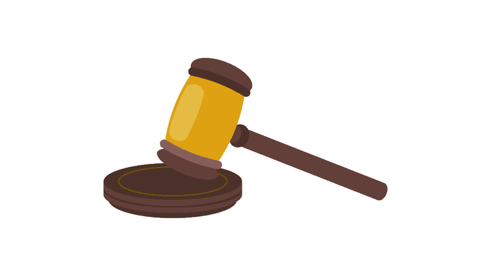

# 软件开发人员应对偏见指南

> 原文：<https://simpleprogrammer.com/dealing-with-prejudice/>

我希望我不必就这个主题写一章，但我必须写，因为尽管我们愿意相信我们已经超越了工作场所的种族主义、不宽容和其他形式的偏执，但事实是我们还没有。

它仍然存在。还是个问题。

很可能永远都是。

我的意思并不是要描绘一幅软件开发世界的阴郁画面。

好的、诚实的、没有偏见的软件开发人员和经理比坏的多。

在很大程度上，我们生活在一个前所未有的充满机遇的时代——对所有人来说都是如此。

总的来说，这个世界比以往任何时候都更加接受不同的文化、种族、宗教、性别，以及你能想到的任何东西。

但是……还是有问题。

尽管我很想告诉你这个世界需要如何改变，以及应该如何应对这些情况，但我是一个现实主义者。

我内心的现实主义者说，我们可能不喜欢事物的现状，我们可以尽自己的力量去改变和影响我们所能改变和影响的事物，但最终，我们必须学会如何适应和应对我们当前的环境。

这就是本章的内容。

这不是关于什么是错的，社会如何解决它。

而是你能做什么。

这是关于当你遇到偏见时，你该如何应对。

这是关于你如何应对并超越那些试图压制你的人。

这是关于**选择控制你能控制的，接受你不能改变的，不要无意中成为问题的一部分，对所有人**都要有恩典，即使是“坏”的人。

## 接受人们有无意识的偏见和成见

我们在“如何着装”一章中谈到了这一点，所以我不会在这里白费口舌，但重要的是要知道并意识到每个人——包括你——都有一些根深蒂固的偏见并依赖于刻板印象。

同样，这一章的重点不是判断或说什么是对的或错的，而是告诉你如何有效地处理这一事实。

对付别人的偏见，尤其是当他们反对你的时候，最好的办法就是接受他们。

我接受它们并不一定意味着容忍它们。当然，有些情况下你需要坚持自己的观点并做出回应。

通过接受它们，我真正想说是**你需要意识到，不管你是谁，总有人会因为一些你无法控制的原因对你有一些偏见。**

你需要接受这个事实。

你需要预料到这种情况，否则你将永远处于震惊、愤怒和怀疑之中。

但是如果你遇到这样的情况——特别是在工作场所——期望并理解总会有某种程度的偏见，每个人都有，你会更好地准备处理它。

同样，当我说“接受”时，我并不是想告诉你这不是一个问题，我只是想告诉你要面对和看清现实，这样你才能做出适当的回应。

## 给自己避免偏见的最好机会

我知道我要告诉你的不是一个受欢迎的观点。

有些人可能会把我贴上虐待和不宽容的标签。(有点讽刺，你不觉得吗？)

但是，就像我说的，这一章是关于有效的，关于在一个充满不完美的人的不完美的世界里，你实际上可以做些什么来让你的生活和事业变得更好。

这不是改变世界来塑造我们想要的现实。

也就是说，**避免偏见的最好方法通常是充分意识到这一点，从而真正改变你向其他你认为可能对你有偏见的人展示自己的方式**——尤其是在无意识的情况下。

让我们举一个简单的例子。

你的名字怎么样？

根据不同的语境，你的名字可能会引发无意识的——不幸的是，有时是有意识的——对你的偏见。

在写这本书的时候，在美国，如果你碰巧有“约翰·史密斯”、“詹姆斯·罗伯特”或类似的名字，你可能根本不用担心工作场所有人会因为你的名字而对你有偏见。

但是，如果你的名字是“法蒂玛·穆罕默德”或“塔米卡·琼斯”，你可能会有更多的问题。

我知道这在政治上是不正确的，但是让我们诚实一点。

另一方面，我最近有机会访问中国，我可以非常自信地告诉你，如果你在那里或在日本的名字是“约翰·史密斯”或“詹姆斯·罗伯特”，你可能也会受到一些偏见。

我用了这两个例子，所以你可以看到它是基于上下文的。

不同的人在不同的背景和环境下会经历不同的偏见。你是谁并不重要，我可以找到一个地方，人们仅凭你的名字就会对你产生偏见。

那么，你能做些什么呢？

嗯——实际上我不是在开玩笑——**你可以合法地改变你的名字**或者用一个昵称。

我知道这可能让人觉得你不应该这样做，甚至觉得这样做是错误的，但我在这里说的是实际的。

如果你知道一个名字可能会引起对你的偏见，哪种策略更好？试着让其他人不要对你的名字有偏见，或者改变你的名字，这样你就不会在第一时间出现问题？

这其实是书作者和演员做的一件相当平常的事情。

我知道很多软件开发人员也这样做过。

见鬼，我考虑过，因为我姓 Sonmez。

我一直想有个“文斯·德莱昂”的网名。

但是现在已经太晚了，因为太多人知道我的名字，但是我确信有些人会因为我的名字而对我有偏见。

重点是，这只是一个名字。不是你。

如果你觉得改名能帮你避免偏见，那就改吧。

如果你不想，就不要，但至少要接受你可能会因此经历一些偏见。

不要指望世界会按照你想要的方式运转。

你的穿着、说话的口音和使用的词汇也是如此。

我能给你的最务实的建议是**根据你将要工作的工作环境对自己进行一次诚实的评估，并试图找出你的哪些方面或你如何表现自己可能会引起负面的刻板印象或偏见。**

然后，找出你可以改变哪些事情来减少偏见，而不牺牲你的核心。

不要误解我，我不是说为你的名字、你的传统、你的肤色、发色、宗教信仰或其他任何东西感到羞耻。

我只是问你能改变什么或者你如何呈现自己来减少对你的偏见。

你可以做很多简单的事情，而不需要牺牲你的正直或改变你的本质。

让我给你举几个例子。

例如，美国许多有南方口音的聪明人会选择聘请语音教练来帮助他们改掉自己的口音。

有南方口音并不意味着你不聪明，但是美国人对南方口音有一种刻板印象，这种印象并不总是积极的。

纹身可能对你不利，但可以被掩盖或去除。

一些种族偏见可以通过穿着更专业一点、减少口音和改变词汇来克服或减少。

即使看起来很好——例如，成为一个健美运动员或一个有吸引力的女人——也会给你带来问题，但是服装选择可以消除这些刻板印象。

现在，有些事情你知道可能会对你产生负面影响，而你不想改变它们。那很好。我完全理解。

我只是给你一些你能做的建议。

最终，这取决于你。

再说一次，我知道这一章会让一些人不高兴。我明白了。

但是，问问你自己，我告诉你的是否是一种务实的方式来处理对你的偏见。

我是想说偏见是可以的，并为它找一个借口，还是想给你一些实用的建议，从一开始就避免它？

## 不要隔离自己

在存在一定程度偏见的工作场所，我经常看到的一个错误是，正在经历某种程度偏见的人会自我隔离。

不要这样。

**不要“找你的人”，组成一个大团体，只和他们一起闲逛。**

这只会制造更多的偏见，而且很可能让你看起来真的有偏见。

本着抛开所有政治正确的精神，我给你讲这个故事。

很久以前，我和一群其他承包商一起签订政府合同，其中很大一部分是印度人。

印度承包商会自我隔离。

他们会在一起，每天一起去吃午饭。

然后是我。

我正处于其中。

我会加入并邀请自己参加他们的午餐。

我会在那里和他们谈生意。

我是一个名誉上的印度人——尽管我根本没有印度血统。

其他承包商会经常与印度承包商发生纠纷，而不是我。

印度承包商经常与非印度承包商发生纠纷，而不是我。

我能从两方面看待问题，我很受印度人和非印度人的喜爱。

最终，我开始邀请其他非印度承包商和我们共进午餐。

**我大大减少了我不得不应对的偏见，我也有能力减少印度承包商不得不应对的偏见，**因为我打破了自我隔离，我包括所有人，从我自己开始。

作为一个在合同中处于领导地位的人，我可以看到自我隔离是如何伤害这个项目的。

从内部观察并不总是那么容易。

我去哪里都这样。

你会经常看到我和最奇怪的一群人在一起，因为我不怕混进去。

结果是，我一点也没有受到太多的偏见。

所以，我给你的建议是**走进那里，混合它，与人交谈，与不是“你的人”的人互动**

大多数人寻找与他们有共同之处的人，并自我隔离到这些群体中，无论是种族、宗教、民族还是其他因素。

结果，他们经历了更多的偏见。

不要那样做。

## 

对自己有信心

迄今为止，对抗偏见的最好方法是不要让它影响你对自己的看法。

如果你高度重视自己和自己的能力，那么试图以某种方式贬低你的人就很难有任何效果。

是的，我知道这说起来容易做起来难。当你觉得人们不公平地歧视你，或基于偏见或成见不公平地威胁你时，你很难继续快乐的生活，但你越自信，就越容易。

你不能改变其他人。

你不能改变他们的想法。

你不能直接改变他们对你的感觉或对你的行为。

但是**你*能*改变你。**

你会变得更强壮，更有弹性。

如果你愿意，[你可以发展你的自信](https://www.youtube.com/watch?v=DUvvbA-FTlQ)到这样一个程度，当人们发表种族主义言论或带着偏见向你走来时，这都没关系，因为你知道你有能力做什么，你可以克服他们试图强加给你的不利条件。

只要对自己的能力和自我有足够的信心，让他们说什么或想什么都不重要，就能消除潜在压迫者的力量。

历史上我最崇拜的人之一是一个名叫弗雷德里克·道格拉斯的人。

以下是他的一段话，与我们的讨论有关:

暴君的极限是由他们所反对的人的忍耐力决定的

弗雷德里克·道格拉斯是一个奴隶，他逃离了他的主人，成为一个自由人，并帮助其他奴隶逃跑。

他是一个伟大的人，不仅仅是因为他的所作所为，还因为他的所思所言。

他不允许自己的状况或周围的偏见和种族主义来定义他。他断然拒绝了。

这里有一段引用自弗雷德里克·道格拉斯的维基百科条目，关于他当奴隶的时候:

> “1833 年，托马斯·奥德从休手中夺回了道格拉斯(“这是惩罚休的一种手段，”道格拉斯后来写道)。托马斯·奥德派道格拉斯去为爱德华·柯维工作，爱德华·柯维是一个贫穷的农民，有“破奴者”的名声。“他经常鞭打道格拉斯，几乎使他精神崩溃。然而，16 岁的道格拉斯最终反抗了殴打，并进行了反击。道格拉斯在一次身体对抗中获胜后，科维再也没有试图打败他。

为什么我这么喜欢弗雷德里克·道格拉斯？

简单。弗雷德里克从未认为自己是一个无助的受害者。

他的反应总是无视你或者反抗你，从不默许。

## 尽可能忽略它

我正在读马克·曼森的一本书，书名很有争议，叫做《不在乎的微妙艺术》。

在书中，马克说，社会和人们普遍存在的最大问题之一是，正如他所说的那样，他们对太多事情漠不关心。

太多事情了。

我并不想轻视歧视、偏见、性别歧视、种族主义、偏执以及所有其他困扰我们社会的弊病——这些都是真实存在的问题——但是从个人层面来说，我们真的有必要如此在意这些事情吗？

我不是西班牙裔，但很多人认为我是。

我并没有因此受到很多歧视或偏见，但我确实受到了一些。

你知道我默认的回答是什么吗？

没什么。

我干脆无视了。

就像马克·曼森说的，“没有性交”

所以，你认为我不够聪明是因为你对我的一些刻板印象。

所以，你嫌弃我，想对我不好。

那又怎样？

我根本不在乎。

我只是继续我的一天，把你的无知当成它本来的样子，无知。

人们说愚蠢的事情。

人们会说一些伤人的话。

有时是出于恶意，但大多是出于无知。

见鬼，这一章的一半——或者更多——可能会冒犯你。

如果**你选择**让它。

或者你可以简单地忽略它，继续你的生活。

偏见发生了。不公时有发生。

这每天都在发生。

不应该发生，当它越界了，你当然要处理，但是**你的默认模式应该是无视。**

小心选择你愿意为之献身的山丘。

我知道这种观点在政治上不太正确，你可能不喜欢，但是你猜怎么着？

我不在乎。

我的生活中有太多重要的事情要担心和做，而不是浪费时间和精力去关心那些不重要的事情。

我宁愿务实也不愿被冒犯。

## 报道你不能忽视的东西

也就是说，并不是所有的事情都可以忽略。

有些时候，你必须为自己挺身而出，你不能容忍某人的无知，因为，从务实的角度来说，它确实以一种严重的方式影响了你。

如果你的工作场所有人对你进行种族主义的侮辱，并对你进行歧视，我并不是建议你袖手旁观，无视他们。

这与说文化不敏感的话或开不恰当的玩笑或其他一些可能“冒犯”但实际上不会伤害你的事情有点不同。

如果你因为你的种族、性别、宗教、性取向等受到老板或有权力的人非常不公平的对待。，而且实际上已经影响到你的职业生涯了，答案不是脸皮厚，是举报他们。

你必须成为法官，清楚地说什么时候该适可而止。

[你必须有明确的界限——你能容忍什么，不能容忍什么。](http://amzn.to/2einWeE)

这是一个个人决定，但我会鼓励你尽可能务实，宁可厚脸皮也不要过于敏感，因为一直战斗会让你在情绪、身体和心理上疲惫不堪，从长远来看，这是不值得的。

但是，当这条线被跨越，你不能忽视它，这里是你要做的。

从记录事物开始。

写下说了什么，发生了什么，谁做的，发生在哪里，什么时候。

做非常详细的笔记，这样很明显你不是在编造事情，只是为了麻烦而制造麻烦，并且有一个不可原谅的行为的清晰模式。

同样，**不要因为一个小小的失误就把某人钉在十字架上——除非这是一种严重的侵犯，比如某种形式的身体或性侵犯——但是，如果你需要举报某人，确保你有证据。**

一旦你有了你需要的证据，**如果可能的话，试着自己处理这个问题**。

面对这个人，告诉他们他们越过了什么界限，为什么这是不可接受的，并告诉他们停止。

不要威胁，不要恐吓，不要说教或乞求。

简单明了、坚定地对待他们跨越的界限，你不会容忍它。

如果他们不同意，那么是时候去找人力资源部或更高层，带上你的证据。

如果问题没有得到解决，你可能想寻求法律咨询或者完全脱离这个环境。

## 偏见糟透了

相信我，我知道。

我是它的目标。

我见过其他人受到它的影响。

我希望你能明白，在这一章里，**我并不是想对它置若罔闻，为它**开脱，或者以任何形式对它不屑一顾。

我想做的是给你一些务实的建议来处理这件事。

在生活中，我发现为一项事业成为烈士很少有效。

取得成功，获得影响力和尊重，然后利用这种影响力对世界产生影响，这要有效得多。

举着纠察标志很少会有什么不同。

我宁愿通过证明反对者是错的来推进我的事业，然后告诉他们他们是错的。

* * *

