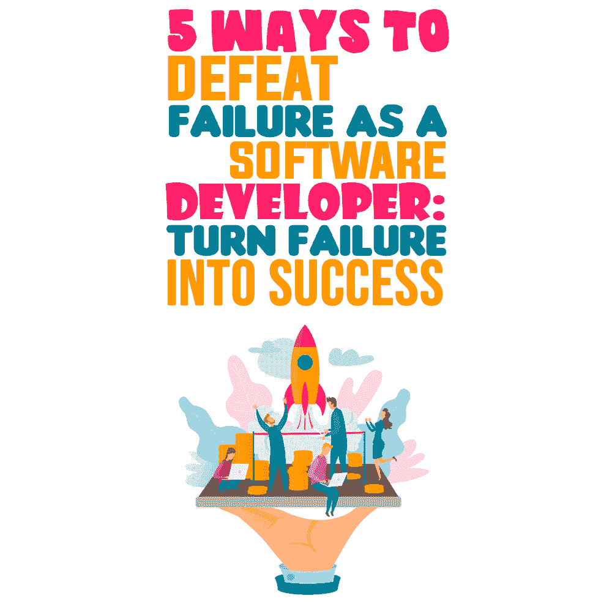

# 作为软件开发人员，战胜失败的 5 种方法:化失败为成功

> 原文:[https://simple programmer . com/defeat-failure-software-developer/](https://simpleprogrammer.com/defeat-failure-software-developer/)

Failure is the most feared word in software development. We all experience failure at some point, but we’re often not taught how to deal with it.

当你是一名软件开发人员时，失败是不可避免的。我们经常会有错误从 QA 中溜走，然后发布到生产中，在那里它们会给用户带来巨大的麻烦。我们经常会写出不符合我们预期的代码。有时，我们发现自己被困在一个问题上，不知道下一步该做什么。

失败的最大问题是难以启齿，更难从中吸取教训。因此，我们的想法停滞不前，我们的职业生涯停滞不前，我们永远无法发挥出自己的全部潜力。

但是重要的是把每一次挑战都当作成长和进步的机会，而不是因为事情没有按计划进行而让它们阻碍你或让你觉得自己不值得。

克服挑战是非常困难的，但是这篇文章将会给你五种有效的方法来应对挑战，帮助你成为一名成功的软件开发人员。

## 正确识别和记录问题

克服挑战的最重要的部分之一是正确地识别和记录问题。

对于软件开发者来说，可以从 bug 入手。报告和跟踪 bug 越快、越具体，解决它们和提高代码质量的速度就越快。请记住，每个 bug 都是您改进代码的机会。

识别问题并不总是容易的，但是如果你能找出哪里出错了，为什么出错，你就能更好地解决问题。你这样做得越频繁，你的代码就会变得越好。

如果你现在不记录一个问题，以后你可能不记得你什么时候解决了它。记录错误有助于你从错误中吸取教训，这样将来就不会再发生了。

行动步骤:有一个地方记录你所有的错误。这可以是一个电子表格，你电脑上的文本文件，甚至是一本物理日志。

关键是要有一个可以方便地获取这些信息的地方，这样当你将来遇到问题时，你可以使用你的笔记来帮助快速解决问题。

## 培养心理安全感

2012 年，[谷歌开始研究团队高效的要素](https://rework.withgoogle.com/print/guides/5721312655835136/)。他们发现最重要的是心理安全。让一个团队有效的不是每个人有多聪明或多优秀，而是团队中的人是否觉得冒险和犯错是安全的。

你需要创造一个允许失败的环境。确保你鼓励你的队友去冒险和犯错，也确保当他们犯错时不要惩罚他们。这将创造一个积极的环境，在那里你将学会如何处理具有挑战性的情况并做出改进。

**行动步骤:**关注解决方案(“下一次我们怎样才能把事情做得更好？、“我们可以一起做些什么来建立未来的游戏计划？”)，并避免责备(“你为什么这样做？”).

例如，当与您的团队合作时，确保您提供支持和帮助，帮助他们解决问题。如果有人犯了大错，不要马上责备他们；帮助他们了解他们做错了什么，以及如何着手解决。这将创造一个人们说“我不知道”或“我犯了一个错误”的环境

重要的是创造一个环境，让人们感到足够安全，可以敞开心扉，表达自己，并在学习中变得脆弱。

## 不要为难自己

我们做的每一件事都不孤单——成功会得到他人的支持，挫折会受到我们无法控制的事情的影响。

当你失败时，你很容易自责，并把自己和那些似乎比你强的人进行比较。但是作为一个软件开发人员，有太多的事情是你控制不了的。当你拿自己和别人比较时，你只会让自己更加困难，阻碍自己的成长。

记住，面对挑战和失败，你并不孤单。许多人失败了，但仍然继续他们的生活。你需要记住，没有人是完美的，每个人都会犯错，即使是世界上最成功的人也不例外。

行动步骤:试着写一份感恩日记，每天晚上或睡觉前，你写下一天中对你有利的三件事，以及它们为什么有利。这将有助于提醒你一天中的所有成就，这将使你更容易避免对自己的错误过于苛刻。

## 从别人的错误中学习

学习会帮助你在你的手艺上变得更好。你知道的越多，你失败的可能性就越小。

一个很好的学习方法是分析别人的错误。当你看到别人犯的错误时，不要费心指出来或为此羞辱他们。相反，想想他们本可以如何避免这种情况，以及你本可以采取什么不同的做法。

**行动步骤:**分析经历过失败的大公司的事后报告。看看他们犯了什么错误，学到了什么。

[Cloudflare 示例](https://blog.cloudflare.com/todays-outage-post-mortem-82515/)是展示事后反思价值的绝佳方式。

在 Cloudflare，他们遇到了一次事故，来自美国和欧洲的所有流量都通过一个数据中心。巨大的流量导致数据中心崩溃，因为对这种资源的需求太多了。发生了什么事？他们发现一名工程师在数据中心网络配置中犯了一个打印错误。

## 从长远考虑

Just because your project isn’t going the way you thought it would now doesn’t mean that it never will.

对自己想要的东西和未来的目标有一个长远的愿景是很重要的。

想想未来的 5-10-15 年，朝着那个目标努力。

如果你是一名初级软件开发人员，你的目标可能是成为一名高级或能够监督他们团队的技术领导。要达到这一目标，你需要通过一定数量的测试，并在被考虑担任更高职位之前亲自动手。

软件开发是如此不可预测，以至于大多数时候，理论知识不会让你走得很远。

例如，当您的代码进入生产阶段时，通常会有很多不可预见的因素导致您的代码失败。如果发生这种情况，试着成为第一个遇到它们并解决它们的人。这将给你一个机会去理解导致这一挑战性局面的环境。

**行动步骤:**想清楚自己的长期目标是什么。不要害怕大胆梦想。一旦你有了它们，每天早上用便利贴、屏保或带说明的照片提醒自己最终目标。拥有长期目标会帮助你认识到每天的挑战只是你在前进的道路上需要克服的步骤。

## 采取行动，扭转失败

应对挑战是软件开发人员的重要组成部分。如果你经历了失败，不要让它阻止你再次尝试。失败是学习和成为更熟练的软件开发人员的最好方式之一。

记住你的挑战是成长的机会。

对此感到不安是可以的，但是不要让它阻碍你做你喜欢的事情。不要因为失败而难过。相反，把它转过来，这样下一次，你就会成功。

是时候应用你从文章中学到的东西，改变你的生活了。最重要的是采取行动。我提供给你的行动步骤是一个很好的起点。拿起纸和笔，写下作为一名软件开发人员为了克服失败需要做的步骤。从今天开始！