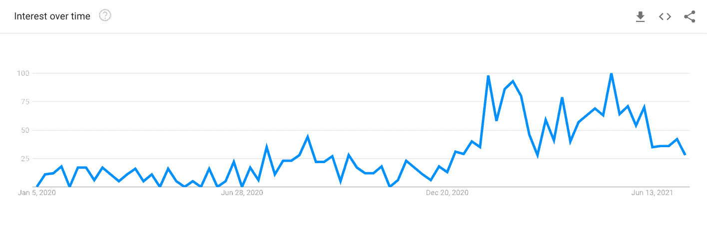
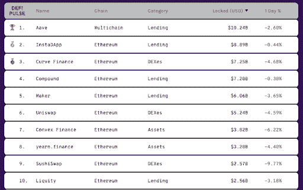
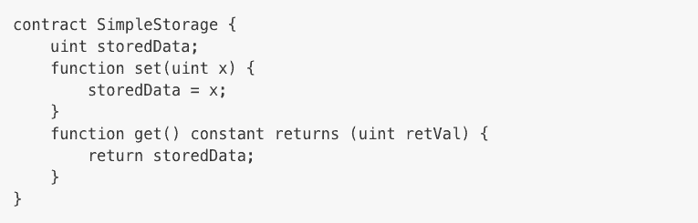
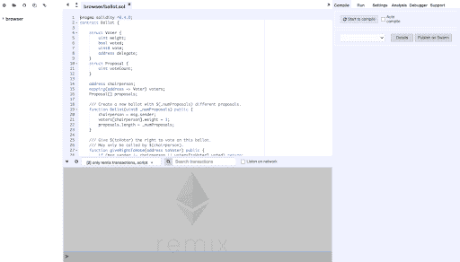
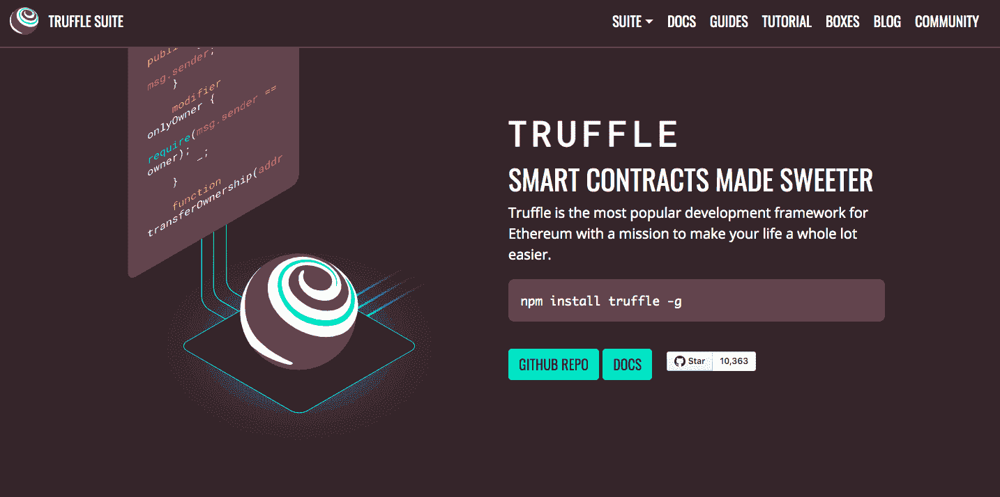
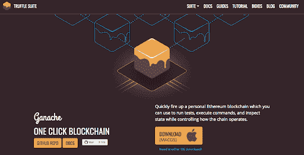

# 什么是 DeFi，如何在 2022 年开始为它编码？

> 原文：<https://simpleprogrammer.com/defi-developer-jobs/>

DeFi 或分散金融是一个密码部门，在去年迅速流行起来。这种受欢迎程度的上升可以归因于投资者对分散融资的需求，这些投资者寻求产生疯狂高利率的非托管金融借贷协议。

这大概也是 DeFi 最近引起各种风险投资家和顶级机构关注的原因。根据 [DeFi Pulse](https://defipulse.com/) 的数据，2020 年 1 月初锁定(TVL)的总价值为 6 亿美元，截至今日，已上涨至 550 亿美元！

这对开发者社区意味着什么？DeFi 加密部门的兴起为在加密行业寻找有利可图的职业的开发人员提供了一个巨大的机会。

作为一个相当新的加密空间，对 DeFi 开发者的需求正在上升。因此，如果你正在考虑转向 DeFi 开发，那么这可能是赶上潮流并大放异彩的最佳时机。

如果你想知道转到 DeFi 是否是你的正确选择，你需要的技能，以及你可以在哪里找到一份 DeFi 工作的平台，那么我会在这个指南中为你介绍。

到本文结束时，您将对这个主题有一个更好的了解，并且您将有足够的资源来做出关于切换到 DeFi 开发的明智决定。

## 什么是 DeFi 或分散财务？

分散金融或 DeFi 是指处理非托管金融产品的加密行业的一个部门。分散或非托管部分使得 DeFi 部门成为一个高度实验性和有利可图的选择。

银行和集中交易所等集中的中介机构对 DeFi 操作没有任何控制权。这种集中的交易所和银行受到更多的监管和欺诈。

这就是投资者和交易者越来越转向分散交易所(DEX)的原因。DeFi 加密交换和借贷协议是目前最受欢迎的金融工具，其中 Aave、InstadApp、Compound 和 Maker 是最受欢迎的 DeFi 借贷协议。此外，诸如 Curve Finance 和 Uniswap 等 DeFi 加密货币交易所也非常受欢迎。

[图像来源](https://defipulse.com/)

### 以太币

所有主要的借贷协议都基于以太坊加密货币，该货币涉及名为 [ERC-20](https://ethereum.org/en/developers/docs/standards/tokens/erc-20/) 的以太坊令牌的借贷。DeFi 协议的创建者对你持有的 ERC-20 代币没有控制权。

持有一些[最佳以太坊钱包](https://coinsutra.com/best-etherum-wallets/)的投资者可能会决定使用 DeFi 借贷平台出借 ERC-20 代币，并从利息中受益。而其他人可能会决定借用这一点，并将其用于一些密码交易并赚取利润。

### 智能合同

所有 DeFi 项目和协议的关键在于智能合同。根据 [Decrypt](https://decrypt.co/resources/smart-contracts) 的说法，“智能合同是用一段代码表示的合同，这段代码[原文如此]是为了执行一组指令而设计的。”

简而言之，智能合同是一段代码，它使 DeFi 项目和协议能够在没有中央组织干预的情况下运行。DeFi 应用程序只不过是一系列智能合同，满足了对中央实体的需求，但实际上并没有。

现在你已经对 DeFi 的基本方面有了一个相当好的理解，让我们来看看开发人员在 DeFi 项目中所扮演的角色。

## 如何开始在 DeFi 中编码？

首先，DeFi 开发者必须具备计算机编程的基础知识和编程语言的基础。

除此之外，掌握加密货币的基本知识以及加密货币领域中任何其他开发工作的功能也很重要。这包括掌握密码学、数据结构和网络的基础知识。

如果你真的想超越其他 DeFi 开发者，并作为一个 DeFi 编码者领先一步，真正理解银行和金融部门的工作也将有巨大的帮助。

如上所述，大多数 DeFi 项目都涉及交换被称为 ERC-20 的以太币。向智能合约存放 ERC-20 令牌的过程是通过 Solidity 完成的，Solidity 是一种高级面向对象编程语言。

### 固态

稳健性用于实施智能合同，这些合同构成了整个去中心化过程的基础。

坚固性主要受 [JavaScript](https://www.amazon.com/dp/0596517742/makithecompsi-20) ，C++，Python 语言的影响。因此，如果你精通这些语言中的任何一种，那么你的潜在学习曲线将会相对较低。

Solidity 旨在借助以太坊虚拟机进行编译。你可以通过在你的浏览器上练习和[编译代码来开始学习 Solidity。](https://ethereum.github.io/browser-solidity/)

### 创建和部署 DeFi 应用程序

要用 Solidity 创建和部署 DeFi 应用程序，您可以使用 Truffle 和 Ganache 之类的工具。这两个工具都是作为 [Truffle 套件](https://www.trufflesuite.com/)的一部分提供的。

Truffle 是一个 IDE 和测试框架，用于部署你用 Solidity 设计的以太坊智能合约。使用 Truffle，你可以在区块链部署智能合约。

另一方面，Ganache 帮助你创建一个本地以太坊区块链，在那里你可以部署和测试你的智能合约。它帮助你模拟真实的区块链网络，从而测试你的智能合约的功能。Ganache 可以作为命令行工具和桌面应用程序使用。

为了简要概述如何构建和部署 DeFi 应用程序，您需要遵循以下步骤:

1.  创建并编译 ERC-20 令牌。
2.  使用 Ganache 部署 ERC-20 令牌。
3.  创建智能合同。

可以参考这个 [DeFi 应用教程](https://ethereum.org/en/developers/tutorials/create-and-deploy-a-defi-app/)了解更多。你可以向官方[以太坊社区](https://ethereum.org/en/community/)寻求帮助，成为 DeFi 领域有能力的开发者，并跟上最新的行业更新。

## 如何找到 DeFi 开发者工作？

一旦你对自己的 DeFi 编码技能有了信心，你就可以开始在各种加密工作平台上寻找工作了。然而，在此之前，确保通过在 LinkedIn 和 Twitter 等各种社交媒体平台上展示自己是一名 DeFi 开发者来建立自己在该领域的权威。

这里有一个加密职位列表，你可以在那里找到合适的 DeFi 开发人员职位:

*   [密码作业](https://crypto.jobs/)
*   [密码招募](https://www.cryptorecruit.com/)
*   [加密货币工作](https://cryptocurrencyjobs.co/)
*   [CryptoJobsList](https://cryptojobslist.com/)
*   [以太网](https://ethlance.com/)
*   [封锁](https://blockew.com/crypto-jobs/developer/)
*   [区块链猎头](https://blockchainheadhunter.com/)
*   [BeInCrypto](https://beincrypto.com/)

因为 DeFi 是一个高度实验性和高风险的领域，所以在你开始从事[编程工作](https://www.youtube.com/watch?v=eChBZVqDfU8)之前，确保对项目的商业基础有一个完整的了解。

DeFi 发展空间相当新，缺乏竞争。因此，你也很有可能通过 LinkedIn、Twitter 和 Reddit 等社交媒体平台获得一些利润丰厚的 DeFi 工作机会。

你可以从在这些平台上创建令人印象深刻的个人资料开始，发布与 DeFi 相关的内容并优化你的个人资料和[作品集](https://simpleprogrammer.com/online-portfolio-for-programmers/)来展示你是一个有能力的 DeFi 开发者。

## DeFi:未来充满希望的潜力

DeFi 是密码领域的一个新兴领域，具有广阔的发展前景。这是一个利润丰厚的领域，许多投资者和风险资本家都在寻求投资。

在这篇文章中，我已经向你展示了作为一名 DeFi 开发者入门所需要知道的一切。你可以利用这些知识来推动自己朝着正确的方向前进，并成为一名成功的 DeFi 开发者。