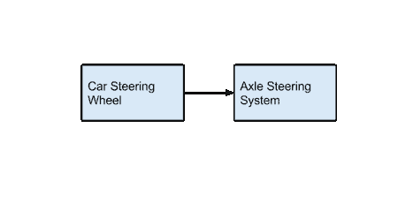
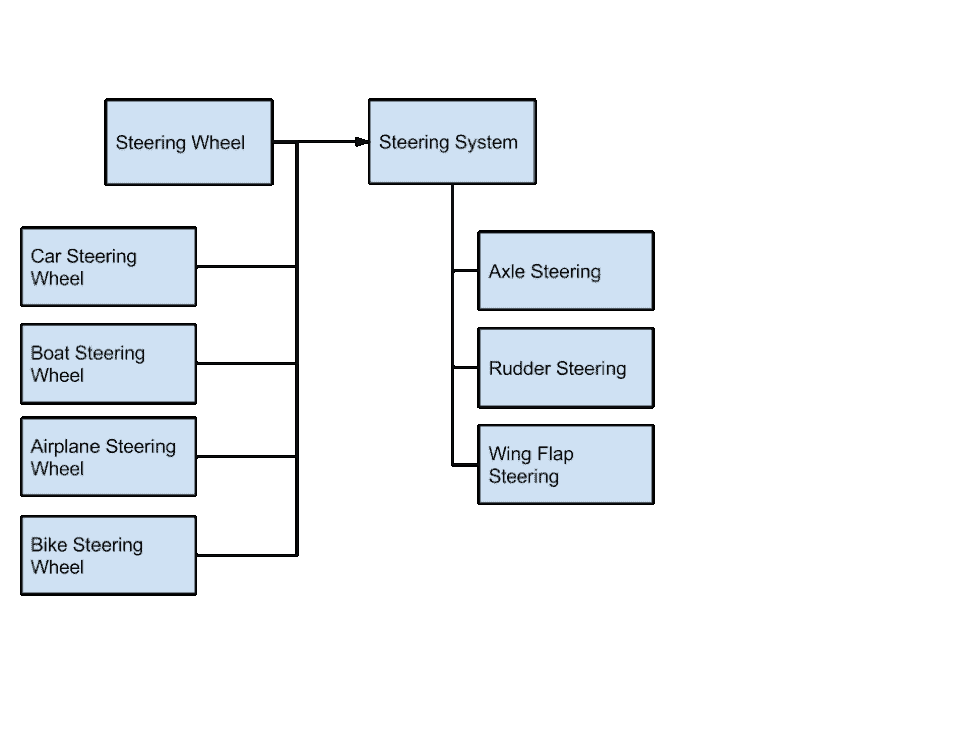
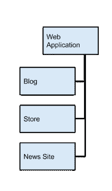
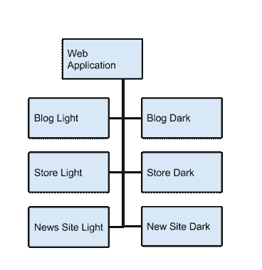
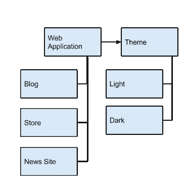
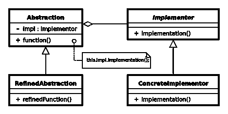
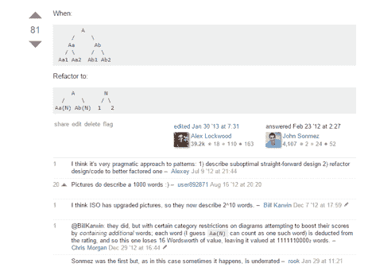

# 桥接模式

> 原文：<https://simpleprogrammer.com/design-patterns-simplified-the-bridge-pattern/>

让我问你一个问题？

你真的了解设计模式吗？你知道，就是那本旧的[四人帮书](http://amzn.to/1KN6CYc)里的那些？

也许你甚至不太熟悉“设计模式”这个术语没关系，你不是一个人。设计模式只是对常见模式的正式命名，这些模式似乎是在解决软件开发中的各种架构问题时出现的。

术语“设计模式”在 1994 年出版同名书籍后开始流行。这本里程碑式的书现在被亲切地称为“四人帮”的书，以共同撰写这本书的 4 位作者命名:埃里希·伽马、理查德·赫尔姆、拉尔夫·约翰逊和约翰·维里西德斯。

尽管这本书很好，但它确实有一个重大缺点。有点难以理解。

Perhaps though, you already understand design patterns, but do you really get them at a deep level? For the longest time in my career, I didn’t. Sure, I understood the basics, and I knew what Singleton was, but **I didn’t really understand the how and why of most of the somewhat complicated design patterns.**

我最终决定适可而止，我将在网上和书籍中寻找一些简单的解释和不容易解释的设计模式的例子。

好吧，在所有的搜索之后，你猜怎么着？我没有找到我要找的东西。我找到了很多关于设计模式的解释，但没有一个是非常简单的。我发现了大量不同设计模式的例子，但大多数都是在其他地方存在的老掉牙的例子。

所以，我决定我要一遍又一遍地浏览所有的信息并提出我自己的例子，直到我真正地、深刻地理解了所有的设计模式。这个过程很长——而且有些无聊——但是，当我完成后，我可以自信地说，我终于真正理解了设计模式。

(我还制作了不少 Pluralsight 视频，用一些真实的代码示例解释了许多设计模式。你可以在这里找到。)

## 分享知识

在这一系列文章中，我将从深入研究所有的设计模式中吸取经验教训，并尽我最大的努力将所有的信息吸收到我所希望的对每种模式最清晰易懂的解释中，从桥模式开始。

在本文中，我将遵循以下格式:

*   **设计模式的形式定义**
*   **通俗易懂的分解定义**
*   一个**真实世界的例子**让你在代码之外思考
*   一个**现有的面向代码的例子**将从设计模式中受益
*   现有示例的一个**重构**到模式
*   一个官方 UML 图的**解释，将它与例子联系起来**
*   何时应该使用该模式

我的希望是，当你阅读这篇文章的时候，你的脑海中不仅会有一个桥模式是什么和它是如何实现的清晰画面，而且会有它试图解决的实际问题和大量的例子，说明在哪里以及如何使用它。

## 桥模式

The pattern, I’ll be covering in this article will be [the bridge pattern](http://en.wikipedia.org/wiki/Bridge_pattern). This is a pattern that many developers—experienced and inexperienced alike—struggle with. Most developers I’ve talked to can only site the over-used example of how the pattern solves the problem of multiple operating systems and drawing APIs for those operating systems. I don’t know about you, but I am tired of that rarely useful example. I think we can do better.

让我们从格式定义开始，直接从 GoF 的书《设计模式》开始。

将抽象从实现中分离出来，这样两者可以独立变化

这到底是什么意思？我们来分解一下。

## 打破它

为了打破这个定义，我们需要首先确保我们理解抽象和实现的含义——而且不是你想的那样。

在许多编程语言中，如 C#或 Java，抽象被认为是接口或抽象类。实现通常是该接口的结构实现，或者是从抽象基类继承的具体类。

记住，GoF 的定义不是特定于语言的。这主要影响单词 interface——这是最常见的混淆点。

暂时忘记单词和它们在特定编程语言中的含义，想想这里要传达的是什么。

我们希望关注单词本身，而不是它们在特定编程语言中的含义。

先说抽象。什么是抽象？

这是一种概括的方式来看待使它成为可能的东西，所以你不必知道那个东西是如何实现的细节。

A car steering wheel is an abstraction on top of a car. The car steering wheel abstracts away what is really going on to make a car change direction.

我们并不关心它是如何做到的。事实上，汽车方向盘的抽象让我们不必担心所有的细节——尤其是如果这些细节在未来可能会改变的话。

好消息是，在定义抽象时，我们也定义了实现。

实现就是抽象的实现。是引擎盖下发生的事情。它是把抽象变成现实。

现在，通常抽象和它的实现是耦合的。

一辆汽车可能有一个汽车方向盘抽象，但是汽车方向盘的实现直接与这个抽象联系在一起。

汽车可能利用汽车方向盘抽象，但是它有该抽象的特定实现，并且该实现直接尝试该抽象。

但是，如果你有多种类型的车辆，你希望能够利用汽车方向盘抽象呢？

如果你有需要使用方向盘的船和飞机会怎样？

一辆汽车与一艘船或一架飞机相比，有着非常不同的操纵方式，但是所有这些交通工具都有着相似的方向盘，并且都以相似的方式操作。

你可以在每一辆车上安装一个汽车方向盘，但是如果汽车方向盘的抽象与汽车的具体实现直接联系在一起，那就不太好了。驾驶汽车可能看起来和驾驶飞机一样，但它们的工作原理却大不相同。

你需要做的是能够将方向盘的抽象从驾驶汽车的具体实现中分离出来。你需要一个抽象的抽象。你需要能够将汽车方向盘的抽象概念抽象成汽车方向盘的更一般化的抽象概念。

这就是这种模式的由来。

该模式允许我们创建双重抽象——两层抽象。

首先，我们抽象出汽车转向系统的接口，用汽车方向盘来表示。

但是，接下来我们把这种抽象又向前推进了一步。我们将驾驶汽车的具体实现从汽车方向盘的抽象中分离出来，并创建了一个更高层次的抽象，即汽车方向盘。

现在，我们可以对车辆方向盘的简化概念或抽象有多种实现方式。

汽车方向盘成为我们的高层次抽象，汽车方向盘成为抽象的实现者。我们现在可以创建抽象的其他实现。我们可以创建船和飞机的方向盘，每一个都有自己特定的实现。

现在，我们可以为每种类型的车辆创建不同的方向盘，而不是连接到特定的转向系统。这种模式使得方向盘的抽象与具体的转向系统的实现相分离，比如使用转向轴或升起或降下机翼。

(我还想提到另一本以相当简单的方式解释设计模式的好书。查看[头部优先设计模式](http://amzn.to/1JvMjl0)。这是我在我的[编程书籍终极清单](https://simpleprogrammer.com/2015/03/23/the-ultimate-list-of-programming-books/)中推荐的书籍之一。)

## 特定于模式代码的示例

现在，我们在高层次上理解了模式，让我们把我们所学的应用到软件开发领域。

假设您正在创建一个 web 应用程序框架，它将允许您创建不同种类的 web 应用程序。

也许您希望能够使用该框架来创建博客、新闻网站、商店和其他类型的 web 应用程序。

您可以定义一个基本的 web 应用程序类，它可以是所有不同类型的 web 应用程序的父类，在您决定引入主题的概念之前，一切都会很好。

假设您希望能够为您的博客类型的 web 应用程序创建不同的主题。

您为您的博客应用程序创建了几个不同的主题。也许你有一个光明的主题和一个黑暗的主题。

你最终会进一步细分 web 应用程序的博客类型，这样你就有了明博客和暗博客，一切都很好，直到你意识到你希望能够为一个新闻网站提供一个明主题和一个暗主题——哦，还有一个商店应用程序。

没有桥模式，你必须遵循同样的模式，为 web 应用类型和主题的每种组合创建一堆不同的类。

所以，你可能有商店亮和商店暗，新闻网站亮和新闻网站暗。

这可能会很快失控——尤其是如果你决定引入第三个主题。

## 桥梁模式到救援。

只要代码中有两个继承层次，就可以利用这种设计模式来简化代码。

您可以让您的基本 web 应用程序类型利用一个主题接口来实现不同类型的主题，而不是拥有由 web 应用程序类型和主题组合而成的特定类。

因此，基本的 web 应用程序不需要知道深色或浅色主题之间的区别，而是利用一个通用的抽象主题接口，您可以创建该接口的浅色和深色实现。

然后，您的 web 应用程序(如博客、新网站和商店)的特定实现可以设置为使用您创建的任何主题，因为它们通过一个公共的主题接口来访问主题的功能。

现在，您可以创建新类型的 web 应用程序和新类型的主题，并让任何组合一起工作，因为您已经将抽象(web 应用程序)与实现(特定主题)分离。

## 回到正式定义

这是 UML(统一建模语言),它代表了桥接模式的正式定义。(如果你不熟悉 UML，不要担心。UML 只是在使用标准语言和约定的软件开发中表示不同实体之间关系的一种方式。大多数 UML 图即使不是 UML 专家也能理解。)

希望在这一点上，它更有意义一些，但是让我们讨论一下在我们的例子中每个部分是什么。

我们从抽象开始。抽象就是“web 应用程序”抽象将利用实现者来执行某种功能。在我们的例子中,“web 应用程序”可能有一个绘制输入框的功能。

实现者将是主题基类或接口。特定的主题是具体的实现者，他们会实现一些特定的功能，比如画一个输入框。

最后，我们将有一个 RefinedAbstraction，它可以是任何 web 应用程序类型。那些 web 应用程序类型，比如 blog、storefront 和 news site，将利用 Implementor 接口，而不必知道具体是哪个 Implementor 在提供实现。

## 何时使用桥接模式

我想出的定义何时应该使用该模式的最简单的例子实际上是我对 StackOverflow 提问“[何时使用桥模式”的回答。](http://stackoverflow.com/questions/319728/when-do-you-use-the-bridge-pattern/9406293#9406293)

好了，我希望您现在对这种模式有了深刻而完整的理解，它是如何工作的以及何时使用它。

(一定要在这里订阅，当我在设计模式系列中发布一篇新文章时，你会收到电子邮件更新。)

如果你真的想巩固你的知识，你现在能做的最好的事情就是拿出几个你自己的例子，并尝试用一些非常基本的代码实现一两个。

有时候，学会如何学习比仅仅学习更重要。查看我的课程[“快速学习的 10 个步骤”](https://simpleprogrammer.com/store/products/learn-anything-quickly/)获得一些提高学习速度的小技巧