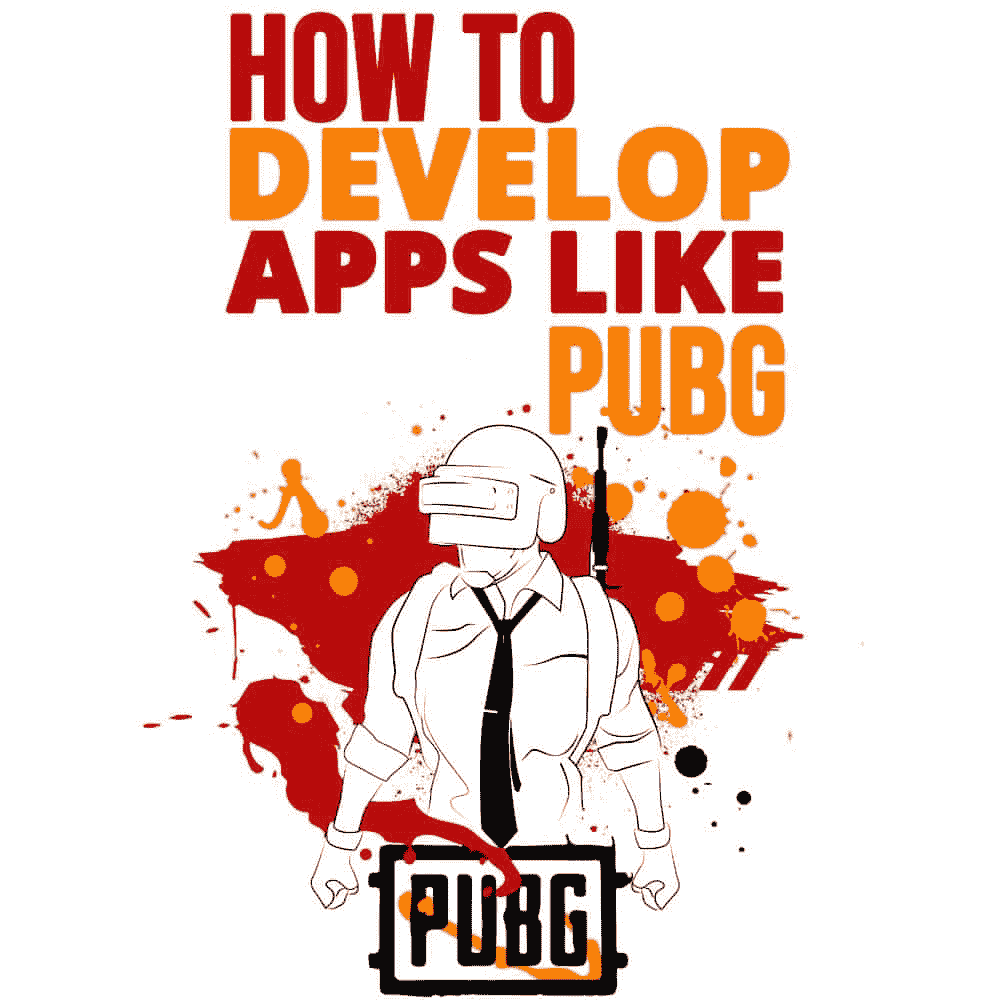

# 如何开发 PUBG 这样的 app

> 原文：<https://simpleprogrammer.com/develop-app-like-pubg/>

<figure class="alignright is-resized">

</figure>

世代更替。我们都变得年轻，我们都有自己的“热门趋势”，我们全心全意地追随。

从音乐到服装，从我们崇拜的名人到我们支持的议程，我们都有定义我们这一代人的东西。信不信由你，不同代人都能看到的一个明显的变化就是游戏产业。

这是一个不断扩大和不断发展的范围。从带卡带的 8 位游戏机到 Xboxes 和 PlayStations，再到现在的 VR 头戴设备，这个行业已经发生了前所未有的变化和发展。

但是，随着客厅文化迅速走向消亡，不同的娱乐形式不得不演变，变得更加灵活。由于流媒体服务和智能手机应用程序的开发，人们现在可以随时随地观看他们最喜欢的电视剧或电影，听他们最喜欢的歌曲和播客。

游戏行业不得不经历巨大的变化，以适应快速变化的行业，并为智能手机带来主机质量的游戏。

*口袋妖怪 Go* 、奥拓的*奥德赛*、*文明 VI* 、*纪念碑谷*以及其他此类游戏让 2018 年成为智能手机游戏令人兴奋的一年(随着*上古卷轴:刀锋*等游戏的出现，2019 年肯定也会令人兴奋)。但是在过去的一年里，也许没有任何一款游戏像 PlayerUnknown 的 BattleGrounds(T11)或 PUBG 一样令人兴奋和受欢迎。

这个游戏受到了如此热烈的欢迎，以至于在它发行的六个月内，它成功地赚了 5 亿美元！你可能想知道，这是怎么发生的？他们到底做对了什么，以至于全世界的人都为这个游戏而疯狂？还有怎么才能创建出 PUBG 这样的游戏 app 呢？

如果你有这样的问题，你来对地方了。让我们开始吧！

但在此之前，让我们明确一件事:[游戏应用程序开发](https://simpleprogrammer.com/started-game-development/)就是创造美丽的时代艺术作品。就像任何艺术一样，它需要奉献、承诺、灵感和耐心。

一个好的游戏不可能在一夜之间创造出来。这需要几个月，甚至几年的时间，才能准备好进行测试。所以系好安全带，这将是一段漫长的旅程！

## 首先，PUBG 是什么？

玩家未知的战场是一款[皇家战役游戏](https://simpleprogrammer.com/pubg-guide)，它的前提遵循一个非常简单却诱人的想法。它把你和另外 99 名玩家丢在一个荒岛上，岛上充满了古怪的武器、古怪的交通工具和最古怪的死法。

这个游戏的目标很简单:杀人或被杀，最后站着的人是赢家。使用各种各样的武器、补给和汽车，玩家互相对抗，直到只剩下一个人还站着。

PUBG 由布伦丹·格林(Brendan Greene)创建，于 2017 年底发布，自那以来，它一直统治着世界各地游戏爱好者的心。PUBG 的成功基本上让《皇室战争》这一流派声名鹊起，也给它带来了急需的关注。多亏了 PUBG，像*堡垒之夜*这样的游戏正在推动这类游戏的边界，并帮助这种类型的发展。

## PUBG 的全球市场份额是多少？

PUBG 自推出以来，人气一直在大幅飙升。在短短四个月内，该应用程序已经获得了超过 1 亿的下载量，并获得了 2018 年游戏奖最佳手机游戏的提名。

根据 Statista 的调查结果，美国占 PUBG 总收入的最大部分，达 590 万美元。

## 这一切是什么时候开始的？

<figure class="alignright is-resized">

</figure>

它始于 2017 年 3 月的一个想法，当时布伦丹·格林(Brendan Greene)设计了由 PUBG Corporation 创作的多人电脑游戏《皇家战役》(battle royale)。一年后，中国游戏开发公司腾讯将这一想法转化为一款可在 Android 和 iOS 上使用的移动应用。

PUBG Mobile 是手机游戏背后成瘾机制的真实例子。PUBG 提供了令人惊叹的图形和声音；它促使玩家拥有[许多不同的体验](https://simpleprogrammer.com/pubg-ultimate)，使他们能够与不同的玩家联系，提供奖励，并通过竞争挑战他们。这无疑影响了游戏行业的趋势。

## PUBG 无与伦比的成功归功于什么？

PUBG 受欢迎的原因是它的要求。这款游戏非常适合发展中市场的智能手机。它在任何中端手机上都运行得非常好，不像类似的游戏如*堡垒之夜*。但不仅仅是这样。其他几个因素也有助于它的成功。

### 异常发射

尽管这款游戏已经在台式电脑上获得了巨大的反响，但 PUBG 的开发者对这款游戏应用的推出并不粗心。

最初只为加拿大用户推出，他们设置了完美的舞台，测试应用程序并衡量目标受众对移动版本的准备程度。然后，他们在克服错误的同时慢慢前进，逐渐占据了全球用户群。

### 非凡的图形

图形是这种游戏应用成功的基本要素之一，PUBG 开发者的方法值得一提。增加其审美商数的是他们为用户提供的微调设置的能力，以找到质量和性能之间的平衡。

您可以自定义您的帧速率，从低到高，或将渲染细节的级别从平滑更改为高清。您还可以从几个颜色选项中进行选择，使您能够从柔和的色调转变为更明亮、更生动的色调。

### 卓越的 UX，带有可定制的控件

触摸屏控制非常有利于这类游戏。作为一名 PUBG 玩家，你可以选择虚拟控制杆，也可以使用屏幕右侧的另一个拇指来方便地控制你的点。你开枪，瞄准，弯腰，倾斜，然后用屏幕右侧的虚拟按钮拿到你的背包。

您可以通过滑动按钮并修改其透明度和大小来定制按钮布局。也就是说，这并不意味着默认布局根本不值得使用。它的直觉因素为它的成功因素加分。

### 货币化战略

PUBG 遵循与同类其他应用相同的盈利策略。你可以免费玩这个游戏，但是那些需要升级配件的人需要下载或购买可用的应用内元素..

有不花钱就享受游戏的玩家，也有不得到一些特殊物品就无法前进的其他人。

## 开发 PUBG 这样的游戏 App 时如何进行？

让我们带你浏览一下开发像 PUBG 这样的游戏应用程序所需的[步骤。](https://simpleprogrammer.com/video-game-developer/)

### 集思广益你的 USP

你能为这个成长中的行业提供什么？你如何用你的游戏来帮助皇家战斗流派？你的游戏有什么吸引人的地方，让你和其他游戏有所不同？

我们明白标题写的是如何开发像 PUBG 这样的应用，但我们并不是要完全照搬，不是吗？我们需要给这种类型带来新的东西，这就是你的工作开始的地方。

想出开箱即用的想法——时髦的武器、有趣的沉浸式世界或类似的东西——来吸引你的用户。记住，没有主意是坏主意。

例如，当每个人都在努力改进他们游戏的图形时，*《我的世界》*走了相反的路线，引起了轰动:复古、块状的外观如此受欢迎，甚至*南方公园*也不得不继续前进，为它奉献了一整集。

所以要原创，那是你的起点。谁知道呢，喜剧之神可能也会觉得你的创意值得一看。

### 规划移动应用程序开发

<figure class="alignright is-resized">

</figure>

为任何事情做计划总是一件谨慎的事情。写下你所有的想法，试着找到一种方法把它们联系起来。PUBG 没有剧情，没有故事，我们已经知道了。

差不多就是开枪和跳来跳去。因此，看看你的想法是否会以这种方式更好地发挥作用。或者他们需要一个情节？如果最终是这样的话，那么拿出你的铅笔，开始构思一个故事，以尽可能好的方式运用你的想法。

### 设计和开发移动应用程序

设计游戏和策划是完全不同的事情。这是你开始创建关卡和世界的时候，用疯狂的角色、交通工具和武器填充它们。最终目标是尽一切努力让游戏对你的潜在用户不可抗拒。

现在，开发一个游戏是一个长期的任务，涉及到一个团队。所以你需要一个技术娴熟的移动游戏开发者团队，他们可以接管你的项目，并用他们灵巧的双手指导它。

雇佣开发公司有其优势。第一个是，你不必是一个“技术专家”。老实说，开发一款游戏远没有玩一款游戏或者想出一个游戏的点子有趣。这是一个复杂的过程，需要几个月的设计和编码，以及数百个对大多数人来说并不有趣的其他过程。

接下来是他们的专业知识。还是那句话，你不会每个月都开发一款游戏。所以，除非你是游戏开发者，否则你很少有机会成为开发手机游戏的专家。

但另一方面，开发公司确实在一年中开发了许多游戏，他们的团队非常了解游戏在开发过程中可能会遇到的所有陷阱。

看看他们的网站，看看他们的作品集，看看他们以前是否处理过像你这样的项目。此外，采访一些他们以前的客户，了解他们在该公司的经历。你可以从像 [Clutch](https://clutch.co/) 这样的网站获得帮助，与声誉良好的合法移动应用开发者取得联系。

作为初学者，你最好雇佣一家移动应用开发公司，而不是自己开店。既然你已经决定雇佣一家开发公司，你需要在实际接触之前做一点计划。

### iOS 应用开发还是 Android 应用开发？

你首先需要考虑的是你选择的操作系统。Android 和 [iOS](https://www.matellio.com/ios-app-development) 是市场空间的两个重量级冠军，你首先瞄准他们是合情合理的。

Android 拥有 88%的巨大市场份额，而 iOS 拥有 11.9%的忠诚市场份额，更重要的是，它有能力支付应用内购买，如开机、急救包、角色升级等。所以你需要决定你想要什么。除了用户，还有一个因素会影响操作系统的选择，这是我们接下来要讨论的话题。

### 开发移动应用程序的成本

你的口袋有多深？你需要问自己这个问题，因为与你可能在网上读到的或从朋友那里听到的相反，移动游戏开发是一项昂贵的努力，尤其是制作像 PUBG 这样的移动游戏。

从图形和声音设计到 UI 和背景配乐，一切都需要钱。操作系统的选择也会影响成本。业界普遍认为 Android 应用程序开发比 iOS 应用程序开发成本更高，因为它的测试周期更长。

你的游戏有些方面是你不能妥协的。你的游戏可以有很少的 WOW 图形，但它绝对需要一个愉快的背景分数，一个无缝的 UX，当然还有很高的乐趣系数。

因此，请确保您根据游戏的需求批准游戏开发各个方面的预算。不可能给你一个制作手机游戏成本的精确估计，因为根据你的选择，每一步的成本都会有很大的波动。但是粗略估计你的游戏成本在 4 万到 5 万美元之间。

## 发布前和部署后

<figure class="alignright is-resized">

</figure>

既然你的项目是和一个游戏开发者一起完成的，那么是时候开始计划发布后的流程了。你看，开发一款游戏只是画面的一半；一旦它发布了，你就需要保持它的运行，并根据用户的需求保持它的更新。

此外，你需要想出一个聪明的营销策略，让你的游戏引起玩家的注意。确保你发布频繁的更新，并且每次更新都引入一些“酷”的东西，比如新的角色皮肤，新的武器，或者新的交通工具。

此外，记住为万圣节和圣诞节这样的节日设计主题也会吸引玩家。

## 这工作很辛苦，但很值得

所以卷起袖子，开始行动吧；你有自己的工作要做，别自欺欺人了。随着每月新游戏的发布，皇室战争类型正在扩展。

有了精心的计划，聪明的市场策略，良好的技术支持，以及一个狂热游戏玩家永无止境的书呆子气，你的目标不会太远！