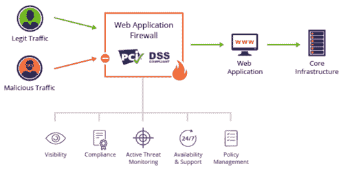

# 开发安全的 Web 应用程序——开发者指南

> 原文:[https://simple programmer . com/develop-secure-web-applications/](https://simpleprogrammer.com/develop-secure-web-applications/)

In 2020, due to the pandemic, we saw a massive shift toward digitization. As a result, many organizations needed digital storefronts to offer products or services to their customers. The web application has been the vessel for such transformation. However, lack of security provisions can be a problem with such rapid adoption of digital transformation.

数字化转变最显著的影响是对业务运营的影响，因为业务运营需要远程能力。此外，通过员工个人网络在互联网上的合作已经影响到了网络安全。根据[德勤的一项调查](https://www2.deloitte.com/ch/en/pages/risk/articles/impact-covid-cybersecurity.html)，47%在家工作的人会陷入导致大量数据泄露的网络钓鱼骗局。

同样，调查报告还表明，在 2020 年 2 月至 5 月期间，超过 50 万人受到安全漏洞的影响。

因此，无论您是为基于企业的用例还是为电子商务目的开发 web 应用程序，安全性都是最重要的。在这篇文章中，我将与你分享如何为你的项目创建**安全 web 应用**的指南。

## Web 应用程序安全性:谨慎

在我们研究安全性之前，首先快速回顾一下 web 应用程序:web 应用程序是一个计算机程序，它使用服务器端脚本来存储和检索信息，使用客户端脚本来向用户呈现信息。Web 应用程序运行在 web 服务器上，用户可以使用活动网络连接通过浏览器访问该服务器。例子包括网络邮件、网上拍卖、网上银行等。

web 应用程序的开发有几个阶段:设计、开发和部署。此外，安全性需求及其路线图需要在整个 web 应用程序开发过程中集成。

### 设计阶段

此时，您的项目规划团队不需要完全了解安全需求，因为架构的几个方面还没有执行。

因此，帮助您的团队理解安全需求的最有效方法是使用威胁建模(TM)。根据 [OWASP](https://owasp.org/www-community/Threat_Modeling) 的说法，威胁建模是一个用于捕获、组织和分析所有与 web 应用安全相关的信息的过程。将该模型应用于 web 应用程序有助于简化数据驱动的决策制定，尤其是在安全问题上。

威胁建模过程还可以帮助确定[安全改进](https://simpleprogrammer.com/7-tools-improve-web-development-workflow/)的优先级，在设计级别集成安全概念，以及实现。这种模型可以包括:

*   模型的主题描述
*   威胁假设。随着 web 应用范围的变化，这些可能会发生变化，甚至受到挑战
*   对系统的威胁列表，这些威胁是并发的，并且在将来会很普遍
*   应对各种威胁的对策
*   通过验证每个对策来验证模型和威胁

一旦设计阶段完成，就应该进入开发阶段

### 发展阶段

安全性是开发 web 应用程序的一个重要方面，因此您需要培训开发人员并提供潜在威胁的知识。特别是像 OWASP 的 10 大安全威胁列表这样的资源可以让开发者了解 web 应用在部署后会遇到什么问题。

web 应用程序可能面临的最重要的问题之一是恶意数据输入。无论开发人员使用哪种编程语言或框架，数据输入威胁都是可能的。解决这个问题的最好方法是创建具有数据验证和代码清理属性的安全代码。

有一些具体的做法可以遵循，有助于防止数据输入问题:

*   使用基于度量的数据库查询。
*   利用正则表达式来验证输入信息。
*   对数据进行编码以处理特殊字符。

在设计和开发之后，下一个阶段当然是部署。如您所料，这也是您需要确保安全措施到位的最关键阶段之一。

### 部署安全的 Web 应用程序

web 应用程序的安全部署需要最佳实践，如授权和 HTTPS 协议，甚至需要防火墙。由于缺乏安全的 web 应用程序部署，web 应用程序遇到的一些最常见的安全威胁如下:

*   **SQL 注入**–当恶意 SQL 代码被用来操纵数据库泄露安全信息时，就会发生这种情况。SQL 注入会导致数据列表的未经授权的暴露、数据表的删除和未经授权的访问。
*   **跨站脚本(XSS)**–这是一种注入式攻击，可以暴露用户帐户凭据，诱导木马攻击，甚至修改页面内容。存储 XSS 的发生是由于恶意代码直接注入到应用程序中。
*   **远程注入**–黑客利用此类攻击将恶意文件远程注入 web 应用服务器。它可以让黑客控制服务器并提取重要的用户数据。
*   **跨站点请求伪造(CSRF)**–这是一种攻击，它让黑客完全控制网站上的用户帐户，允许他们通过 web 应用服务器操纵活动。

这些是由于缺乏 web 应用程序安全性而出现的一些重大安全问题。为了应对这种安全威胁，这里有一些你可以执行的预防措施。

处理这种漏洞的最好方法之一是对代码进行输入/输出净化，但这并不总是一种实用的方法。原因很简单；该应用程序需要与新版本和增加的功能进行集成，这使得它成为一个复杂的净化环境。

一个**网络应用防火墙**旨在阻止恶意流量，防止数据窃取和金融欺诈。如果您有有效 WAF 来阻止此类漏洞，您可以选择 PCI 数据安全标准(PCI DSS)认证。但是，它不是确保 web 应用程序安全协议的唯一认证。

[Web 应用安全|你需要知道什么？| Imperva](https://www.imperva.com/learn/application-security/application-security/)

确保浏览器和 web 应用服务器之间安全通信以进行数据交换的另一个重要认证是 **SSL 认证**。SSL(安全套接字层)或 TLS(传输层安全性)是通过不对称加密技术对用户和系统之间交换的数据进行加密的协议。

这样，黑客无法读取信息，web 应用程序是安全的。你可以选择有这种认证的主机服务提供商，或者从安全公司购买便宜的 SSL 证书。

## Web 应用程序安全性向前发展

随着我们走向后大流行时代，越来越多的人现在在互联网上，使 web 应用程序安全成为一个重大挑战。

然而，在 web 应用程序开发的掌舵下，有了正确的工具和熟练的专业人员，您可以保护您的项目免受一些漏洞的影响。从设计阶段就开始计划您的安全措施，并在整个开发阶段集成它们以部署 web 应用程序。

然后，小心地部署您的 web 应用程序，利用您可以使用的技术，比如 WAF 和 SSL/TLS。这些简单但重要的步骤将极大地增强您的 web 应用程序的安全性，确保一个健壮的、有价值的产品。