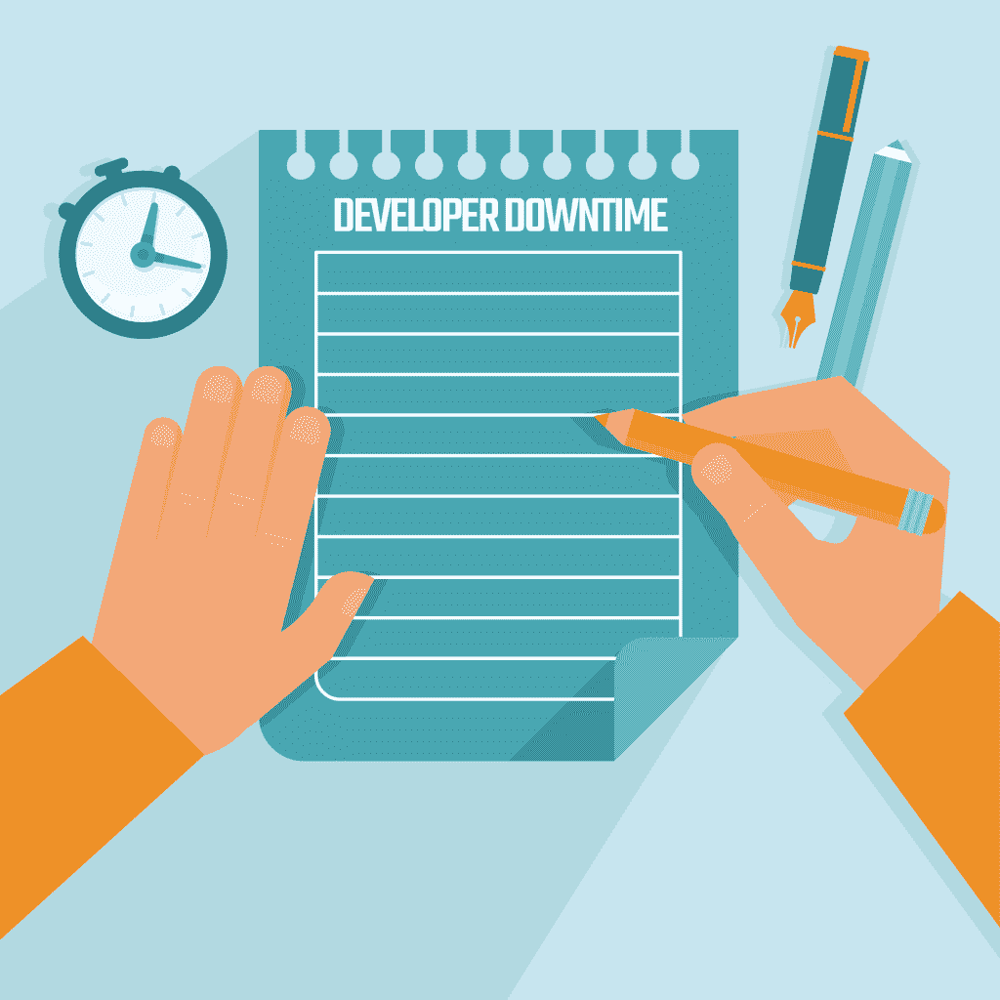
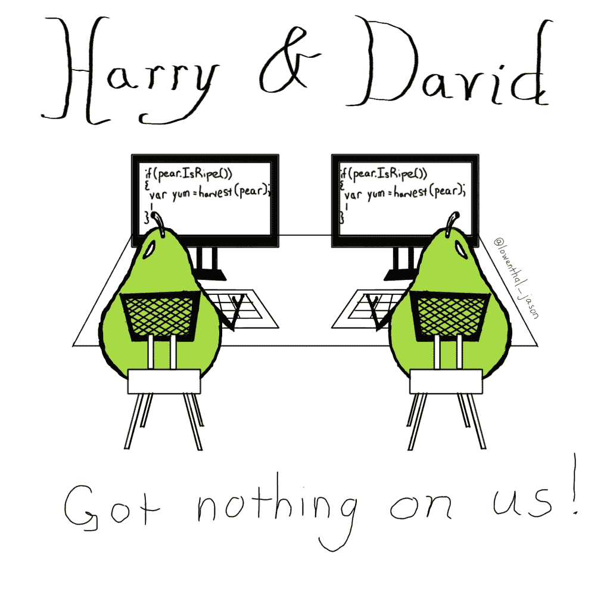
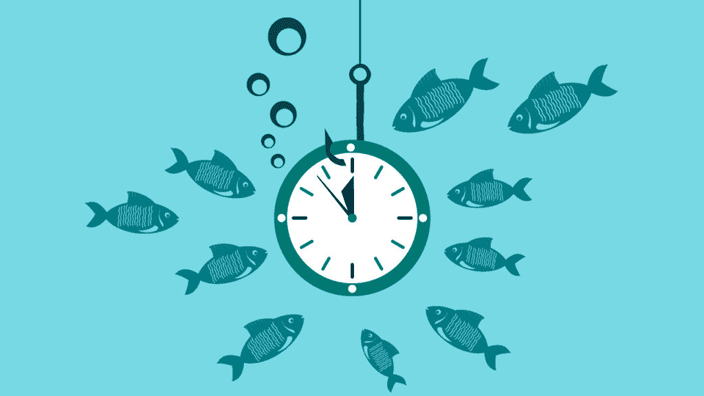

# 开发人员停工时间

> 原文：<https://simpleprogrammer.com/developer-downtime/>

我发现自己在异步实验室的新角色中处于一个有趣和令人兴奋的位置。我的团队是一台运转良好的机器(我将在后面的文章中深入讨论)——但正因为如此，有时我们的测试时间会导致我们在“生产”时刻之间有一些相当不错的延迟。

实际上，我现在正在利用这种滞后来写这篇文章——每天至少有一次(如果不是几次的话)我们必须启动一个包含所有集成测试级别的构建，这是很常见的。现在，我们有 20 分钟的时间在办公桌前“消磨时间”。

有时候我们利用这段休息时间来增进友谊。由于我们是一个结对编程团队，我们的结对经常会分享我们听过的幽默故事或来自编程社区的有趣轶事。

有时候，我们会利用这段时间做一些管理工作，比如记录时间、回复电子邮件，或者离开办公桌去吃点零食或散散步。

但这不足以填补所有的空白。最近，我有时会浏览 Twitter 或脸书，只是为了打发时间，但通常，即使是这些也不会真正吸引我的注意力，因为在任何一天，我都会查看它们 20 分钟。

所以这留给我时间。该思考了。是时候反思了。是时候更好地利用我的时间了。到目前为止，我真的不擅长这个。

我花了一些时间来放松或无聊。我花了一些时间做了一些并没有真正丰富我、我的团队或我的项目的事情(比如强迫性地查看 Twitter 或脸书)。

有很多方法可以让我每天花 20 分钟(或更多)做有成效的事情，这些事情对我的职业生涯或家庭生活有长期的帮助。但出于某种原因，我根本没想过它们——直到现在。以下是我最近开始在休息时间做的一些事情，这些事情让我对自己的个人效率感觉更好。

## 

写作

就像，在我等待构建通过或者(希望不是)失败的这一秒，我正在做的事情。我已经有一段时间没有写作的习惯了；我已经错过了，现在写作 bug 又准备好了，只争朝夕。一般来说，我的写作要么是长篇(比如这篇博客文章)，要么是日志。

我开始更多地使用[子弹日志系统](http://bulletjournal.com/)写日志，它给了我一些博客主题的想法，并帮助我进行自我反思。记录我每天做的具体事情，同时记录我的想法，有助于我以后再去想它们，而不是完全忘记它们。

我也开始再次利用这段时间写博客。本文的大部分内容是在我的一次构建停机期间完成的。

我希望重拾写作的动力，并更有动力再次这样做。写作真的让我作为一个个体获得了自由，并帮助我与周围的人分享我的经历。在过去的几个月里，我有点儿…咳咳…不喝酒了，但是现在我办公室的情况好了，我当然应该再多写点东西了。

## 阅读

我的清单上有如此多的书，我甚至无法想象在任何现实的时间框架内看完它们。其中一些直接适用于我的职业生涯或我最终的收入目标。因此，其中一些非常专业。现在我正在深入研究罗伯特·c·马丁的《干净的代码》。

我最近也重新发现了自己对小说的热爱。虽然在阅读各种非小说和教育材料时会有很多收获，但小说真的向我证明了脱离现实一小会儿真的会有很大的不同。它帮助我清除所有对任何事情都没有帮助的杂念，为更多的批判性思维、创造性思维和整体大脑健康腾出空间。

我想看的小说清单比我的非小说清单短得多。但是在忽视了一段时间之后，阅读真的又变得对我很重要了。现在我真的很想读《时间之轮》系列，因为我想象当我读的时候，它会带我去一次大冒险。

当我在工作时，我倾向于专注于阅读非小说类的充实主题，因为我觉得我一直都有很多东西要学。我的非小说阅读清单，无论是直接还是间接与编程相关的，都相当长。因此，当我坐下来阅读时，我喜欢一次不超过一章，在我的子弹日记中做笔记，并真正吸收我所读到的内容。

## 合作

当我们等待事情发生时，我的团队经常花时间互相交谈。我们讨论如何改进我们当前的代码库。我们讨论引入新项目工作的方法。我们只是谈论生活。

现在害羞内向的人在阅读时会说“等等！说话，就像…和人说话？!"是的，与人交流确实有助于提高编程创造力。虽然我很想看那篇很酷的文章或者查看那个程序员幽默的帖子，但是有时候转身和另一个人聊天确实是值得的。我保证！

我很自豪我的团队团结一致。我们在彼此的工作关系中有一种固有的安全感，这在很大程度上源于这样一个事实，那就是我们每天都要就任何事情与对方交谈几次。

我们通过友情和定期公开诚实的反馈来建立这种信任。团队入职培训包括来自其他团队成员的 30 天反思性审查，提供诚实的关键工具，新团队成员可以使用这些工具积极尊重团队文化。

我们有时也喜欢使用一种叫做 Team 360 的东西。在这种类型的对话中，整个开发团队坐下来，为每个团队成员提出一个优点和一个缺点，然后我们就我们的想法进行一对一的交谈，以帮助彼此更好地作为一个团队工作。

我喜欢把我的团队想象成遵循旧的魔法校车系列中的咒语。[“碰运气。犯错误。弄得乱七八糟的！”](https://www.youtube.com/watch?v=p8jw_-Vh9Z0)

不管我们最终制造了多大的麻烦，我们总是互相支持，作为一个团队做出决定。孤独的枪不需要申请！

## 去散步

我和我的一个队友现在每天至少散步一次。我们通常只是出去走走，逛逛几个街区，这样我们可以呼吸新鲜空气，晒晒太阳。

它有助于清理精神上的蜘蛛网，并重置我们的大脑以集中注意力。完全离开办公桌真的有助于让办公桌时间变得更容易忍受。

去散步不是你唯一的选择，但它肯定是一个好的选择。你也可以考虑买一张立式办公桌，让血液流动起来。你也可以试试健身球。我相信有其他方法可以让你在办公桌前动起来。不管怎样，我强烈建议多走动走动。正如我在《程序员的临床抑郁症》中写的那样，体育锻炼确实是促进大脑发展的最佳方式之一。

## 磨利锯子

磨利锯子是高效人士的七个习惯 中定义的一个术语，是我们能为自己的职业生涯做的最重要的事情之一。

随着我们不断发展，在某个特定领域变得越来越专业，重要的是我们不要形成狭隘的观点。当然，我们需要继续提高我们已经获得的硬技能。但是，如果我们不欣赏代码库之外的自我和优势，那么我们所做的很多事情都无法继续下去。

我发现自己很享受做与工作无关的事情的时光。

最近，我开始学习我的一些美术技能，特别是学习如何手写字体(或书法),还提高了我使用石墨和其他绘画媒体的能力。我也想出了一些我的团队非常欣赏的傻傻的插图。

我没有花太多时间在办公室做这项活动，因为我不知道这是我们的雇主鼓励我们在停工期间做的那种充实——但我可能很快就会发现自己在办公室尝试这些事情，如果我能找到一个好时间做这件事的话。

这是我做的一个关于结对编程的例子:

## 

T2】

## 密码

奇怪的是，在等待我们的构建通过时，我们并没有花太多时间在与代码相关的任务上。我们可能会学习一种新工具，或者在我们当前的堆栈中获得某种机制的基础知识，但我认为我们都意识到我们团队的软技能和团队间的交流有很大的价值，而不是仅仅花 20 分钟学习我们已经非常有信心的硬技能。

我们在停工期间所做的那些代码项目往往是非常短暂的，并且专注于我们作为一个团队的小痛点。我们最近编写的一个代码片段记录了我们作为一个团队每天使用的时间，然后将其保存为 csv 中的一个条目。

我们还在研究一种方法，从我们的任务管理工具中提取数据，并使用它来审查指标。我们现在正在通过一个非常普通的 REST API 访问它，但是看看我们是否能整理一些数据，并根据我们所学的对团队工作流进行有意义的调整，这将会很有趣。

## 这不是浪费时间

在这些构建过程中，我的雇主和我的团队提醒我的最重要的事情之一是:停机时间绝对是积极的，不会浪费我们的时间。

我们在充实自己，让自己成为更好的程序员和更好的团队成员。当我们在纸板上处理卡片时，我们不在纸板上编码时所做的事情会直接影响我们的心理健康。

希望你足够幸运，当你在一个团队中进行构建的时候，你可以得到休息时间。并且，希望你能利用这段时间找到你代码中没有的重要部分。

我很想听听你对如何利用停机时间的建议，或者你自己是否真的会利用它。

请在评论中发表意见！