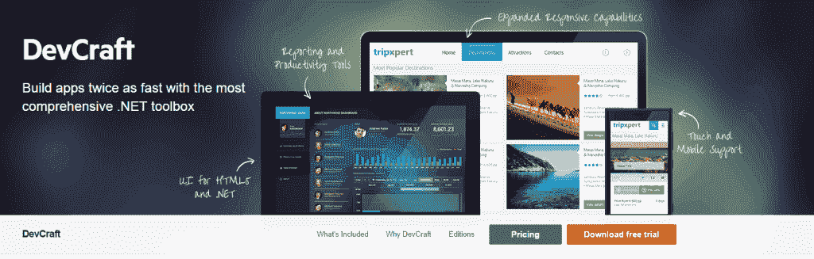
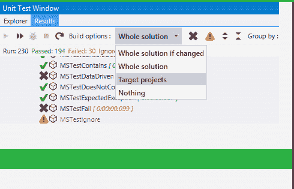
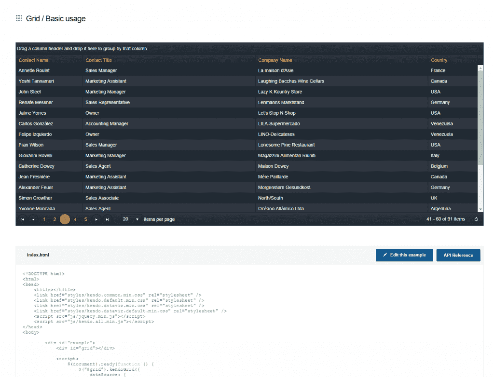
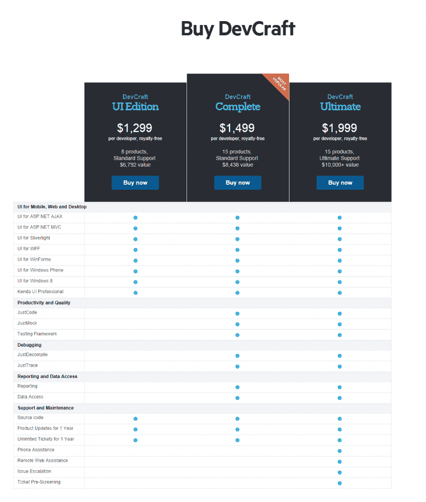

# 开发者生产力工具回顾:Telerik 的 Devcraft

> 原文：<https://simpleprogrammer.com/developer-productivity-tool-review-teleriks-devcraft/>

我没有在这个博客上做很多产品评论，这是有原因的。

我收到了很多公司的请求，让我在这个博客上“推销”他们的东西，但是我被要求写的大多数东西我都没有使用或者永远不会真正发现自己在使用。

然而，当 Telerik 联系我并问我是否有兴趣让他们赞助一个关于他们的 Devcraft 开发者工具的帖子时，我非常兴奋，因为我真的非常喜欢这些工具——我一直是 Telerik 的忠实粉丝——**我真的觉得整个 Devcraft 包提高了开发者的生产力。**

所以，是的，这是一个赞助贴。关注这个博客的人都知道，这个博客是我的主要收入来源之一。但是，我相信如果你经常阅读这个博客，你就能看出来，我几乎从不允许赞助帖子或客座博文，因为不值得花钱去编造一些我永远不会使用的产品是多么好的废话。

也就是说，这是我对 Telerik 的 Devcraft 产品的真实看法。

## 这是什么？

我想，在我真正了解我对 Devcraft 的看法之前，我必须先说明它是什么。

你可以在这里亲自查看: [Telerik Devcraft](http://www.telerik.com/devcraft) 。

但是，从本质上来说，它是几乎所有 Telerik 的收藏。网络焦点工具——全部在一起。所以，如果你不是. NET 开发人员，你可能不会发现太多的价值——尽管，我不得不说，Kendo UI 部分(它是一个基于 jQuery 的框架，有一堆响应窗口小部件和其他不错的 HTML 组件，包括一个 MVVM 框架)对于任何类型的 web 开发都很棒。

大致情况是这样的:

**网页**

ASP.NET AJAX、ASP.NET MVC、Silverlight 甚至 SharePoint 都有一堆不同的 UI 控件。再加上我已经讲过的剑道 UI 框架。这真的是一个疯狂的控制量，他们看起来真的很好。

**桌面**

同样，大量的控件，它们看起来都很棒。我自己设计了一些 Windows 窗体的自定义控件，这些控件让我曾经做过的所有事情都相形见绌。他们有 WPF 和旧的 Windows 窗体控件。

**手机**

你可能已经猜到了，移动端有 Windows Phone 8、Windows 8 XAML 和 Windows 8 HTML 控件。我会喜欢一些 Android 和 iOS 控件，但我猜你不能拥有一切。我自己没有做过很多 Windows Phone 或 Windows 8 开发，但我玩了一些控件，我真的印象深刻。同样，抛光的顶级控件非常容易工作。

此外，在移动方面，我发现我可以将剑道 UI 与 PhoneGap 结合起来，创建一些非常好的移动应用程序。(虽然，我知道 Telerik 有他们的 [AppBuilder 平台](http://www.telerik.com/appbuilder)，它基本上为你做这个——它过去被称为 Icenium)

**开发工具**

Telerik 不仅有 UI 控件，还有其他所有东西。他们有一个类似 NUnit 的测试框架——实际上是免费的。

但是，他们也有 JustCode，这是一个 Visual Studio 插件，它使您更有效率，并为 Visual Studio 添加了各种自动重构功能。(想想 Resharper，但是更快。)

而且，我真的很喜欢属于 Devcraft 的 JustMock 工具。我发现这个模仿引擎非常容易使用，我喜欢它模仿非虚方法、非公共成员、密封类甚至静态方法的能力。(不过，我建议小心使用这种能力。)

甚至还有调试方面的工具。JustTrace 是一个非常健壮的。NET 内存和性能分析工具——有一个非常漂亮和易于使用的用户界面。我终于觉得我可以真正使用一个剖析工具，并理解它在做什么。

我也非常熟悉 JustDecompile。我一直在用那个。自从整个红门事件结束后。网状反射器。Telerik 在使这个反编译程序易于使用方面做得非常好。

我还将在这个分组中包括报告和数据访问工具——尽管我想你可能会认为它们不是真正的开发工具。Devcraft 也有一个非常轻量级的报告解决方案，看起来很适合生成报告，他们还有一个数据访问组件，基本上是一个可视化的对象关系映射器。(数据访问组件是免费的。)

这些天我对报告和数据访问不太感兴趣，所以我真的不怎么使用这些部分——但它们对我来说看起来很不错。

## 那么，我怎么想？

嗯，我不得不说，Devcraft 中的许多工具我已经在使用了。我熟悉 Telerik 的产品已经有一段时间了，但直到现在我才真正有机会深入了解它们的许多控件。

我总是对控件的外观印象深刻，但现在我同样对它们的易用性印象深刻，尤其是可用的文档。

很明显，桌面应用程序和 ASP.NET AJAX 的控件相当容易使用，但我印象最深的是 Telerik 如何轻松地使用他们的 ASP.NET MVC 控件和剑道 UI 位。

在对 ASP.NET MVC 控件如何工作一无所知的情况下——也没有提前阅读任何文档——我决定挑选几个控件，看看我是否能让它们工作。

我发现每个控件在 Telerik 的网站上都有现场演示。我可以直接进入控件，看看它是如何工作的，并查看下面的源代码。这使得使用任何我想要的控件变得非常容易。我不必记住如何使用每个控件，因为我可以在需要时学习如何使用控件。

我现在面临的最大问题是，我不知道如何继续使用常规控件或尝试为 ASP.NET MVC 应用程序创建自己的用户界面。我知道这听起来有点扯，但我其实有点担心。我必须想办法说服我为之工作的客户，让他们相信他们需要在这些控制上投资，因为现在我知道它的存在以及它有多容易使用，我看不到像以前那样重现一些这种东西。

同样令人疯狂的是，所有这些东西都很好地融合在一起。ASP.NET MVC 控件实际上是剑道 UI 的包装，所以你可以很容易地在你的 ASP.NET MVC 应用程序中使用相同的剑道 UI 控件。

你能想象到的一切似乎都有控制。我花了几个小时查看控件并进行测试。仅仅通过查看控件，我就获得了可以构建的应用程序的好主意。我现在真的很兴奋能在我的下一个项目中使用这些控件。

## 生产力提高

总之，对我来说，Devcraft 最大的优点是生产率的提高。我非常关注开发人员的生产力，所以这是我喜欢 Devcraft 的主要原因之一。

我知道花几天时间来尝试定制一个网格控件或者定制一个网格控件来做我想做的事情是什么感觉。我知道为你的应用寻找完美的 jQuery 插件会浪费多少时间。我认为在一个大的包中包含所有这些有巨大的价值。

不用为测试、模仿、重构、跟踪等寻找不同的解决方案也是非常好的。把所有的东西都放在一起，而不需要我去想，并且知道质量很高，这让事情变得简单得多，也让我可以专注于真正重要的事情。

## 全部的

所以，总的来说，我不得不说我对 Devcraft 印象深刻。这些年来，我一直在使用 Telerik 的软件，但直到我做了这篇评论，我才意识到它是如何集成在一起的，以及有多少可用的东西。

现在，价格有点高。在撰写本文时，有三个版本:

*   UI 版售价 1299 美元
*   完整版售价 1499 美元
*   终极版售价 1999 美元

但是，考虑到这些收藏品的价值，我仍然认为这是一笔非常划算的交易。我过去购买过——或者负责购买过——许多单独的组件，对我来说，把所有的东西都放在一起，而不是一件一件地去买，这似乎是显而易见的。

此外，Telerik 还好心地提供了剑道 UI 专业版的许可证。要参加比赛，只需在下面留下评论。我会在一周内随机选出一个赢家。