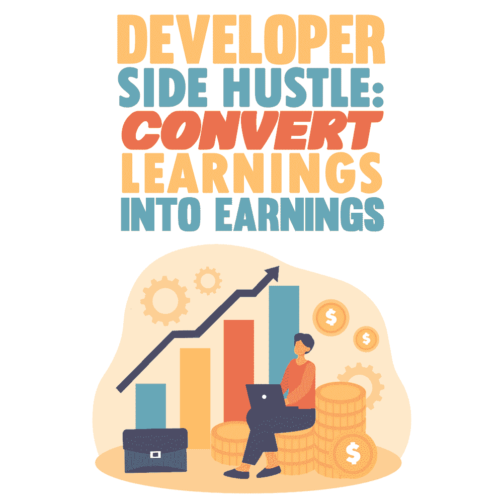

# 开发人员的努力:将学习转化为收益

> 原文:[https://simple programmer . com/developer-side-hustle-learning-earnings/](https://simpleprogrammer.com/developer-side-hustle-learnings-earnings/)

Developers are always learning, but they may not know how to turn that knowledge into more significant earnings. For example, you know you know a lot and have the scars to prove it, but the rest of the world doesn't acknowledge it. If only they could look inside your brain and figure out what you are worth.

但愿如此。这篇博文将讨论分享你的学习，何时分享，在哪里分享，以及你如何将这些学习转化为更大的收益，既作为你可以销售的产品，也作为销售广告的空间。

## 为什么要分享

为什么分享你的学习很重要？

首先，它强化了你的学习。在你向别人解释某件事之前，你必须确保你头脑清楚。如果你必须在团队建设 tiki 酒吧回答一个技术问题，粘性是很大的。

第二，它允许你为他人提供价值，并[将自己](https://simpleprogrammer.com/personal-branding-for-programmers/)定位为专家。被视为专家的人赚更多的钱。

当你能向他人展示你知道自己在说什么时，他们更有可能:

*   关注你
*   重视你的意见
*   寻求你的建议和指导
*   给你机会
*   宣传你的想法

最后，这也是一种回报给你很大帮助的社区的方式。我们都经历过，开始的时候有人帮助我们，现在轮到我们帮助别人了。这种感觉很好，这是正确的做法。

## 第一步:确定你何时在学习

将你的学习转化为收入的第一步是意识到你正在学习。你一天有多少次不得不去查阅资料或者解决一个棘手的问题？每一次都是你在学习一些东西。

这里的主要思想是意识到你正在学习。所以，在开始的时候，把它记在心里。在《原子习惯 一书中，James Clear 让我们知道，我们可以通过坚持不懈地首先做尽可能小的事情来开始建立令人印象深刻的习惯。

在你的一天中，留意你:

*   来个“啊哈！”瞬间。
*   心里想:“真好笑。”
*   查阅
*   对自己说，“嗯，它在我的机器上工作。”
*   解决一个棘手的问题
*   与同事讨论解决问题
*   告诉别人如何做你刚学会的事情

每一次，注意它是你学到的东西。然后，如果你能养成在学习时识别的习惯，你就能开始采取行动，将学习转化为收入。

收入:非常少，因为所有这些都发生在你的脑海里。

## 第二步:捕捉你的学习

当你养成了承认你学到了什么的习惯后，开始[记下](https://www.amazon.com/dp/B017NEFC7Q/makithecompsi-20)你学到了什么。记下问题和你是如何解决的，这样你就不会忘记。

记笔记有三个好处:

1.  它能立即强化你的学习。强化意味着你不太可能忘记解决方案，通过这种方式，你强化了你的知识。
2.  你有笔记可以让你在未来加强你的学习。如果这是一个关键的概念，你应该把这个想法放在一个间隔重复系统(SRS)中，比如 [Anki](https://apps.ankiweb.net/) 。
3.  你有一个你所学知识的提醒，这样你就可以在以后公开分享它们。

再一次，迈出这一小步，仅仅这一步，建立在前一阶段的认知上，直到你持续这样做超过两周。

**收益:**小。如果你只是把它记录在一个实体笔记本上，这是你可以转化为收入的开始，但你还没有到那一步。

## 第三步:小范围地分享你的学习

The best way to start sharing in little ways is on a platform that constrains the size of what you can share, Twitter.

Twitter 是分享小片段信息的完美平台，或者我喜欢称之为“微型教学”

下一个要养成的习惯是每天在 Twitter 上分享你学到的一件事。请把你的一个笔记，浓缩成一条推文，放在那里。连续几周每天或每个工作日都这样做。

如果你没有足够的勇气向世界揭露你的无知(你猜怎么着，每个人都有无知的时候)，你可以匿名开一个 Twitter 账户，在那里发帖。

这样过了几个星期，你已经建立了一个小而稳定的习惯，以一种非常低风险的方式与世界分享我们的学习。

**收益:**小到中等。你在 Twitter 上赚不了多少钱，但如果你做得足够久，你可以把自己定位为专家，并把它变成一份更有成就感或报酬更高的新工作。

## 第四步:将你的分享整合成更大的东西

接下来，你拿一个我们的学习笔记，它不能归结为一个单独的 Tweet，并将其构建到 Tweet 线程中。

或者你可以提供前 4 或 5 天的推文摘要，如果它们都是相关的。

让我们计划每周做一次，除了我们每天的推特。

列表是在 tweet 线程中展示的好东西。例如，把最初的推文想成:“Y 的 X 个最好的工具”，或者“我本周学到的关于产品 Z 的 X 个好的方面和 Y 个坏的方面。”

人们喜欢列表，这很容易让他们理解，也让你更容易组织你想说的话。让事情变得更容易，意味着你更有可能把这些推文变成一种习惯。

另一种线程类型是“How-To”这些更难制作，但如果你能让它们成为习惯，它们会为你的追随者提供巨大的价值。

最后一个线程类型是故事。如果你有一个与你的工作或学习相关的好故事，别人会感兴趣，那就分享吧！故事很棒，因为它们很有趣，并且以一种容易理解的形式提供了一种分享你的学习的好方法。

这些线索类型的关键是确保你为你的追随者提供价值，而不仅仅是推广你自己或你的产品。

如果你能做到这一点，人们会欣赏它，你将建立一个积极参与的用户群，他们乐于看到你的内容。

正如你所看到的，我们现在已经建立在前两个习惯的基础上，达到了每周一次与世界分享我们的学习的程度。

但不止于此。

**收益:**小到中等。还是和上面一样的原因，但是向人们展示你愿意更加努力地分享会增加你获得机会的机会。

## 第五步:巩固你的巩固到更大的东西

现在我们可以开始寻找将我们的微观学习转化为更有价值的东西的方法。

接下来就是开始写文章了。写文章是一件很大的事情，需要一些时间来适应，但是值得。主要的想法是从你的 tweet 线程中选择一条，或者选择一条，把它变成一篇更长的文章。

文章比你想象的更容易构建，因为你已经创建了内容。你需要扩展你的 tweet 和 tweet 线程，并把所有东西连接在一起。

文章是以一种更永久的方式与世界分享你的学习的好方法。他们还受益于可以在社交媒体和其他平台上轻松分享。

假设你每周能写一篇，一年 52 篇！如果这些文章中的每一篇都只帮助了一个人，那就是 52 个人，他们的生活因为你而变得更好了。

想想这会让你感觉有多好，除此之外，谁可能会接触到它，谁可能会喜欢你的工作，以至于想通过咨询、工作邀请、一起写书或其他方式与你合作。

我们想养成每月写一篇文章的习惯，最终减少到每周一篇。

你在哪里发表这些文章？

### 中等(或其他地方)

中型是一个很好的起点。你有固定的受众，如果你开始吸引他们，你可以把他们重定向到你的博客(如下)。

媒体的缺点是他们拥有内容，他们拥有你的订户。

发布这些内容的其他好地方是像 [Hashnode](https://hashnode.com/post/technology-write-for-us-ckv18oeqj07xrp5s1eii109xj) 、 [freeCodeCamp](https://www.freecodecamp.org/news/how-to-write-for-freecodecamp/) 和 dev 这样的网站。这些网站已经拥有大量对阅读这类内容感兴趣的开发人员。

在别人的网站上发帖是一个很好的开始，但是如果你想要长期的控制和成功，你必须:

### 开始写博客

个人博客是与世界更充分地分享你的学习的好方法。

你不仅掌控一切，还可以随心所欲地深入话题，炫耀自己知道的东西。没有编辑器，没有风格指南，也没有限制。也很少有人支持。只有在你养成了定期写作的习惯，并且有了愿意追随你的读者之后，我才建议你这么做。

这也是建立对你要说的内容感兴趣的听众的好方法。

如果你想走这条路，WordPress.com 是一个很好的起点，因为它免费且易于设置。如果你想要更多的控制权，你可以以每年 48 美元的价格获得你的域名和主机。有很多关于如何开始写博客的教程。

你可以通过联盟营销或广告收入从你的文章中赚钱，但真正的钱是在下一步。

**收益:**中到大。广告收入和联盟营销在合适的领域和合适的项目中非常有利可图。

## 第六步:为了收入

Once you have gotten into the habit of writing articles, you can move on to even larger projects to share with others. At this point, it should be easy to take this next step. You have all the accumulated knowledge from the previous actions ready to package into a more extensive offering. The best part of this step is it is when you really start seeing the money. With all these things you can either sell them directly or generate ad revenue off of them.

以下是一些想法:

*   写一本书
*   开始播客
*   制作视频课程
*   创建模板或项目启动者
*   在会议上做报告
*   单人咨询
*   世界是你的！

**收益:**大。此外，许多这些都是[被动收入](https://simpleprogrammer.com/earn-passive-income-mql5-marketplace/)流，让你继续学习和分享，循环往复。

## 现在你知道了，所以去分享和赚取

学习和分享是我选择的获得更大财务自由的途径，也是我推荐你选择的途径。

关键是开始行动，让分享你的学习成为一种习惯——也就是说，你要坚持不懈地去做。专注于习惯培养，一次一小步，认识到你学到了什么，写下来，在 Twitter 上分享，分享更长的 Twitter 线程，然后写文章，最后，开始创建自己的课程或产品。越早开始，你就能越早收获更多的回报。你为什么等着？走出去，开始与世界分享你的优秀知识吧！