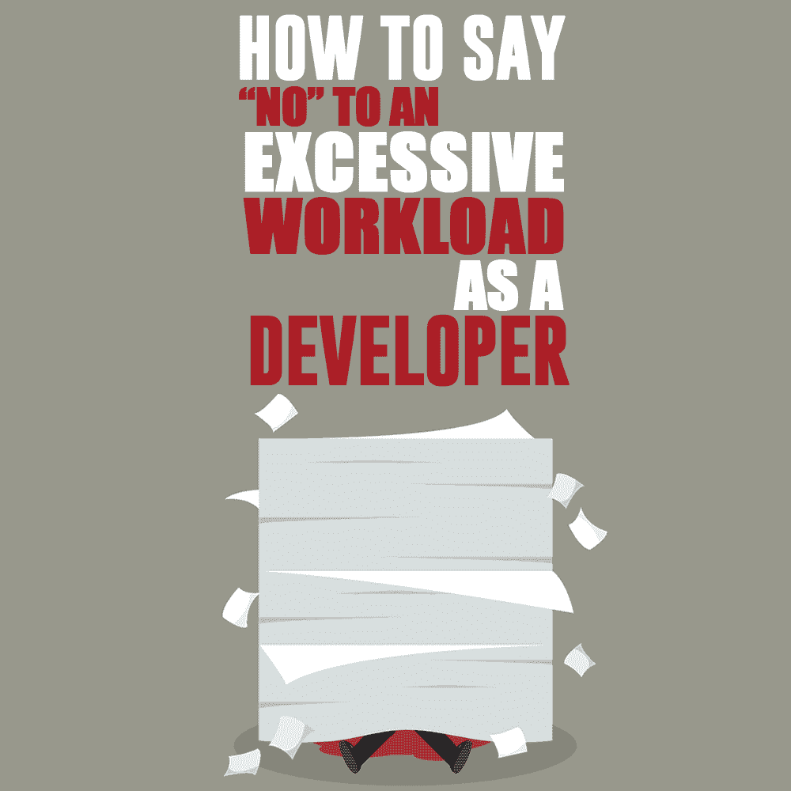

# 作为开发人员，如何对过度的工作量说“不”

> 原文：<https://simpleprogrammer.com/developer-workload/>

The world of [software development](http://www.amazon.com/exec/obidos/ASIN/B078J67VNF/makithecompsi-20) is a continuous race against the fast pace of the industry, with products being developed, marketed, and released to the public in a matter of months. Making your product stand out means putting in a tremendous amount of dedication and passion. This often translates to long hours.

作为一名负责任、经验丰富的软件开发人员，您可能已经感受到了在工作日执行更多任务的压力。你甚至可能试着调试你的工作流程，看看如何在一天内做更多的事情。

对你来说，想要积极主动，承担更多的工作是很自然的。想要给人留下乐于助人的印象是有道理的。幸运的是，如果你想提高你的生产力，有很多关于如何做的信息来源。但是你应该小心你承担了多少。

通过在一家 Java 软件开发公司工作，我了解到管理你所承担的工作量的重要性。越多越好，直到你精疲力尽，你提交的工作质量显著下降。

学会如何说“不”会帮助你避免这种不可避免的现实。

## 为什么你需要开始说“不”

首先，你为什么要对帮助同事或让自己更多地参与软件开发过程说“不”？毕竟，只有当项目的所有成员都积极努力完成任务时，项目才算完成。

说“是”感觉很棒。帮助你的同事并因此得到赏识的感觉也很棒。许多人这样做，却不知道这会对他们自己的工作量产生多大的影响。他们很少考虑持续过度工作的长期影响:筋疲力尽。

为了理解为什么你需要意识到并试图在压力达到精疲力竭之前管理它，你需要知道它如何影响你以及如何在早期注意到症状。

根据定义，倦怠意味着经历精神和身体的疲劳和疲惫。它是由于在困难条件下工作的压力而逐渐形成的。如果管理不当，倦怠状态很容易发展成慢性疲劳和焦虑，导致脾气暴躁，身体容易感冒和生病。

对你整体身心健康的负面影响往往[严重](https://www.forbes.com/sites/bryanrobinson/2019/06/02/the-burnout-club-now-considered-a-disease-with-a-membership-price-you-dont-want-to-pay-for-success/#530ac22537ab)。它的程度可能会有所不同，取决于你允许条件建立的时间。为了保护自己，你需要保持警惕，努力控制自己的压力水平，不让压力越积越大。

只有当我……被太多的精疲力尽所逼时，我才开始把工作视为我生活中不可替代的一部分，但不是我生活的全部。直到那时，我才开始专注于我唯一能做的事情，而不是试图做所有的事情——因此，作为一名员工，我开始变得更有效率。 —格洛丽亚·斯泰纳姆

当你的工作量达到让你有精疲力竭风险的水平时，说“不”的想法并不是降低效率。相反，它旨在提高员工的生活质量和智力，鼓励更高质量的工作。虽然生产力的爆发是必要的，也是有帮助的，但是我们不应该依赖它作为一种普遍现象，也不应该期望它作为生产力的通常衡量标准。

当涉及到软件开发工作过程时，数量不应该优先于质量。产品需要功能性强，平衡好，整体质量高。当你把自己分散得太分散，面临风险或经历倦怠时，你会优先考虑数量，你的工作质量会受到影响。

## 什么时候应该说“不”？

既然我们已经确定了为什么你需要记住说“不”是一种选择，这并不是说你应该总是对额外的工作说“不”。就像生活中的大多数事情一样，答案是不确定的。

当你的同事需要时，愿意帮助他们会让你成为一个真正伟大的同事。在工作中采用团队合作的方式会让你与众不同，还会建立一种相互帮助的关系，因为你肯定会遇到自己需要帮助的情况。

关键是要知道你什么时候能承担更多的工作。当被询问时，您应该经历以下过程:

***注:*** 自然，要考虑到是谁给你布置的作业。无论是同事还是经理，在做出决定时，以下几点都应该是通用的——与你是否应该接受这份工作的决定有关:

1.  你手头有多少任务？
2.  你的任务的最后期限是什么？
3.  你实际上预计自己的工作量需要多少时间？

**与同事交谈时:**

做出决定，并恭敬地迅速通知他们。如果你不认为你可以把额外的工作安排在你的时间表中，最好让他们马上知道，这样他们就可以计划一个不同的解决方案。

**与你的上级经理或主管交谈时:**

问问额外的工作是否紧急，是否比已经分配给你的工作更重要。然后，询问时间框架是什么，并就当前任务的最后期限的必要延长进行沟通。

一个常见的错误是，在没有沟通这将不可避免地引起的变化的情况下，就贸然接受上级的更多工作。另一方面，在不延长时间的情况下，匆忙完成现有的工作和额外的工作会非常有压力，但通过适当的沟通可以很容易避免。

最重要的部分是对你自己和你的谈话对象诚实，看看这个任务是否适合你的工作，而不会让你失去平衡。

在许多情况下，你可以把它和你的其他工作结合起来。目的不是拒绝承担更多工作和提供帮助的想法，而是避免养成过多完成任务的习惯。当承担额外的工作会对你自己的职业表现不利时，你需要留意*。或者更糟，你的精神或身体健康。*

## 你应该如何说“不”？

Let’s say you have decided you have too much work on your plate to take on any more and do it at a high quality. How do you go about refusing to take another assignment?

1.  对寻求帮助的人保持尊重。
2.  诚实地说明你无法提供帮助的原因。
3.  建议一个替代方案:推荐一些他们可以求助的人，或者建议一个不同的信息来源。
4.  如果你一直被分配很高的工作量，那就接受接近你上司的想法。

说“不”时被动和现实的区别在于对你目前的能力有一个准确的认识。有必要根据分配给你的工作和你完成工作的时间来充分评估你的能力。

## 在积极主动和过度劳累之间取得平衡

就工作而言，毫无疑问你应该完成所有的作业。只有当你养成了堆积工作的习惯时，这个问题才会出现。关键是分清轻重缓急，如果你被太多的工作压得喘不过气来，也要进行沟通。

对你的工作进行优先排序，然后根据新工作的重要性决定你是否能承担更多的责任。权衡你的决定，确保你提交的作品符合标准，并且质量不会因为数量而降低。

最终脱颖而出的是高质量的产品，而不是最快推向市场的产品。