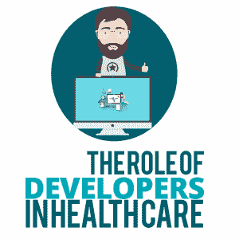

# 开发商在医疗保健中的作用

> 原文：<https://simpleprogrammer.com/developers-in-health-care/>

As the health care industry continues to modernize systems and processes, there is an ever-growing need for software engineers, information technology (IT) professionals, and general developers. Data scientists and IT technicians are in high demand to assist with the organization, processing, and handling of various health and patient data streams.

此外，[网络安全和适当的系统保护](https://simpleprogrammer.com/5-security-concepts/)对于保护由此产生的门户和数据至关重要，因为我们都知道个人健康信息和病历极其敏感。

这最终意味着，开发人员将在医疗保健领域获得大量机会，并因此获得大量回报丰厚的职业选择和途径。

## **职责和角色**

一些更常见的职责和角色包括:

*   医疗保健信息系统开发人员和技术员
*   医疗软件工程师
*   数据和系统分析员
*   医疗保健应用和门户开发者
*   信息技术和网络安全专家
*   网络开发者
*   [物联网(IoT)](https://simpleprogrammer.com/iot-development/) ，可穿戴和设备传感器技术员
*   人工智能(AI)和自动化应用开发人员

医疗保健行业的许多职业和机会与其他行业重叠。例如，IT 和网络安全，或者人工智能和自动化开发人员，几乎在从零售、营销到酒店的每个行业都有一席之地。医疗保健之所以特别有吸引力——在某些情况下更是如此——是因为从技术上讲，这是一个相对年轻的领域，因此参与者将对市场的方向和未来产生强大的影响。

## **仪器任务**

虽然有很多机会，但一些核心职责和角色将被证明对医疗保健和现代医疗技术的未来至关重要。

每当一种新技术或新形式的设备出现时，开发人员和软件工程师就必须打造我们用来与所述设备交互的数字体验和平台。例如，智能家居技术需要一系列移动应用和网络应用，消费者可以使用这些应用来控制技术。在医疗和保健领域，许多与工业设备接口所需的系统和应用尚未开发出来。那些确实存在的将肯定需要改进或修改以满足现代要求。

随着我们生活的世界日益数字化，用户体验已经成为医疗领域软件和技术设备方面的一个巨大话题。患者现在比以往任何时候都有更多的知识，因此开发人员必须转变为以患者为中心的思维模式。开发人员不仅必须首先考虑患者，他们还必须找到一种方法，使他们的产品具有成本效益和可伸缩性，以扩展产品的覆盖范围。

具体到医疗保健领域，开发人员和程序员需要确保他们的产品是遵从意识的，并且使用医疗保健词汇。健康保险便携性和责任法案(HIPAA)是开发人员不能忽视的一个重要因素，他们最好让自己了解 HIPAA 合规性意味着什么，这样他们就可以确保他们的产品符合安全性和可用性标准。最重要的是，如果你正在为医疗保健领域制作程序，你必须确保你至少能理解所使用的语言，并且你的产品能正确地存储信息。

## **创建新平台**

这就是在健康护理和医疗行业工作的普通开发人员的核心目标。在这样的技术和系统变得更加普遍和标准化之前，开发人员将需要精心设计医生、护士和医疗保健从业者日常使用的必要平台和应用程序。

显而易见的是，在部署之前，必须首先开发一个安全的分配系统，用于只向授权方发放限制性药物。物联网传感器和可穿戴监视器必须首先参与并向主监视应用报告，然后才能处理和采集医疗数据。开发者要创造的就是这些通用的体验和平台。

## **开发者如何适应**

当然，一旦平台/软件在主流水平上建立和推广，维护、改进和保护由此产生的系统和网络就变得很重要。在一个网络安全备受关注的世界里，开发者如何融入这个等式有着无限的可能性。

你还必须考虑到这样一个事实，即许多涉及医疗领域的公司和专业人士对软件和应用程序开发几乎没有经验。他们不仅会寻找有经验的专业人士来帮助创建平台，而且还需要指导和建议来实现最高的质量、安全性和效率。

## **开发者如何准备？**

Professionals already in the space will need to get trained and become familiar with basic development practices and simple language and markup. A medical data analyst, for instance, will need to become familiar with raw code and development practices to better understand the data they are working with.

根据劳工统计局的数据，软件开发人员的平均年薪是 107，600 美元。虽然编码教育是一项繁重的工作，当然也需要大量的培训，但是光是工资就非常值得投资。同样可以肯定的是，在医疗行业——开发人员需求量很大——工资会合理地提高。

那么，如何准备进入医疗保健行业呢？需要什么样的培训，什么样的语言有助于获得一个职位？

理想的技能和经验与其他行业没有什么不同。它们在很大程度上取决于你要做什么，以及你要履行什么职责。例如，如果你从事移动应用程序开发，了解用于 Android 开发的 Java 以及用于 iOS 和苹果平台的 Swift 或 C#是至关重要的。

如果您正在使用关系数据库或数据科学应用程序，则有必要了解和理解 SQL 和 basic C。如果您正在开发 web 应用程序或门户，则需要了解 HTML、PHP、ASP.net 以及任何数量的移动和基于 web 的语言。事实上，一般来说，这些语言中的许多被认为是现代医疗保健和 IT 开发人员的顶级或最受欢迎的技能。

## **决定时间**

第一步是决定何时何地适合你。你将追求什么样的角色或职业，这将如何影响你的整体简历？如果有你还没有的技能和培训，那么你需要在提交申请或寻求机会之前获得它们。

好消息是，你有充足的时间，因为在可预见的未来，医疗保健和医疗行业将继续需要开发人员和软件工程师。毫不夸张地说，从这一点上来说，他们将永远需要开发人员在某种程度上。数字和现代技术正在占据主导地位，并且会一直存在下去。

## **今天开始寻找**

如果你完全不知道从哪里开始，就看看一些比较流行的求职板和招聘平台。您会发现医疗公司正在寻找有经验的开发人员的各种空缺和机会。至少，这会让你对自己可能感兴趣或不感兴趣的事情有所了解。