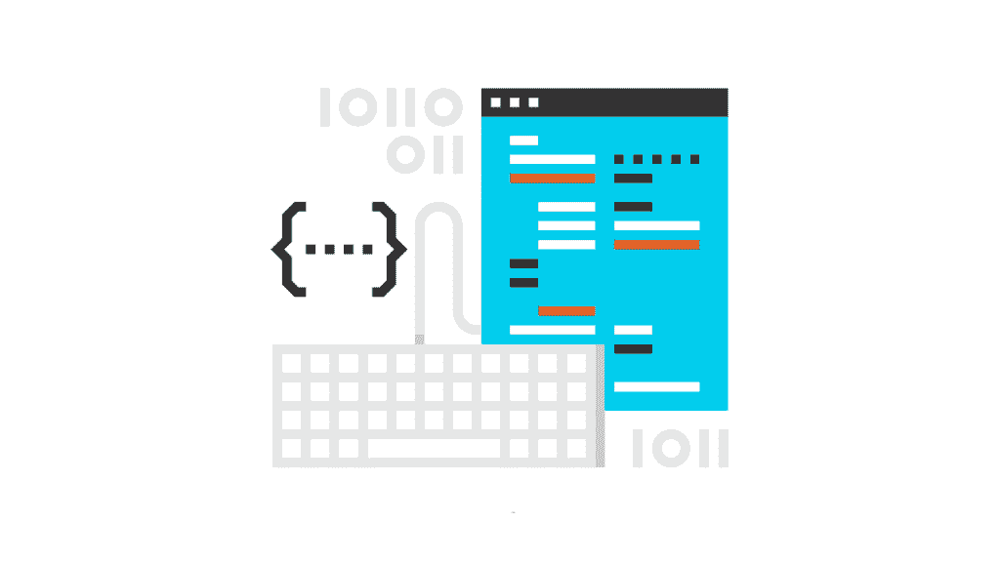
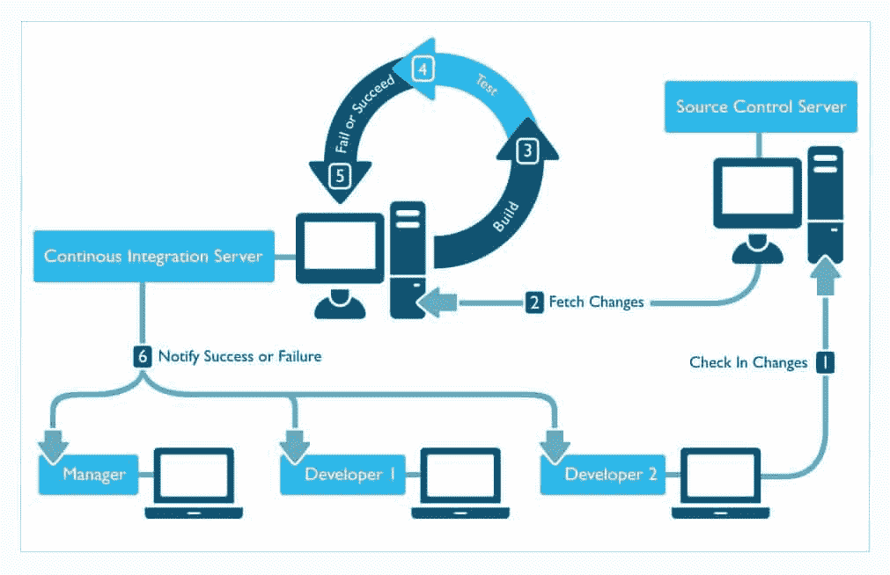
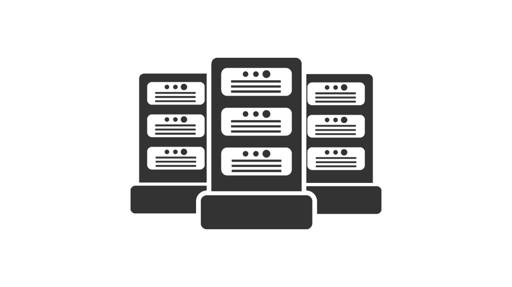

# 关于持续集成，软件开发人员应该知道什么

> 原文：<https://simpleprogrammer.com/developers-know-continuous-integration/>

有些关于我的事你需要知道。

我是持续集成的超级粉丝。

如果你把我放在一个新的软件开发团队中，而你还没有一个自动化的构建过程和持续的集成设置，你可以打赌我要做的第一件事就是让所有这些都运转起来。

我喜欢自动化的想法。

我喜欢尽可能让事情变得更有效率和自动化。

对我来说，这就是持续集成所代表的。

这是一个缓慢、痛苦、乏味且容易出错的过程，构建软件，对其进行测试，将其打包以供部署，并使其自动化。

但远不止如此。

持续集成，或者通常所说的 CI，也是关于**增加单个开发人员工作的代码被合并在一起的频率**，所以你不会经常陷入我在关于源代码控制的章节中提到的那种**合并地狱**。

您越早能够集成，集成地狱的机会就越少，您就会越快发现集成问题。

最后，持续集成**为整个团队提供反馈**——而且很快。

当您能够检入一些代码，并在两分钟内知道该代码是否编译成功，以及您是否在五分钟内破坏了一些东西，同时在一个中心位置看到结果，您就有了一个非常快速和有用的反馈周期。

反馈周期越快，软件就能发展得越快，整体质量就能提高得越多——这是敏捷开发中极其重要的元素。

此时，您可能会想，“是的，John，听起来您确实想向我推销 CI 这个东西，但它到底是什么呢？

我是说，听起来不错。

我喜欢自动化。我喜欢反馈。我不认为我会喜欢融合地狱。

“但你说的这个词到底是什么？”

嗯，我认为让你理解持续集成的最好方法是让我带你回到过去，向你展示事情过去是如何完成的，以及持续集成是如何随着时间的推移而发展的。然后，我将带您了解一个现代软件开发环境的工作流程，一个好的 CI 系统已经建立并正在运行。

我们开始旅行吧，好吗？

## 建筑规范过去是如何工作的

我还不算太老，但是我已经足够老了，可以在没有先进的自动化工具之前开发软件了。

在我职业生涯的早期——我们谈论的是 21 世纪初——在一个软件开发团队中工作是很正常的，在这个团队中，每个开发人员都负责弄清楚如何创建他们自己的软件版本。

我这么说是什么意思？

嗯，在任何足够大的应用程序中，都有相当多的组件可能会加入到正在开发的软件的构建中。

当然会有大量的源代码文件需要编译。

通常，会有一些其他资源，如外部库，需要存在于开发人员的机器上，以构建最终的软件解决方案。

并且在编译代码以获得最终产品之前或之后，可能会涉及到额外的步骤。

过去，当你是一名开发人员时，你会得到一份源代码。某个在过去五年里一直致力于软件开发的大师会向你展示构建软件所需的神奇咒语，然后你就只能靠自己了。

个体开发人员开发了他们自己的方法来在他们的机器上构建软件。

当要生产一个可以测试或部署给客户的版本时，其中一个开发人员会牺牲一些鸡，向后走一圈，在五角星周围点上蜡烛，按 CTRL+SHIFT+F5，然后就会弹出一个软件的完成版本。

然而，这种开发和构建软件的方式存在一些大问题。

最大的问题是，由于每个开发人员都是在他们自己的机器上开发软件——而且方式略有不同——**两个拥有相同代码版本的开发人员很有可能会开发出两个完全不同的软件版本。**

你可能会问，这是怎么回事？

当你没有一致性时，很多事情都会出错，每个人都在按照自己的流程做事。

开发者可以在他们的机器上安装不同版本的外部库。

开发人员可能**认为他们有相同的源代码**，但实际上**忘记从源代码控制中获取最新的文件**或者**对文件**进行了本地更改，他们没有意识到这一点，从而阻止了代码的更新。

**文件或文件夹结构可能不同**，这反过来会导致软件实际运行方式的差异。

很多事情可能会出错。

另一个主要问题是，由于开发人员都是在本地构建，如果有人签入了一些甚至无法编译的代码，没有人会发现，直到他们删除这些代码并尝试构建软件。

这可能看起来没什么大不了的，但是当多个开发人员在几天甚至几周的时间里签入糟糕的代码，然后当有人最终试图构建所有东西并发现它坏了时，他们不知道是什么变化导致了问题，这真的很有趣。

另外，我曾在一些地方工作过，在那里仅仅创建一个软件版本就要花费数小时。

没有什么比在你的机器上运行 4-5 个小时，然后发现它坏了更糟糕的了。

## 然后构建服务器的

出现了

解决这类问题的早期方法之一是**引入构建服务器。**

这个想法是，不是让每个开发人员在他们自己的机器上构建软件，而是有一个中央构建服务器，它被正确地配置并拥有所有正确版本的库，等等。

开发人员可以在构建服务器上开始构建，或者构建服务器每天晚上自动构建软件。

起初，这是从每周的构建开始的。

因此，你至少会有一些官方的软件每周版本，它将所有开发者在那一周所做的所有更改结合在一起，并以统一的方式构建。

然而，每周构建的一个问题是，当试图创建每周构建时，通常——特别是对于大型团队— **会有一个集成地狱问题。**

通常，会有一个开发人员或 IT 人员负责让每周的构建工作起来，他们会手动修复所有破坏构建的问题，并找出有冲突变更的开发人员来尝试并解决它们。

比无构建服务器有所改进，但并不多。

最终，每夜构建的想法变得流行起来。

我们的想法是，如果我们每天集成代码，构建服务器每天晚上创建一个新的构建，那么大问题堆积和复合的时间就会减少，我们可以更早地发现问题。

起初，这个想法似乎很疯狂。

你不会相信，在我工作的一家公司，当我第一次建议进行夜间建设时，遭到了多大的阻力。

但是，最终它成为了规范，并且确实解决了相当多的问题。

可以说，来自中央构建服务器的每夜构建有助于让每个人同步并在同一页面上，如果每夜构建中断，让它重新工作是每个人的首要任务。

每夜构建的想法推动了构建过程本身实际自动化的需求。

这非常好。

为了每天晚上一致地构建软件，我们需要一些自动化的方法来收集所有的代码，编译它，并执行创建工作构建所需的任何其他步骤。

这是许多脚本的时代，这些脚本是为了自动化构建软件的过程而创建的，至少在构建机器上是这样。对于开发人员来说，仍然拥有自己的本地构建流程是很正常的。

过去只编译代码的 Makefile 脚本开始变得更加复杂，可以为构建服务器处理完整的构建过程，基于 XML 的构建自动化工具(如 Ant)也应运而生并开始流行。

生活变得越来越好，但是仍然有一些大问题。

随着敏捷变得越来越流行，单元测试的想法也越来越受支持，仅仅编译代码并打包的每夜构建已经不够好了。

我们需要更短的反馈周期。

如果有人签入了糟糕的代码，整个团队可能会脱轨，而我们直到第二天早上才发现这一点。

我们需要一些方法来每天多次可靠地构建代码，并运行一些除了“它可以编译”之外的其他代码质量检查

## 最后，持续集成

图片由卡内基梅隆大学 SEI Insights 提供

每夜构建是一个困难的推销，但与试图让管理层购买持续集成或者每次有人签入新代码时都构建软件的想法相比，什么都不是。

你为什么要这么做？我们有夜间建筑。

我不明白；你想不断地构建代码吗？

等等，让我搞清楚。你想让我告诉所有的开发人员他们需要一天多次签入他们的代码吗？你在开玩笑吗？

阻力很大，但是随着敏捷越来越流行，阻力慢慢被克服了。持续集成不仅仅是一个美好的梦想，而是一个必须具备的条件，以便在每次迭代中有足够短的反馈周期来完成工作项目。

然而，主要的问题是如何做到这一点。

我们如何在每次新代码被签入源代码控制时构建代码呢？

答案是**持续集成服务器。**

开发了特定的软件，可以在构建服务器上运行，能够检测源代码控制的变化，下载最新的代码，并运行构建。

很快，开发人员开始着手**减少代码库**的构建时间，这样反馈会更快。

既然我们有了这种能力，那么做更多的事情而不仅仅是构建代码是有意义的。

持续集成发展到包含运行单元测试，以及运行代码质量度量，如静态代码分析器，这些都是由初始签入开始的。

最大的障碍是——现在仍然是最大的障碍——**让开发人员尽早地、经常地签入他们的代码**,这样我们就可以相当快地得到反馈。

现在，有了 CI，我们不仅可以在几分钟内知道代码更改是否会妨碍整个项目的编译，而且我们还可以发现是否有任何单元测试被破坏，甚至可以自动运行自动化回归测试来寻找回归。

啊，生活真美好。

## 持续集成工作流示例

好了，至此，通过了解持续集成所解决的问题以及它是如何发展的，您可能对持续集成有了一个大致的概念。

但是你可能还是不太“明白”——这没关系。

让我们通过一个使用持续集成的样例工作流，然后也许它会点击得更好一点。

### 签入代码

这个循环从您签入代码开始。

当然，您已经在本地机器上运行了构建并运行了所有的单元测试，然后才敢将代码签入主存储库并冒着破坏所有人的构建的风险……对吗？

### 新构建开始

构建服务器上的 CI 软件刚刚检测到它所监控的源代码控制分支发生了变化。

这是你的代码！哦，太好了！

CI 服务器启动新的构建作业。

### 代码已签出

新构建作业做的第一件事是获取最新的变更。

它提取您的代码变更——以及分支上的任何其他变更——并将它们放入它的工作目录中。

### 代码已编译

此时，通常会启动某种构建脚本来实际编译和构建代码。

构建脚本将运行命令来构建源代码。

它还将链接任何外部库或编译代码所需的任何东西。

如果代码编译失败，构建将在这里停止，并报告一个错误。

这被称为破坏构建——这是不好的。

我记得你说过你在签入之前在你的机器上编译了代码？

丢人！

### 静态分析器正在运行

假设代码构建正确，运行静态分析器来测量某些代码质量度量。

如果你不知道这些是什么，没关系。

基本上，它们是可以查看代码并寻找可能的错误或违反最佳实践的工具。

这些分析器的结果被存储起来，以便在构建完成时进行报告。

如果从静态分析器得到的代码质量度量没有达到某个阈值，一些构建实际上可以被设置为失败。

### 单元测试正在运行

假设一切仍然良好，CI 工作开始单元测试。

针对编译后的代码运行单元测试，并记录结果以备后用。

通常，如果任何单元测试失败，都会导致整个构建失败。我强烈推荐这种方法。

### 报告结果

最后，报告实际构建的结果。

该报告将包含关于构建是通过还是失败、运行需要多长时间、代码质量度量、单元测试运行以及任何其他相关数据的数据。

此时，文档也可能由构建自动生成。

结果可以设置为通过电子邮件发送给团队——特别是在失败的情况下——并且大多数 CI 软件程序也有 web 界面，任何人都可以在那里看到最新构建的结果。

### 软件被打包

现在，构建软件被打包成一种可以部署或安装的形式。

这通常包括将编译好的代码和任何外部资源或依赖项打包成任何需要的结构，以获得可部署或可安装的单元。

例如，可以创建一个包含所有正确文件的文件结构，然后将整个文件压缩。

此时，构建作业还可以在源代码控制中应用某种标记来标记软件的版本。

### 代码是可选部署的(连续部署)

这最后一步是可选的——实际上，我认为前一步也是可选的。

但是[更多的团队正在进行持续部署](http://amzn.to/2cgmQz4),他们将代码直接部署到环境中进行测试——或者，如果他们真的勇敢，直接投入生产。

### 完成

仅此而已。

当然，在这些步骤中有一些变化，可能还有一些额外的步骤，但是**的基本思想是构建代码，检查问题，并且每当新代码被检入时，都自动地为部署准备好代码。**

这使我们能够很快知道系统的新变化是否导致了错误，以便可以立即修复它。

尽管我已经轻松地完成了所有这些，但我不想让它听起来太简单。

构建工程师可以花相当多的时间来构建一个顺畅的持续集成过程，并且有各种各样的关于应该如何做以及做这件事的最佳实践的争论。

## CI 服务器和软件

持续集成的一个关键组件是 CI 软件。

没有 CI 软件，我们将不得不编写定制脚本并对我们自己的构建服务器进行编程。

幸运的是，许多聪明的开发人员很快意识到构建 CI 软件的价值，这有助于自动化持续集成的大多数常见任务。

大多数 CI 软件都以非常相似的方式工作，这使得实现我上面描述的工作流变得容易，或者至少更容易。

实际上有相当多的 CI 服务器和软件可用，但我在这里只着重介绍我发现在撰写本书时最常用的几个。

### 詹金斯

[Jenkins 几乎是我的竞争情报软件](http://amzn.to/2bM44y8)。

它是一个 Java 程序，最初是为了在 Java 环境中进行 CI 而创建的，但它变得如此流行和易于使用，以至于它已经扩展到几乎可以用于任何技术。

Jenkins 非常容易安装和运行，因为它包含自己的内置 web 服务器。

它还有一大堆插件。

如果你想在 Jenkins 中做些什么，很有可能有人已经为你写了一个插件。这是我如此喜欢和使用詹金斯的主要原因之一。

实际上，我有一门 Pluralsight 课程，教你学习詹金斯基础知识。 [)](https://simpleprogrammer.com/pluralsight)

### 哈得孙

我就不跟你讲赫德森/詹金斯分手的故事了，给你讲个简短的。

在詹金斯出现之前，有哈德森。

发生了一些争吵，詹金斯从哈德森脱离出来，哈德森继续独立发展。

Hudson 是甲骨文控制的，我个人觉得不如 Jenkins，因为 Hudson 的创建者川口康介，以及 Hudson 原来的大部分团队，都搬到了 Jenkins。

老实说，我不知道哈德森是否还活着，是否还在接受治疗。

### 特拉维斯·CI

Travis 是另一个流行的 CI 软件，但它的操作方式略有不同。

Travis CI 实际上是托管的，并作为服务提供。

换句话说，你不安装 Travis CI 你报名参加。

它实际上是为 GitHub 上托管的项目执行 CI 而设计的。

Travis 越来越受欢迎，因为许多项目都托管在 GitHub 中，而且它设计良好，易于使用。

另外，不必维护自己的构建服务器也很好。

### TFS

如果你专门在微软公司工作，TFS (Team Foundation Server)确实提供持续集成支持，但以我的经验来看，它相当简单，不足以与其他一些更流行的产品竞争。

但是，我想如果你想要简单的东西——而且必须是微软的解决方案——这个可能适合你。

### TeamCity

[TeamCity 是另一个流行的持续集成服务器](http://amzn.to/2bN9ryT)，由商业公司 JetBrains 创建。

它有一个免费版本，但也是一个许可产品。

所以，如果你正在寻找一些更专业的支持，这是一个很好的选择。

很多。NET 团队使用 TeamCity 来满足他们的 CI 需求。

### 更多？

我只给出了一些比较流行的 CI 服务器选项的一小部分，但是已经有很多了。

如果您想查看所有选项，请查看这个[接近完成和更新的列表](https://en.wikipedia.org/wiki/Comparison_of_continuous_integration_software)。

* * *

