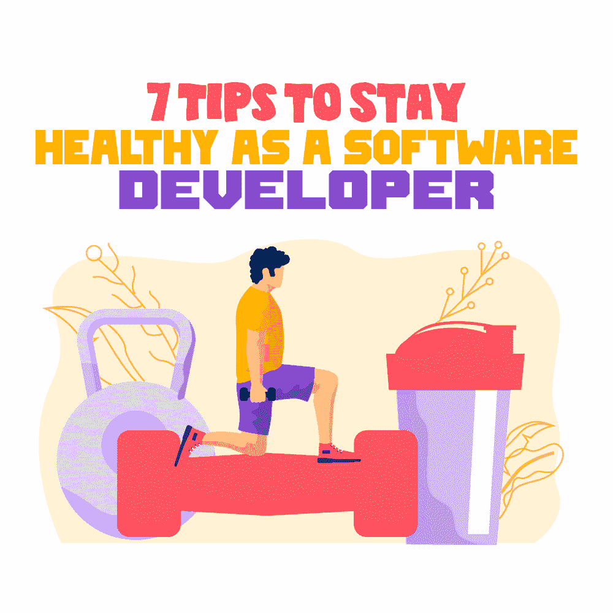

# 作为软件开发人员保持健康的 7 个技巧

> 原文：<https://simpleprogrammer.com/developers-mental-physical-health/>

The rewards of being a software programmer can turn into a pyrrhic victory if issues such as untackled job burnout, fostering of [imposter syndrome,](https://simpleprogrammer.com/programmer-impostor-syndrome/) and working late hours are left unchecked.

Greg Baugues，一位与双相情感障碍作斗争的开发人员，在他的演讲“开发人员和抑郁症”中解释了抑郁症如何由于相关的耻辱而具体影响开发人员社区。

因此，恢复和保持良好的心理健康对软件开发人员来说是一项艰巨的任务。

但是当考虑精神健康和身体健康时，这两者不应该被认为是分开的。身体健康不佳会增加患精神健康问题的风险。同样，不良的心理健康会对身体健康产生负面影响，导致某些疾病的风险增加。

作为一名业务分析师，在我的职业生涯中，我一直与软件程序员一起工作，因此我对这个问题有了一些独特的看法。这里有一些建议可以帮助你作为一个开发者保持身心健康。

## 将物理学带入画面

开发人员坐的时间越长，软件越好，但是对他们的健康破坏性很大。根据牛顿第一运动定律，开发人员更喜欢处于持续的休息状态，除非受到一些外部因素的干扰，例如家庭成员要求他们完成一些家务。

所以，正如你能猜到的，给你的生活带来一些运动是很重要的，因为这对健康的身心是必要的。无论是在下午打壁球，参加瑜伽或游泳班，还是和朋友一起徒步旅行，将你选择的体育活动融入你的生活。

## 应用 20-20-20 规则

程序员整天盯着电脑屏幕——有时甚至通宵——所以慢性眼睛疲劳是他们面临的一个普遍问题。

医疗从业者建议通过应用 20-20-20 法则来应对数字眼疲劳。但是这个 20-20-20 规则到底意味着什么呢？

眼科医生建议，在连续盯着数字屏幕 20 分钟后，你应该试着观察 20 秒钟放在 20 英尺以外的任何其他物体。

软件开发人员可以在 20 分钟的固定间隔后设置一个闹钟，每次这个闹钟响起时，他们都应该尝试从办公室的座位上站起来，四处活动，即使只是一点点。另一个选择是看看窗外。另一个好主意是多喝水，因为这不仅可以防止你的眼睛脱水，而且也是四处走动、让眼睛离开屏幕的好借口。

应用 20-20-20 法则将有助于眼部肌肉放松，最终防止头痛、流泪、视力模糊和眼睛疼痛。

## 禁止你的咖啡因供应

似乎太难实现？也许一开始是这样，但是限制咖啡因和苏打饮料对于健全的精神功能是必要的，因为咖啡因和苏打会阻碍神经化学信号工作所必需的接收器部位。

最糟糕的是你会产生一种耐受性，所以大脑需要不断增加你需要的咖啡因的最小量，因为它已经习惯了之前摄入的咖啡因剂量。咖啡因含量越高，心脏就要为全身血液循环付出越多的努力。

摄入咖啡因后，我们感觉到的能量是心脏促使血液在体内流动的力量，因此血压升高。因此，禁止你的咖啡因或苏打水供应，因为这对开发人员的健康是令人发指的。

## 保持完美的姿势

开发人员背部有问题的主要原因不是因为他们长时间坐着，而是因为他们保持错误的姿势。

保持笔直的姿势，这样所有的关节和骨骼都对齐了，肌肉才能发挥作用。正确的姿势也会防止肌肉向上拱起。

坐在椅子上保持正确姿势的一些小技巧包括把你的后背靠在椅子的靠背上。这通过在脊椎骨后面提供结构支撑来防止脊椎骨上的重量倾斜。不要跷二郎腿，把脚放在地板上。

## 消除脑雾

开发人员是被雇佣来解决问题的，所以他们比其他专业人员有更高的脑力活动。然而，过度集中注意力会暂时剥夺大脑集中注意力的能力。

这种情况被称为“脑雾”,它会让接收者几天甚至一周都无法完成基本功能，如进行对话。它可以通过将精神活动分成更小的任务来解决，中间有放松的时间。

避免脑雾的另一个有用的技巧是在其他任务之前进行最费力的精神活动，因为你不必在精神疲惫时强迫自己去工作。

## 避免倦怠

大多数程序员通常都有同样是程序员的朋友，因为他们通常没有足够的时间去社交和逃离他们的职业生活。尽管如此，在编码圈之外没有生活或者生活有限会加速精疲力竭的过程。很少或根本没有得到项目团队领导的赏识、过度的工作量和报酬过低都是导致倦怠的因素。

养成习惯，远离工作模式，投入生活中的其他角色。那些有家庭的人可能不会觉得这很难，因为家庭可以成为充电的一大来源。其他人可以沉溺于某种爱好，比如看书或画画。记住补充你的能量资源是很重要的。如果能源是按天抵押的，总有一天你会用完它。

## 认真对待感谢的话语

Over the years, our minds have learned to take criticism more seriously than appreciation and words of praise for our accomplishments. We don’t value others’ appreciation much, but criticism gets into our heads until we ace at the task we were criticized for. This may be a strong motivator in the short term, but it has devastating mental and physical effects in the longer run.

所以，别忘了从漫长的工作日中抽出几分钟，欣赏自己一会儿。在工作场所感受别人对你的感激之情。你可以通过喝一杯特别的饮料，享受一顿美食，更新你的成就清单来欣赏自己。

归根结底，软件程序员也是人，和其他人一样，他们也需要爱和欣赏。

## 小步骤可能至关重要

有时，我们忽略了小步骤的预防措施是如何将我们从精神和身体健康的混乱中拯救出来的。它们可能看起来无关紧要，但却意义深远。加入一些小的步骤或预防措施，关心你的身体和精神上的平静，可以使你免于永久失去健康的精神或身体健康。

作为一名软件开发人员，你应该努力刻意增加身体活动，削减身体的毒素，让眼睛休息一下，保持笔直的姿势，消除脑雾和倦怠，欣赏自己。

这样做，你会惊奇地发现这些自我保健的步骤会给你的生活带来改善。