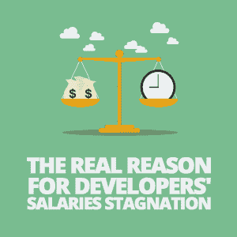

# 开发商薪资停滞不前的真正原因

> 原文：<https://simpleprogrammer.com/developers-salaries-stagnation/>

Salaries of middle-class professionals have been stagnating in real term since the 1980s. This statement has been reiterated all over the media, usually with [various graphs](https://www.theguardian.com/business/2017/jul/12/uk-pay-squeeze-real-wages-tuc-unemployment-ons-figures) to support it.

软件开发人员是一个通常包含在这些数字中的职业。过去，程序员的工资很高，但是现在，软件开发人员的平均工资并没有那么高，尽管仍然比其他职业的人要高。可以说，它不仅没有停滞，实际上还在下降。

软件开发领域传统上吸引着对技术有热情和良好的解决问题技能的人，正是因为它被认为是一种职业选择，人们可以在实践他们热爱的事情的同时获得良好的生活。

然而，由于工资停滞不前，许多开发人员要么对他们的职业前景变得悲观，要么现在正在考虑做其他事情，这通常是他们没有多少热情的事情。

然而，那些担心薪资停滞的人不应该绝望。虽然听起来很奇怪，但平均数字停滞不前的关键原因实际上是人们应该乐于听到的。

你仍然可以通过写软件赚很多钱，而且这种情况不会很快消失。如果你想知道怎么做，请继续阅读。这正是我们要讨论的内容。

## 薪资停滞的主要原因是什么？

软件开发人员平均工资下降的最根本原因如下:

现在入门级的编程工作比以往多得多。

我说过你听到这个会很高兴的。这难道不是个好消息吗？事实上，自从软件开发人员这个职业被发明以来，进入这个行业的门槛已经大大降低了。

几十年前，作为一名开发人员，你需要对计算机系统有广博的知识。既没有 Google 也没有 Stack Overflow 给你一个即时的答案。也没有多少开发人员是你可以联系并寻求帮助的。你必须知道一个给定的系统是如何工作的，如果有什么不对劲，你必须能够自己解决。

拥有专业学位是必须的。除了大学的计算机科学系，几乎没有其他地方可以学习软件开发技能。你的知识量相当于一个医学博士需要知道的知识量，你的工资会和他们的相当。

然而，如今的情况大不相同。成为一名软件开发人员比以往任何时候都要容易。很多开发人员没有编程相关的学位，有的甚至没有学位。例如，参与 2015 年 Stack Overflow 组织的开发人员调查的近 50%的开发人员表示，他们从未获得过专门与编程相关的学位。大约 42%的参与者认为自己是自学的。

借助于网络和一些训练，你可以在家里舒适地学习如何编写软件。理论上，只要完成一两个编码教程，就足以胜任初级开发人员的角色。

你不可避免地会遇到这些教程都没有提到的事情。然而，大多数这些问题的答案只是谷歌搜索了一下。

虽然作为一名初级开发人员，你永远不会像那些拥有多年专业技能的人一样挣得多，但与经济中的许多其他工作相比，你仍然会做得相当好。

进入初级编程岗位比以往任何时候都容易，但对软件工程师的需求仍然强劲。这使得初级程序员的工资不会比现在低。由于软件在我们的生活中扮演着比以往更重要的角色，这种趋势不太可能很快改变。

## 自由市场如何影响工资？

根据经验，在自由市场经济中，有三个因素决定你的收入:对你所做的事情的需求、你的能力以及取代你的难度。当[软件开发人员的职业刚刚起步的时候](http://www.amazon.com/exec/obidos/ASIN/B073X6GNJ1/makithecompsi-20)，这个行业的几乎每个人在这三个方面都得了高分。

对开发人员的需求是存在的，因为他们被要求完成大量的教育*和*必须能够依靠他们的记忆做许多事情，擅长他们所做的只是进入该领域的先决条件，而取代他们中的任何一个几乎是不可能的。

Today, the situation is different. Demand for software developers is as high as ever as more and more organizations, both in public and private sectors, produce software—whether it’s to sell or purely for internal use. Despite the barriers to entry being lowered, being a software developer still requires specialist skills that take time and effort to acquire. Because of this, programmers are still difficult to replace. Certainly it’s not as hard as it was in the past, but it’s still hard nonetheless. This is what keeps their salary relatively high.

的确，在许多公司里，初级开发人员的任务类似于流水线工作。要完成这些任务，你不需要对你所使用的技术有深入的了解，你甚至不需要从头开始编写任何软件。这是平均工资下降的原因。

通常，初级开发人员只修改别人编写的代码来修复错误和添加一些相对较小的功能。初级开发人员面临学习新技术挑战的唯一情况是，新技术已经被更高级的人引入到他们开发的软件中。

因此，对于那些渴望成为软件开发人员，但又害怕必须获得高深技术知识的人来说，这确实是个好消息。

但是，那些在技术上真正有天赋并且不介意处理令人痛苦的技术难题的程序员呢？好消息是，真正的技术奇才的工作和与之相关的高薪都没有消失。

## 为什么某些开发人员的工资不同？

软件开发人员的报酬之所以不同，是因为不同角色所需的技能水平存在差异，这种差异有时非常大。

我给你举个好例子。试着去翻翻官方 [C#教程](https://docs.microsoft.com/en-us/dotnet/csharp/quick-starts/)。如果你熟悉任何其他编程语言，你可能会发现它很容易。如果你完全是编程新手，你可能会发现难度适中，但仍然可行。教程中教授的技能是精通 C#的初级开发人员需要的技能。

所以，在你完成教程之后，试着浏览一下 [Autofac 文档](https://autofac.readthedocs.io/en/latest/)。中广泛使用的依赖注入容器。网络生态系统。如果你还不熟悉它，你可能会发现大部分的文档几乎无法理解。

在你开始阅读文档之前，你需要很好地掌握[控制反转](https://martinfowler.com/articles/injection.html)和[工厂](https://sourcemaking.com/design_patterns/factory_method)设计模式，它们本身并不容易学习。即使你知道这些设计模式，你仍然可能不得不多次阅读一些章节，并在你的代码中实际使用这个库，以便完全理解它。

因此，这就是为什么不同的开发人员获得不同的工资。对于一个工资最低的初级开发人员来说，知道基本的 C#就足够了。然而，那些有经验的开发人员，知道最广泛使用的设计模式，并且很好地掌握了像 Autofac 这样的库，可能会得到大多数初级开发人员的两倍甚至三倍。然而，这与过去高素质开发人员的技能水平仍相差甚远。

有些职位绝对需要深厚的技术知识，而且这些职位的报酬非常高。然而，与过去不同的是，这些并不严格地与低级计算机架构相关。

## 你如何找到高薪的开发人员工作？

如今，作为一名软件开发人员，您可以选择多种途径。你可以在[人工智能](http://mobiletechtracker.co.uk/trackerblog/trackerblog-article.php?pagename=i-cannot-wait-for-ai-to-take-over)工作，你可以成为[数据科学家](https://www.forbes.com/forbes/welcome/?toURL=https://www.forbes.com/sites/drewhansen/2016/10/21/become-data-scientist/&refURL=https://www.google.co.uk/&referrer=https://www.google.co.uk/)，也可以成为[虚拟或混合现实](https://www.microsoft.com/en-gb/windows/windows-mixed-reality)专员。

或者你可以继续做一个普通的软件开发员，你仍然会得到合理的报酬，但是比你应该得到的要少得多。说实话，这个没毛病。选择权完全在你。

不过，有一个问题。绝大多数可用的软件开发工作不需要任何高级技能。有许多软件公司，但很少有公司做的事情与建立网站、移动应用程序或内容管理系统(CMS)有显著不同。

当然，这些公司中没有一家愿意为任何此类职位支付比平均工资高得多的薪酬，因为这就是此类职位所需技能的价值。你可能有一些机器学习的高级知识，但谁会在乎你在当前角色中所要做的只是为一个网站构建后端呢？只有当你的知识被实际应用时，你才能得到报酬，而在这种情况下，你的知识并没有被应用。

If your current employer doesn’t do anything related to machine learning (or any other advanced technology that you know), the only way you can utilize your knowledge and get an appropriate financial compensation for it is to find another employer. The good news is that if you’re already employed as a software developer in any capacity, your paycheck—even if it’s as big as it could be—would be sufficient to cover all of your expenses while you are on the lookout for another opportunity. Another bit of good news is that there are more of these opportunities than there ever were.

你的道路上可能会有一些障碍。例如，如果你住在一个相对较小的城镇，有一些先进的知识，但当地没有一个软件工作需要这些知识，该怎么办？嗯，你可以从积极的角度来看。

当软件开发刚刚起步时，一个和你差不多大的城镇可能没有任何编程工作。一个都没有。所以，是的，如果你不得不搬迁以实现你的全部潜力，这可能会令人沮丧，但这是处于你这种情况的人一直在做的事情。

请记住，在你重新安置之前，你处于一个可以合理谋生的位置。如今，即使是小城镇也可能有软件相关的工作。

然而，搬迁并不是唯一的选择。随着高速互联网的普及，您现在可以在几乎任何地方远程工作。通常，你只是偶尔有义务出现在办公室。即使是三个小时的通勤，如果你不必经常这样做，你也可以忍受。

然而，这并不适合所有人，因为有些人在家时很难让自己进入工作状态。但这是一个可以考虑的选择。

## 高级技术技能并不是获得更高报酬的唯一途径

到目前为止，我们已经讨论了如何纯粹基于你的技术技能来提高你的工资。然而，也有其他提高工资的方法，不需要花时间学习一些只有相对较少的人能够掌握的先进技术。

当然，业内人士都知道，你可以通过进入团队领导、技术架构师或项目经理等不那么亲力亲为的角色来增加薪水。由于许多开发人员真正喜欢编码，这不是他们中许多人想要走的路。这就是为什么我们只提到它。

有一件事能让你的薪水保持在市场最高水平，那就是自信，这与其说是一种特殊的技能，不如说是一种性格特征。好消息是，这种性格特征是一种可以学习的技能，可以通过定期练习来培养。更好的消息是，一旦你拥有了它，它会在你薪水之外的其他方面帮助你。

你可能已经看到过招聘广告，其中的薪水是一个范围。通常这些数字旁边会写着“依经验而定”。事实是，情况并不总是如此。

如果广告上的工资差距很大——例如，如果较高的数字是较低的数字的两倍——那么它可能确实取决于经验。张贴广告的公司不介意雇佣任何级别的开发者，并准备支付相应的费用。然而，如果工资范围不是很高，但仍然很可观，情况可能会有所不同。

如果你正在寻找一个高级软件开发人员的职位，并且广告中的最低和最高工资都适合这种类型的职位，那么你最终获得的工资很可能与你的经历无关。这些数字放在那里可能是因为招聘经理希望候选人进行谈判。

If you are in this situation, your task is to be as assertive as possible, backing it up with [persuasive points](https://simpleprogrammer.com/sell-your-ideas/) of why it would be mutually beneficial to pay you more. If you are usually reserved and shy, you may be uncomfortable with the whole idea. However, getting out of your comfort zone in this situation will help you in many areas of your life. If you have already decided to stay in a hands-on programming position but don’t want to study a specialist advanced technology, this is pretty much the only way for you to be paid more.

同样的原则也适用于薪资谈判。如果你很确定你现在的薪水远低于你在其他地方能挣到的，那可能是因为你过去不够自信。

如果你过去不能对你的老板说“不”，现在就很难改变你对他们的行为，你新发现的自信可能不会被很好地察觉。这就是为什么当你要开始一份新工作时，谈判你的薪水总是比改变现有工作更容易。

在现有工作中获得加薪的最简单的方法就是主动承担更多的责任。不过，还是有风险的。你的老板可能会利用你新发现的热情，而不是给你加薪。尽管如此，从长远来看还是值得的。你可以把新的职责写在简历上，让其他潜在雇主看到。

## 包扎

简而言之，尽管软件开发人员的平均工资停滞不前，甚至有所下降，但这并不是因为这个职业本身的贬值。相反，这纯粹是因为不需要基本编程技能的工作大量涌现。

如果你愿意努力深入学习复杂和热门的技术，你仍然可以赚得很多。同样，你可以通过有说服力和自信来增加薪水。

尽管那些需要复杂技能的高薪工作相对较少，但实际上比以往任何时候都多。如果你住的地方没有，你将不得不搬迁或远程工作——但在找到一份真正好的工作之前，你几乎肯定能够找到一份基本的编程工作来支付你的账单。

记住，停留在这个水平没有错。如果你对自己的现状非常满意，现在可能还不是做出重大改变的时候。

然而，如果你准备付出疯狂的努力，你最终会得到回报。今天做了别人不会做的事，明天就做了别人不会做的事。