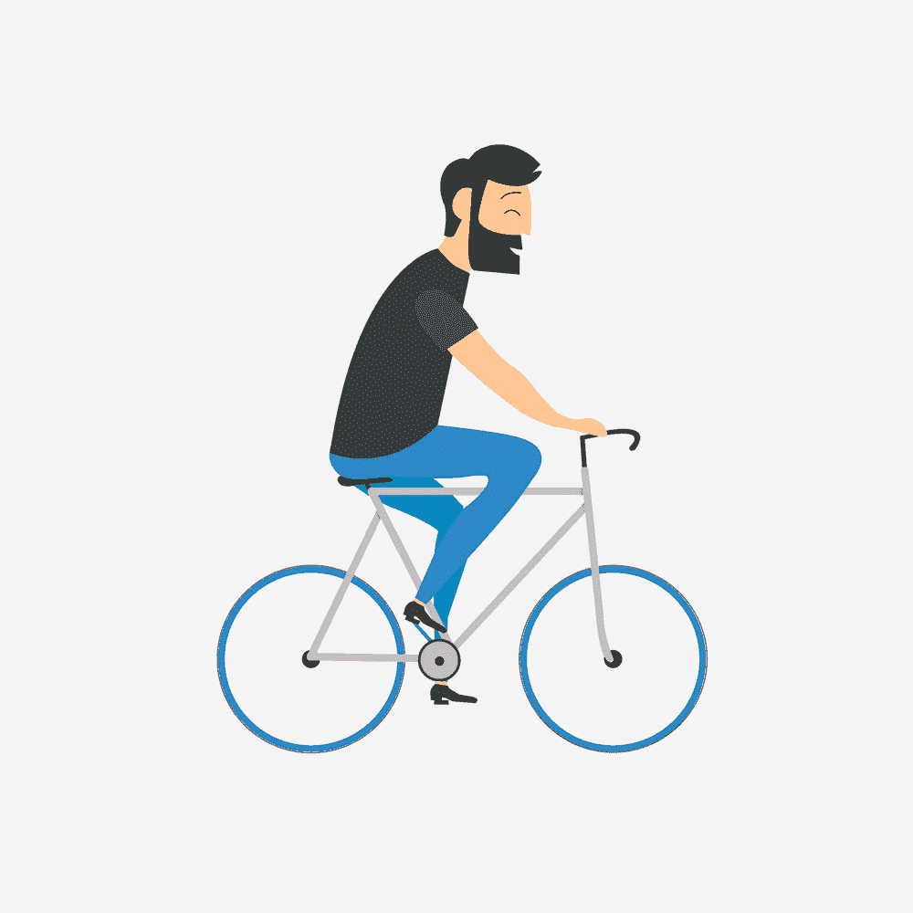
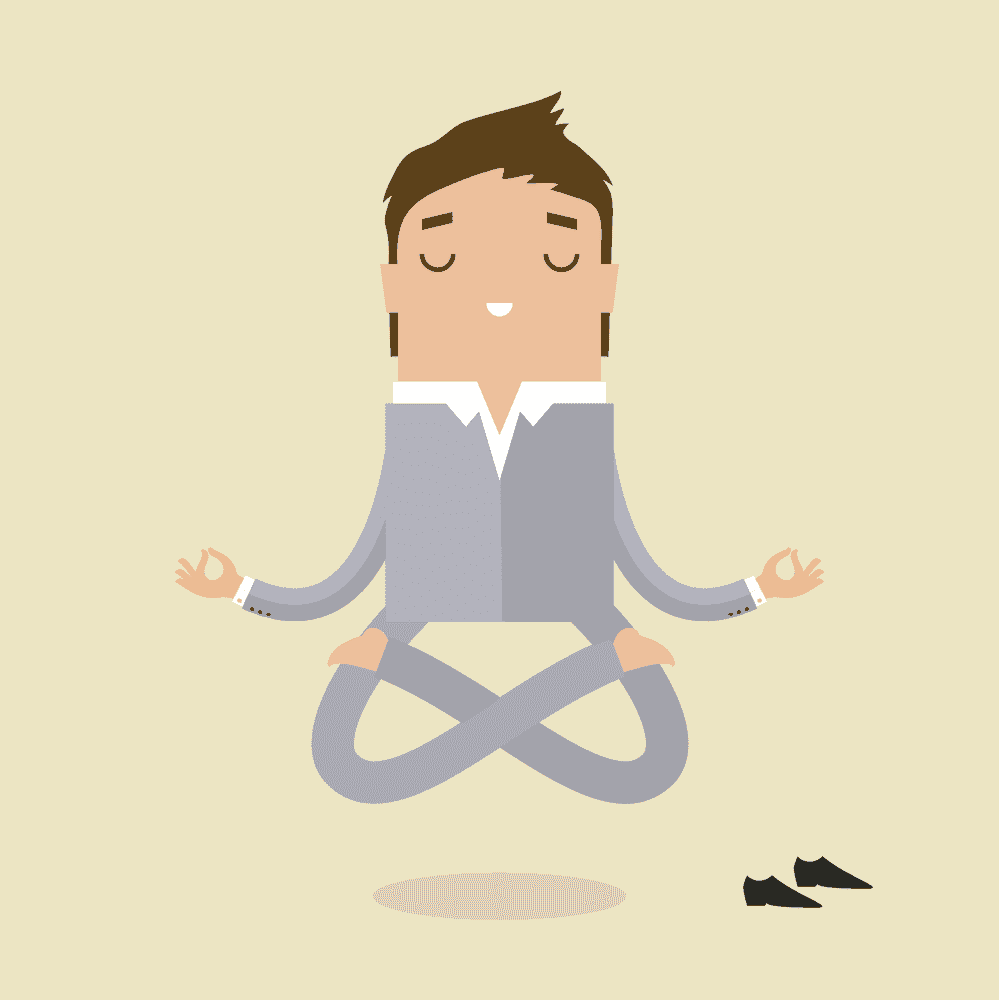

# 挑战时代的健康与幸福程序员指南

> 原文:[https://simple programmer . com/developers-wellness-challenge-times/](https://simpleprogrammer.com/developers-wellness-challenging-times/)

Staying physically and emotionally healthy during challenging times is never easy. And it's safe to say that the past few years have been nothing if not challenging. Between the pandemic, war, climate change, and an inflation rate that's managed to hit a 40-year high, there have been plenty of external stressors going around for everyone. And, if you're working as a programmer, chances are you've dealt with some stressful career challenges too—at least from time to time.

研究表明，不受控制的压力会导致各种健康问题，包括心脏病、肥胖症、糖尿病、抑郁症和加速衰老。所以，你的重点应该是保护你的身体和精神健康，尤其是在困难时期。

但是，即使你现在没有经历工作上的困难时期，保持健康也是必要的。研究表明，IT 专业人士在幸福感方面的得分往往低于平均水平。事实上，2015 年的一项调查显示:

*   56%有肌肉骨骼症状
*   22%被诊断患有高血压
*   10%患有糖尿病
*   36%的人胆固醇水平高
*   54%患有抑郁、焦虑、失眠；和
*   40%的人肥胖。

此外，如果你查看更多关于员工福祉的最新数据，你会发现 2021 年英国长期缺勤的[三大原因](https://www.cipd.co.uk/Images/health-wellbeing-work-report-2021_tcm18-93541.pdf)包括心理健康问题(影响 50%的受访者)、肌肉骨骼损伤(48%)和压力(48%)。过去 12 个月，小病和新冠肺炎也是员工缺勤的原因之一，但它们的影响大多是短期的。

好消息是人们(和雇主)开始意识到保持健康的重要性。健康市场正在快速增长(2020 年价值为 4.37 万亿美元，预计到 2025 年将增长 7 万亿美元)。此外，[超过 50%的人](https://www.pewresearch.org/politics/2022/02/16/publics-top-priority-for-2022-strengthening-the-nations-economy/)希望在 2022 年优先考虑健康相关问题。

但是，在充满挑战的时代，到底需要什么来保持(甚至改善)你的整体健康呢？

嗯，可以说最好的方法是逐步改变，解决你幸福的六个方面的每一个问题，这样你的身体和大脑就能准备好应对生活不断抛给你的压力。

这篇文章包括如何做到这一点的建议——以一种帮助你减轻压力后果的方式优化你的健康，无论你是否知道你在工作中面临着一个具有挑战性的时期，或者只是想为生活决定向你扔出一个曲线球做好准备。此外，它还提供了一些有用的建议，用于评估你的整体健康状况，处理大量压力(包括工作和家庭压力)，知道何时放松，以及在从事高风险工作时实现工作和生活的平衡。

## 身体健康

对你的整体健康做出积极改变的第一步是对你目前的健康状况有一个清晰的认识。

一般来说，建议是[每三年进行一次常规检查](https://www.healthline.com/health/how-often-should-you-get-routine-checkups-at-the-doctor#how-often)，50 岁以后将频率增加到每年一次。

每次你去做检查时，你的医生都会进行必要的测试，以确定你的整体健康状况。更重要的是，他们会就你身体健康的哪些方面需要改善向你提出建议(以及开出你可能需要的任何必要的治疗或药物)。

然而，如果你经常遇到高压力的情况，你的首要任务应该是保护你的健康。如果你并不总能获得高质量的医疗保健，或者只是想保持身体健康，你自己也可以做很多事情。

### 练习自我评估

改善你整体健康的最好方法是积极参与你的身体健康。

*   [使用免费的在线工具测量您的身体质量指数](https://www.cdc.gov/healthyweight/assessing/bmi/adult_bmi/english_bmi_calculator/bmi_calculator.html)。
*   设置您的可穿戴设备来跟踪您的心率，并在出现任何异常时提醒您。
*   跟踪您的血压(使用家用血压计或在当地药店购买)。

这些活动每天只会占用你几分钟的时间。然而，它们会让你对自己的健康状况有有价值的见解，让你更好地控制自己的身体健康。

### 跟踪健康问题

为了更好地了解你的整体身体健康状况，你可以做的第二件简单的事情是建立一个健康跟踪系统。这将为您提供一个关于您身体健康状况的深入数据库，更重要的是，将有助于引起对复发症状的注意，使您能够跟踪其根本原因并及时寻求必要的医疗护理。

观念有一些详细的[健康和健康导向的模板](https://www.notion.so/templates/categories/health-and-wellness)你可以用来跟踪你的幸福。然而，任何笔记应用程序(或手机上的通用健康应用程序)都可以很好地记录日常健康指标。

### 坦然承认你身体的局限性

最后，当你努力投入时间和精力来提高你的身体健康时，不要忘记考虑你只是一个人的事实。这意味着你的身体并不完美。

是的，我们大多数人都会处理一些急性或慢性健康问题(特别是当我们过了 30 岁的时候)。接受午餐后的第三杯咖啡、三个小时的训练课或额外的一杯葡萄酒对我们没有任何帮助的事实，对于确保我们的身体状况处于最佳状态至关重要。

## 健康

Physical activity is essential for health and well-being. Yet, have you noticed that the moment you start experiencing high amounts of stress, the first thing that seems to go is your fitness regime?

如果有，你放心，不只是你。事实上，一份关于 168 项研究结果的[文献综述](https://www.ncbi.nlm.nih.gov/pmc/articles/PMC3894304/)研究了压力对身体活动的影响，结论是“*心理压力预示着更少的 PA(行为抑制)和/或锻炼或更多的久坐行为。*

但是，即使把锻炼放在次要位置，让自己有时间来应对生活中的挑战，这看起来似乎是合乎逻辑的，科学表明，这与你应该做的事情恰恰相反。

体育活动是减压的好方法；研究表明，某些形式的锻炼实际上可能是正确管理压力的关键。

根据哈佛健康，**的说法，有氧运动减少肾上腺素和皮质醇**，**刺激内啡肽**的产生——这种荷尔蒙让你感到放松和乐观。

所以，如果你在家里或工作中遇到了难以应付的情况，为什么不穿上一双好的步行鞋，在午休或下班后去附近的公园散步 30 分钟呢？即使是短暂的散步也会激发你的创造力。

此外，2018 年的一项[研究发现，在大自然中散步是降低皮质醇水平的最有效方法之一，比仅仅锻炼或通过屏幕观看自然风景更有帮助。所以，如果你正在寻找减压的方法，也许你应该放下手机，选择去附近的公园。或者，更好的办法是，将在自然环境中散步纳入你的周计划，并将周末留作一次有趣的徒步探险。](https://journals.sagepub.com/doi/abs/10.1177/0013916518800798)

如果在你应对生活挑战时，散步、跑步或 HIIT 舞没有吸引力，你仍然可以在放慢节奏的同时享受体育锻炼的好处。

在高度紧张的情况下，一个快速减缓和缓解焦虑的方法是做几分钟的呼吸练习，你甚至可以在办公室做。如果你有苹果手表，一定要看看 2021 年软件更新中推出的股票正念应用程序。或者，如果你不使用可穿戴设备，你可以使用像 [Endel](https://endel.io/) 这样的应用程序，它使用神经科学数据来创建放松和提高注意力的声音场景。

最后，要明白体育活动不仅仅是预防身体健康问题或管理压力。这是**控制抑郁和焦虑的关键组成部分**，鉴于许多程序员受到心理健康问题的影响，这一点至关重要。因此，根据阿德莱德[大学](https://www.sciencedaily.com/releases/2018/03/180322112720.htm)的一项研究，知道停止锻炼会导致抑郁症状增加，尽最大努力不要忽视你的身体健康，即使情况变得艰难。

如果锻炼目前还不是你日常生活的一部分，试着把它融入你的日常生活，慢慢开始，增加你喜欢的活动。

## 营养

大多数人在有压力或不知所措的时候会有一些不健康的饮食行为。例如，美国心理协会发现，几乎 40%的成年人暴饮暴食或吃不健康的食物来应对压力，30%的人因为同样的原因不吃饭。

这本身就够令人担忧的了。

现在，考虑一下以垃圾食品为生的程序员的刻板印象。它可能不总是正确的，但它至少部分植根于现实生活的经验。因此，显而易见，开发人员需要特别关注他们的营养。考虑到他们的职业强烈鼓励久坐的生活方式，更是如此。

记住，不健康的饮食习惯不仅仅是一种症状。它们也可能是一些身体和精神健康问题的潜在原因。

例如，我们知道高糖和高脂肪摄入会给我们的身体健康带来一系列严重后果。2016 年的一篇[研究文章](https://journals.sagepub.com/doi/full/10.1177/2167702616641050)发现，以西方饮食为主可能会导致更高的抑郁、焦虑和压力反应风险。

因此，当你探索如何在充满挑战的时期照顾好自己的健康和幸福时，不要忘记关注你的营养。

*   从确定你需要吃多少开始。一个在线的[宏观计算器](https://www.transparentlabs.com/pages/macro-calculator)可以给你一个好主意，在一顿健康均衡的膳食中寻找什么营养，而不限制你自己特定的饮食。
*   **用 [Lifesum](https://lifesum.com/) 或 [MyFitnessPal](https://www.myfitnesspal.com/) 等应用程序追踪你的卡路里摄入量**。这将让你对你正在吃的食物类型有一个很好的了解，阻止你吃得太多或太少，并鼓励你采取更积极的方法坚持更健康的饮食。
*   优先考虑对抗压力负面后果的食物。这些食物包括富含 Omega 3 脂肪酸的食物(坚果、鳄梨和鱼油)，富含维生素和矿物质的蔬菜(如绿叶蔬菜)，以及[高纤维食物](https://www.stress.org/stressed-out-eating-more-fiber-can-help)。关于这方面的更多信息，我们强烈推荐你阅读邦妮·j·卡普兰和茱莉亚·拉克里奇的《更好的大脑:克服焦虑，对抗抑郁，用营养减少多动症和压力》 。
*   限制咖啡因和糖等兴奋剂的摄入，因为这些会抑制身体放松的能力。此外，当过量摄入时，它们会让你感到不知所措，即使你只是在应对少量的压力。

## 出现

Most people don't view their physical appearance as an indicator of their overall well-being.

但是，如果你想全面改善你的身体和情绪健康，以及你处理高压力情况的能力，你应该考虑所有你可以投资自己的方式。即使只包括一些“肤浅”的东西，比如你的穿着、发型或者日常护肤。

现在，压力情境直接影响我们的外表这一事实并不是一个新概念。例如，我们知道长期的[压力暴露会使痤疮恶化](https://www.healthline.com/health/stress-acne)并加速[皮肤衰老的过程](https://www.ncbi.nlm.nih.gov/pmc/articles/PMC4082169/)。同样，2020 年的一项[研究发现，急性压力会导致黑色素细胞干细胞的耗竭，从而导致白发。一项研究甚至发现压力和抑郁会影响人们对衣服的选择。](https://pubmed.ncbi.nlm.nih.gov/31969699/)

但是，在充满挑战的时期，投资于你的外表和保持你的健康有什么关系呢？

2019 年的一项[研究发现，人们如何看待自己，即他们对外表的判断水平，直接影响他们的皮质醇反应、自我评估的压力水平和抑郁症状。换句话说，我们的皮肤感觉越差，我们处理压力的机会就越小。](https://www.ncbi.nlm.nih.gov/pmc/articles/PMC6711807/)

所以，如果你想确保你正在尽你所能让你的身心做好应对压力的准备，那就投资你的外表吧。试用你喜欢的护肤品，预约沙龙，或者每隔一段时间预约一次水疗日。只要它让你对自己的外表感觉更好，它肯定有助于你应对生活中的挑战。

## 睡眠

经历艰难时期会对睡眠质量产生破坏性影响，这并不是什么新闻。感觉有压力会让你更难入睡。另外，它会让你在夜里醒来。当然，睡了一夜不好觉后感到昏昏沉沉似乎没什么大不了的。但是因为长期的[睡眠不足会削弱新陈代谢](https://www.ncbi.nlm.nih.gov/pmc/articles/PMC2929498/)并扰乱内分泌功能，所以可以有把握地说，在充满挑战的时期，确保充足的休息是保持健康的一个极其重要的方面。

不幸的是，大多数 IT 专业人士并不擅长对睡眠进行优先排序。

根据 Core 在 2020 年发布的数据， [74%的 IT 专业人士](https://www.core.co.uk/core-research-report-2020)每晚睡眠不足八小时。根据美国心理学会的报告，每晚睡眠少于八小时的成年人[比那些注重健康睡眠卫生的人报告的压力水平](https://www.apa.org/news/press/releases/stress/2013/sleep)更高。仅从这一点来看，显而易见，优先休息可能是一种有效的策略，有助于你在高压力的生活事件中保持健康。

但是在应对工作压力时，怎样才能控制你的睡眠模式呢？嗯，有几个简单的策略可以确保你每晚都能得到高质量的休息。

电脑和智能手机屏幕发出的蓝光直接影响你的昼夜节律，延缓你身体自然产生褪黑激素。但是，像**限制你下午和晚上的屏幕时间**这样简单的事情可以让你有机会放松下来，更容易入睡。

如果由于临近的截止日期或紧急情况你不得不工作到很晚，调暗你的屏幕。再者，把色温设置得更暖一点，甚至戴一副[蓝光阻隔眼镜](https://www.gearpatrol.com/style/g39136238/blue-light-blocking-glasses/)，把睡前工作的后果降到最低。

你可以做的另一件提高睡眠质量的大事是**确保你的卧室是睡眠专用区**。我们中的许多人都对[把笔记本电脑带进卧室](https://buffer.com/resources/work-bed/)感到内疚——尤其是在家工作的时候。这种界限的缺失使得我们的大脑更难将休息时间与卧室联系起来，这往往足以导致晚上难以入睡。

你也可以尝试优化你的物理空间，以获得最佳的睡眠效果。尽量睡在舒适的床上，防止身体疼痛。把你的恒温器调到 60 到 67 度之间。在你的卧室里增加一些植物来确保更好的空气质量。并且投资一些遮光窗帘来限制夜间的光线和[噪音污染](https://www.ncbi.nlm.nih.gov/pmc/articles/PMC4608916/)。

## 留意

最后，当你试图在生活中的压力时期保持健康时，不要忘记健康不仅仅与你的身体状态有关。不仅如此，幸福还应该包括情绪弹性，这对于让你接受职业和个人挑战并度过难关而不变得不知所措或精疲力竭至关重要。

所以，无论你是在应对困难时期，还是想为未来的考验做准备，都要投入时间和精力来建立精神力量，发展应对压力情况的健康应对机制。

投资于你的精神健康的最简单的方法之一就是为你的爱好留出时间。最近的一项科学研究调查了长时间工作和精神健康之间的[联系。研究结果令人着迷的是，爱好有助于员工减轻压力大的工作环境的影响。](https://www.mdpi.com/1660-4601/16/24/4980)

所以，很明显，花时间做你喜欢做的事情，比如做拼图游戏，T2 在玩滑板的时候练习正念，或者 T4 玩电子游戏，这些都是保护你情绪健康的绝佳策略。然而，考虑到作为一名开发人员，您可能会将大部分工作时间花在坐在屏幕前，请尝试选择一些爱好，鼓励您将更多的运动融入到您的日常生活中，或者在自然环境中花费一些额外的时间。

在充满挑战的时期投资你的幸福的另一个好方法是**寻找更多的机会与朋友和家人共度时光**。根据[今日心理](https://www.psychologytoday.com/us/blog/living-mild-cognitive-impairment/201606/the-health-benefits-socializing)，积极的社交生活的好处包括长寿，更强的免疫系统，更低的抑郁水平，以及改善的记忆和认知能力。

当处理高压力的情况时，我们最常见的反应是坚持到底。尽管有时忍受一些压力是必要的，但一直忍受压力会损害我们的整体健康。这就是为什么知道什么时候适可而止是如此重要。

For one, do your best to limit how many hours you work. Block out hours in the afternoon to practice your hobbies. Enforce a hard-stop time at the office. And try to commit to viewing your free time as non-negotiable—without sacrificing your commitment to work, of course. Or, if you’re looking for a more advanced approach to work-life balance, take inspiration from Tim Ferriss' *[The 4-Hour Workweek](https://www.amazon.com/dp/0091929113/makithecompsi-20). *

第二，定期离开工作，理想的情况是，试着改变你的物理环境。一个计划周密的假期是减压、变得精力充沛、提升快乐水平的好方法。然而，为了获得离开工作的好处，通过[学习寻找经济实惠的航班](https://scottscheapflights.com/guides/how-to-find-cheap-flights)，住在高等级的酒店，提前计划你的旅行，尽最大努力避免旅行压力。

最后，当你探索有助于提升情绪健康的策略时，不要忘记，你感受到的很多压力来自于你自己的期望。所以，评估一下你是否能对自己更加宽容。

尽你所能优先考虑生活中真正重要的事情。考虑一下，在大多数日子里，给自己慢慢来的自由，是否会给你在必要的时候努力工作所需的能量。

## 把你的健康和幸福掌握在自己手中

在一天结束时，照顾你的身体和情绪健康是一种责任。但是，这也是一项值得做的投资。

快乐和健康不仅会让你感觉良好，还会确保你在工作中高效和满足。此外，它将使你能够处理任何挑战，而不会变得太多太快。