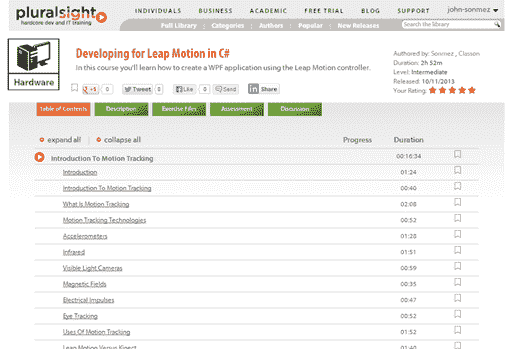

# 用 C#开发 Leap Motion

> 原文：<https://simpleprogrammer.com/developing-leap-motion-c/>

我知道我刚刚发布了关于我最后一门多视课程的消息。但是，我还有另外一个作品，是我和我的[起床编码](http://getupandcode.com)主持人和瑞典编码人[艾里斯·克森](http://irisclasson.com/)共同完成的。

[在 C#中开发跳跃动作](https://simpleprogrammer.com/developing-leap-motion-csharp)

这门课程非常有趣。Iris 和我实际上是通过 Skype 使用 Join.me 进行配对编程，在课程的一部分中分享我们的屏幕。

我真的认为像 Leap Motion 这样的设备有很大的潜力，这是一项非常酷的技术。两者都不难编程。

以下是官方描述:

在本课程中，您将学习如何使用 Leap Motion 控制器创建完整的 WPF 应用程序。Leap Motion 是一种新型的用户界面设备，可以非常精确地跟踪近距离运动。Leap Motion 为创建完全不同类型的应用程序开辟了可能性，这些应用程序可以通过手指、手势甚至铅笔等工具来控制。

本课程将教你开始用 C#开发 Leap Motion 应用程序所需的一切知识。首先，您将大致了解一下运动跟踪以及 Leap Motion 的工作原理。

我们将讨论 Leap Motion 设备与许多其他运动跟踪技术的独特之处。

然后，我们将介绍 Leap Motion 本身的基础知识，您将了解如何开始并设置开发 Leap Motion 应用程序的开发环境。

之后，我们将带您完成创建一个真正的 WPF 应用程序的过程，该应用程序使用 Leap Motion 控制器来跟踪运动。

您将了解如何使用 Leap Motion SDK 创建代码来跟踪单个手指的移动和手势，以及如何将这些移动映射到屏幕坐标来控制屏幕上的对象。

最后，我们将向您展示如何将您的 Leap Motion 应用程序部署到 Leap Motion Airspace 商店，并带您了解将您的 Leap Motion 应用程序推向大众的过程。

本课程结束时，您将构建出一个完整的应用程序，可以使用 Leap Motion 控制器进行控制。