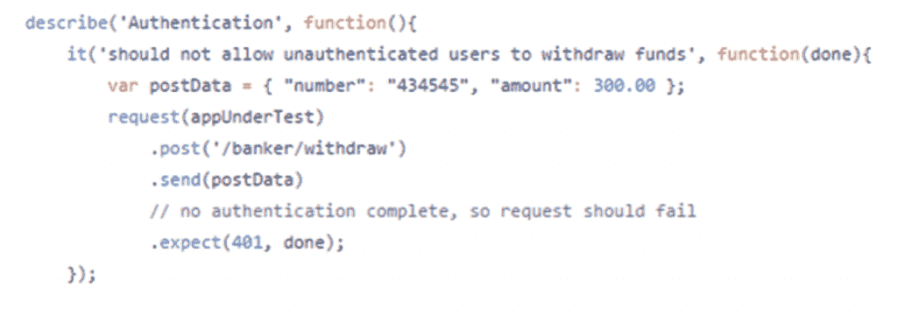
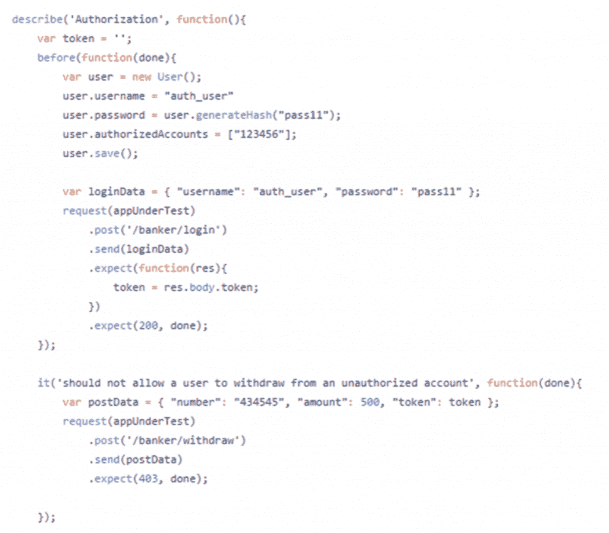

# 开发运维与应用安全兼容吗？

> 原文：<https://simpleprogrammer.com/devops-application-security/>

DevOps 是年度词汇。随着 DevOps 热潮的兴起，软件行业火了起来，越来越多的公司在寻找 DevOps 技能。

DevOps 实践是快速交付价值、有效扩展和实现重要信息快速反馈周期的关键。它们允许公司成功所需的软件开发的真正灵活性。

良好的应用程序安全实践有助于防止软件被恶意滥用。它旨在防止数据丢失和软件被利用。不幸的是，安全性通常被视为快速和敏捷的对立面。

当你看到“应用安全”这几个字的时候，你想到了什么？是速度和敏捷吗？你认为反馈周期快吗？

或者，像大多数开发人员一样，您认为缓慢、繁重的过程会导致开发工作停止吗？

我质疑应用程序安全性与开发运维不兼容的假设。事实上，安全性和 DevOps 的结合实际上可能会使您的软件变得比使用传统方法更安全。

让我们通过定义其核心原则来看看 DevOps 的真正含义，然后展示安全实践如何与之相适应。

## 三种方式

真正的 DevOps 有三个核心原则，被称为“三种方法”为了通过使用 DevOps 实现业务目标，公司必须在应用这三种方法时建立专业知识和成熟度。

如果你想深入讨论这三种方式，拿起一本优秀的书[《devo PS 手册](http://www.amazon.com/exec/obidos/ASIN/1942788002/makithecompsi-20)。这很值得一读。

让我们仔细看看这三种方式的每一种都需要什么，以及成功的公司如何应用这些原则。

### 第一种方式——流动

把你组织中的软件开发想象成一条河流。一项功能必须能够安全地从源头(开发)流向海洋(生产)。你的河流有多平滑？

岩石和其他障碍物使得顺流而下的旅程很难安全。太多的岩石导致急流形成，使顺流而下变得危险。顺流而下的船极有可能失事。

你的发展过程是不是充满了岩石和障碍？为你的代码创建一个测试环境需要几周或者一个月的时间吗？在投入生产之前，您是否有很长的手动测试周期？

你河中的障碍物越多，你就越有可能撞车。第一种方式解释了你必须找到方法来增加从开发到生产的工作流程。

换句话说，您必须消除障碍，以便代码能够尽快从开发人员的头脑中进入生产(从而交付价值)。要做到这一点，你必须清除河里的石头。

有哪些增加你的“河”流量的常用方法？

**基础设施即代码**–通过将基础设施转化为代码，自动创建您的环境。使用 [Chef](https://www.chef.io/chef/) 、 [Ansible](https://www.ansible.com/) 或 [Docker](https://www.docker.com/) 之类的工具来创建环境“食谱”并将它们存储在源代码控制中。赋予自己按需创建相同环境的能力。您还应该能够在需要时销毁和重新创建环境。

**创建部署管道**–在环境易于启动的情况下，创建部署管道以实现持续集成和持续部署。像 [Bamboo](https://www.atlassian.com/software/bamboo) 和 [Jenkins](https://jenkins.io/) 这样的工具可以用来在每次代码提交后不断地将代码部署到类似生产的环境中。

**支持快速自动化测试**–如果没有在每个构建和部署中运行的自动化测试，开发运维是不可能的。如果有任何测试失败，您的构建应该会中断。您的测试将为您的代码在类似生产的环境中工作提供一定程度的信心。如果管道破裂，立即修理。

**小批量开发**——代码不应该在很长的时间内进行开发，将多项功能合并到主干中。小批量开发，可以提交到主干，并以低风险快速通过部署管道运行。需要几周、几个月或更长时间开发的大批量工作在部署到生产时更有可能出现问题。零钱=小风险。

**轻松部署到生产环境中**–您希望能够轻松部署到生产环境中。对于以传统方式做事的公司来说，这种部署方式是一个可怕的命题。然而，如果您选择实现小批量开发，如上所述，每个单独的生产部署可能相对简单且风险较低。

这些实践将使您能够减少开发和交付特性所花费的时间。您将增加河流的流量，降低风险，并更快地为您的业务带来价值。

### 第二种方式——反馈

DevOps 走向成熟的下一步是实现对开发团队的快速反馈。为什么这很重要？

考虑当今软件开发中的一个典型场景。开发人员在一个项目上工作，一些决策者希望这个项目是目前工作的正确项目。在构建这个产品或特性一年之后，它被发布给最终用户。

如果最终用户不喜欢这个产品会怎么样？如果您构建的特性大部分没有被使用，会发生什么？作为一名开发人员，你对此有何感想？这让企业浪费了多少精力？

如果仅仅过了几周或一个月，你就发现你正在开发的代码或特性没有用了，那该怎么办？然后，决策者可以转向并尝试更明智地利用资源的其他方式。这种灵活性正是快速反馈所带来的。

存在哪些 DevOps 机制来实现这种快速反馈？

当编写代码时，确保**代码评审**正在进行，这样开发人员可以快速获得他们编写的代码的反馈。

在特性方面，使用 [A/B 测试](https://vwo.com/ab-testing/)来尽早确定新特性是否会被您的客户实际使用。

在生产中设置 [**遥测**](https://docs.microsoft.com/en-us/azure/application-insights/app-insights-asp-net) ，这样你就有了可以用来做出反应和决策的实时数据。

成熟的 DevOps 公司使用与**业务目标**相关的遥测技术来提供快速反馈，说明您的代码更改是否“改变了”业务成果，这最终是软件应该做的。

### 第三条路——不断学习和实验

最后一种方式是学习。组织应该努力将学习融入到日常工作中，以改善服务和提高弹性。

这种学习方式的一个很好的例子是网飞。你可能听说过[混沌猴](https://github.com/Netflix/chaosmonkey)，这个程序在生产中随机关闭服务器实例。

混沌猴揭示了当服务没有响应或不同部分丢失时出现的奇怪和意想不到的行为。

网飞利用从混沌猴子测试中吸取的经验教训，告知其开发团队如何使这些服务更具弹性和稳定性。这种学习是开发人员日常工作的一部分。

公司需要建立一种接受实验、新想法和失败的文化。这不是打印错误。一家拥有学习和实验文化的公司知道，失败是找出有效方法的自然组成部分。

你不会看到苹果公司在获奖设计产生之前所有失败的 iPhone 设计。没关系。我们今天所看到的是尝试不同的事情并发现哪些不奏效的最终结果。

同样，公司和开发者不应该害怕尝试。找到真正成功的用户值得做一些失败的实验。

当一项实验确实奏效时，确保员工有办法**与公司分享他们的发现**,这样每个人都能受益，从而创造持续学习和改进的文化。

## 安全性如何融入

了解了成为一家成功的 DevOps 公司的基本要素后，是时候了解安全性在其中的作用了。

的确，以传统方式进行的安全审查和渗透测试会减慢开发速度，或者提供安全反馈太迟而无法采取行动。前进的方向是改变我们实现应用安全的方式，以符合 DevOps 原则。

让我们来看看良好的安全实践如何遵循这三种方法的公式，并使您的软件比以前更加安全。

### 建立安全流程

流程就是减少交付产品或功能到生产的时间。

安全流就是在安全漏洞进入生产环境之前，减少发现和修复安全漏洞所需的时间。**流量不是忽视应用安全的借口**。相反，你需要把它融入你的心流。

首先，可以通过将基础设施转换成代码来增强安全性。如果你的基础设施是代码，那么它很容易被检查。可以捕获并重复执行正确且安全的配置。

这种安全性消除了配置服务器的人忘记打开漏洞的关键步骤的风险。每个新实例都会执行所有必要的配置，不会遗漏任何步骤。

安全性需要从一开始就内置到软件中。设计提供关键安全控制的可重用组件，如身份验证、授权和会话管理。在实际的编码组件不可用的地方，提供关于如何以安全的方式构建软件的清晰的指导方针和需求。

**构建管道**是将安全性整合到 DevOps 环境中的一大块。构建管道执行自动化测试，以确保功能按预期运行。

在构建过程中，功能不是唯一需要测试的部分。在每个提交-构建-部署过程中，还需要执行自动化安全测试。

我最近的一篇关于[保护 Node.js REST API](https://greenmachinesec.wordpress.com/2017/06/07/secure-your-api-in-node-js/) 的文章介绍了一个小型银行 API 的安全测试。Github 回购可以在[这里](https://github.com/jboyer2012/node-authZN)找到，以便进一步审查。现在，让我们看一个安全性测试的例子。

这个测试是一系列身份验证测试案例中的第一个，测试的目的是确保如果请求没有通过身份验证(在本例中是使用 JSON web 令牌)，API 会返回正确的响应。当用户未通过身份验证时，将返回“401 未授权”响应。

同样重要的是授权测试用例。

该测试使用合法的用户帐户登录，并通过请求传递令牌。但是，用户无权使用该帐户，因此会收到“403 禁止”响应。

这个例子说明了安全测试用例可以很容易地包含在您的自动化集成测试中，并在部署管道的每次执行中运行。当这些测试通过时，您就知道安全性是从一开始就内置的。

自动化测试可用于测试多种漏洞，包括 CSRF 验证、身份验证、授权和点击劫持(通过检查有效内容安全策略的标题)。尽可能地创新和自动化。

小批量开发也是一个很好的安全工具。小的变化很容易理解，因此很容易**代码审查**可能的安全漏洞。

在代码审查期间，使用列表，如 [OWASP Top 10](https://www.owasp.org/index.php/Category:OWASP_Top_Ten_Project) 和 [SANS Top 25](https://www.sans.org/top25-software-errors/) ，以确保涵盖最高风险的漏洞。

增强的管道流程还意味着任何发现的漏洞都可以快速修复，并且修复可以在最短的交付时间内投入生产。

这些实践将流程合并到您的安全开发生命周期中。与其停止所有开发来检查整个应用程序的安全漏洞，不如从一开始就构建安全控件，并在整个项目中不断测试它们。

### 建立对您的安全状况的反馈

DevOps 的下一个关键是定期和快速的反馈。这能应用于安全吗？当然可以。目标是为开发团队提供关于需要解决的安全问题的快速反馈。

传统的(缓慢的)应用程序安全审查可能会泄露重要信息。然而，这些信息通常在开发周期中来得太晚了。修复这些问题需要重新设计功能，因此这些修复会被取消，以满足交付期限。结果是，通过传统方法发现的漏洞有时会在被修复之前停留相当长的时间。

因为 DevOps 的目标是快速反馈，所以安全性应该从一开始就包含在内，并持续贯穿整个项目。

我们上面讨论的自动化安全测试用例提供了我们需要的流程，也是一个很好的反馈来源。测试让您知道每次提交时，您的更改是否引入了漏洞。这是相当快的反馈。

还有其他工具可以帮助开发团队获得所需的快速反馈。这些工具是自动化的，为您的应用安全策略带来了另一个有价值的层面。

**静态应用程序安全测试(SAST)** 是一个自动工具，它扫描您的源代码或二进制文件，寻找显示可能的安全漏洞的模式。这些工具通常可以整合到部署管道中，这样它们就可以在每次构建时执行。

推荐您进行代码审查和静态代码分析可能看起来很奇怪。如果你让 SAST 为你做，让人类审查代码不是浪费时间吗？

实际上，它不是。SAST 工具的现实是它们并不完美。不同的 SAST 工具可能会给你不同的结果。他们也可能给出假阳性。最终，你无法摆脱人类的判断。

SAST 仍然是应用程序安全分层方法的重要组成部分，可以提供有价值的反馈。只要确保你睁大眼睛，并了解 SAST 工具可能是昂贵的，并引入一些开销的过程。

**动态应用程序安全测试(DAST)** 还会扫描您的应用程序是否存在漏洞。不同之处在于，它在测试环境中运行时扫描应用程序。

DAST 试图利用运行的应用程序中的常见漏洞，如果它发现什么可能是有效的利用，它会让你知道。

这个测试打开了一些反馈的好来源。例如，一个有趣的实验可能是当 DAST 系统发现一个漏洞时，在你的错误跟踪或项目管理软件中自动创建一个标签。然后，它可以被优先化，并与其余的工作一起被修复。

我倾向于认为 DAST 通常比 SAST 更有效。原因在于，在类似生产的环境中对运行中的系统进行真正的攻击，通常可以发现人类代码审查和 SAST 扫描可能会遗漏的漏洞。

您可以在您的测试环境中使用 DAST 作为永久的渗透测试器，定期检查您的应用程序，并让您知道是否有任何漏洞出现。确实非常有用。

### 适应安全方面的发展

安全世界总是在变化。新的漏洞和利用总是不断被发现。然而，这个事实并不需要用恐惧来麻痹你。

您可以使用这些发展来帮助推动安全性方面的持续学习。学习的故事有两个方面，一个是人，一个是技术。

人的一面是简单地跟上新的进展以及当前发现的威胁。开发人员应该尽最大努力了解针对他们正在使用的技术的威胁。

至于技术，所获得的信息可以被输入到一个**实时应用程序自我保护(RASP)** 工具中，以便根据该信息采取行动。RASP 允许应用程序检测正在进行的攻击，并采取措施阻止它。

例如，假设您的网站使用的 PHP 版本发现了一个新的漏洞。可以将签名输入到 RASP 系统中，这样，如果系统发现攻击者试图利用该漏洞，它就可以阻止其成功。它还可以发出警报，以便采取纠正措施。

粗锉工具也可以自己学习。虽然许多是基于特征的(已知的攻击特征用于检测攻击)，但是一些已经开发或正在开发在操作中学习的能力。

例如，一个 RASP 可以随着时间的推移监视和学习应用程序中的“正常”流量和函数调用。如果它发现行为之外的活动，就会发出警报。

基线的另一种方法是遍历所有代码路径，以了解应用程序的各种功能。一旦 RASP 工具理解了应用程序应该如何运行，它就可以阻止旨在改变该行为的执行。

锉刀不是银弹。不要忽视良好的安全实践，然后期望一个 RASP 系统来保证你百分之百的安全。

这个想法是创建一个“虚拟补丁”,它可以保护你的安全，直到你可以正确地修复粗锉所防御的安全漏洞。

RASP 系统的一个很好的例子是 OWASP 的 AppSensor 项目。OWASP 创建的指南将允许您在任何您希望的技术中实现它。它允许开发者选择在代码中的什么地方使用 RASP 技术。一个好的选择是在登录功能或其他功能经常受到攻击的时候。

## 通往 DevSecOps 的道路

当今世界，仅靠 DevOps 是不够的。安全性必须成为等式的一部分，并融入 DevOps 实践中。否则，你唯一能做的就是更快地将一个易受攻击的软件投入生产。

如果您目前没有将这些实践应用到您的开发生命周期中，不要试图一次做所有的事情。压倒你的开发者只会鼓励你在事情开始不顺利的情况下放弃。

最好有一个清晰的计划，以一个 DevSecOps 环境结束。这样的计划可能看起来像这样:

*   **实施自动化测试**–自动化安全测试将让您的投资快速见效。实施测试以确保涵盖基础知识(XSS、CSRF、身份验证、授权等)。).
*   **安全代码审查**–开始对应用程序中可能影响应用程序安全性的关键部分进行安全代码审查(数据库连接、登录和会话管理等)。).
*   **在您的基础设施代码中自动进行安全配置**–更新您的基础设施代码，以填补您的环境配置中的漏洞。
*   **调查 SAST 和 DAST 工具的使用**–一旦你建立了一些应用程序安全敏锐度，调查各种自动化工具，以帮助以更自动化的方式找到东西。如果预算有限，DAST 可能是最物有所值的地方。
*   **使用 RASP 工具保护您的生产资产**–这一步是针对更高级和更成熟的应用安全程序。然而，如果做得好，RASP 可以很好地帮助快速“修补”主要漏洞，直到可以将永久性代码更改部署到生产中。

将安全性与 DevOps 思维结合起来将会带来更安全的应用程序。以前，简单地关注功能并交付一个产品到生产环境，而对它的安全性知之甚少或一无所知是太容易了。

这里讨论的工具和技术将允许我们知道我们的应用程序是尽可能安全的，并且这样做不会干扰软件的正常和有效的交付。

实践 DevSecOps 并帮助保护未来的软件！