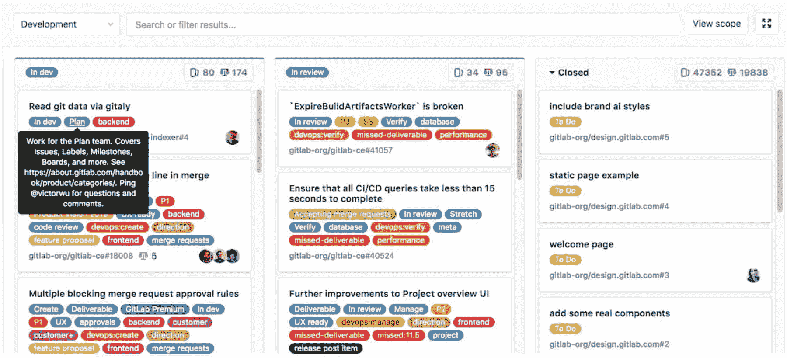

# devo PS——从天启中拯救你的代码

> 原文：<https://simpleprogrammer.com/devops-code-apocalypse/>

一个以前的计算机科学同学，现在是一名教授，请我做一个关于 DevOps 的演讲。对于现在的学生来说，听到业内人士的一些见解似乎总是很有趣。

所以，我准备了一个演讲，并想，为什么不把它写成一篇博文呢？这是结果。

如果你喜欢看我给这篇文章灵感的演讲，你可以在这里查看:

<figure class="wp-block-embed-youtube wp-block-embed is-type-video is-provider-youtube wp-embed-aspect-16-9 wp-has-aspect-ratio">

[https://www.youtube.com/embed/9FaBQg2fi4c?feature=oembed&enablejsapi=1&origin=https://simpleprogrammer.com](https://www.youtube.com/embed/9FaBQg2fi4c?feature=oembed&enablejsapi=1&origin=https://simpleprogrammer.com)

</figure>

您将了解 DevOps 的实际含义，以及如何在日常工作中实施它。这样做将使你的代码免于灾难，这意味着不使用这些会导致你丢失代码，工作压力大，在最坏的情况下，甚至丢掉工作。我们走吧。

## DevOps 是什么？

DevOps 没有完美的定义，但是下面的引用非常适合。DevOps 是:

一套结合了软件开发(Dev)和信息技术运营(Ops)的实践，旨在**减少**提交**系统变更和**将变更**投入正常生产之间的时间**，同时**确保**高质量。

因此，我们一方面开发软件，另一方面操作或运行软件。重要的因素是许多这些**实践可以自动化**，因此**缩短了软件开发生命周期**。

## 情绪还是动机？

在我们进入 DevOps 实践的细节以及它们将如何使你受益之前，让我们谈谈 DevOps 可能会给你带来什么样的感受——以及它将如何激励你。

如果你根本没有实施这些实践，你可能会陷入困境。DevOps 附带了很多工具，在构建应用程序时会给你很大帮助。但是如果你没有使用这些工具和实践中的任何一个，那么——相信我，我也经历过——你可能会变成这样:

<figure class="wp-block-image">

<figcaption>*Image:The Len/shutterstock . com*</figcaption>

</figure>

完全没有 DevOps。这不好笑吗？

但是当你开始使用工具和概念时，开发人员的生活会变得更容易！

<figure class="wp-block-image">

<figcaption>*图片:garets workshop/shutterstock . com*</figcaption>

</figure>

你看，你可能会更放松。从事一个项目很有趣。也许你也可以喝杯咖啡放松一下。

这是**最现实的场景**，或者至少是最现实的目标。

当然还有一个梦想，DevOps 为我们做一切。一切都是自动化的，你不再需要做太多事情，你可以在沙滩上放松。

<figure class="wp-block-image">

T4】</figure>

但这是乌托邦。我们还没有到那一步。我们的目标——你们的目标——应该是第二张照片。

## 债务理论

每个软件开发生命周期的理论都是这样的:你想把咖啡变成利润。

<figure class="wp-block-image">

T4】</figure>

有趣的部分是介于两者之间的区域。你是如何从咖啡盈利的？

目前，这是魔术。

<figure class="wp-block-image">

T4】</figure>

但是你猜怎么着:这是一种你可以真正学会的魔法——而且你甚至不需要魔杖。继续阅读，在这篇文章结束时，你会知道这种魔力是如何发挥作用的。

## DevOps Magic 及其优势

好吧，这是什么德沃普斯魔法？

<figure class="wp-block-image">

<figcaption>*[来源](https://marketplace.atlassian.com/categories/devops)*</figcaption>

</figure>

正如你在这里看到的，开发软件的过程并不是一条从 A 点到 z 点的直线，而是一个由六个阶段组成的**循环过程。**

我们从左上角开始，**计划**。您得到您的任务和特性请求，并且您可能对您的项目有一个想法。那你就应该开始规划这个项目了。再说一遍，这不是从头到尾的全程规划；在开发过程中，您迭代了几个步骤。这方面有很好的工具和概念。

接下来是**构建**阶段。现在我们讨论编码。您启动您的集成开发环境(IDE ),并实现您在前一阶段计划的特性。在这一步中，有一些工具可以确保你的代码是安全的，如果有什么严重的错误，你可以返回。

持续集成是自动部署代码的好方法。持续集成和部署在某种程度上是并行的。我们稍后将讨论细节。请记住，这是部署整个团队代码的好方法。

除此之外，还有一些很棒的平台可以**部署**你的代码。如果您想要制作一个 web 应用程序并使用运行此应用程序的服务，请在部署部分注意。

现在，当您的应用程序正在运行时，您可能希望对其进行监控。服务器一直在运行吗？是否出现任何错误？这是**操作**阶段。您可以使用可用的工具来完成这项工作，或者自己简单地实现一个小的解决方案。

最后，你需要**反馈**。你的应用程序正在做它应该做的事情吗？用起来好玩吗？当然，所有这些也可以用 bug 追踪器之类的工具来完成，然后你可以利用反馈回到计划步骤。

所有这些步骤都围绕着**沟通**。到目前为止最重要的部分。你必须和你的团队沟通。最棒的是你不必离开你的家去做那件事。

在上图中，你可以看到在你的软件开发生命周期中有很多工具可以使用。别担心，没有必要了解每一个人。不过，我会给出一些提示，告诉你哪种工具可能是个好选择。

你可能听说过 git 和 GitHub、Google Drive、Slack 等等。你有很多选择。

在我们进入细节之前，还有一件事。你为什么要烦恼呢？为什么要使用更多的工具？有什么好处？

## 利益

好吧，从你的代码开始。使用某些工具，与团队合作会容易得多。你团队的 **[代码质量](https://simpleprogrammer.com/quality-code/)会提高**。

你将需要**更少的时间来开发**。尤其是部署，可能是一件痛苦的事情。你更有条理，这样你就知道下一步该做什么，然后简单地去做，而不是去想如何达到一个特定的目标。

当您使用特定的实践和工具时，您会发现一些以前根本不会发现的错误。而且发现 bug 对盈利总是有好处的！

好了，记住这些，让我们仔细看看每个阶段的细节，从而将你的代码从灾难中拯救出来。

## 沟通

在你做项目的时候，你必须一直做的一件事就是沟通。

无论是计划、修复错误还是监控应用程序，你都应该和你的团队讨论所有这些方面——有时也和你的客户讨论。有时甚至是对你自己…

因为不可能一直坐在同一个办公室里，所以最好还是有一个工具，让你至少在大部分时间都有空，或者可以查看是否发生了什么有趣的事情。

当然还有邮件，但肯定有更好的解决办法。

这就是[松弛](https://slack.com/)出现的原因。本质上，Slack 是一个聊天客户端。您可以下载并安装 Slack 或使用 web 客户端。

然后你可以免费创建你自己的工作空间，并邀请你所有的团队成员。

之后，你就有了自己的项目工作空间，在这里你可以创建不同的渠道进行规划、讨论 bug、随意聊天等等。

此外，您可以用 Slack 集成几个服务。例如，如果您正在部署您的应用程序，您可以**自动向您的 Slack 工作区**发送一条消息，在那里每个人都可以看到部署是成功还是失败。这样，您就不必亲自观看部署过程。

Slack 还提供了其他一些功能，比如文件传输和视频通话。

我这么说并没有得到报酬(和我在这里推荐的所有工具一样)，但是 Slack 确实是一个在开发过程中帮助你的很好的工具。

你可以开始使用 Slack 绝对免费。所以我建议你现在就去 slack.com 注册你的工作室。

## 计划

规划是一个你不应该低估的话题。它可以决定你项目的成败。如果您认为您将在可能被放入您选择的项目管理方法中的方面实现一些特性，这尤其如此。

你听说过**瀑布模型**或者**螺旋模型**吗？这些或多或少都过时了，但是知道软件在过去是如何开发的还是很有意思的…嗯，有时候直到今天。但是现在肯定有更好的解决方案。

正如您在下面看到的，瀑布模型提供了几个步骤。在你进入下一步之前，每一步都应该完成。

<figure class="wp-block-image">  

<figcaption>*瀑布模型，[来源](https://en.wikipedia.org/wiki/Waterfall_model#/media/File:Waterfall_model.svg by Peter Kemp / Paul Smith)*</figcaption>

</figure>

你能想象把所有的需求都准备好，然后再也不谈论它们，因为它们应该对每个人都很清楚吗？当然，这几乎从来没有真正起作用。设计甚至实现也是如此。瀑布模型在现实世界中非常不现实。

当然，必须要有一个概念，一个文档，理想情况下要有应用程序应该有的所有特性。但是期待不会有任何变化会让你陷入困境。如果客户想改变一些东西或者不知道软件的某个部分应该是什么样子，你会怎么说？“时间到了，又要从头开始，又要花一大笔钱？”我打赌你再也见不到那个顾客了。

螺旋模型肯定更好，并且非常类似于现今广泛使用的敏捷流程。

<figure class="wp-block-image">

<figcaption>*螺旋模型，[来源](https://en.wikipedia.org/wiki/Spiral_model#/media/File:Spiral_model_(Boehm,_1988).svg)*</figcaption>

</figure>

这里都是关于**迭代**的。你管理你的项目的方式，你会经历每一个步骤很多次。同样，对软件有一个粗略的概念是好的，但是细节会在相应的迭代中讨论和实现。这也是处理任何变更请求的好方法。你**不用从头再来**。

所以今天，人们使用类似的方法，所谓的**敏捷开发**过程。

这里有一段来自维基百科的引言，它很好地描述了敏捷软件开发:“*它提倡适应性计划、进化开发、早期交付和持续改进，它鼓励对变化做出快速灵活的反应。”*

因此，敏捷意味着您能够对某些事件(如变更请求或错误)做出快速反应。

与瀑布模型中从 A 到 Z 计划整个开发过程不同，你每周或者每两周查看一次你的项目。

当然，你的脑海中有一个大的图景，但是总是着眼于下一个周期，下一次迭代，或者像他们在 **Scrum** 中所说的那样——这里提到的软件开发框架之一——下一个 **Sprint** 是很重要的。

这些软件开发框架——Scrum 或看板——帮助你继续使用敏捷开发过程。让我们从 Scrum 开始，仔细看看这两者。

## 混乱

<figure class="wp-block-image">

<figcaption>*Scrum, [Source](https://www.scrum.org/resources/scrum-framework-poster)*</figcaption>

</figure>

这就是 scrum 框架。看起来很复杂，但是不用担心；没有必要检查每一个细节。这一段应该只是给你一个事情如何工作的概述，以及 Scrum 如何能够改进你的开发周期。

如你所见，在最左边是你的**产品积压**。本质上，这些是所有的任务，所有的特性，简单地说就是你的最终产品完成后应该有的一切。这些任务或功能由所谓的**产品负责人**给出。她在与客户或利益相关者交谈，或者只是对项目有自己的想法。

但是你不想一次爬完这一大堆要做的事情，而是想一步一步地前进。这就是**冲刺规划**的目的。同样，sprint 是一个迭代，通常设置为一周或两周。

在冲刺计划会议上——这可能是冲刺计划日——你计划下一个冲刺的所有任务。这个会议的结果是 **sprint backlog** :你和你的团队**在这个迭代**中提交的所有任务。

在一个完美的世界里，你真的必须确认那些游荡在待办事项中的任务，因为你必须去做，而且只有你能估计完成这些任务需要的时间。至少理论上是这样。但是如果你不能在截止日期前完成，什么也不会发生。有时，会出现问题或估计错误。通常这没什么大不了的。这就是回顾、回顾和新的冲刺计划的目的。

在冲刺阶段，有**个每日冲刺**。这应该是一个**真短**的日常会议。每个团队成员只是简单地讲述，没有任何细节，她正在做什么，她现在正在做什么，以及是否有任何问题。如果有问题，那么你会在每日的争论后谈论它们。这真的只是为了检查当前的发展状况。

这个日常的 scrum 由所谓的 **scrum master** 主持。这个人会询问每个人的现状，如果有必要，会分配新的任务。如果有任何问题或者团队成员需要支持，scrum master 是可以联系的人。

在 sprint 的结尾是评审，本质上是用户接受度测试。这意味着你向客户或利益相关者或任何有权看到结果的人展示你的结果。希望这些人接受您的实现。

在 sprint 之后，你反思在 sprint 回顾中什么做得好，什么做得不好。这是提供反馈和提出改进建议的完美会议。

就是这样！下一次迭代开始。

同样，这只是一个简短的概述。但是它应该给你一个这个软件开发框架如何工作的总体概念。

## 看板法

什么是看板？实际上看板是一个精益生产和准时制生产的调度系统。它是由丰田公司的一名工业工程师开发的，旨在提高生产效率。顺便说一下，日语单词“看板”的意思是“视觉信号”通常你作为开发人员的实际工作是看不见的。使用看板使它变得可见，你可以把它展示给其他人，让每个人都在同一页上。

看板是由 David Anderson 带着**看板板**带到软件开发世界的。

<figure class="wp-block-image">

<figcaption>*看板板带*</figcaption>

</figure>

看板就是你在上面看到的。这是工具 [Trello](https://trello.com/) 的一个例子。该板由列和卡片组成，希望帮助您的开发团队完成工作！一张卡片代表一项任务，一列代表该任务的类别或当前状态。

你完全可以将看板和 Scrum 结合起来。正如你所看到的，有一栏是待办事项卡片，一栏是你正在做的卡片或任务，还有一栏是已经完成的任务。

您还可以添加一个 backlog 列。在这种情况下，您可以将所有产品待办事项任务添加到该列中。然后，对于即将到来的 sprint，您将团队想要做的任务移到 to do 列中。只要有人从那里抢到一个任务，它就会被移到“正在做”栏，以此类推。你明白了。

一般来说，Trello 或数字看板的另一个优点是，您可以在卡片上添加更多信息。您可以在卡片上添加描述、分配团队成员和添加清单，还可以添加图像或撰写注释。如果您想跟踪应用程序中的任何 bug，这非常有用——添加一个带有描述的屏幕截图，调试就可以开始了。

这是一个简单但非常有效的项目管理解决方案。当然，还有像 [asana](https://asana.com/) 、【monday.com】T2、 [Basecamp](https://basecamp.com/) 等大型工具。但是像 Trello 这样的看板就足够了。还是那句话，只是我的经验推荐。

## 建设

这里是实际工作发生的地方。

对于您用来编写实际代码的 IDE，我真的无法提供帮助。有很多很多选择。

不过，我还是推荐使用 Visual Studio 代码，如果适合你的需要，可以做一些扩展。它绝对是我最喜欢的 IDE。NET、JavaScript 和 TypeScript。例如，您还可以将它用于带有某些扩展的 Java 或 Python 项目。

但这并不是“构建”部分的全部内容。它更多的是关于管理你的代码。为此，你肯定需要**源代码控制**。那么源代码管理是什么呢？

源代码控制意味着您正在**跟踪和管理代码**的变更。但是不仅仅是你写的代码*。是关于你们*整个*团队的代码。*

当你独自处理一个项目时，你可能认为你并不真的需要源代码控制。你可能认为你可以通过备份一些文件来管理你的改变，仅此而已。但是我真的建议使用源代码控制，即使你是一个人在工作。当然，如果你在一个团队中工作，那就更好了。

使用源代码控制有很多好处，比如拥有您的变更历史、**合并您团队成员的代码变更**，以及创建**特性分支**。

让我们通过源代码控制系统 [Git](https://git-scm.com/) 的例子来详细说明这一切。

## 使用 Git 进行源代码控制

适合大多数项目的源代码控制或版本控制系统是 Git。

Git 最初是由 Linus Torvalds 开发的，他也创建了 Linux 内核。它肯定会帮助您跟踪和管理代码的变更，尤其是当您在团队中工作时。

那么跟踪和管理您的代码变更实际上意味着什么呢？

首先，如果您或您的团队成员搞砸了，您可以简单地回到您的应用程序的工作版本。有时，人们会将文件从一台机器复制粘贴到另一台机器上，并希望一切正常。相信我，我也经历过。那不是一段美好的时光。还记得之前那只受惊的猫吗？

但不是今天。今天你有一个所谓的**库**。团队中的每个人都将他们的代码变更提交并推送到这个库中。

<figure class="wp-block-image">

<figcaption>*Git 客户端:叉子*</figcaption>

</figure>

您在上面看到的屏幕截图是一个 Git 客户端，在本例中称为 [Fork](https://git-fork.com/) 。本质上，您在这里看到的是 Git 存储库。你可以看到**提交**的全部历史。在左边你也可以看到我们正在看**主分支**——假设它是你的代码的主版本。我们一会儿会谈到分支。

当你提交你的修改并且你没有修改别人修改过的代码时，Git 会自动将你的代码修改与你同事的修改合并。这不是很好吗？甚至不必是不同的文件。

假设你和一个同事正在处理同一个文件，但是功能不同。Git 将设法合并您的更改。再也不需要复制和粘贴这些东西了。(如果你是新手，那么这可能会改变你的生活！)

但是，如果您和您的一个或多个团队成员对相同的代码进行了更改，那么您可能会遇到合并冲突。

<figure class="wp-block-image">

<figcaption>*合并冲突*</figcaption>

</figure>

这意味着已经提交了对您想要更改的相同代码行的更改。在屏幕截图中，可以看到 Git 不知道应该选择哪个版本的代码。他们的版本还是我们的？

在这种情况下，您必须自己解决这个冲突，要么选择一方，选择双方，要么在编辑器中快速手动修复冲突。有一些工具可以帮助你解决冲突。

例如，大多数 ide 已经设法做到了这一点。所以其中一个工具可能就是 Visual Studio 代码本身。其他专门为 Git 制作的工具有 [TortoiseGit](https://tortoisegit.org/) 或 [GitKraken](https://www.gitkraken.com/) 。你也已经看到了[分叉](https://git-fork.com/)和[源树](https://www.sourcetreeapp.com/)。大多数 Git 客户端都是免费的，或者至少有免费的试用版。

如果您不太喜欢具有图形用户界面的客户机，也可以坚持使用 Git bash、终端或命令提示符——这取决于您的操作系统。

但是要做到这一点，你首先必须为你的操作系统下载 Git。

下载 Git 后，你可以在你的机器或服务器上创建一个库，或者使用一个免费的在线服务，将在线创建的库克隆到你的本地机器上。

克隆意味着您基本上下载了存储库，并且您的更改将被跟踪。这样，您可以再次提交和推送它们——也就是上传。我们将在下面的持续集成部分进一步研究这些在线服务。

无论您选择什么，每个团队成员都可以使用这个存储库并将变更推送到其中。这是一个很棒的集中式解决方案。

但这还不是全部！Git 的另一个伟大之处是创建分支的能力。

什么是分支，有时也称为特征分支？

您可以获取当前代码库并创建当前状态的副本。然后对代码进行更改，并在不触及复制的代码库(通常称为主分支)的情况下推送您的更改。

让我们重复一下，因为这很重要:你制作了主分支的**副本，并在不触及主分支**的情况下修改了你的代码**。如果您想创建一个新的特性，并在没有破坏工作代码库的风险的情况下为该特性进行修改，这是非常好的。这样，您的代码在存储库中是安全的，而不是躺在您的硬盘上。**

<figure class="wp-block-image"> **

<figcaption>*分支*</figcaption>** </figure>

你看到截图里那些彩色的线条了吗？这些是不同的分支。Hero_images 和 google_verification 是在自己的分支中开发的功能，在测试成功后，它们已经被合并回主分支，您的更改成为主代码库的一部分。

如果不这样做，可能会发生如下情况:

<figure class="wp-block-image">  

<figcaption>*[源](https://www.reddit.com/r/ProgrammerHumor/comments/dvaigk/this_is_why_we_have_code_reviews/)*</figcaption>

</figure>

这些图片来自于[声波电影](https://www.imdb.com/title/tt3794354/)的预告片。派拉蒙公司发布了这部电影的预告片，社区对此并不满意。您可以说第一个版本直接在主分支中表示了代码变更，而没有审查或测试它们。

第二个版本使用的是已经测试过的特性分支，然后合并到主分支中。好多了，你不觉得吗？

## 容器

还有一件事可以帮助你从灾难中拯救你的代码，那就是 [Docker](https://www.docker.com/) ，或者一般的容器。

让我们来看看这段来自维基百科的引文:

Docker 可以将一个应用程序及其依赖项打包到一个虚拟容器中，这个虚拟容器可以在任何 Linux 服务器上运行。这有助于**提供灵活性**和**可移植性**，使应用程序能够在不同的位置运行，无论是在本地、公共云中还是在私有云中。Docker […]允许容器在单个 Linux 实例中运行，避免了启动和维护虚拟机的开销。

简单地说，有了 Docker，你可以启动一种虚拟机，获取你需要的一切(库，等等)。)来运行您的应用程序，然后运行它。

这样，你就可以在每次修改时快速地测试你的应用程序，并确定你的应用程序不仅可以在你的机器上运行，还可以在一个全新的系统上运行。也许你最终会想看一看。这可能会进一步提高你的工作效率。

## 连续累计

持续集成很重要，而且非常有用。但是这到底是怎么回事呢？

我认为这个摘自 GitLab 的简短描述很好地描述了这一点。

持续集成是将代码集成到一个**共享存储库**并尽可能早地自动构建/测试每个变更**的实践——通常是一天几次**。****

****我已经在使用 Git 的源代码控制一节中提到了这一点。每天你和你的队友在一个项目上工作时，你可能想要一天几次提交和推送你的变更到代码库。****

****没有存储库和持续集成，您将不得不手动合并整个代码——同样，一天几次。那真的很费时间。所以你宁愿一天合并一次代码，一周一次，甚至一个月一次。这导致了许多问题，或者至少是烦人的任务。****

****随着持续集成和源代码控制，这种东西已经成为历史。****

****您得到了您的存储库，您签入了您的代码，并且**您不必再为这些管理工作而烦恼了**。****

<figure class="wp-block-image">****T3T5****</figure>

*****持续集成*****

****这张图片展示了开发软件的一般过程。在 GitLab 的引用中，他们提到了测试——更准确地说是关于**自动化测试**。****

****您构建您的应用程序；推送您的更改后，将运行自动化测试；如果他们成功了，你的应用将被部署到你的服务器上，部署到云上，只要你能想到的。****

****自动化测试似乎是这里的操作元素，所以让我们仔细看看****

### ****自动化测试****

****最著名的自动化测试是**单元测试**和**集成测试**——以及**测试驱动开发**，但那是另一种开发实践，不在本文范围之内。****

****以单元测试为例。顾名思义，您想要用这些测试来测试单个单元。想象一下，你有一个计算器，你只想测试加法或减法是否有效。然后你**只为那个部分**编写测试。****

****在你完成这些测试后，你可能想要测试是否所有的**这些单元也一起工作**。在一次计算中有可能进行数字的加减运算吗？这将是一个**集成测试**。****

****另一个例子是为后端代码编写单元测试，但也要为**编写集成测试，看看前端是否能与后端**一起正常工作。****

****如果你只使用单元测试而不使用集成测试，可能会发生这样的事情:****

<figure class="wp-block-image"> ****

<figcaption>*集成测试，有人知道吗？*</figcaption>**** </figure>

****你看，滑动门和旋转购物门配合得很好，但是不能一起使用。有人肯定忘了在这里做一些集成测试。****

<figure class="wp-block-image"> ****

<figcaption>*微软测试框架，[来源](https://docs.microsoft.com/en-us/visualstudio/test/unit-test-basics?view=vs-2019)*</figcaption>**** </figure>

****和往常一样，有许多测试框架可供您使用。以上是微软测试框架的一个例子。在 Visual Studio 中，您可以看到哪个测试失败，哪个测试成功。如果一个测试失败了，你还可以更深入地了解一下，找出哪里出了问题。是你实现了单元，还是你写错了测试？****

<figure class="wp-block-image">

********

<figcaption>*****【JUnit】[来源](https://www.eclipse.org/community/eclipse_newsletter/2017/october/article5.php)*****</figcaption>

</figure>

****如果你在 Java 世界中，带有 Eclipse 的 JUnit 看起来非常相似。测试结果在左边，细节或实现在右边。您还可以看到测试实现有自己的注释。因此，关于如何编写测试以及如何使用特定的测试框架，有一些特定的规则。****

****无论你用什么写软件，都会有一个测试框架。随便看看。例如，Angular 在前端已经有了自己的测试文件。****

****自动化测试非常适合持续集成过程，但是您不一定要使用它们。请记住，持续集成背后的想法是，您编写代码，将其推送到您的源代码控制库，您的应用程序将在服务器上构建或编译，测试将运行，所有测试通过后，您的应用程序将部署。****

### ****持续集成服务****

<figure class="wp-block-image">

********

<figcaption>*****Continuous Integration Services*****</figcaption>

</figure>

****有几种服务可以用于持续集成。有些人能做得更多，有些人做得更少。例如，Jenkins 是领先的自动化服务器之一。但是对于您的情况，其他解决方案可能更好。****

****根据我的经验，[詹金斯](https://jenkins.io/)和[哈德森](http://hudson-ci.org/)在持续集成方面做得很好，你可以通过扩展添加更多功能。但是也有其他平台提供**完整的 DevOps 解决方案**。****

****[GitLab](https://gitlab.com/) 、 [Bitbucket](https://bitbucket.org/) 或 [Azure DevOps](https://azure.microsoft.com/en-us/services/devops/) (甚至使用了 DevOps 这个术语)都想成为一体化解决方案——根据我的经验，他们确实是这样。您不仅可以获得持续集成，还可以获得存储库、发布板、标签、部署解决方案、通知、许多与其他工具的集成选项，等等。****

****不要误解我。其他服务也可以做到这一点，但是您可能需要做更多的设置工作。****

****最终，由您来决定您想要使用哪种服务、工具或平台。决定的最好方法是简单地尝试它们，找到你最喜欢的和符合你要求的。****

### ****持续集成配置****

****但是让我们看看你是如何在 GitLab 的例子上进行持续集成的。****

****您首先需要的是一个**配置文件**。在 GitLab 的例子中，它是一个 yml 文件，叫做**。gitlab-ci.yml** 。****

****您会看到它只是被放入项目的根目录中。****

<figure class="wp-block-image">

********

<figcaption>****T5】。git lab-ci . ymlT7****</figcaption>

</figure>

****这个 yml 文件由一个脚本组成。您可以定义阶段，然后为每个阶段添加命令，或者为某个阶段之前或之后的时刻添加命令。****

****在这些示例中，您可以看到. NET 核心后端和 Angular 前端的部署脚本。****

<figure class="wp-block-image"> ****

<figcaption>*YML 脚本*</figcaption>**** </figure>

****本质上，您只需输入在开发机器上本地构建应用程序时要运行的命令。然后添加命令来发布编译后的应用程序。****

****例如，在。NET 核心的情况下，我们运行 dotnet build 和 dotnet publish 命令来发布调试和发布版本。关于 Angular，我们调用 npm install 来安装所有依赖项，然后用特定的配置运行 ng build。后端服务和角度前端这两个应用程序都被部署到 Windows 服务器上的 Internet 信息服务中。****

****这样做的一个好处是，每次都像第一次一样构建代码。理想情况下，万一出错，你再也不会听到“但是它正在我的机器上运行”这句话了。****

<figure class="wp-block-image"> ****

<figcaption>*松弛整合*</figcaption>**** </figure>

****如前所述，有一些方法可以将 GitLab 这样的 DevOps 平台与 Slack 这样的其他工具集成在一起。一旦代码被推送或者构建和部署过程已经完成，**消息将被发送到松弛通道**。它还将添加**提交消息**和**部署结果**。****

****在那里，我可以单击“比较变更”或部署流程的管道号。****

<figure class="wp-block-image"> ****

<figcaption>*代码修改*</figcaption>**** </figure>

****“比较变更”将我带到了实际的提交，在这里我可以比较代码变更。在这个例子中，您可以看到这个文件与之前版本的所有不同之处，比如第 290 行中添加的条件。****

<figure class="wp-block-image">

********

<figcaption>*****git lab 中的持续集成管道*****</figcaption>

</figure>

****单击管道会将我带到 yml 脚本的结果。您会看到像 dotnet publish 这样的命令以及这些命令的结果。如果出现任何问题，您将会在这里看到具体的错误，希望有关于如何修复它的提示。如果一切顺利，您会看到“作业成功”语句。****

****这就是持续集成的工作方式。代码将被集成到一个共享的存储库中；它将被自动构建和测试，一天几次。****

****我们甚至可以通过**连续部署或交付**走得更远。****

******连续交付**补充道，软件可以在任何时候发布到产品中，通常是通过自动将变更推送到一个暂存系统中。****

******持续部署**更进一步，自动将变更推向生产。****

****实质上，这意味着您不仅要构建和测试您的代码，而且还要将它部署到您正在运行的产品服务器上。不需要手动将测试或试运行版本移动到生产服务器。 **DevOps 可以自动为你完成这一切**。****

****还记得沙滩上的猫吗？我们就是这样到达那里的。****

## ****部署****

****我们已经在讨论持续集成时讨论了部署。****

****部署是将你的代码转移到人们可以实际使用的服务器或平台的过程。****

<figure class="wp-block-image"> ****

<figcaption>*部署平台服务*</figcaption>**** </figure>

****有几种方法可以做到这一点。你可以租用自己的专用服务器或虚拟机，或者使用众多可用平台中的一个，如[微软 Azure](https://azure.microsoft.com/en-us/) 、[亚马逊网络服务](https://aws.amazon.com/)或[谷歌云](https://cloud.google.com/)。****

****这三个的最大优势是你不需要托管和配置你自己的服务器。你只需为你真正需要的东西付费。您的 web 应用程序需要一个数据库和一点 web 空间？太好了，只需添加这些，决定需要多少内存和什么处理器，就大功告成了。****

****这些平台的另一个优点是可以选择**扩展**。如果你只在短时间内需要更多的电力，你可以增加更多的内存或其他任何东西。如果您的应用程序或用户数量增加，您还可以进行长期扩展。****

****当您不得不依靠自己管理的服务器时，您可能需要另外购买一台服务器，甚至完全迁移您的应用程序。****

****有了 [GitLab](https://gitlab.com/) 和 [Bitbucket](https://bitbucket.org/) ，你就有了很棒的 DevOps 解决方案，但是你可能不得不自己去买一台服务器，然后你的应用就会被部署到那里。****

****当然，像微软 Azure 这样的服务是要花钱的。但是，也有免费的 T2 选项。在这种情况下，您可以测试 12 个月的服务。例如，您可以测试应用程序并将其部署到虚拟机上，还可以使用 SQL 数据库。****

****移动应用也完全没有问题，另一个巨大的优势是，有了 Azure 这样的服务，你能够**从你的用户数据**中获得洞察力，并可能基于这些数据改进你的应用和用户体验。****

****[亚马逊网络服务](https://aws.amazon.com/)颇为相似。也有免费的选项，但它们是分层的**。有些服务是永远免费的，有些你可以试用 12 个月，还有一些有更有限的试用时间，比如 30 天。但是同样，您可以只添加您需要的服务。******

******谷歌云平台采取了不同的方法。这里你有 300 美元的预算，你可以用它来建造和访问任何你想要的东西。你还可以使用特殊的谷歌服务和 API，比如 Firebase 或谷歌地图 API，这很好。******

******需要注意的是，免费试用结束后，您不会自动被收取任何费用。你得先自己升级到付费计划。这真的很好，对顾客很友好。******

******Bitbucket 和 GitLab 看起来有点不一样。也有免费的计划，我认为，在大多数情况下，如果你刚刚开始，它们是完全足够的。******

******对于[比特桶](https://bitbucket.org/product/pricing)，有一个典型的定价模型。对于一个小团队来说，有一些特性是免费的，包括无限的私有库、Trello 集成和持续集成。如果你的团队发展壮大或者你需要更多的功能，你必须升级到付费计划。******

******还是那句话， [GitLab](https://about.gitlab.com/pricing/) 挺像的。在免费计划中，您已经获得了无限的存储库、持续集成和许多集成选项。好像不限于你团队的大小。******

******有了付费计划，你就能获得越来越多的功能。******

******最终这取决于你。你需要什么？我建议你比较这些服务，也许从一个免费计划开始，也许甚至是一个功能有限的服务，只是为了掌握它，然后当你需要它时，当你更熟悉这些平台和服务提供的所有不同功能时，切换到更大的服务。******

## ******操作******

<figure class="wp-block-image">

************

</figure>

******DevOps 循环的下一个阶段将是运行。或者换句话说，**监控**你的服务器，**记录**信息和发生的错误，**在必要时发送通知**。******

****再说一遍，有很多服务可以帮你做到这一切。Nagios 、 [Loggly](https://www.loggly.com/) 、 [dynatrace](https://www.dynatrace.com/) 和 [splunk](https://www.splunk.com/) 可能是你想看看的一些服务。****

****Nagios 是关于监控的。它可以监视您的 Windows 或 Linux 系统、任何类型的服务器、您的应用程序等等，并且它将记录所有这些监视的结果。****

****当然，还有免费试用。****

<figure class="wp-block-image"> ****

<figcaption>*Nagios 结构*</figcaption>**** </figure>

****下面是使用 Nagios 的结构。****

****你的物品在左边。这些通常是任何类型的服务器。然后，Nagios 可以检查所有的东西是否都已经启动、运行并按照预期的方式工作。它还可以跟踪性能数据。****

****右边是状态栏。这仅仅意味着 Nagios 能够随时随地向您发送通知。因此，如果出现错误，您可以告诉 Nagios 发送电子邮件或 SMS，或者您可以简单地将它记录到数据库或 web 应用程序中，在那里您可以自己检查这些错误。****

****同样，所有的事情都是自动完成的，你不必一个人一直看着你的服务器。****

****Dynatrace 采取了不同的方法。他们用一个由人工智能驱动的一体化平台来宣传他们的服务。他们不仅仅是监视和提供数据，他们还希望为您的数据提供解释和“答案”。这里还提供免费试用。****

****但对我来说，最大的问题是，**你真的需要这样的服务吗？大多数情况下，这种监控对于**大中型公司**来说是必要的。在大多数情况下，你可以尝试自己做一些**记录和发送通知**，但仍然是自动的。******

**为什么不自己在后端写一个日志服务呢？您可以将任何想要的信息写入数据库，甚至是文本文件，如果出现任何错误或抛出异常，只需**向自己**或开发团队发送一封电子邮件，其中包含某些信息，如日期和时间、触发错误的用户以及请求数据。**

**然后，您可以更深入地查看日志，尝试重现错误，修复它，就大功告成了。**

## **反馈**

**随着最后一个阶段——反馈，我们正在慢慢接近 DevOps 循环的终点。**

**反馈有不同的方式。我们有**自动状态更新**、 **IT 服务管理(ITSM)** 、**客户关系管理(CRM)** 和**缺陷跟踪**。**

**简而言之，我们可以说 ITSM 更关注对 IT 部门的反馈，而 CRM 则关注客户。问题跟踪可以是 IT 服务管理的一部分。但是，让我们先来看看其中的一些服务。**

<figure class="wp-block-image">

****

**T4】**</figure>

### **反馈服务**

**我们拥有 IT 服务管理、客户关系管理和问题跟踪的服务和平台。**

**有些服务与客户关系管理更相关。这意味着他们专注于存储客户信息并向他们提供反馈，希望他们能带来利润的增长。因为当你能够跟踪客户信息并给他们正确的反馈时，你的客户可能会更高兴，更频繁地购买，并推荐你的服务。**

**但是我想把重点放在 IT 服务管理上，或者更准确地说，问题或缺陷跟踪上。螳螂、 [Bugzilla](https://www.bugzilla.org/) 、[吉拉](https://www.atlassian.com/software/jira)和 [Trello](https://trello.com/) 是提供写罚单和 bug 报告选项的 web 应用程序。螳螂和 Bugzilla 更专注于跟踪 bug。**

**像 Mantis 这样的问题追踪器的目的是提供一个选项，将应用程序中的问题描述添加到所述追踪器中。因此，一旦出现错误，您或您的应用程序测试人员就会添加一个新问题，该问题带有一个标题，描述了所发生的事情，还可能包括该问题的后果。应用程序崩溃了吗，这个错误只是导致了奇怪的用户界面行为，还是其他什么？**

**有了 Mantis 或 Bugzilla，您就有了一个跟踪器，使您的整个团队能够协作并观察应用程序中的所有 bug。**

**和往常一样，你可以开始免费试用，甚至可以先睹为快。因为螳螂官方追踪器本身是对所有人开放的。**

<figure class="wp-block-image"> **

<figcaption>[尾数 BT](https://www.mantisbt.org/bugs/my_view_page.php)</figcaption>** </figure>

**如你所见，我们有几个问题的清单。有些未分配，有些已解决，您可以查看已创建、编辑或评论的问题的时间表，还可以查看所有问题的详细信息。**

<figure class="wp-block-image"> **

<figcaption>*[尾数问题](https://www.mantisbt.org/bugs/view_all_bug_page.php)*</figcaption>** </figure>

**然后，您会看到每个问题的严重性、状态或类别等属性。当然，你也会看到最后一次更新的日期和这个问题的摘要。**

**这样你就有希望组织好你的 bug，这将帮助你使你的软件变得更好。此外，通过启用通知功能，**您的团队将随时了解正在发生的事情**。**

**例如，如果一个团队成员修复了一个 bug，这个 bug 的报告者可以得到一个通知，并且已经测试了这个修复。因为由于持续的集成和交付，修复了错误的代码已经发布并部署到您的测试系统中了，对吗？很棒的东西！**

<figure class="wp-block-image">

****

**T4】**</figure>

### **吉拉**

**吉拉只是这种软件的另一个例子。但是螳螂只关注 bug，吉拉通常也用于特性请求或任何种类的标签。但是核心功能是一样的。创建票证、跟踪票证、更新票证、完成票证并发送通知。**

### **GitLab 发行版**

****

**GitLab 还提供了问题跟踪功能。您甚至可以自己决定是否要以列表或公告板的形式查看门票或问题。您还可以添加类别、严重性、不同的颜色等等。这看起来很像特雷罗。**

**我们在哪里能找到特雷罗？在计划阶段，也就是我们开发周期的开始。像 Mantis 这样的问题跟踪器可能看起来不同，但实际上**你完全可以使用你正在使用的软件来计划你的开发生命周期，也可以跟踪你的问题**。**

**如果你使用的是像 GitLab 这样的 DevOps 解决方案平台，你甚至不需要额外的工具。**

**你明白我的意思了吗？我们已经走了**整圈**。给予和提供反馈有助于规划您的下一次迭代。**

## **保存你的代码，做一只快乐的猫**

**所以我们现在又兜了一圈。我们从规划到构建，然后到持续集成和部署，然后我们进入了 DevOps 的运营部分，这是关于运营和反馈的部分。基于这些反馈，我们能够计划下一步的发展。这一切都是围绕着实时通信展开的。**

**您已经看到了很多很多工具可以在开发运维的每个阶段为您提供帮助。你用什么完全取决于你自己。为每个步骤选择一个工具，自己做一些事情，比如记录异常和给你的团队发送电子邮件，或者选择一个大的 DevOps 平台，用一个服务做所有的事情。**

**只要记得在你的软件开发生命周期中实现 [DevOps](http://www.amazon.com/exec/obidos/ASIN/1942788002/makithecompsi-20) 就行了。你不想看起来像一开始受惊的猫吧？**

**尝试不同的工具，然后找到最适合你的方法。有这么多的解决方案，我认为对于每个团队、每个公司和你想要构建的每种软件都有一个正确的方法。**

**我希望你学到了一些东西，获得了一些新的见解。如果你有任何问题，请随时提问！**