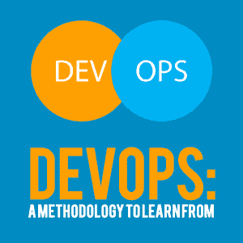
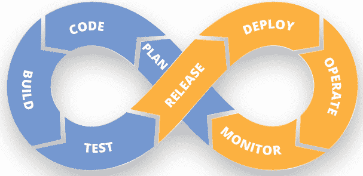
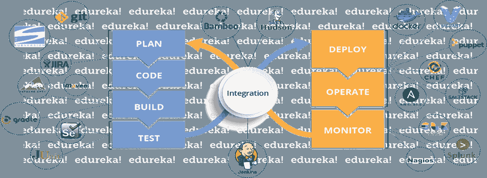
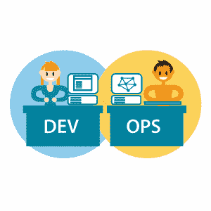

# DevOps:值得学习的方法论

> 原文：<https://simpleprogrammer.com/devops-methodology-learn/>

For every technical professional out there, DevOps is one of those buzzwords that pops up every now and then. DevOps has been around since the early 2000s and has continuously evolved out of opportunity. With a huge number of tech professionals looking to move into DevOps, this is definitely a trend that is here to stay!

那么，DevOps 是什么？您为什么要[学习 DevOps 方法论](http://www.edureka.co/devops)？

DevOps 本质上是*而不是技术*。这是一种连接公司“开发”和“运营”阶段的方法。传统上，软件的开发和部署中涉及的操作是由两个不同的人或部门以两种不同的角色分别处理的。DevOps 旨在通过模糊软件开发的这两个阶段之间的界限来提高效率。对于任何寻求优化时间和资源以获得最大产出、理解和学习的技术专家来说，DevOps 是关键。

## 敏捷的时代

在技术层级中，开发团队致力于创造产品/服务。他们整理需求，设计架构，编写程序，测试/调试错误，最后在真实场景中部署软件。这种方法被称为瀑布模型。

随着时间的推移，公司意识到瀑布模型对开发人员来说很慢。经常会出现这样的情况，当产品推出时，客户需求几乎完全改变了。这就是敏捷开发的由来。

敏捷开发基本上强调定期以更小的功能块交付整个软件的重要性。这使得开发团队能够通过多次迭代来解决问题并更好地调试他们的代码。

这种方法优化了开发阶段，但是每当操作阶段开始时，它就缺乏灵活性。

## 从敏捷到开发运维

这是 DevOps 到达现场的时间。 [DevOps 基本上是一种为开发和运营带来敏捷性](http://www.amazon.com/exec/obidos/ASIN/1942788002/makithecompsi-20)和优化的实践。

开发和运营齐头并进。为了确保软件顺利运行，需要开发和运营之间的持续协作。

考虑这个场景:

开发团队开发新的应用程序，并将代码发送给质量保证(QA)团队。测试之后，QA 将识别出的 bug 发送回开发团队。这里可能会出现沟通障碍——开发人员会生气，声称 QA 没有正确地运行测试，或者没有看到更大的画面。测试人员可能会回答“这不是我们的过程，这是您的代码。”来回花了一段时间，bug 修复，代码交给运营团队部署。这就是激烈争论的开始。在开发环境中一切都很好，但是当应用程序部署到生产环境中时，代码会在一个共同的虚拟化环境中与各种工作负载产生冲突。这就是出问题的地方，每个人都在头发着火的情况下跑来跑去。

根据 DevOps 文化，单个工程师小组对软件开发负有端到端的责任，从收集需求到开发，到测试，到部署，最后到监控和收集来自最终客户的反馈，然后实施任何更改。

虽然敏捷是对瀑布模型的改进，但它仍然有其局限性。敏捷只强调持续集成和监控的重要性。持续部署的概念为 DevOps 铺平了道路。

那么，DevOps 是如何克服敏捷方法论的缺点的呢？一旦你了解了 DevOps 的生命周期，你就会更好地理解这一点。

## DevOps 生命周期概述

[DevOps 的出现](http://www.amazon.com/exec/obidos/ASIN/B0084HJB56/makithecompsi-20)标志着技术领域的一次重大变革，推动了持续部署以及集成和监控的概念。持续部署的理念让 DevOps 与众不同。这种不断变化和改进的意识形态反映在生产方面，使得生产过程更加高效。

无穷大符号被正确地用于 DevOps。

它强调驱动软件应用程序的生产和维护的持续变化和升级的需要。该过程从规划和编码开始，然后构建和测试应用程序。然后，应用程序由运营团队发布和部署，运营团队还负责监控应用程序。这个循环一遍又一遍地重复。

图片来源:Edureka

### 持续开发(计划、编码和构建)

软件可交付性被分解成多个短开发周期的冲刺，开发，然后在很短的时间内交付给运营方。

Git 和 SVN 等 DevOps 工具用于维护不同版本的代码，Ant、Maven 和 Gradle 等工具将代码构建成可执行文件，该文件可以转发给 QA 团队进行测试。

### 连续测试(测试)

在这个阶段，QA 人员会不断测试开发的应用程序是否有缺陷。持续的监控有助于在开发时理解代码的缺点。这将有助于节省时间和资源，因为可以在不影响代码其他方面的情况下修复错误。

对于连续测试，使用自动化测试 DevOps 工具，如 Selenium、TestNG 和 JUnit。这些工具允许 QAs 在确保功能没有缺陷的同时，彻底测试多个代码库。

### 持续集成(发布)

这是支持新功能的代码与现有代码集成的阶段。

由于软件的持续开发，更新的代码也需要持续集成。重做的代码应该确保运行时环境中没有错误，允许我们测试更改并检查它对其他更改的反应。Jenkins 是用于这一过程的流行工具之一。

### 持续部署(部署和操作)

下一个阶段是将代码部署到生产环境中。这里，我们确保代码被正确地部署在所有的服务器上。

由于新代码是在连续的基础上部署的，配置管理工具在快速和频繁地执行任务中起着重要的作用。Puppet、Chef、SaltStack 和 Ansible 是在这个阶段使用的一些流行的 DevOps 工具。

### 持续监控(监控并提供反馈)

这是 DevOps 生命周期中非常关键的一个阶段，其目的是通过监控软件的性能来提高软件的质量。这种源于真正的监控和反馈的持续改进的理念是与众不同的。开发和运营团队之间的执行流程非常流畅，没有任何麻烦。

这需要 Ops 团队的参与来监控用户活动，以发现系统的任何[不当行为。Splunk、ELK Stack 和 Nagios 等专用监控 DevOps 工具将持续监控应用性能并突出问题。](https://simpleprogrammer.com/security-code-secure-devops/)

图片来源:Edureka

上图显示了 DevOps 的端到端生命周期以及流程中使用的各种工具。从规划到测试，这些活动都与部署和监控相集成。这使得 DevOps 成为一个持续的循环，主要关注持续的改进。像 Git 这样的编码库从计划和编码阶段就开始使用。

该应用程序是用 Maven 和 Gradle 等工具构建的。Selenium 是一个自动化测试框架，用于运行测试。Jenkins 是一个集成工具，通过持续集成来帮助弥合开发团队和运营团队之间的差距。Docker、Puppet 和 SaltStack 等工具用于部署和操作应用程序。最后，Splunk 和 Nagios 有助于持续监控和提供反馈。整个循环反复进行。

## 采用 DevOps 原则的优势

DevOps 将帮助您掌握持续开发和部署以及监控和升级流程。它促进了开发人员和运营人员之间的持续协作，以创造更好的结果。

从这种方法中可以学到很多东西，不仅对于技术专业人员，对于需要优化时间和资源以实现目标的经理和领导者也是如此。持续开发、部署、集成和监控的理念可以帮助领导者提高任何给定项目的效率。这种简化的方法将有助于产生高效的产出。

DevOps 成功背后的简单秘密是，它将任务分解成更小的目标，这些目标可以更好地完成和管理。我们也可以在生活中采用这种做法。复制持续监控和改进的理念可以帮助我们调整我们的职业道德，为我们的职业圈带来积极的影响。然后，将这些小片段组合在一起，产生想要的结果。

持续监控也是 DevOps 的一个重要方面。客户对升级和变更的反馈和反应受到监控，这取决于哪些基本变更可以纳入开发阶段，以进一步增强用户体验。这使得 DevOps 成为一个永无止境的不断变化和改进的过程。

DevOps training will help you understand that communication is the key to effective collaboration. Organizations implementing DevOps have transparency and fluidity across the hierarchical structure. The bigger picture or the end goal is communicated across all teams, which promotes collective collaboration.

DevOps 的另一个原则是不断的适应性和改进，这有时意味着从一个行动计划转向另一个。这种方法教你对变化保持开放的心态，并时刻关注如何取得更好的结果。

使用 DevOps，焦点总是在更大的画面上。有时，您需要“缩小”并查看它们是如何相互联系的。

## 一套基本技能

DevOps 将帮助你培养通才心态。专业技能很重要，但是您需要理解并帮助消除整个系统中的瓶颈。

这也是 DevOps 职位在就业市场备受追捧的原因。从依赖性和潜在失败的角度思考将有助于你更准确地预见结果，这是领导者需要学习的另一项重要技能。

最后，我们不要忘记同理心的重要性。当团队一起工作时，错误会发生，延迟会发生，事情可能会不时地发生。一个强大的 DevOps 专业人员会从容应对这一切，并通过与团队的持续协作来尝试找出解决方案。

[今天就开始学习 DevOps】并利用其原则积极影响您的职业生活和工作。](http://www.edureka.co/devops)