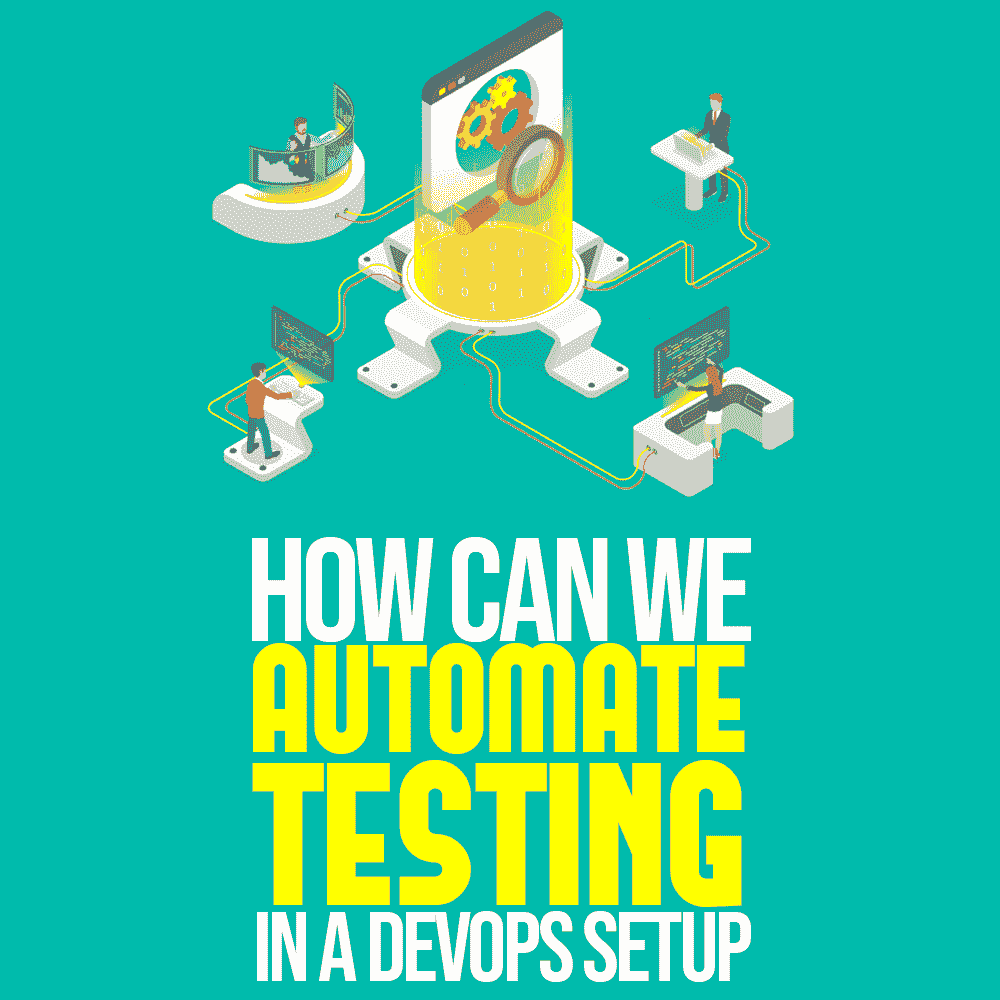

# 我们如何在 DevOps 设置中自动化测试

> 原文：<https://simpleprogrammer.com/devops-test-automation/>

<figure class="alignright is-resized">

</figure>

在开发软件时，专业知识和策略在采用开发和运营(DevOps)策略中起着必不可少的作用。这是因为为了实现测试自动化的目标，需要一组专门的测试人员。

自动化测试是一项困难的技术活动，如果没有有效地实现，它有可能破坏您项目的整体 DevOps 策略。

仅仅了解 app 的基础是不够的。团队需要使用敏捷方法进行规划和开发。如果您希望您的测试自动化策略在 DevOps 设置的环境中发挥作用，那么协作就扮演了一个必不可少的角色。

记住这一点，这里有四个有用的提示，通过它们我们可以在 DevOps 设置中自动测试。

## 1.完全了解你的应用程序的用户环境

了解一个应用程序的不同部分并不能解决理解测试自动化的确切需求。为了获得[测试自动化](https://www.kualitatem.com/automation-testing/)需求的完整知识，理解应用程序用户环境中的所有因素是很重要的。

例如，如果应用程序是为了金融目的，那么安全性是最重要的，自动化测试将集中在安全性测试上。当[测试](http://www.amazon.com/gp/product/0471358460/ref=as_li_tl?ie=UTF8&camp=1789&creative=390957&creativeASIN=0471358460&linkCode=as2&tag=makithecompsi-20&linkId=P376HSKN3AK7NKOI) [i](https://simpleprogrammer.com/testing-computer) [ng 应用](http://www.amazon.com/gp/product/0471358460/ref=as_li_tl?ie=UTF8&camp=1789&creative=390957&creativeASIN=0471358460&linkCode=as2&tag=makithecompsi-20&linkId=P376HSKN3AK7NKOI)时，开发团队必须协同工作并协助测试团队考虑所有重要的方面。

作为开发团队及时交付的持续支持的结果，测试团队将能够创建更好的自动化策略，并与开发功能完美地合作。

在一个金融应用程序的例子中，自动化测试将只关注安全性测试工作，而开发团队将通过让测试团队了解代码中的任何开发来安排有效的测试。
T1。med rectangle-4-multi-110 { border:none！重要；显示:屏蔽！重要；浮动:无！重要；行高:0；边距-底部:15px！重要；左边距:0！重要；右边距:0！重要；margin-top:15px！重要；最大宽度:100%！重要；最小高度:250px 最小宽度:250 像素；填充:0；文本对齐:居中！重要}

## 2.辛迪加的技术和管理经验

在一个 [DevOps](https://simpleprogrammer.com/devops-handbook) 设置中，测试自动化和开发工程师一起工作来创建测试脚本并扩大他们的测试覆盖范围。创建这些代码和脚本是为了支持持续的开发和集成活动。

然而，技术和[管理经验](https://simpleprogrammer.com/programming-project-manager/)的系统结合在应用程序开发中也很重要。技术技能允许开发人员确保没有小故障，并且用户体验非常好。

这种设置对管理体验也有影响。想象一下这样一个环境，在这个环境中，一切都很顺畅，每个人都知道他们应该做什么，他们应该向谁报告和交付，以及他们应该与什么团队互动。这样的设置对任何公司来说都是成功的不二法门。

## 3.创建一个测试团队来处理测试自动化

理解不同类型的测试需要不同类型的专业知识是非常重要的。对于一个[手动测试者](https://simpleprogrammer.com/software-testing-career/)，自动化测试是相当具有挑战性的。因此，将测试自动化任务分配给执行其他类型测试的测试人员是无效的。

自动化需要专业知识以及对规划和实施的深刻理解。因此，在 [DevOps](https://www.kualitee.com/blog/software-testing/software-testing-changing-era-devops/) 环境中创建一个拥有测试自动化专业知识和经验的独特团队是明智的。

自动化并不局限于执行测试；它包括测试的排序和计划。一个专注且经验丰富的团队可以为整个自动化流程创造价值，并保证切实的成果。

## 4.鼓励文化转变

DevOps 并不局限于技术应用和开发测试活动的实施。这是一种文化转变，在这种转变中，有利于发展的环境对于保证计划得到密切监控和协作非常重要。

在任何组织中，健康的 DevOps 文化都可以帮助公司在许多组织价值观上成长。不仅如此，公司还可以获得更高的投资回报(ROI)、更高的客户保持率和更大的市场规模。

操作人员和开发人员需要一起工作来减少不足之处并加速开发活动。为了达到预期的测试自动化目标，必须创建一个有利于 DevOps 的环境。

目标是编写代码，帮助在更短的开发周期内创建健壮的应用程序。只有当 DevOps 文化在系统开发过程中被接受，而不仅仅是特定任务时，速度和质量才能得到保证。

## 拥抱向开发运维的过渡

<figure class="alignright is-resized">

</figure>

像大多数变化一样，将自动化测试集成到 DevOps 设置中是许多企业必须习惯的事情。

要做到这一点，你必须对你的应用程序的用户环境有一个完整的理解，并且能够融合技术和管理经验。同样最好的是建立一个单独的团队专门进行自动化测试，并鼓励文化的转变，这种转变必然会伴随着建立一个 DevOps 设置，该设置还包括一个测试自动化策略。而且，现在随着物联网时代的到来，数字化转型的需求越来越大，一切都在加速，拥有 DevOps 是必不可少的。

谁想坚持传统技术或资源？现在是提高投资回报率、客户保持率和市场价值的时候了。