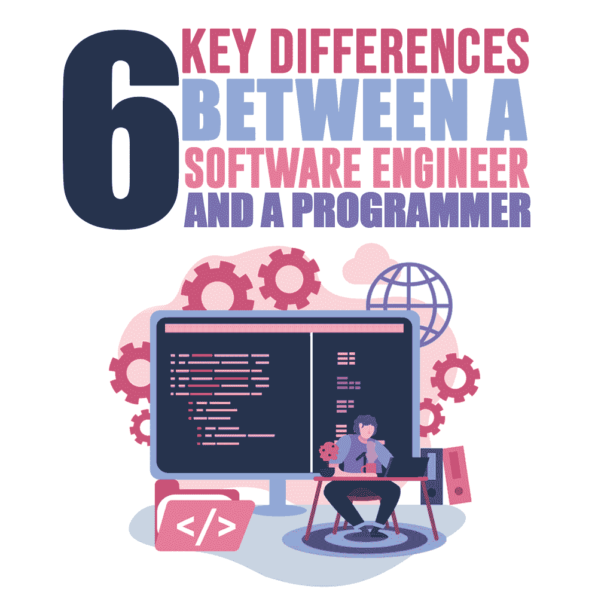

# 软件工程师和程序员之间的 6 个关键区别

> 原文：<https://simpleprogrammer.com/differences-software-engineer-and-programmer/>

Recruiters are always on the hunt for strong tech candidates. With a [1.3% unemployment rate in the industry](https://fortune.com/2019/06/12/unemployment-tech-workers-lowest-ever/), they still intend to hire and retain deserving candidates. However, as a recruiter, it is significant to know exactly what you need in a candidate to hire the right people.

例如，行业中对软件工程师的需求很高，但他们的工作角色通常是开发人员和程序员的结合。根据雇主需要候选人的角色，招聘人员需要知道这两种简历之间的主要区别。

为此，你必须更多地了解他们各自的角色。

## 程序员的角色

计算机程序员通常简称为程序员。他们是软件承包商，开发不同类型的软件和程序。他们还负责遵循软件工程师的指导方针。他们有时也被称为开发人员或编码人员，因为他们的主要任务是编写、评估和编辑代码行。

*   **专业:**程序员一次专注于一个组件，参与开发生命周期的单个阶段。程序员必须能够编写代码和识别/调试错误。这就是为什么他们只专注于几种特定的编程语言。
*   专业知识:编程训练营的趋势已经导致程序员在计算机或信息科学领域发展自学的艺术。这个行业提供的经验比知识更重要；因此，有经验的程序员可能会占上风。
*   **算法:**程序员独立工作，分块搭建系统。拥有很强的技术技能以及设计和理解算法的能力的程序员被视为最合适的候选人。

最后，程序员负责遵循软件工程师提供的框架和编码指南。

## 软件工程师的角色

[软件工程师](http://www.amazon.com/exec/obidos/ASIN/0996128107/makithecompsi-20)通常被称为开发人员，但作为一名技术招聘人员，你必须知道开发人员和工程师的区别。毫无疑问，他们的角色是重叠的，外行人很难理解其中的区别。然而，有一些关键的特征和正式的培训过程使他们与众不同。

*   资格:在一些国家，申请工程职位时，拥有工程学位在法律上是很重要的。工程背景为候选人提供了软件工程师角色所需的坚实基础。他们在科学方法和高等数学方面的专业知识确保了独特的开发生命周期。
*   **领导力:**大局是软件工程师设计的。他们可以评估公司的需求，并与用户需求相结合。他们的知识和经验有助于他们形成系统的解决方案。一个好的工程师需要对编程背景有很强的掌握，才能引导程序员走上正确的方向。
*   路线图:软件工程师是众所周知的软件架构师，因为他们构建指导方针，软件框架的蓝图。然后，这些设计被传送给程序员，程序员对它们进行编码，这样计算机就能正确地阅读它们。
*   **最优解:**软件工程师团队工作，俯瞰软件开发过程。他们通过实施最佳解决方案来创建一个稳定的系统。工程师还应该定期测试和维护软件。维护系统的质量和稳定性是他们最终的工作。如果一个 bug 进入一个系统，他们会询问程序员它对系统的影响以及消除它的必要措施。

## 工程师 vs 程序员

现在你对工程师和程序员的角色有了一个大致的概念，下一步是学习如何根据他们的工作方式来区分他们。如果你打算聪明地招聘，那么理解程序员和软件工程师工作方式的不同是必须的。

这里有六大方面可以帮助你区分程序员和软件工程师:

### 1.技能

软件工程师对高等数学和编程有深入的了解。他们对工程领域有很强的掌握。另一方面，一个程序员已经用几种编程语言详细介绍了[知识。程序员也拥有编写和读取算法的技能。](https://www.brainvire.com/what-are-the-programming-languages-the-full-stack-developers-should-know/)

### 2.教育

一个软件工程师拥有工程学学位，并且在同一领域接受过正规培训。程序员拥有计算机科学学士学位。

在某些情况下，拥有副学士学位和质量经验的个人也被招聘为程序员。

### 3.总体责任

软件架构师(有时被称为软件工程师)评估公司的需求。他们将公司/客户的需求与用户的需求结合起来，并在此基础上概念化一个软件系统。他们还运行几个测试来维护系统。

相反，作为程序员的软件承包商将工程师的指导方针转换成计算机能够理解和遵循的代码行。有时，程序员负责识别和修复错误。

### 4.开发生命周期中的角色

A software engineer starts their job at the beginning of a particular project, overlooking the entire software development life cycle, including its maintenance.

程序员只是开发周期中一个阶段的一部分，并不贯穿整个过程。

### 5.发展方法

软件架构师能够根据他们的工程知识和经验为项目提供最佳解决方案。他们可以提供基于系统功能的质量分析，并维护项目的相互依赖性和稳定性。

一个程序员一次只处理一个组件，因为他们主要关注的是单个的程序。他们还关心特定组件的视觉外观和功能。

### 6.工作动态

程序员独立工作，但接受来自各种工程师的输入。

软件工程师在一个工程师团队中工作，向程序员提供输入。

## 了解你的候选人

为角色找到合适的人并不总是容易的。希望你现在有合适的工具和理解来雇佣正确的和最有效率的人。

注意候选人的教育和专业背景。将该职位与所提供的职位描述进行匹配，然后将候选人列入候选人名单。这将有助于你为这个职位挑选合适的候选人，并简化你的工作。