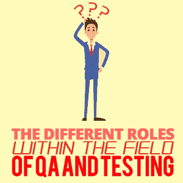

# QA 和测试领域中的不同角色

> 原文：<https://simpleprogrammer.com/different-roles-of-qa-and-testing/>

这篇文章是 Kayleigh Oliver 和 Daniel Sayer 合作写的，Daniel Sayer 是意料之外的问答博客的作者。

* * *

There are so many job titles which cover the generic role of someone who works as a tester or someone within quality assurance (QA). Is it all recruiter babble? Does it denote the same roles and responsibilities?

或者说，这些职称对一个人的期望有很大的不同吗？

在这里，Kayleigh 和 Dan 将讨论他们在各自的职业生涯中遇到的各种非专业人员的当前职位，并努力定义每个职位的高级职责。

更具体地说，他们将描述测试人员或 QA 工作人员的角色，并提出他们对每个头衔含义的解释，这样你就可以制定自己的定义，并决定哪个最适合你。

## 质量保证工程师

丹:在分析职位时，首先要做的是把它分解成几个组成部分，QA 是质量保证的缩写。我相信这些部分传达了一个想法，即担任 QA 角色的人需要关注的不仅仅是测试。他们应该是团队中质量的倡导者，促进其他人提高他们从事的工作、他们遵循的过程和他们编写的代码的质量水平。

质量保证上下文中的“工程师”部分表示更多地参与定义和确保特性的发布过程，并且发布的变更对最终用户的负面影响最小。

本质上，如果我们要画一个所有质量/测试职位的维恩图，我会看到“QA 工程师”在中间，占每个部分的一点点:测试、编码、过程改进和拥护。

Kayleigh: 我同意 Dan 关于这个职位的 QA 部分的观点；任何带有“QA”的角色都意味着这个人将是产品质量的倡导者。

最终用户通常不参与开发，因此 QA 的角色是为最终用户支持他们的目标，并帮助改进开发过程中使用的过程，以确保交付高质量的产品。

但当我在一个职位名称中看到“工程师”这个词时，我不会考虑发布过程。这意味着这个角色需要有专业技能的人。毕竟,“工程师”这个词来源于这个人能够建造、建造和开发某物的能力。

## QA 开发人员

丹:这个很有意思。我认为——我可能会在这里引起一些争议——这个角色是虚构的。从语言学上来说，测试和开发都没有意义(测试是团队 QA 责任的很大一部分)。

公司将 QAs 作为独立于开发人员的实体的原因之一是确保功能检查由一双新鲜的眼睛来完成。这也是为什么 QAs 应该采用开发人员在编写代码时使用的技术的原因，比如代码评审。一些公司没有将 QA 作为一个独立的单元，并期望开发人员测试他们自己的工作；然而，他们不被称为“QA 开发人员”

因此，如果我们认为任何 QA 的首要目标是确保最终产品的质量，那么有人成为 QA 开发人员就不可行。

然而，如果你把它翻过来，试着想象如果有人被雇佣到一个有这个头衔的角色会做什么，我会想象他们会花更多的时间在增强 QA 的工具上，而较少参与功能的生产和主要产品的变化。那为什么不干脆拥有开发商的头衔呢？

我不同意这一点。并非所有开发人员都参与生产代码的开发。有些人只是维护代码和编写测试，但他们是开发人员，他们的关注点才是最重要的。他们被期望在可读的、可扩展的和可维护的代码库中编写有助于特性开发和那些特性的持续改进的代码。QA 开发人员将专注于编写有助于在可读、可扩展和可维护的代码库中开发特性测试的代码。

To me, this role would have someone with technical skills that (as Dan so rightly suggested) could be working with other teams like [DevOps](https://simpleprogrammer.com/devops-methodology-learn/) or solo, building testing tools to aid QA and testers during their day-to-day work.

这个角色也可以是指自动化工程师的另一种方式。这些通常是测试人员，他们花费大部分(如果不是全部)时间来创建自动化脚本，这些脚本在构建上运行，以便在项目进入生产之前检测缺陷。开发人员进行开发，但是 QA 开发人员会特别关注质量以及他们如何提高产品的质量。

## 质量保证测试员

Dan: 当我看到“测试者”这个词时，我会立即想到手动操作按钮和点击网站的过程。这个标题表示使用者更多的关注于作为手工任务的测试，但是仍然参与形成过程的整体质量，以获得发布的变更或特性(由标题的 QA 部分表示)。

我并没有经常看到 QA 测试员的角色，我的重点是公共服务、在线赌博以及网络和应用服务。通常，雇主要么希望测试人员从流程开始就对产品产生直接影响，要么只在流程完成后才进行测试。

我同意 QA 测试人员的角色是执行手工测试。同样，这个角色要求测试人员从最终用户的角度成为质量的倡导者，并支持变更以改进构建产品的过程。

历史上，你会发现在游戏行业工作的测试人员只会执行手工测试，所以他们被称为“QA 测试人员”然而，越来越多的行业认识到发布高质量产品的重要性，以及低质量产品如何影响他们的声誉、品牌和财务。甚至游戏行业也开始雇佣 QA 工程师[自动化工程师](https://simpleprogrammer.com/start-test-automation-part-1/)。这种头衔上的区分让我更加自信这个角色是纯手工的。

## 质量保证分析师

**Kayleigh:** 我觉得这和 QA 测试员挺像的。然而，我认为在用户验收测试(UAT)阶段，QA 分析师会更多地参与开发周期。

**丹:**我同意和 QA 测试员的角色有一定的相似性；这两个角色都主要关注手动测试。有人曾经告诉我，质量保证分析师和质量保证工程师的区别在于，工程师负责发布过程，而分析师的关注点是直到发布点。如果我们把这个职位放在显微镜下观察，我敢肯定有比这个轶事更多的东西。正如 Kayleigh 提到的，它与业务分析师有相似之处，并可能跨越角色和职责，如 UAT 阶段。

## 自动化工程师

到目前为止，这可能是这个榜单上最广为人知的职位之一。自动化工程师的角色是开发自动化脚本来测试生产代码。

测试的类型很大程度上取决于你工作的公司。自动化工程师倾向于编写集成测试和 UI 测试。

通常，自动化工程师更有可能编写 UI 测试，因为他们从最终用户的角度测试应用程序。但是根据公司及其规模，这个角色可以编写从低级单元测试到高级 UI 测试的任何东西。

丹:再说一次，我非常同意你的观点。“自动化工程师”几乎是职位头衔中的 Ronsil(与标签上写的一样)。这些人(或女孩)编写自动化测试，这几乎是他们所做的全部工作。然而，我不想贬低这项任务。从单元到 UI，有如此广泛的方法来帮助自动化测试过程，有足够的工作要做，值得一个专门从事这个职位的人。

在我被期望编写自动化测试的位置上，这些脚本需要保持在顶部。最轻微的变化或新特性都会使你的测试变得过时，这就是为什么要设计诸如页面对象模型这样的策略；但是，必须有人来实现这一点。

## 软件测试人员

****

**丹:**我对软件测试员角色的想法是，它类似于 QA 测试员:主要是手工测试，关注产品而不是过程。这感觉很像是一个工作涉及测试产品的职位，它要么满足预期的标准，要么不满足。

我的理解可能会受到我所采访的来自软件测试人员背景的候选人类型的影响，但我确实感觉到软件测试人员和 QA 工程师之间有一种感知上的差异。

在这一点上，我基本上同意丹的观点。软件测试人员将集中测试产品的功能，以确保它满足其预期的用途，而不是从它是否满足其业务需求的角度进行测试。“软件”这个词是一个通用的总括词，它表明你是一个数字产品的测试者，而不是像实验室或电气测试者那样的机械测试者。

## 测试工程师

Dan: 我认为在工作标题中缺少对“软件”的详细说明表明被测试的产品可能是硬件。然而，我觉得这就是分歧的所在。似乎没有一个使用频率很高的硬件测试员职称，所以这是用于硬件的手动测试员。

凯莉:我还是不同意。每当一个职位名称中包含“工程师”一词时，它就暗示了该职位的技术能力水平。但除此之外，我同意这个角色更关注于测试产品的功能，而不是它所增加的商业价值或最终用户的观点。

## 测试分析师

**Dan:** 测试分析师更多的是一个瀑布式开发过程的职称。测试分析师可以从测试活动中识别目标，并制定任务来实现这些目标，或者他们可以在一个更具咨询性的位置上工作，帮助准备测试周期，在验收测试期间帮助用户，并产生结果的报告和分析。

这是一个暗示你将独自从事体力工作的角色。然而，这个角色将更多地关注于从最终用户的角度进行测试，而不仅仅是确保特性在功能上得以执行。

## 测试软件开发工程师(SDET)

这个头衔是微软在 2005 年首次使用的。这个头衔对于测试领域的人来说是最专业的，因为他们的角色是开发和测试，通常跨越不同的开发阶段。承担这个角色的人可能开发许多不同类型的测试，例如集成、契约接受和 UI。

为了能够执行所有这些类型的测试，您需要了解什么是好的测试，每个级别需要的测试类型，以及如何实现它们。

给这种类型的技术测试人员一个带有“开发”字样的头衔，意味着候选人应该有更强的技术能力。这也使标题更容易被开发角色之外的人理解。任何人都可以猜测软件开发人员是做什么的，但是你也需要解释自动化工程师的角色。这是我认为最接近 SDET 的角色。

Dan: 正如你所说，Kayleigh，这个角色已经存在一段时间了。SDET 是专注于测试的开发人员。SDETs 高度精通编码和开发实践，但是不参与开发方面，并且仍然专注于确保产品处于可测试的位置。

我感觉 SDETs 更愿意编写一个脚本，而不是手工执行一个测试，不管需要花费多少时间和精力。我知道有几个地方会利用 SDETs 来重构代码，使其更易测试。这不是标准，但确实显示了这个职位的雇员需要具备的广泛技能。但是这个角色和自动化工程师的角色有什么不同呢？我相信这是不同名字下的相同工作，看不出职责之间有明显的不同。然而，如果我在这个位置上，我宁愿被称为测试中的软件开发工程师。听起来很不错，你不觉得吗？

## 职称真的很重要吗？

Ultimately, a job title can give you only so much information into what you will be doing. Many jobs will be posted by non-QAs (recruiters, development managers, etc.) that even if there was a consensus on the titles above, there would still be so many nuances that you have to look at the job description to make an informed decision. You’ll find some uniquely named positions after a quick search on popular job sites, such as Test Ninja, which shows that our list and discussion isn’t exhaustive.

我们都同意角色的描述比标题更重要，因为它会传达角色的细节和日常行为。然而，职称仍然被用来表示一个人的权威级别，所以你在哪个头衔下工作很重要。

## 如果你的职位不适合你，该怎么办

同样，招聘启事可能与你实际从事的工作不同。你可能会发现你的角色与你最初申请的职位不同。

如果你对你目前的头衔不满意，我们建议你和你的经理谈谈，在下一次绩效评估中协商改变头衔。记住，附上你承担的额外任务的证据，这样你就可以证明这个头衔更能代表你的日常工作量。

如果你对自己承担的额外职责不满意，我们建议你也和你的经理谈谈。也许这些额外的任务会让你无法做到最好，让你的精力过于分散。无论你有什么不满，都要和你的经理达成妥协；不要只是继续。