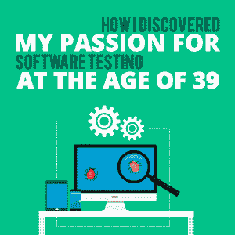

# 我是如何在 39 岁时发现自己对软件测试的热情的

> 原文：<https://simpleprogrammer.com/discover-my-passion/>

Passion for your work can make the difference between a workday that flies by and one that crawls. And passion can keep you working hard and honing your craft. But how do you discover this kind of devotion and interest? I didn’t discover my passion until I was 39 years old, and in the process I learned a bit about how to find it. Here’s what happened:

那是 1978 年。我当时 8 岁，自豪地拥有一个漂亮的数字计算器，还可以玩名为 Dataman 的游戏。数据人有各种各样的算术测验和逻辑游戏。

我经常玩它，但过了一会儿，我已经掌握了所有的游戏。由于我不想停止玩 Dataman(毕竟 Game Boys 还不存在)，我一直在尝试这些游戏，看看我能多快解决小测验。

在某个时候，我注意到如果我同时按下两个键，会出现一个不是数字的符号。我是一个想象力丰富的孩子，我很高兴地认为这是某种秘密代码。我尝试了所有可能的组合键，并在笔记本上记录了我的结果。

我不知道我所做的事情有一个名字:探索性测试。30 多年后，我发现这是我的激情所在！

## 你的第一份职业可能并不合适

我们中的许多人发现自己从事的第一份职业并不是我们所热爱的。我们经常在 17 或 18 岁时被要求决定职业轨迹，那时我们没有太多的生活经验。我们甚至可能不知道一个让我们充满激情的职业存在！对我来说就是这样。

随着时间的流逝，我变成了一个青春期前的少年，我对音乐、朋友和男孩比我父亲带回家的麦金塔电脑更感兴趣。我参加了高中开设的一门计算机课——Pascal——我学得很好，但在 1987 年，计算机对我来说并不那么有趣。

大学就要到了，我必须找个专业。我学了几年的钢琴和声乐课，由于我对其他学科不感兴趣，我决定学习音乐并成为一名教师。

多年来，我在小学教音乐和钢琴课，还指挥过一个教堂唱诗班。36 岁的时候，我已经准备好做一些不同的事情。这种感觉与离婚不谋而合，突然间，我成了需要更多收入的单亲妈妈。

但是我能做什么呢？我想到我非常喜欢做的事情，当我做这些事情的时候，时间悄悄溜走了。

我想到了组织事情。所以我开始自己创业，做专业的组织者。我这样做了大约一年，直到我发现整理别人的东西不如整理自己的东西有价值。但我作为组织者的经历帮助我在一家小型移动初创公司找到了工作，在那里我为销售团队组织了所有的手机。

这样做让我想到也许我会喜欢成为一名软件开发人员，所以我在州立大学上了在线编程课。当创业公司资金耗尽，我被解雇时，我开始寻找下一份工作的想法。

我还没有足够的知识来成为一名初级开发人员，所以我寻找其他的东西。我能够利用我在移动设备方面的经验在另一家移动创业公司找到工作，这一次是作为一名质量保证(QA)实习生。

工资很低，工作也没有福利，但我希望它能给我足够的经验来推进我的事业。没想到的是，这次实习让我发现了自己的激情！

## 当它是正确的时候，你知道它

在我作为 QA 实习生的第一天，有人给了我一部装有应用程序和测试计划的黑莓手机。我开始检查测试计划的步骤。

很快我发现了一些奇怪的事情，我不小心按了两次按钮。我发现这很有趣，并决定看看我是否能重现结果。然后，我想知道如果我比预期的更早或更晚点击按钮会发生什么，并尝试了这一点。

然后我对自己说，“我应该停止玩这个手机，回去工作。”突然我意识到，*这是我的作品*。找到了。我发现了我非常喜欢做的工作，这对我来说就像是在玩耍。从那天起的九年里，我一直热爱我的工作。

你的激情可能不是软件测试。可能是前端开发，或者项目管理，或者信息安全。但是我分享这个故事是为了说明两个关键点。

首先，你可以发现你的激情。其次，这样做永远不会太晚。

## 找到你的激情

But how do you find your passion? Here is my advice:

1.  开始思考你喜欢什么。你在失去所有时间观念的情况下做了哪些事情，在这些事情中，你对出色完成工作感到非常满意？有哪些对你来说很容易的技能？这些通常是你喜欢做的技能。先不要担心如何让别人为此付钱给你；只需列出你热衷的活动。我的清单包括整理我的衣柜，整理东西，建立系统保持房子干净，计划合唱团排练。
2.  列出一个清单，列出一个人擅长你喜欢的事情所需要的品质。在这一点上，你仍然没有考虑工作；你只是在列技能清单。我的清单包括组织和归档，建立系统，计划，把复杂的事情变得简单。
3.  现在，列出哪些工作需要这些技能。以我为例，我想到的第一份工作是办公室秘书。但在那个特定的时间点，我需要一个灵活的时间表，所以我的下一个想法是成为一名专业的组织者。
4.  寻找一份你在第三步中想到的工作。因为刚进入这个新领域，可能需要低薪甚至无薪工作。相信自己，知道这种情况是暂时的。仅仅过了四个月，我就能够利用我作为质量保证实习生的经验获得一份质量保证工程师的有薪工作。
5.  在你的工作岗位上工作几个月后， [**评估你的结果。**](https://simpleprogrammer.com/clerk-to-engineer-choose-success/) 你喜欢它什么？你不喜欢什么？你能想到一个包含更多你喜欢的东西的职位吗？我原以为我会喜欢整理别人的家，但事实证明我不喜欢这份工作要求的高度个人化的互动。但我也被雇来组织一个当地办事处，我更喜欢这样。这让我意识到，也许办公室工作是我的下一步。
6.  当你在寻找你梦想的职业时，想想你下一步需要什么技能。当我第一次考虑从事软件开发时，我意识到我需要参加一些课程来学习如何编码。幸运的是，我们有各种各样的方法来学习新技能:YouTube 视频、[免费在线课程](https://www.w3schools.com/)、[付费在线课程](https://www.pluralsight.com/)、当地大学课程和[新兵训练营](https://simpleprogrammer.com/is-paying-for-developer-bootcamp-worth-it/)只是其中的一些选择。想想什么样的学习方式最适合你，什么样的学习方式最适合你的时间表和预算。
7.  寻求帮助和建议。当我开始我的 QA 职业生涯时，我非常感谢更有经验的 QA 工程师，他们帮助我了解测试什么以及如何测试。我也很感激和我一起工作的开发人员，他们在我午餐时间帮我做大学课程作业。
8.  **建立良好的关系网。如果你是一个乐于助人、开朗的同事，并尽力帮助他人，你会交到愿意帮你找到下一份工作的朋友。当我被办公室解雇时，我的四个同事提出为我的下一份工作写推荐信。**

## 永远不会太晚

不要担心你可能经历的任何失败——我花了一些时间来发现我的激情。当你在学习新技能时，所有的生活经验都是有价值的。我使用我作为一名音乐教育者所开发的技能来指导其他正在学习软件测试的人。

最后一条建议:永远不要低估自己！找借口很容易，比如“我太老了，学不了新东西了”或者“没人会把我当回事。”唯一真正拖你后腿的是你自己！

只要你有耐心，坚持不懈地勤奋工作，并定期回顾和调整你的目标，你就能找到你的激情和你热爱的工作。