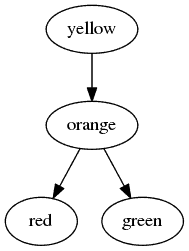
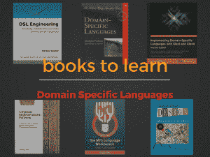
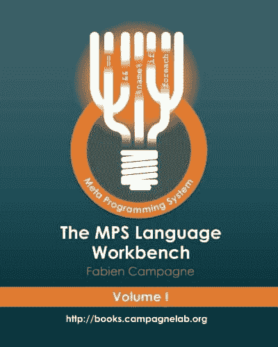
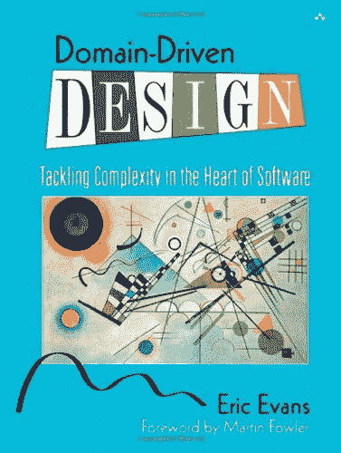

# 领域特定语言

> 原文：<https://simpleprogrammer.com/domain-specific-languages/>

领域特定语言(DSL)是为一个单一目标而精心制作的专用语言。

你为什么会对它们感兴趣？

因为它们可以完全改变一个组织的运作方式。特别是，它们可以极大地提高生产力，改变开发人员和领域专家的交流方式。

我们要回答三个问题:

1.  什么是领域特定语言？我们将看一些具体的例子
2.  使用它们你能获得什么好处？
3.  如何创建 DSL？

## 什么是领域特定语言？

你可能熟悉通用语言*，比如 Java 或者 Python，它们能够表达每一种可能的算法。*

*领域特定语言则不同:它们的优势在于只做一件事，但要做好。它们是可以在一家公司内部使用的专门语言——这是我为我的客户经常做的事情。然而，一些 DSL 被广泛使用，并且您可能已经知道其中的一些。*

## *特定领域语言的例子*

*特定于领域的语言可以满足各种各样的目的。它们可以在不同的环境中被不同类型的用户使用。有些 DSL 是供程序员使用的，因此技术性更强，而有些 DSL 是供非程序员使用的，因此它们使用的概念和语法不那么令人讨厌。*

### *DOT–定义图形的 DSL*

*DOT 是一种可以描述有向或无向图的语言。*

*根据该描述，可以生成表示这些图形的图像。首先，您使用一个名为 [Graphviz](http://www.graphviz.org/) 的程序，它与 DOT 语言一起工作。从上面的例子中，您会得到这样的结果:*

**

**使用 DOT DSL 生成的图像**

*该语言还允许您定义节点的形状、颜色和许多其他特征。但是基础非常简单，几乎每个人都可以在几分钟内学会如何使用它。*

### *gherkin——定义功能测试的 DSL*

*[小黄瓜](https://cucumber.io/docs/reference)是用于定义功能测试的 DSL。它有一个非常灵活的语法，使它看起来几乎像自由文本。基本上，开发人员、分析师和客户可以围坐在一张桌子旁，定义一些场景。然后，这些场景将作为测试来执行，以验证应用程序是否符合预期。例如，我们可以这样定义从自动取款机中取款的期望值:*

*场景:验证在 ATM 机取款是否正常* 

*我很喜欢这个 DSL，因为使用它的要求很低。然而，这种 DSL 要求开发者使用 GPL 定义一些代码。它在实践中的工作方式是，开发人员定义特定的命令，如:“{name}在他的帐户中有{amount}$”，并在为项目选择的 GPL 中定义执行该命令的代码(支持 Ruby、Java 和其他代码)。*

*一旦开发人员创建了这些特定于感兴趣的应用程序的命令，所有用户都可以在定义他们的功能测试时使用它们。也可以从另一端开始:首先，你按照自己的意愿编写你的场景，试图捕捉需求，只有后来的开发人员将每个命令映射到一个 GPL 中相应的函数。*

*换句话说，这种 DSL 非常适合将真正的代码隐藏在每个人都能理解和贡献的表面之后。坐在桌前与银行代表讨论我们展示的示例，比向他展示与这些命令相对应的数百行 Java 要好得多，对吗？*

### *SQL–数据库*

*你可能听说过 SQL。它是一种用于定义如何在关系数据库中插入、修改或提取数据的语言。让我们从*统计数据*表中获取一些统计数据:*

*当然，您不会期望普通人能够编写复杂的查询:SQL 不是一种简单的语言，它需要一些时间来掌握。然而，学习 SQL 并不需要经过开发人员的培训。事实上，许多 DBA 并不是开发人员。*

*也许不应该信任 Joe 对数据库的写访问权限，但是他可以获得读访问权限并编写简单的查询来回答他自己的问题，而不是必须询问某人并等待得到答案。假设他需要知道亚特兰大八月份的最高温度:*

*也许 Joe 永远也不会达到 DBA 的水平，但是他可以学习一些基本的查询，并根据自己的需要进行调整，这使他更加独立，并让他的同事专注于他们的工作，而不是帮助他。*

### *HTML–网页布局*

*我真的希望你听说过这种相当成功的定义文档的语言。令人惊讶的是，20 年前，当大多数人将台式电脑连接到分辨率为 640×480 像素的显示器上时，我们可以定义 HTML 页面，而现在，这些页面可以在智能手机上运行的浏览器上呈现。我想这是 DSL 可以实现的一个很好的例子。*

*注意，HTML 实际上是定义文档:它们的结构和它们包含的信息。然后，同一文档在台式计算机、平板电脑或智能手机上以不同的方式呈现。残障人士也可以使用不同的文档。例如，为视力受损的人设计的特定浏览器可以帮助他们阅读用 HTML 定义的文档。这种浏览器读取内容并支持导航到文档的不同部分。*

### *CSS 样式*

**级联样式表*语言定义了用于可视化文档的样式。我们可以用它来定义一个 HTML 文档在屏幕上的显示方式或者在打印时的显示方式。*

*掌握 CSS 并不容易，但是许多具有基本编程知识或没有编程知识的人可以用它来改变网页的外观。这个 DSL 在大众化网页设计中扮演了重要的角色。*

### *ANTLR–词法分析器和语法分析器定义*

*ANTLR 自带 DSL 来定义词法分析器和解析器语法。那些是识别一段文本结构的指令。例如，这是一小段 lexer 语法:*

*JavaCC、Lex、Yacc 和 Bison 是类似的工具，它们都带有略微不同的 DSL，灵感来自于[巴克斯-诺尔形式](https://en.wikipedia.org/wiki/Backus%E2%80%93Naur_form)。*

### *制造-建造系统*

*Make 是一种描述如何构建东西以及不同步骤之间依赖关系的语言。例如，您可以定义如何生成可执行文件，并指定为此首先需要三个目标文件。然后，您可以为每个目标文件定义如何从相应的源文件中获取它。*

*在这个例子中，我们指定创建程序 *myExecutable* 我们将需要目标文件，一旦我们有了它们，我们将使用 gcc 将它们链接在一起。我们还可以在文件的顶部定义一些常量，这样如果我们需要的话，以后就很容易修改 Makefile 了。*

## *那么我们可以用 DSL 做什么呢？*

*看了这些例子之后，我们可以得出结论，DSL 可以用于多种目标:*

*   *定义要执行的命令*
*   *描述文档或文档的某些特定方面*
*   *定义规则或流程*

*这些只是一些典型的用法，但是 DSL 可以用于许多其他的原因。*

*至此，您应该对 DSL 的外观和用途有了一些了解。现在，让我们看看*为什么*您应该使用一个，然后看看如何构建一个。*

## *为什么我应该使用 DSL 而不是我最喜欢的编程语言？

T2】* 

*如果你是一名开发人员，利用你辛苦获得的 C#或 Ruby 技能来解决任何可能的问题是很有诱惑力的——我明白这一点。*

*然而，也有令人信服的理由用更具体、更合适的工具来解决一些具体的问题。*

*是的，你可以用打火机或叉子打开一瓶啤酒，但如果你必须打开数百瓶，如果你刚刚开始使用开瓶器，你的生活会更容易，对不对？*

*同样的事情也适用于编程:有些问题用一种特定的语言能更好地解决，原因我们将要探讨。*

*你还要考虑另一个方面:**不是每个人都是你这样的程序员**。许多项目涉及的人员不是开发人员，但是他们具有特定的能力。他们是*领域的专家*。*

*也许你写会计软件，你与会计师和商业顾问一起工作。在这种情况下，编程语言对你来说很容易理解，但对领域专家来说却是完全的胡言乱语。DSL 对他们来说更容易理解，因为它是他们领域的专用语言。*

*现在，让我们看看使用 DSL 相对于 GPL 的三大优势:*

1.  *他们更安全。使用 DSL 时，可能会出现更少的错误。你上一次在使用 HTML 或 SQL 时遇到空指针异常是什么时候？从来没有。如果我们正在做一些重要的事情，比如处理某人的健康或金钱，这是非常重要的。*
2.  *当存在错误时，这些错误是特定于领域的，因此更容易理解。特定于域的错误不是关于某个不能被取消引用的指针；它们是领域专家能够理解的东西。*
3.  *我们可以更容易地教它们:它们的范围有限，因此掌握它们所需的时间和培训更少，原因很简单，因为要学的东西更少。*

## *使用 DSL 有什么好处？*

*特定领域语言并不是 GPL 的边际改进。在适当的情况下，它们可以通过在两个不同的层面产生强大的影响来改变组织的工作方式:*

1.  *他们让你与领域专家交流。你写医疗应用吗？当你谈论*阵列或 for-loops* 时，医生不理解，但是如果你使用关于*患者、温度测量和血压*的 DSL，他们可能比你更能理解。*
2.  *它们让你专注于重要的概念。它们隐藏了实现或技术细节，只暴露了真正重要的信息。*

*DSL 是组织和表达与特定领域相关的思想的工具。他们所有的优势都源于这种能力。让我们详细地看看它们。*

## *与领域专家交流*

**

*在许多情况下，你需要和领域专家一起开发软件，而这些专家本身并不是开发者。例如:*

*   *您可能会构建医疗应用程序，因此需要与医生交流，以了解配套软件应该建议的治疗方法。*
*   *你可以建立营销自动化软件。你需要营销人员解释如何识别符合某个特征的客户，这样你就可以向他们提供特定的交易。*
*   *你可以为汽车行业开发软件。你需要与工程师沟通，了解如何控制刹车。*
*   *你可以为会计开发软件。你需要描述在给定的环境中应用的所有特定的税收规则，并且你需要一个会计师向你解释它们。*

*现在，问题是这些领域专家没有软件开发的背景，开发人员和那些领域专家交流的方式可能会非常不同，因为他们说不同的语言。*

*开发人员谈论软件，而领域专家谈论他们的领域。*

*通过构建 DSL，我们构建了一种在开发者和领域专家之间交流的语言。这种语言将被开发者、领域专家以及软件所理解，软件将能够执行 DSL 中指定的指令。*

*在某些情况下，您可以给领域专家一个 DSL，让他们单独编写他们的查询或逻辑。然而，在实践中，领域专家能够自主使用 DSL 的情况很少见。通常，领域专家向开发人员描述他想要什么，开发人员可以使用 DSL 立即写下该描述。领域专家可以在此时**阅读并批评它**。*

*一般来说，非开发人员不具备形式化问题的分析技能，但是他们仍然可以**阅读并理解它**，如果它是用用户熟悉的术语 DSL 编写的。此外，这些工具可以使用模拟器或动态运行查询，这样领域专家不仅可以查看代码本身，还可以查看结果。*

*这些类型的交互在实践中可以有一个非常短的周转期:代码可以在会议期间或几天内编写。相比之下，当使用 GPL 时，周转时间即使不是几个月或几年，也至少是几周。*

## *专注和生产力*

*DSL 抽象出一些技术细节来关注它们应该获取哪些知识，这一事实具有重要的意义。*

*一方面，它使得对使用 DSL 编写的代码的投资随着时间的推移保持价值。随着技术的变化，您可以改变处理 DSL 代码的解释器，但是 DSL 代码可以保持不变。20 年前编写的 HTML 页面仍然可以使用 20 年前没有人能够想象的设备打开。与此同时，浏览器已经完全重写了多次，但是逻辑可以移植到新技术中。*

*我想分享一个我曾经工作过的公司的故事。这家公司创建了自己的 DSL 来定义会计和税务计算的逻辑。他们在 30 年前开始构建这个 DSL，当时他们生成了控制台应用程序。是的，在 80×25 单元的控制台上运行的应用程序。*

*我和他们一起重新设计了编译器，他们 DSL 的相同代码现在被用来生成反应式 web 应用程序。这是怎么发生的？因为 DSL 只捕获逻辑，这是程序真正有价值的部分，也是公司极其重要的资产。技术细节在编译器中被抽象化了。因此，我们只需更改 DSL 编译器，以保留逻辑的价值，并使其在更现代的上下文中可用。*

**

*这个故事告诉我们:*

*领域逻辑是有价值的，应该被保留，而技术是随着时间而变化的。*

*通过使用 DSL，我们可以分离领域逻辑和技术，并允许它们独立发展。*

*隐藏技术细节的另一个好处是生产率。想想在考虑释放内存或选择哪个链表实现最适合当前情况时所花费的时间。那段时间投资回报率很低。通过使用 DSL，您只需关注问题的相关部分并解决它。*

## *如何创建特定领域的语言*

*你已经看到了为什么特定领域语言如此酷，以及它们能给你带来什么好处。现在只剩下一个问题需要回答:*我们如何构建 DSL？**

## *我们可以使用什么工具来构建特定领域的语言？*

*构建 DSL 有不同的方式。这里的目标是用工具支持构建一种语言，同时保持合理的努力。*

*我们不是在构建下一个 Java 或 C#，所以我们不会花费几十年的时间来构建一个额外复杂的编译器或一个具有大量特性的 IDE。我们要建立一个有用的语言，有很好的工具支持，一个小公司就能维持的投资。*

*在这里，我们将看看几个备选方案:一些关于构建文本 DSL 的细节，另一个旨在构建图形语言，或者基于不太常见的符号的语言。您可能只想到文本语言，但是领域特定语言比这更广泛。*

### *文本语言*

*这些是最经典的语言。大多数从业者甚至不会想象使用其他种类的语言。诚然，我们都习惯于使用文本语言。它们更容易支持，可以在各种环境中使用。然而，为了有效地使用它们，必须有一个特定的编辑器。让我们看看如何构建文本语言和支持工具。*

*Xtext 是构建文本语言的可靠解决方案，在许多情况下，它是您的最佳选择。*

*使用 Xtext，您可以像使用 ANTLR 一样定义语法，但是您得到的不仅仅是一个解析器，而是一个很好的编辑器。默认情况下，这个编辑器是一个 Eclipse 插件，这意味着您可以在 Eclipse 中编辑用 DSL 编写的文件。*

*如果您知道 Eclipse 平台是如何工作的，那么您可以创建一个 RCP 应用程序，也就是说，一个精简版的 Eclipse，它基本上只支持您的语言，并删除了一些对您的用户没有用的东西。*

*所以 Xtext 给了你一个编辑器和一个解析器。这个解析器使用 Eclipse 建模框架(EMF)为您生成代码模型，这基本上意味着您必须学习这项技术。*

*我记得在漫长的日子里阅读 EMF 书籍是我经历过的最无聊的经历之一。我还记得在 Eclipse 论坛上提问，但没有得到任何回答。我打开了直到三年后的*才收到答案的错误报告(我不是在开玩笑)。**

*所以一开始很沮丧，但随着时间的推移，社区似乎改善了很多。现在，Xtext 网站上可用的材料比过去好得多，洛伦佐·贝蒂尼的书使这成为可能。*

*Xtext 生成的编辑器可以深度定制，如果你知道自己在做什么的话。通过合理的努力，您可以进行小的更改，但是如果您想做高级的事情，您需要学习 Eclipse 的内部知识，这并不容易。*

*最近，Xtext 增加了为 IntelliJ IDEA 和 web 生成编辑器的可能性，从而逃脱了“Eclipse 陷阱”!像许多其他开发人员一样，我在几年前转向 IntelliJ，我缺少一种方法来轻松地为 IntelliJ IDEA 构建编辑器。*

*所以这是一个好消息，即使因为 Xtext 是为了与 Eclipse 一起工作而创建的，对 IntelliJ IDEA 的支持并不像对 Eclipse 的支持那样成熟和久经考验。*

*我还没有尝试过 web 编辑器，但据我所知，它生成了一个服务器端应用程序，基本上是一个无头 Eclipse。在客户端，它基于三种技术生成三个不同的编辑器(每一种都有不同的完整性级别)。完全支持的编辑器是 Eclipse 项目 [Orion](https://orionhub.org) ，另外两个是大家熟知的 [CodeMirror](https://codemirror.net/) 和 [ACE](https://ace.c9.io/) 。*

*您可能想要查看这个用 Xtext 实现的[项目列表，以了解使用 Xtext 可以实现什么。](http://www.eclipse.org/Xtext/community.html)*

### *文本语言:其他工具*

*如果 Xtext 不适合您的文本语言，您可能需要考虑一些替代方法。这些是我会留意的:*

***[TextX](https://github.com/igordejanovic/textX)** 是一个受 Xtext 启发的 Python 框架。您可以使用与 Xtext 非常接近的语法来定义您的语言的语法。TextX 不使用 EMF 或生成代码，而是使用 Python 的元编程能力来定义内存中的类。虽然它看起来很好并且易于使用，但是 textX 不像 Xtext 那样生成编辑器支持，这是一个主要的区别。如果你想更好地了解 textX 的工作原理，看看这个视频。*

*[https://www.youtube.com/embed/CN2IVtInapo](https://www.youtube.com/embed/CN2IVtInapo)*

*还有其他可用的工具，比如 **[Spoofax](http://www.metaborg.org/en/latest/) 。**我没有用过，所以我不能保证。它比工业级语言工作台更学术，所以我建议谨慎一点。Spoofax 可以在 Eclipse 中使用，它基于一组 DSL，用于创建其他 DSL。*

*如果你想了解 Spoofax，你可能会想看看这本来自 Eelco Visser 的名为 *[Declare Your Language](http://declare-your-language.metaborg.org/) 的免费短文。**

### *项目编辑*

*投影编辑器极其强大和令人兴奋，但对许多用户来说是陌生的。我可以给你一个定义和一点理论，但如果你真的想了解这些编辑，请观看下面的视频，在 Jetbrains MPS 部分。你也可以看看马丁·福勒写的关于[投影编辑](https://martinfowler.com/bliki/ProjectionalEditing.html)的解释。*

*投影编辑器是显示存储在文件上的内容的投影的编辑器。用户与投影交互，编辑器将这些交互转换成对持久模型的更改。当你使用文本编辑器时，你会看到可以添加或删除的字符，而字符实际上是保存在磁盘上的。*

*在一个项目编辑器中，你可以编辑表格、图表，甚至是看起来像文本的东西，但是这些改变将以不同于你在屏幕上看到的格式保存。这可能是某种 XML 格式，也可能是二进制格式。关键是你只能在它们的特殊编辑器中使用这些文件。*

*如果你想一想，所有的图形语言也是如此:你看到漂亮的图片，你拖动它们，连接线条，最后编辑器保存一些模糊的格式，而不是你在屏幕上看到的漂亮图片。投影编辑器的最大优势是它们比典型的图形语言更加灵活。您可以组合不同的符号，并支持您的案例所需的所有类型的表示。*

*迷茫？这是可以预料的。观看下面的视频，观看更多的视频，随着时间的推移，事情会变得更加清晰。*

### *Jetbrains 议员*

**

*Jetbrains MPS 是一个非常强大的工具，我已经用了好几年了；这是目前最成熟的投影编辑器。这并非偶然:十多年来，Jetbrains 在开发这种技术上投入了大量资金。*

*想看看它长什么样吗？看视频。*

*[https://www.youtube.com/embed/I8EEhXJSJYI](https://www.youtube.com/embed/I8EEhXJSJYI)*

*Jetbrains MPS 对于使用高级工具构建可互操作的语言家族非常有用。想象一下使用几个 DSL 来描述问题的逻辑，定义测试，定义文档。想象各种各样的模拟器、调试器和工具来分析代码覆盖率。全都建立在一个平台上。*

*在一个平台上拥有一切意味着你需要准备好接受 Jetbrains MPS，并投入大量时间来正确学习它。然而，如果你准备投资，它可以彻底改变你的过程。*

## *我需要什么来使我的 DSL 成功？*

*只有两件事看似显而易见，实则不然:*

1.  *你需要你的用户使用你的 DSL*
2.  *你需要你的用户从使用你的 DSL 中获益*

*为了实现这些，您需要构建正确的工具支持并采用正确的技能。我们将在这一部分讨论所有这些内容。*

### *让用户使用它*

**

*你需要赢得用户的支持。当我获得博士学位时，我做了一个关于为什么不采用 DSL 的调查。有几个原因，但是一个重要的因素是来自用户的阻力，特别是当他们是开发者的时候。*

*如果你将 DSL 定位于开发人员，他们可能会抵制，因为他们觉得他们不像使用通用语言(GPL)时那样处于控制之中。他们也可能担心 DSL 降低了门槛，因为它比 Java 简单易用。*

*此外，和所有的创新一样，新的 DSL 对经验丰富的开发人员来说是一种威胁，因为它降低了他们的一些技能的重要性——例如在处理公司当前 GPL 的古怪方面的丰富经验。*

*如果您的 DSL 面向非开发人员，通常更容易赢得他们的支持。为什么？因为你给了他们一种超能力:自己做事情的能力。*

*他们可能能够使用 DSL 来自动化以前的手动过程。也许在 DSL 可用之前，他们唯一可能做的事情就是打扰一些开发人员编写定制代码。有了 DSL，他们因此获得了更多的权力和独立性。然而，如果他们觉得太难或者觉得不符合他们的思维方式，他们可能会拒绝采用它。*

*对我来说，在这种情况下，作为 DSL 设计师的关键是**谦虚和倾听**。倾听开发人员的意见，努力获取他们的经验，并将其嵌入到 DSL 或围绕它的工具的设计中。让他们参与 DSL 的设计。当与您的用户交谈时，无论是技术人员还是非技术人员，都要告诉他们 DSL 将是他们的工具，旨在支持他们，并源于他们对手边领域的理解。当设计 DSL 时，牛仔方法不起作用；你需要作为一个团队取得成功，否则根本不会成功。*

### *给用户让利*

**

*如果你得到用户的支持，人们开始使用你的 DSL，只有当他们从使用 DSL 中获得显著优势时，你才是赢家。我们已经讨论了 DSL 作为支持协同设计的通信工具和媒介的重要性。这是至关重要的，但除此之外，您还可以通过构建一流的工具支持来显著提高用户的生产力。几个例子:*

*   *一个很棒的编辑器，带有语法高亮和自动完成功能，所以学习和使用这种语言就像是轻而易举的事情*
*   *巨大的错误消息:DSL 是一种高级语言，错误对用户来说意义重大*
*   *模拟器:没有什么比与模拟器交互并看到他们所写的结果更能帮助用户了*
*   *静态分析:在某些情况下，分析代码并消除可能的错误是一个巨大的胜利*

*这是一些想法，但根据具体情况，可以采用更多的想法。特定的工具为特定的语言提供支持。*

## *关于特定领域语言的书籍*

**

*如果你真的想学习 DSL，这里有一个书单，你可以看看。*

****[DSL 工程](http://voelter.de/dslbook/markusvoelter-dslengineering-1.0.pdf)*** by **[马库斯·维特尔](http://voelter.de/)***

*这本书的 PDF 版本是捐赠软件，所以你可以直接阅读并捐赠。或者，你可以在亚马逊上找到印刷版。*

*这本书将在不同层面上帮助你。首先，它非常有助于明确你的术语。除此之外，您将学到一些 DSL 设计的好原则。如果你没有直接的专家来教你如何设计 DSL，那么阅读这本书是我推荐的最佳选择(当然，还要尽可能多的练习)。*

*接下来是关于执行的部分:记住马库斯有博士学位，但他首先是一个把事情做好的人。这部分写得很好，有基于 Xtext、Spoofax、MPS 的例子。第四部分是关于 DSL 有用的场景。鉴于这是基于他在这个领域的大量经验，有很多有趣的评论。*

*我有机会和马库斯一起工作，他绝对是这个领域的佼佼者，所以如果你能从他身上学到什么，那就去学吧。读他的书，看他的演讲，关注他的项目。这将是一个投资时间的好方法。*

****[领域特定语言](http://www.amazon.com/exec/obidos/ASIN/0321712943/makithecompsi-20)* 作者马丁·福勒***

*福勒是著名的思想领袖和畅销书作家。他写得很清楚，尤其是关于内部和外部 DSL，书中呈现的心智模型既有用又优雅。然而，如果你像我一样发现内部 DSL 无关紧要，你可能只对这本书的某些部分感兴趣。*

*有 15 章专门针对外部领域特定语言。虽然这些章节是围绕实现技术组织的，但是有一些注释和评论，从中您可以了解一些设计原则。关于替代计算模型和代码生成的部分是有价值的。*

*在其他任何地方，你都很难找到如此详细的关于这些主题的探索。这本书已经有七年的历史了，自这本书问世以来，技术可能已经有所发展，但是书中提出的绝大多数考虑事项仍然有效。当然，正如你对马丁·福勒的期望，他们考虑得很周到，解释得很好。*

****[语言实现模式](http://www.amazon.com/exec/obidos/ASIN/193435645X/makithecompsi-20)* 作者特伦斯·帕尔***

*如果你对文本语言感兴趣，尤其是 ANTLR，你绝对应该看看这本书。*

*这本书开始讨论不同的解析算法。如果你想了解东西是如何工作的，你应该看看这些章节。*

*然后是关于使用抽象语法树、提取信息和转换信息的章节。如果你想成为一名语言工程师，这是你需要学习的东西。*

*接下来的章节讲述了解析引用、构建符号表和实现类型系统。这些是学习如何处理用 DSL 表达的信息的基础。*

*最后，Terence 解释了如何通过构建解释器或代码生成器来使用您已经处理过的信息。至此，您结束了您的旅程，已经从头到尾了解了如何构建一门有用的语言。这本书将为你学习如何实现 DSL 打下坚实的基础。唯一缺少的是关于如何设计 DSL 的讨论，但是因为这不是本书的目标，所以没什么大不了的。*

****[MPS 语言工作台](http://www.amazon.com/exec/obidos/ASIN/153053335X/makithecompsi-20)* by 杨奇煜·坎帕涅***

**

*围绕 MPS 的资源不多，所以从 Campagne 购买这两卷本的印刷版或 Google Play 可能是有意义的。他们详细解释了 MPS 的所有特性(不可否认有些有点晦涩难懂)。*

*缺少的一点是关于语言设计的更多建议。这些书是学习 MPS 如何工作的非常好的参考资料，但是没有多少关于如何结合这些特性来获得你的结果的指导。其中一个原因是 MPS 是一个非常强大的工具，可以以非常不同的方式使用，因此不容易给出大致的方向。*

*第一卷分别解释了语言的不同方面:如何定义结构(元模型)，如何定义编辑器，行为，约束，类型系统规则，等等。大多数章节都是参考手册的形式(如“结构方面”或“实践中的结构”章节)。第一卷解释了入门和用 MPS 构建真正的语言所需要的一切。*

*第二卷主要是关于高级的东西，你可以在开始时安全地忽略。我建议只有当你对第一卷中解释的所有主题感到舒适时，才查看这本书。如果你以前从未使用过 MPS，这将需要一些时间。*

*第二卷解释了如何使用构建框架来定义复杂的构建配置，并且它为您提供了您可能想要对您的语言使用的所有不同类型的测试的概述。它还向您展示了如何为您的语言或自定义持久性定义自定义方面。*

****[用 Xtext 和 Xtend](http://www.amazon.com/exec/obidos/ASIN/1786464969/makithecompsi-20)* 实现特定领域语言***

*我已经[评论了](https://tomassetti.me/review-second-edition-implementing-domain-specific-languages-xtext-xtend/)这本实用又有趣的书的第二版。*

*如果您想学习如何在良好的工具支持下编写文本语言，您可以开始阅读 Xtext 上的几个教程，然后跳到这本书。这本书将解释使用 Xtext 为您的语言构建相当复杂的编辑器所需要知道的一切。唯一需要说明的是，Xtext 是复杂生态系统的一部分，所以如果你真的想成为 Xtext 的专家，你需要学习 EMF 和 Xtend。*

*这本书在教你开始学习这些科目所需要知道的东西方面做得很好，但是当你想进步时，你可能必须用其他资源来完成你的教育。*

*我喜欢这本书的一点是，它不是一本参考手册，但它包含了关于范围或构建类型系统规则等主题的指示和意见(作者在这个特定主题上有丰富的经验)。此外，作者对最佳实践感兴趣，因此您将阅读他对测试和持续集成的看法。如果你对语言工程很认真的话，这是你不应该忽视的东西。*

****[DSLs 在行动](http://www.amazon.com/exec/obidos/ASIN/1935182455/makithecompsi-20)* 由市侩戈什哈***

*如果你想从总体上对 DSL 的主题有一个温和的介绍，这是一本有趣的书，尽管它有一些问题。具体来说，它过于关注内部 DSL，众所周知，这并不是真正的 DSL。另外，他们拼错了我的名字(-1 分)。*

*关于外部 DSL 的内容不多:作者简要讨论了 Xtext，然后花了一章的时间讨论如何使用 Scala 解析器组合子来构建外部 DSL。如果你对学习如何实现外部 DSL 感兴趣，不要选这本书。然而，如果你更喜欢内部 DSL 而不是外部 DSL，或者如果你想阅读 DSL 上的所有可用资源，这本书可能是一个不错的选择。*

****[领域驱动设计](http://www.amazon.com/exec/obidos/ASIN/0321125215/makithecompsi-20)* 作者 Eric Evans***

******

***T4】**

这是一本值得一读的相关且重要的书，因为你需要技能来理解一个领域，以便用你的语言来表示它，并设计你的语言来捕捉它。

现在，我可能应该只是称赞这本书，并强调我有多喜欢它。不幸的是，我倾向于在诚实方面犯错误，所以我警告你:这是我读过的最无聊的书之一。它很重要，很有用，很伟大，但就是这么平淡而漫长。

它在我的床头柜上放了几个月。你应该从这本书中学到的是在你所有的软件工件中获取领域的重要性。这本书强调了建立利益相关者共享的共同语言的重要性。如果你想构建特定领域的语言，这是完全和绝对相关的。这本书没有包括如何将这个领域模型映射到一种语言，但是它是对其他专门针对 DSL 设计的书的一个很好的补充。

## DSL 帮助您的用户

有很多原因可以解释为什么你真的应该考虑特定领域的语言。我看到公司从 DSL 中受益匪浅。我接触过的大多数人都将 DSL 作为一项关键优势，帮助他们将生产率提高 10-20 倍，缩短上市时间和反馈周期，延长业务逻辑的寿命，等等。

除了实际的好处，我觉得这个话题非常吸引人。最重要的是，我觉得通过构建 DSL，我们构建了强大的工具来帮助其他人完成他们的工作。作为语言设计者，我们扮演推动者的角色；我们的语言可以被熟练的专业人士用来实现伟大的事情，这对我来说是一种神奇的感觉。

*如果你对领域特定语言感兴趣，可以看看这篇文章的扩展版:[领域特定语言完全指南](https://tomassetti.me/domain-specific-languages)。它包含了更多的例子、更多工具之间的比较、构建 DSL 的技巧和更多的资源。**