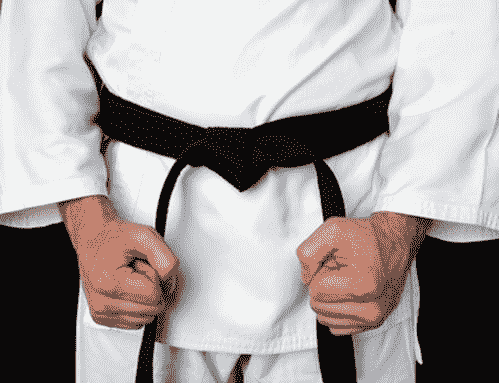
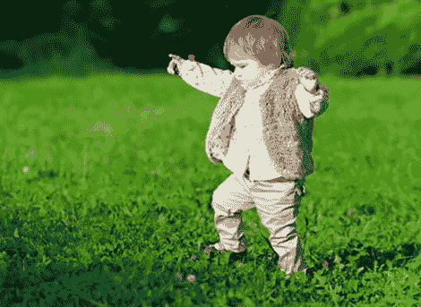

# 为什么我不做代码形

> 原文:# t0]https://simple programmer . com/dont-code-venkatasubba/

***更新:请务必查看[的评论链](https://simpleprogrammer.com/2013/08/26/dont-code-katas/#comment-1100621910)，了解更多关于代码式到底是什么的说明。感谢 Cory Foy 指出我不公平地将所有代码称为 katas，一遍又一遍地解决同一个编程问题。只有一些人这样对待代码形，这篇文章是关于为什么这种代码形是无效的。我也在这个帖子里更新了几句话来反映这一点。***

我不想让人觉得我在吹牛，但有些事我必须说出来。

但是，在我告诉你我通过无数小时无聊的练习掌握了什么惊人的技能之前，让我告诉你一点我的训练计划。

我每天早上起床。我穿上鞋子。我开始我的实践。通常我会先做个小小的热身运动，让血液在去大厅尽头办公室的路上流动起来。

当天晚些时候，我会溜出办公室去吃午饭，在去厨房的路上多练练。

当我写这篇博客的时候，我正在跑步机上一步一步地磨练我的技艺。

是的，你现在可能已经猜到了——我是一个步行高手。

我一生都在练习这种卑微的技能。我每天都在练习我的秘密手艺。我看到其他傻瓜骑着轻便摩托车和摩托车，羞怯地谈论他们在两足运输方面的感知技能。但是，虽然表面上我承认他们的话，但内心我知道我是特别的，因为我把我的技能磨练成一门手艺。

听起来很可笑？当一些人谈论做代码形时，我听起来就是这样。

## 代码卡塔斯

你可能会问什么是[代码形](http://codekata.pragprog.com/)？有些人认为代码形是指你一遍又一遍地解决同一个编程问题，认为你实际上是在练习某种东西，而不是在 IDE 中使用快捷方式。(公平地说，并不是所有人都这样看待代码表单。)

这些类型的代码式来自于一次失败的尝试，即强行模拟音乐家或运动员为了更好地完成他们的职业而进行的相同类型的练习。

## 为什么代码形无效

不要误解我，Code Katas 背后的意图似乎很到位，我完全支持软件工艺(虽然不是有时伴随它的精英主义。但是，就像每天走路不会让你成为一个行走高手，每天开车不会让你成为一个优秀的司机一样，一遍又一遍地解决同样的编程问题也不会让你成为一个编程高手。

如果你仍然有疑虑，考虑一下老年人。老年人既不是健步走高手，也不是开车高手，但他们已经日复一日地做了很多年了。他们不仅没有掌握这些技能，这些技能实际上萎缩了——他们在这些方面变得更差，不仅因为他们的肌肉和反应能力随着年龄的增长而变得更差，还因为在没有增加挑战水平的情况下一遍又一遍地重复同样的事情实际上会导致大脑对导致最终退化的活动变得自满。(至少，在我看来是这样。)

但是不要失去希望，稍后我会告诉你一个真正的方法来实践你在软件开发中的技能——一个会给你带来结果的方法——但是，首先让我们进一步剖析一下走路和开车的例子，看看为什么重复实践这些活动似乎收益递减。

## 一遍又一遍地做同样的事情不会让我们做得更好

我们首先从走路和开车开始学习，因为一切都是新的和具有挑战性的。虽然走路看起来像是一个重复的过程，但实际上正是缺乏重复给我们的大脑和身体带来了挑战，让我们从中受益。

作为一个初学走路的孩子或一个学习开车的青少年，我们不断地被新的场景和挑战轰炸，这些场景和挑战是我们以前从未面对过的。当狗跑过我们的腿时会发生什么？这对我们的平衡有什么影响，我们要做些什么来调整？这个新表面怎么样？地毯似乎会吸住我们的脚，当我们试图在上面行走时会产生更多的摩擦力。我们如何在这个表面上补偿平衡？穿着袜子在地板上行走会减少我们的抓地力，等等。

但是，作为一个成年人，或者有经验的步行者或司机，我们不会受到几乎同样的挑战；我们已经看到了大部分场景。我们每天通勤上班，很少会遇到不熟悉的刺激或需要解决的问题。我们在自动驾驶仪上运行，自动步行和驾驶到我们的目的地，无需太多努力或思考。

一次又一次地重复编写代码来解决相同的编程问题是完全相同的事情，除非您通过添加约束和扭曲来引入新的挑战，否则您只会在第一次，也许是第二次，从事该活动时受益。

现在，并不是所有做代码卡塔的程序员都一遍又一遍地重复完全相同的代码。他们中的一些人试图解决同样的问题，但是这次没有使用任何循环，或者将行数限制在某个数量或其他类似的约束。这种练习是真正有价值的练习，它挑战思维，引入新的场景，在大脑中创造新的神经通路，并强化他人。 ( [)这是一本鼓励你这么做的好书。我强烈推荐解决这本书里的问题。)](http://www.amazon.com/gp/product/0201657880/ref=as_li_ss_tl?ie=UTF8&camp=1789&creative=390957&creativeASIN=0201657880&linkCode=as2&tag=makithecompsi-20)

简单地在同一个 IDE 中一遍又一遍地输入相同的代码，每天 10 分钟，可能会让你感到放松和平静，甚至像一个音乐会小提琴手努力练习他们的音阶，但在最好的情况下，它会让你更快地使用 IDE 和输入代码；在一天的正常工作中很容易练习的技能。如果你想真正擅长编写代码来排序单词列表和计算购物车中杂货店商品的价格，请便。

## 真正的精通是如何实现的

如果你在这一点上抵制我所说的，很可能是因为你仍然错误地认为走路和开车与播放音乐、运动和编程是不同的范畴。但是，事实是，走路、跑步、音乐、运动和编程属于同一个范畴，或者说，没有范畴。

**原来真的有行者大师和司机大师。**一项并不广为人知的运动叫做跑酷或自由奔跑。不要相信我，[看看这个视频的例子](http://www.youtube.com/watch?v=WEeqHj3Nj2c)。在这项运动中，运动员变得非常擅长用自己的双脚穿越日常场所。这些从业者的所作所为令人惊叹——如果你不相信我，就看看视频吧。

至于驾驶，我可能不需要让你相信纳斯卡是“一件大事”

我的观点是，仅仅在你家附近走走或者开车上下班，你是不会成为一名跑酷专家或纳斯卡车手的，即使你确实倾向于像蝙蝠一样开车。为了在那些看似平凡的活动中达到那样的技能水平，你必须在更高的难度下不断练习，并不断引入新的挑战。

事实上，当我们真正观察真正的音乐家和体育运动员做什么的时候，他们是一样的。我严重怀疑你在收音机里听到的或在音乐会上看到的许多音乐家在他们的乐器上反复演奏“呸呸黑羊”或“一闪一闪的小星星”，直到有一天他们达到了精通。在职业体育界，只有日复一日地不断超越自己的极限，才能取得成就。

**重点是这样的:*如果你想在某方面做得更好，光是重复练习是不够的。你必须增加练习的难度和挑战性。*T3】**

## 如何提高你的编程技能

那么，你如何成为软件开发行业的大师级工匠呢？如果你不使用代码形，你怎么练习你的手艺？让我先给你举一个我见过的最好的例子。

[这是詹妮弗·德瓦尔特的博客](http://blog.jenniferdewalt.com/)；她决定通过在 180 天内建立 180 个网站来学习编码。当您坐在键盘前一遍又一遍地在 IDE 中输入相同的 20 行代码时，Jennifer 每天都在创造新的东西，面临全新的挑战。

你认为 180 天后，你和詹妮弗谁的技能会提高得更多？我想都没想就知道我会雇佣谁。

我收到很多电子邮件，询问我学习编程的最佳方法，或者某人如何提高他们的技能。最近收到很多邮件询问如何学习 Android 开发。你知道我对这些好奇的人说了什么吗？

制作安卓应用。

但是，嗯，我能读什么书呢？

没有书，只是想出一个点子，努力去创造。弄清楚一路上你需要做什么。当你陷入困境时，去寻找答案或寻求帮助。但是，我首先需要知道我在做什么。

谁说的。做然后学。边学边做，读一本书或者一遍又一遍地重复同一个练习不会让你变得更聪明或者更有技巧；不断挑战你的思维和现有技能。

## 想了解更多？

关于这个话题，我还有很多要说的，还有很多比代码形更有效的技巧，你可以用它们来磨练你的编程技能。我不能把它放在这样一个单独的帖子里，但是我会把它放在我正在做的绝密项目中，以帮助开发人员促进他们的职业生涯，并学会营销自己。

如果您想成为第一个得到通知的人，[在这里](https://simpleprogrammer.com/email)注册。我将包括许多实用的有价值的信息，你可能在其他地方找不到。

你觉得怎么样？你现在做代码形吗？如果有，你觉得它们实际上有用吗？请在下面的评论中告诉我。