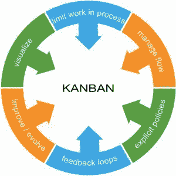
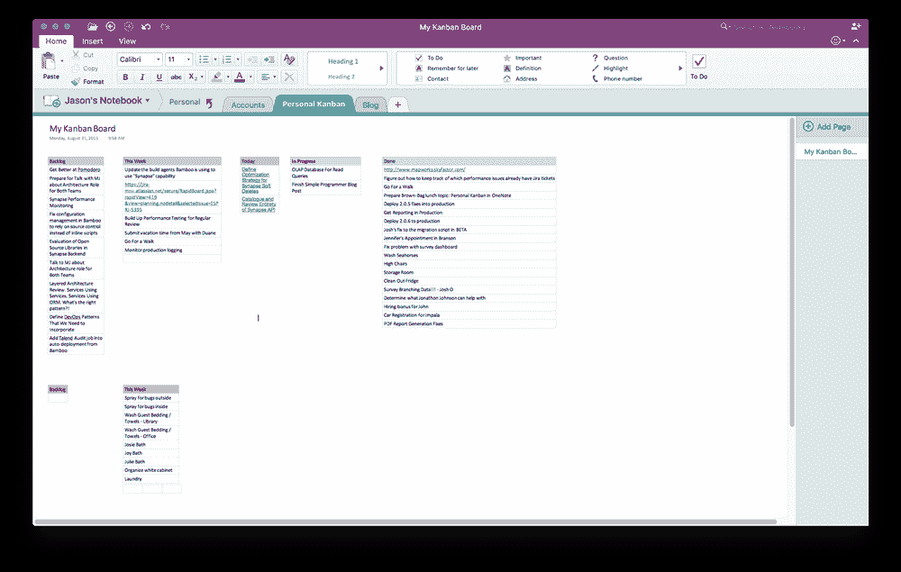

# 不要去追逐瀑布

> 原文：<https://simpleprogrammer.com/dont-go-chasing-waterfall/>

从事软件工作，你会发现流程工作流的三种通用模型:SDLC/瀑布、看板和 Scrum。如果你在做一个瀑布项目，停下手头的工作，从窗户跳出去。(开玩笑。大部分是。使用降落伞…)如果你有一个好的管理团队和一群好的同事，即使你在进行 SDLC/瀑布项目，想法也应该是将操作策略更多地朝着敏捷开发过程的方向移动。但是哪一个才是正确的呢？为什么瀑布在软件中不起作用？

如果你在一个敏捷项目中，你应该注意到没有所谓的千篇一律的开发过程。这就是敏捷的原因；它具有灵活性和可塑性，因此当工程团队为了满足客户的需求而发展时，过程也可以随之发展。瀑布最大的弱点之一是它的极端刚性，这使得它不适合你正在做的任何敏捷项目。

事实上，瀑布适用于某些类型的项目，但是这些项目并不倾向于移动软件，它们倾向于有一个可预测的过程。关于软件的任何事情都是不可预测的，这也是瀑布在软件中不起作用的原因。瀑布因可预测性而繁荣。

无论如何，任何坚实的过程都必须有一个关键的基本点。例如，看板可以限制正在进行的工作。Scrum 致力于限制范围。两者都致力于加强创意和生产之间的反馈回路。

# 瀑布:不适合程序员使用

Don’t get me wrong, I’m sure some programmer somewhere got to participate in a Waterfall project, and everything was amazingly well done. Probably. Waterfall as a project management discipline works pretty well in fields where you have a good idea of the estimated time going into the work. If you’re building a house, Waterfall is probably OK, and even preferred, because you want to get the plumber on site at the right time—plumbers are expensive.

在一个软件项目中，做一些以前从未做过的全新事情的不可预测性使得瀑布工作非常困难。因为这篇文章是针对更高级的程序员的，所以我不打算花时间解释它是如何工作的，所以如果你真的想知道你可以看看这里。

瀑布不适合软件的原因包括:

1.  僵化的时间表使得无法对未知因素进行调整
2.  范围不灵活，无法响应不断变化的客户需求。
3.  想法和测量之间的漫长反馈回路。
4.  不服从测量/调整/反应。

# 敏捷:多面光谱

工程光谱的另一端是敏捷开发概念。有两种通用的机制:看板和 Scrum。

# 什么是看板？

根据谷歌的字典，[看板](https://simpleprogrammer.com/2010/04/28/the-kanbandand-guide/)的字面定义有助于解释该机制如何工作，并被描述为“一种日本制造系统，在该系统中，通过使用显示一系列规格和指令的卡片来调节组件的供应，这些规格和指令沿着生产线发送。”此外，谷歌告诉我们，起源源自“广告牌”或“标志。”

## 汽车制造？

The general idea of Kanban is that you have different columns on a board that represent issue statuses. And your whole team works to limit WIP (Work in Progress) in any one of those columns.

看板流程以瓶颈识别和消除为中心。看板板上的每个通道都是生产流程中的一个步骤。如果任何一条车道开始堵塞，整个团队都会停下来，找出堵塞的原因。这是从汽车制造业直接采用的。如果输出中的一个工作站成为瓶颈，每个人都要共同努力消除瓶颈，以优化吞吐量。

如果你曾经使用 Trello 进行团队或个人管理，简单来说就是看板。你把卡片放在一块板上，然后跟着它们完成。尽管 Trello 非常简单，但实际上我更喜欢使用 OneNote 进行更简单的设置。

这是我个人在 OneNote 上的看板。它比这三种状态多一些，它结合了家庭生活和工作生活，但使用和理解起来仍然很简单:

  

(点击查看全尺寸图像——更清晰！)

## 这太简单了

虽然看板依赖于你所在团队的具体细微差别来工作，但一般来说，它在全自动、持续交付的环境中运行得最好。在一个依赖手工部署的团队中运行看板要困难得多，因为其中一列是部署，所有的事情都会停滞在那里。

一列有 300 张卡片的卡片很难跟踪。

如果你想要更多关于看板如何有效工作的信息，有一本名为 [*凤凰计划*](http://www.amazon.com/The-Phoenix-Project-Helping-Business/dp/0988262592) 的几乎非虚构的书，它很好地解释了如何从瀑布心态过渡到连续交付心态。这很有趣，也有点傻——但是它确实很好地教授了连续交付概念的课程。

# 我们真的不能看板:Scrum 拯救？

如果你绝对不能在你的过程中建立持续的部署，你将会有更好的运气使用 Scrum 来攻击你的项目。

如果你想花时间理解 Scrum 应该如何工作，这些人在解释这个概念上做得很好。

让 Scrum 工作起来最重要的一点是冻结范围。在你计划了一次冲刺之后，在下一次冲刺之前，不会有其他的事情发生。这使得冲刺计划会议成为 Scrum 冲刺中最重要的一天。获得正确的 sprint 范围，然后不要让任何人改变它。句号。

## 火灾呢？

The best analogy I can come up with for [Scrum/Kanban](http://www.amazon.com/exec/obidos/ASIN/1449331920/makithecompsi-20) is putting out a large forest fire.

你必须有两个(或更多)团队。一种关注森林中已经燃烧的部分(看板)，直到火熄灭。另一个关注的是防止尚未燃烧的森林被点燃的长期计划(Scrum)。后者采取一种不同的计划，是主动的而不是被动的。

我认为最好的组合是一个看板团队致力于扑灭升级支持的突发事件，一个 Scrum 团队致力于通过将产品管理集成到单一 backlog 中来推进新的范围和 bug 修复。

最重要的是，对于一般意义上的敏捷开发来说，你需要与你的同事和你的产品团队一起工作，以拥有一个单一的、统一的、有优先次序的 backlog。只要管理你的项目的人能决定先做什么，工程师就能决定如何做。良好治理的积压对于任何类型的敏捷工作都是至关重要的。

## 我们应该尝试估算吗？

如果你从字面上理解这个过程，规划扑克是 Scrum 如何运作的一个非常关键的部分。在 sprint 中规划合适的范围需要非常微妙的平衡。不管你是否将评估作为这个过程的一部分，总的想法是更好地计划每一个 sprint，这样你就可以在 sprint 时间线内尽可能多地投入。

并且，如果你决定使用评估，无论如何要关注复杂性。基于时间的估计只会给你一个动脉瘤。你永远都是错的。

老实说，我工作过的最敏捷的地方并不太关注实际估计完成很多事情的时间表。相反，更明智的做法是把注意力放在最重要的事情上，放在最优先的事情上，并且一直努力直到完成。然后继续最重要的下一件事。如果重要，花多长时间都没关系。当然，这将持续交付发挥到了极致，确实是一种只使用看板的方法。

# 保持简单

毕竟这是[简单程序员](https://simpleprogrammer.com/softskills)对吧？当你开始调整工作流程时，最重要的事情就是简化。从一块简单的板上开始，板上有三种状态:待办事项、进行中、完成。希望这个工作流程是显而易见的，但如果不是这样:

待办事项:你(或你的团队)还没有开始做这些事情。最重要的东西在最上面。

*   进行中:你(或你的团队)正在积极地完成这些任务。
*   完成:它在生产中，做它应该做的事情。

软件的概念确实可以归结为一件事:部署它。有很多方法可以达到这个目的，但它们最终都在同一个地方:可执行文件或某种网站中的代码。

If you wanted to get really simple, do what some of my project management focused colleagues recommend, and start analogue. Find a big blank wall, get some sticky notes or some index cards that you can tape to the wall, and physically move the cards around. Visibility is obviously key because you want everyone to know what everyone else is working on.

此外，在每个工作日开始(或结束)之前，和其他人一起参加一个快速会议。看看你的董事会在哪里，谈谈上面的问题，谈谈任何阻碍进展的事情。然后开始工作。这次检查的目的应该是:

*   “我昨天(今天)做了什么？”
*   “我今天(明天)在做什么？”
*   “有什么东西挡住我的路了吗？”

此外，思考一个真正有意义的简单概念:如果疼，就更频繁地做，越频繁越好。坚持做下去，直到不疼为止。这可以是任何东西。测试代码、部署、编写规范等等。找到真正让团队烦恼的东西，坚持做下去，不断优化，直到不痛为止。

# 一个积压来统治他们所有人

为了让一个敏捷项目工作得更好，你能做的比任何其他事情都要多的事情是一个优先的和有组织的待办事项。确保整个团队都在同一个工作队列中工作。你如何决定分配工作和选择最重要的任务取决于你的团队的动态。但要确保只有一份名单。

最后，确保团队和整个公司的每个人都确切地知道那里有什么以及为什么会有。如果你的同事和周围的每个人都知道其他人在做什么，以及为什么它是优先事项，那么过程的其余部分可以随着时间的推移而改进——并且你总是有足够的时间来改进它。

# 沿着敏捷性范围移动

不管你发现自己处于什么样的工作环境，你都会想采取措施走向更加灵活的方法。当然，不是每个人都认为敏捷方法是正确的方法。看板风格的开发推动团队尽可能接近真正的连续交付。实际上，这并不总是与组织方向相一致。

你怎么想呢?我们能修正不关注灵活性和敏捷性的过程吗？还是软件工程专业真的是把刚性留在了尘埃里？