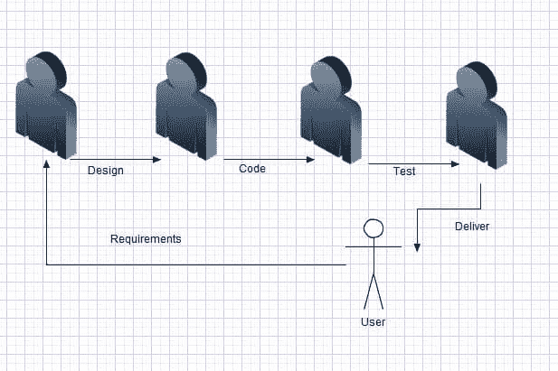
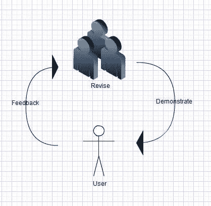

# 不要去追逐瀑布(迷你瀑布 vs 敏捷)

> 原文:[https://simple programmer . com/don-go-chasing-falls-mini-falls-vs-agile/](https://simpleprogrammer.com/dont-go-chasing-waterfalls-mini-waterfall-vs-agile/)

在当今的软件开发世界中，对于敏捷和迷你瀑布的区别有很多困惑。仅仅因为你有迭代，并不意味着你是敏捷的。

我之前写过关于[如何挂一张图片](https://simpleprogrammer.com/2010/03/02/how-to-hang-a-picture-agile-user-stories/)，作为以敏捷方式完成用户故事的类比。这个例子恰好是小型瀑布与敏捷的一个很好的例子，但是我将在这里进行更详细的讨论。

## 迷你瀑布是什么样子的？

你可以看到这里发生的是，用户给出一些需求，然后设计完成，然后开发，然后测试，最后完成的故事交付给用户。对于下一个用户故事，或者下一次迭代，这个循环又开始了。

从表面上看，这幅图似乎没有太大的问题。事实上，你可能只是对自己说“这正是我们正在做的，我们是敏捷的。”问题是:用户没有得到他们想要的。

你有没有玩过那种电话游戏，让一群人站成一个圈，你传递一个信息，当它回到最初说这个信息的人那里时，它就不一样了。

当你在整个链条中走完所有的路时，你不太可能仍然拥有最初的愿景。这是假设你有一个用户、产品所有者或企业，他们可以明确说出他们想要什么。这是极不可能的。

这种方法和瀑布方法之间的唯一区别是，您更频繁地经历这个循环。你的反馈回路更紧密，但还不够紧密。

使用这种方法，如果用户拥有一个最终会有 5 个变化的特性，那么它将至少需要 5 次迭代。最终用户很长时间后才会满意。

## 真正的敏捷是什么样子的？

这幅图并没有什么不同，但是你可以看到软件开发的各个阶段之间没有区别。相反，对于一个真正的敏捷过程，我们关注的是非常紧密和简短的反馈循环。用户提供一些反馈，或者关于用户故事的初步想法，然后团队致力于改变应用程序或者构建一些东西来满足用户的需求。

没有必要将设计、编码和测试分开，因为这些事情应该尽可能同时发生，并且软件开发的这些方面(不是连续的阶段)中的每一个都可能导致回到用户那里获得反馈。

## 约翰…约翰…约翰…你这个疯狂的梦想家…你不能在东西造出来之前就测试它…

是的，没错。但是什么是“某些东西”呢？重要的是东西的大小。我们希望事情越小越好，这样我们的过程才是连续的。这是一条流动而不是崎岖不平的道路。

这么想吧。如果你有一些数学背景，你可能熟悉[极限](http://en.wikipedia.org/wiki/Limit_(mathematics))或者如果你从事银行业，你可能熟悉[连续复利](http://en.wikipedia.org/wiki/Compound_interest)的概念。我不会在这里详细介绍这些概念，但我的想法是，您正在减少执行计算的时间，以尽可能接近瞬时。

在我们的迭代中，我们应该对软件开发有同样的想法。我们希望来自用户或企业的反馈尽可能接近连续。

是的，最终，你必须在测试之前构建一些东西，但是如果你能让你构建的东西尽可能小，你就可以开始将设计、构建和测试混合在一起，所以它们看起来是一起发生的。事实上，如果测试正在驱动设计和开发，这个过程开始变得自然。

## 如果你想停止思考迷你瀑布，开始思考敏捷…

停止考虑串行构建软件，开始考虑并行构建软件。停止从以下方面思考:

*   第一步:获取需求
*   步骤 2:设计解决方案
*   步骤 3:开发解决方案
*   第四步:测试

从以下方面开始思考:

*   第一步:找出用户最想要的东西
*   第二步:制作一小块，确保它是正确的
*   第三步:与用户一起检查，看看如何做得更好
*   第四步:继续直到用户满意