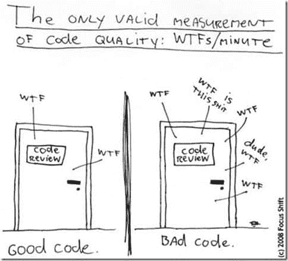

# 不要忽视代码审查

> 原文：<https://simpleprogrammer.com/dont-snub-the-code-review/>

在我工作过的许多软件商店中，代码审查的话题总是引起很多争论。

经常有人问我对代码评审的看法。我的回答可能会让你大吃一惊。

我不喜欢他们。我宁愿不做。

什么？

让我说得更具体一些。我不喜欢在工作已经完成之后进行代码审查。

我确实喜欢随着工作的进行而不断发生的代码审查。这叫做[成对编程](https://simpleprogrammer.com/2009/12/11/pair-programming-why/)。(这个 [prezi 演示](http://prezi.com/7syjl9hdcxga/pair-programming/)可能也有帮助。)

## 成对编程=持续的代码审查？

是的。这正是我要说的。

想一想。与成对编程相比，你真的能有更好、更诚实、更具交互性的代码审查吗？如果两个开发人员共同开发一部分代码，那么在编写的时候就要对它进行评审。

我将稍微转移一下话题，谈谈代码审查中出现的一些常见问题，然后我将谈谈成对编程如何解决这些问题。

## 代码审查问题

**#1。不说实话**

如果没有人说出他们真正认为代码有什么问题，而是挑出一些无关紧要的小事，比如没有遵循的命名约定，那么代码审查就没有任何价值。

太多时候，代码评审被对侮辱被评审的人的代码的恐惧所支配。这种弱代码审查没有任何好处。我甚至可以说，它强化了编写糟糕代码的实践，因为糟糕的代码是橡皮图章。

**二号。自我**

为了有一个成功的代码审查，每个人都必须在门口检查他们的自我。这种情况很少发生。代码是经过创造性设计的东西；没有多少人能接受对他们劳动的批评，对他们艺术的批评就更少了。

没有谦逊和开放的精神，代码评审不会提供任何价值。指出一个问题是一回事，对此采取措施是另一回事。

**#3。聚焦错误**

代码审查最常见的错误之一是关注格式、编码风格或命名约定。那些主题根本不属于代码评审。

工具可以自动格式化代码，并静态分析编码风格或命名约定的问题。让一个人类审查者审查这些东西完全是浪费时间。

说真的，如果有人来进行代码评审，但他们还没有对他们的代码运行自动代码格式化程序，他们还没有运行静态分析工具并修复在那里发现的问题，不要粗鲁，只要友好地告诉他们，他们的代码还没有准备好接受评审。

这里边注:关于我们是否应该强制代码格式，或者强制编码风格，或者强制命名约定，经常有争论。是啊！是啊！是啊！一致性非常重要！代码读得比写得多，一致的代码更容易阅读。进行一次这样的讨论，将自动格式化代码的自动化工具放在一起，并自动检查需求。

不要花几个月的时间来编写专门的编码标准文档。使用任意数量的静态分析工具中的一些规则集，并开始实施它们。使它们成为您的构建的一部分，使签入因格式问题而失败，使您的 IDE 在保存时自动格式化。决定花括号和空格的完美位置远不如保持一致重要。挑一件事，然后执行它。

代码评审应该关注代码的设计、结构和可理解性。代码审查应该永远永远永远不要关注任何可以自动检查或强制执行的东西…永远不要！

**#4。拉什&前后矛盾**

团队很少有或没有时间进行代码评审。如果它们这样做了，那么它是不一致的，并且不会应用于所有代码，这会导致值丢失。如果你有一个巨大的围栏，但有一个大洞，人们可以爬进去，围栏是没有价值的。

如果代码没有得到深入的评审，那么进行代码评审是没有意义的。只是浏览代码，在这里或那里挑选几个变量名并没有什么好处。如果你还没有准备好完全沉浸在被评审的代码中，并深入理解它到底在做什么，那就不要费心了。

## 配对编程来拯救

成对编程就像实时代码审查。它通过拥有一个共同的目标和在代码中创建一个共同的所有权来解决这些问题。

当你与团队的不同成员配对时，你可能会更加诚实，不那么自私，专注于问题而不是惯例，并深入钻研代码。

众所周知，我更喜欢的*工作方式*是没有代码审查，而是成对编程，每个人都监控提交到源代码控制，如果他们看到有问题，可以标记一些东西并进行讨论。

## 如果配对编程不是一种选择呢？

好吧，试着做一个。成对编程是一项伟大的投资。

但是，如果你没有进行成对编程，你绝对应该进行代码审查。我可能赞美了代码审查的一些问题，我提倡成对编程，但是我们不要在这里拐弯抹角。

结对编程是进行持续或即时代码审查的更好方式。不做任何形式的代码审查是非常愚蠢的。

如果你有一个建筑团队在建造你的房子或你的价值 2000 万美元的摩天大楼，他们告诉你他们没有对已经完成的工作进行工程审查，你可能会当场解雇这家建筑公司。构建软件比大多数物理建设项目的复杂程度要高几个级别。如果你称自己是工程师，而你没有定期检查你的工作，你只是一个扮演“工程师”的业余爱好者

因此，如果你必须做老式的代码审查，这里有一些我认为有用的提示:

*   通过做一些练习来鼓励人们诚实，在这些练习中，每个人都回顾一些不是由团队中的任何人编写的代码。鼓励人们在审查代码时尽可能地保持偏见。
*   设定你的期望。代码审查不是一个批准过程，而是一个改进过程。确保团队意识到这一点。代码评审是一个让你的代码变得更好，并提高你的技能的地方。培养这种思维。
*   自动化所有挑剔的东西，并设置编码标准、格式标准和样式标准。决定他们将在一起做什么，或者让你有经验的人来做，但要完成它，使一致性不可选择，并使它自动化。
*   开发关于代码评审的一致标准和实践。留出足够的时间深入钻研代码。设定并执行何时以及如何评审代码的标准。
*   以身作则。主动要求团队成员查看您的代码，并告诉您如何改进它。询问是否有更好的方法。对反馈和改进表现出真正的兴趣，这种态度会流行起来。