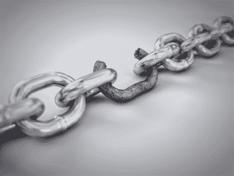

# 不要专注于你的优势

> 原文：<https://simpleprogrammer.com/dontfocusonstengths/>

伙计们，伙计们，伙计们…(和女孩们)

我认为我们开始变得有点“老实巴交”——我们所有人——无意冒犯。

我发现生活中最大的成功就是努力克服自己的弱点，并把它们变成优势。为什么？因为，当你把弱点变成优势时，你会更欣赏它，你会更投入和致力于进一步改善它。

## 变成优势的弱点是战利品；你为之努力的东西

把弱点变成优势需要纪律、决心和专注。这意味着当你这样做时，你更有可能长期坚持下去。

我们认为理所当然的优势。我们倾向于用实力来追随我们的激情，因为它们是自然而来的。

我不只是这么说。

老实说，我天生懒惰、不爱运动、内向、害羞，而且不擅长书面交流。 

有一天，我决定停止不运动。所以，我在高中加入了摔跤和田径，开始举重和跑步。完全违背了我的书呆子气，虚弱，脆弱，肥胖，懒惰的本性。现在，这是我的优势之一，我坚持下去，因为我投入了太多。我很敬业。

绘画和艺术对我来说是天生的。从我很小的时候起，我就能画出近乎完美的马里欧和卡通。不是开玩笑，我会证明给你看的。不管怎样，我现在画吗？我能进一步发展这种力量吗？不。当然，我可以，但是我缺乏动力，因为我从来没有努力过。我对它没有真正的欣赏。我们认为是理所当然的自然优势，我们感觉不好，因为它们不是我们赢得的，而是我们与生俱来的。

## 我不是说你从不关注自己的优势，但我想说的是:

你最大的弱点决定了你有多强。整个最薄弱环节的事情。不能只盯着自己的强项，因为要在瓶颈处攻克问题。当你的硬盘速度很慢时，越来越快的 CPU 速度对你没有好处[。](http://www.amazon.com/gp/product/B00E3W1726/ref=as_li_tl?ie=UTF8&camp=1789&creative=390957&creativeASIN=B00E3W1726&linkCode=as2&tag=makithecompsi-20&linkId=5V5QBZ5PGBBQTXSM)

还有，最烂的东西，通常对你最有好处。我觉得我们最近都变得有点软弱了，包括我自己。当然，你不可能一直保持 100%的状态，但是没有努力、纪律和最重要的承诺，就不会取得成功。

承诺是真正的杀手。当然，我可以花一天时间做我不想做的事情。我甚至能坚持一周，但我能日复一日坚持一年吗？十年了？成功需要长期的奉献和承诺。[许多人在成功前止步不前。](https://simpleprogrammer.com/2013/04/07/bad-advice-stop-working-so-hard/)

## 成功从何而来？

最痛苦的事情是那些让我最成功的事情——如果你仔细观察，我相信你也会发现自己也是如此。

不要忘记你从哪里来。不要忘记你现在已经爬上的山。不要忘记，也许就在几年前，你与魔鬼做了多少笔交易，才有了现在的地位，仔细想想你是如何走到这一步的。你到达这里的方式和到达那里的方式是一样的。

或者也许你还没到那一步。也许你还没有爬上第一座山。如果是，是什么阻止了你？你害怕做一些你不想做的事情吗？也许是时候穿上工作服，拿起铲子铲点肥料了。

## 领先只会带你走这么远

我知道我已经开始有点偏离主题了，但我的观点是，你不会仅仅依靠你的优势度过难关，如果你试图只关注你的优势，你会发现你缺乏取得成功的承诺和坚持。

我并不是说不要利用或发展你的优势——这样做——但是，要意识到你为发展你的劣势——尤其是那些最阻碍你发展的劣势——所付出的努力从长远来看可能会给你带来最大的回报。

请这样想:力量或天赋就像赛跑中的小小领先。这有助于对抗同样强大的竞争对手，这是无与伦比的优势。但是，在一场真正漫长的比赛中，与那些经过艰苦训练并发展了自身能力的选手比赛，这种领先实际上毫无意义。如果你依靠你的实力给你的人生领先，你最终会被超越。

从另一个角度来看，你可以成为一个没有领先优势的人，但比其他人跑得更好。我知道很多天生有天赋的人最终什么也没做，因为他们从来没有开发过这种天赋，超越了它给他们的最初开端。

从长远来看，你认为谁会成为更好的音乐家，是有音乐天赋、每周演奏一次乐器的人，还是几乎五音不全、每天练习几个小时的人？

同样，我不是说不要利用你的优势，而是战略性地利用它们。用你的力量一击就把墙推倒，而不是一点一点地敲。通过从你的弱点中发展辅助优势来增强你的天生优势。

此外，把发展你的弱点作为发展我们没有人天生就有的技能的一种方式。自律和耐心必须培养，不能直接培养。它们总是解决弱点的间接结果。你没有学会如何通过做自己喜欢的事情来控制自己、集中注意力并坚持到底。你通过做一些感觉像要杀死你的事情来学习它。

(顺便说一句，我知道我一直在推销这本书，但它确实是让你痛不欲生并激励你奋力前行的最佳书籍之一，所以如果你还没有读过《艺术的战争》,那就帮你自己一个忙，把它拿来读一读。)

## 你能弥补一个弱点吗？

是的，我知道我很顽固。那是我的工作。如果你希望有人为你粉饰太平，你可能应该去读另一个博客。我只是告诉你这是怎么回事。

专注于你的优势，让你周围的人帮助弥补你的弱点，怎么样？这是一个伟大的想法，但它有其局限性。你不能用这个作为作弊代码来阻止自己充分发展自己的性格和纪律。

当然，你不可能什么都擅长，但如果你——比如——雇佣一名会计师，因为你不擅长财务，也不懂钱，猜猜会发生什么？你将被敲竹杠，你甚至不会知道。我并不是说你应该自己纳税或者自己处理每一项工作，但是在你雇佣某人做一项工作之前，你需要知道如何自己去做——而且你甚至需要在这方面有一点点的擅长。

我之前已经谈过这个问题，但是你不可能知道某人在某件事情上有多好，除非你自己至少在那件事情上有一定程度的好。相信我，我自己也犯过这样的错误，试图雇人来弥补我的弱点，而不是努力克服这个弱点，我一直都很后悔。你不能欺骗系统。

那么，我是不是在提倡让自己筋疲力尽，向这么多方向伸展自己，以至于你在很多事情上变得平庸，而不是某一方面的专家？

当然不是。我想说的是，你需要直接面对它们，而不是对你的弱点进行修补并试图避免它们——尤其是当它们阻止你走上通往成功的道路时。

我只是想让你意识到这样一个现实:天生的优势和领先优势在生活中并不意味着什么，除非你碰巧有 7 英尺高，在这种情况下，你可能会成为一名优秀的篮球运动员。(但是，即使有这样的优势，如果没有大量的练习，一个比你矮的玩家仍然能够打败你。)

总而言之。放聪明点。利用你的长处，但也要发展你的短处。不要因为某件事对你来说是一个明显的弱点而不去做或回避它。如果你这样做，你将会剥夺自己实现有意义的个人成长的真正机会。如果你从来不处理你的弱点，你就会像那个重量级拳击手一样，可以打出一记强有力的击倒，但却有一个玻璃下巴。

如果你想从一个关心让你成为更好的自己的开发人员那里得到更多以开发人员为中心的、强硬的建议，或者你想加入 5000 多名其他开发人员的简单程序员社区，请在这里注册。我偶尔会试着卖给你一些东西，但大多数时候我会踢你的屁股。