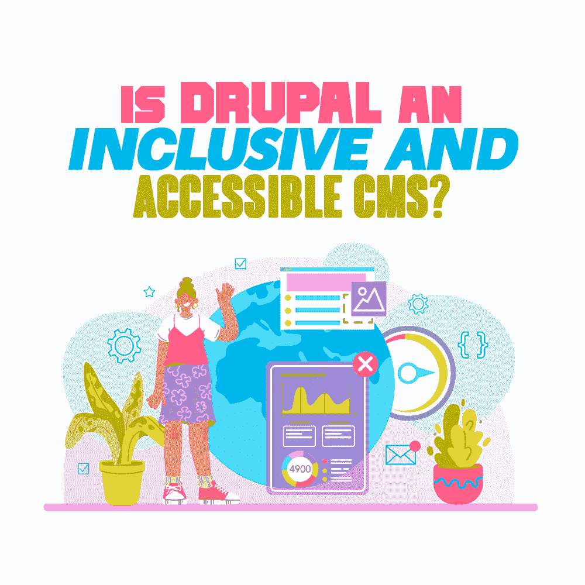

# Drupal 是一个包容的、可访问的 CMS 吗？

> 原文：<https://simpleprogrammer.com/drupal-accessibility/>

The entire Drupal community is [dedicated to building an accessible platform](https://simpleprogrammer.com/pros-cons-open-source-software/) for developing websites that can be used by individuals with impairments. Specifically, people can perceive, understand, navigate, and interact with the web. This might include issues with the following types of functions:

*   听众
*   认知的
*   神经病学的
*   物理的
*   演讲
*   视觉的

这项工作始于 Drupal 7 可访问性的改进。Drupal 承诺确保所有 Drupal 核心功能符合万维网联盟(W3C)的 WCAG 2.0 和 ATAG 2.0 标准。该团队还将升级 Drupal core 的前一版本，版本 6，在可行的情况下提高[的可访问性](https://www.amazon.com/Web-Everyone-Designing-Accessible-Experiences-ebook/dp/B00HCREJZ6/ref=sr_1_2?keywords=drupal+accessibility&qid=1638626637&sr=8-2)。

在这里，我们将看看 Drupal 在特定的可访问功能方面提供了什么。

## **Drupal 的可访问特性**

**如果您使用屏幕阅读器或其他辅助技术，您会很高兴了解到 Drupal 是为了促进和支持语义标记的使用而创建的。例如，对于页面级导航，您应该能够依赖标题。使用标题组织网页有助于人们理解页面结构。标题看起来比周围的文字更大更清晰。因此，屏幕阅读器可以使用标题来跳过重复的内容，如标题、菜单和侧边栏。**

**Drupal 可访问性团队的任务是识别和解决可访问性问题。他们发现并修复了 Drupal 7 核心代码中的一些 bug，并提高了社区意识。**

**WAI-ARIA 提到了“网页可访问性倡议——可访问的富互联网应用”它是由万维网联盟(W3C)编写的技术规范，W3C 制定了 WCAG 指南。**

**因此，Drupal 站点所有者可以利用 WAI-ARIA 来验证交互式内容是否符合 WCAG 的成功标准。拖放部件、手风琴和滑块都是交互式内容的例子。**

**虽然我们在网站上经常看到这些内容，但是使用这种类型的内容来开发网站会给辅助技术的用户带来问题。这可能会使某些残障人士无法访问网站。WAI-ARIA 试图提高两个特殊群体的网站可用性:那些不能使用鼠标和依赖语音命令来控制他们的小工具的人和那些依赖屏幕阅读器的视觉障碍者。**

**Drupal 团队增加了 WAI-ARIA 功能，为这些组件提供更多支持。Drupal 的访问者和管理员都得到了显著的增强，包括:**

*   **拖放功能允许依赖键盘的用户与元素进行交互，而以前只有鼠标用户才能使用这种功能。**
*   **为不同视觉需求的人提供颜色的对比度和强度。**
*   **在核心主题中添加跳转导航是节省时间的一个很好的方法，因为它不需要浏览页面中重复或不必要的部分。**
*   **图像处理，允许用户调整图像，使其适合自己的最佳观看方式。**
*   **使用屏幕阅读器时逻辑阅读顺序的表单标签。**
*   **删除重复的或空的标签，这意味着页面对于屏幕阅读器用户来说具有更好的逻辑流程。**
*   **开发者的可访问性，允许那些依赖 Drupal 本身来构建站点的人可以从前端和后端的角度进行访问**

## **Drupal 模块**

**如果你想在安装之前知道一个模块是否可访问，只需进入 Drupal.org 上该模块的专用页面，寻找“D7AX”标签。这表明模块的开发人员遵循 Drupal 指南来创建可访问的模块。因此，他们尽了最大努力来保证他们的程序和他们生成的信息是可访问的。**

**每个 D7AX 开发人员都很高兴听到您对他们的模块的体验，特别是如果您发现了一个他们不知道存在的问题。**

## **可访问的 Drupal 主题**

**主题层是许多可访问性困难出现的地方。同样，在选择主题之前，检查 Drupal.org 页面上该主题的 D7AX 标签。与贡献的模块一样，标签表示主题的创建者正在积极地改善他们作品的可访问性。**

**Drupal 开发团队还开发了一个可访问性指南和一个主题化指南可访问性部分，让主题者更容易理解 Drupal 最佳实践是什么。**

## **社区 Drupal 站点**

**Drupal 作为一个实体由三个网站管理，这三个网站都由 Drupal 协会管理。这些站点是 Drupal.org(Drupal 所有东西的中心，包括核心和贡献模块、安全更新和大量帮助构建 Drupal 站点的文档)、Drupal Groups(用于事件和会议)和 Drupal API 文档站点(用于帮助开始使用 Drupal)。**

**其中两个站点运行在 Drupal 7 上，我们承认这些站点存在一些可访问性问题，这导致一些 Drupal 社区无法参与平台本身的贡献。然而，这些问题正在尽快得到解决。也就是说，Drupal 生态系统中的任何一部分都将尽快启用。**

**社区站点的目标是那些在 Drupal 上工作的人，而不是 Drupal 站点的用户。然而，那些提供代码和非代码贡献的人同样重要，这样他们就可以继续改进 Drupal，所以值得注意的是，可访问性也从内部得到了重视。**

## **Drupal 8 和 9 核**

**符合 WCAG AA 标准意味着网站对大多数有残疾或无残疾的人来说是可用的和可理解的。自然，网站所有者应该致力于迎合尽可能多的用户。**

**AA 标准确保(但不限于):**

*   **色彩对比足够。**
*   **使用替代文本或类似的解决方案来表达图像的含义。**
*   **该网站的导航是一致的和合乎逻辑的。**
*   **表格有适当的标签。**
*   **屏幕阅读器可以浏览网站。**
*   **标题按逻辑顺序使用。**

**Drupal Core 的构建是为了促进符合 WCAG 2.1 AA 和 ATAG 2.0 标准的站点的创建。随着 Drupal 9 的发展，Drupal 可访问性社区将参与采用最佳实践。这是 Drupal 致力于将可访问性作为标准融入平台的一个很好的标志。**

## **特征**

### **语义改进**

**Drupal 的创建者 Dries Buytaert 希望确保开发人员把时间花在实现直接有利于 Drupal 用户群的特性上。因此，Drupal 9 支持语义标记的适当使用，允许广泛依赖屏幕阅读器的整体 Drupal 用户一致地使用标题进行页面导航。**

### **可以控制 Tab 键顺序**

**TabbingManager 是一个非常棒的新工具，它以逻辑的方式引导非视觉和非鼠标用户找到页面上最重要的组件。对于使用屏幕阅读器的人来说，这使得通过键盘导航遍历复杂的用户界面变得更加容易。**

### **隐藏或不可见的元素**

**并非所有隐藏内容的方式都适合使用屏幕阅读器或自适应技术的用户。有时，最好在视觉上隐藏一个元素，因为它在页面上并不需要。**

**Drupal 使得隐藏这些元素成为可能，而不会对屏幕阅读器造成负面影响(否则，屏幕阅读器可能会大声读出元素是什么，包括它被标记为不可见的事实)或生成错误或警告消息(这本身也会破坏用户体验)。**

### **字段集**

**Drupal 表单 API 现在允许模块开发人员设计表单，以符合 WCAG 2.0 AA 标准的方式收集、验证和处理用户提交的数据。这是 Drupal 表单增强的一个重大进步。**

### **Alt Text**

****

**Alternative text, also known as “alt text” for short, “alt attributes,” “alt descriptions,” or even “alt tags,” are used within HTML code to describe the appearance and function of an image on a page. A screen reader will use this information for those with visual impairments.

根据 WCAG 准则，英国所有公共部门网站现在都必须默认使用替代文本。如果不使用，该组织很可能面临罚款。

就其本身而言，alt 文本对于添加到 Drupal 站点的所有图像元素都是强制性的，因为它对使用屏幕阅读器的站点访问者非常重要。Drupal 开发人员目前并不打算让它成为可选的，除非有人能提出相反的令人信服的理由。

### 奥里维罗

Olivero 是 Drupal 9 的默认主题。它符合 WCAG AA 标准。事实上，外部可访问性专家和 Drupal 可访问性团队都确保该主题继续顺利通过 Drupal 严格的可访问性标准。

### 可访问的内嵌表单错误

随着可访问的内联表单错误作为一个可选的实验性核心模块的引入，Drupal 表单对于那些有视觉障碍的人来说变得更加容易访问。用户现在更容易理解他们在填写在线表格时犯了什么错误。

也有很多旨在进一步扩展 Drupal 可访问性的贡献模块。

## 如果您需要关于网页可访问性的更多帮助

如果你需要专家的帮助，Code Enigma 是一个经验丰富的 Drupal 网络代理。他们可以在您的网站上执行可访问性审核。他们提供可访问性审计服务，检查您的网站或应用程序是否符合《网页内容可访问性指南(WCAG)2.1 AA 级》的基本要求。

在整个评估过程中，不符合 W3C 标准的情况和问题都将被强调出来。他们的技术团队将为您提供一份报告，描述所发现的问题以及如何补救的建议。然后，为了让你在你的网站上发布，他们会开发一个可访问性声明。**