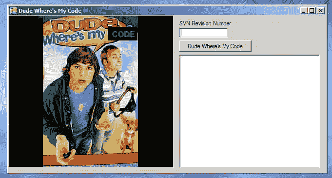
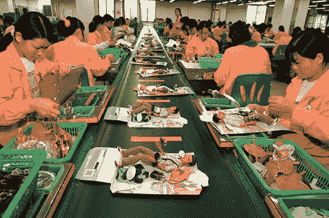

# 伙计，我的代码呢？

> 原文：<https://simpleprogrammer.com/dude-wheres-my-code/>

这个星期我的团队花了两次时间测试一些不在我们测试环境中的东西。

这一周发生了两次。

这以前发生过。

再也不会发生了。

为什么？因为我做了我一直做的事。我写一个工具。我碰巧把这个工具叫做“哥们，我的代码呢？”。

这个小工具将允许您输入您的签入的 SVN (subversion)版本号，并告诉您的哪些环境部署了更高的 SVN 版本。

不过，我不是在写这个简单的小工具。这种大小的工具不到一个小时就能组装好。我写的是这个小工具将会节省的时间。 

## 软件开发与自动化有关

那么，我们不应该自动化软件开发吗？我以前写过这个话题[，说每个项目都应该有一个专门的开发人员工具团队](https://simpleprogrammer.com/2009/12/03/dedicated-developer-tools-teams/)。我可能会再次写这个话题，**它是如此重要。**在开发和质量保证活动中，我们花费大量时间重复做同样的事情。我们没有注意到它，因为我们的大脑在游戏中，试图完成手头的任务，但如果有人从外面看着我们，他们会看到重复的过程。他们不仅会看到你个人的重复过程，还会看到你团队中的所有其他开发人员都在做同样的事情。

我有一个我喜欢遵循的一般规则，大概是这样的:

> 做一些繁琐的过程一次，我的游戏。
> 
> 把一些繁琐的流程做两遍，我在想怎么把它自动化。
> 
> 做一些繁琐的过程三次，我创造了一个新的工具。

我共事过的一些人对此很恼火。我手下的一些管理人员认为我是在“玩”，但几乎总是这个工具被大量使用，最终每个人都想知道没有它他们如何运作。我不想在这里自吹自擂。这不是因为我创造了令人敬畏的激进工具，也不是因为我是一个超级天才。(这两个都不是真的。)原因是因为我看到了一种需求，我满足了这种需求。当你让人们变得更有效率时，你就提供了指数级的投资回报。

如果你不相信这一点，让我们稍微分解一下，想想软件在很大程度上是如何自动化的。想想你写的最后一个程序。它是为了自动化一些手动过程而编写的吗？很有可能是。如果是，为什么？自动化手动流程有什么好处？如果你不知道这个问题的答案，你可能很难卖出你的软件或者证明它的预算。

我在这里的观点是，如果你正在创建的软件是为了自动化一个手工过程，因为它将节省资金，并使人们做“x 活动”更有效率，那么你怎么能认为一遍又一遍地做同样乏味的事情是可以的呢？对此有一个术语。叫做“吃自己的狗粮。”作为一个软件开发人员，最终的“自食其果”是自动化你的软件开发过程。

## 准备…设置…自动化！

既然你们都同意自动化并编写好的工具来帮助你们变得更有效率，你们可能会问自己“太好了，但是我自动化什么呢？”在我的下一篇文章中，我将介绍一些你在软件开发过程中可能会从自动化中受益的常见领域。

“我的说什么”

“哥们儿！”

“我的说什么”

“甜！”

我的说什么

“哥们儿！”…