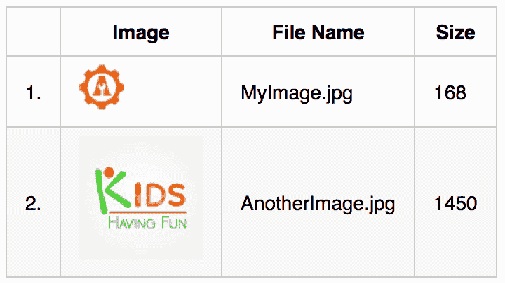
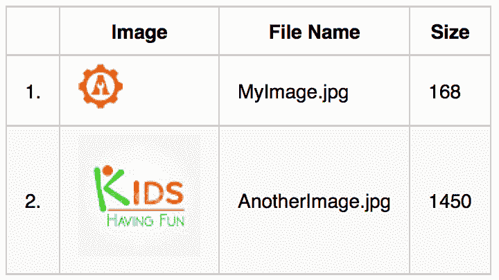
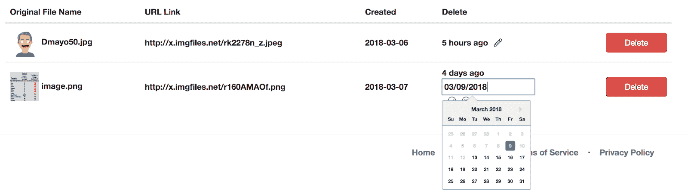

# 让愚蠢的组件变得聪明:重构

> 原文：<https://simpleprogrammer.com/dumb-components-smart-refactoring/>

Learning new skills is how we as programmers stay sharp and stay employable. I recently started a gig that gave me an opportunity to learn something new, but I had to develop a few workarounds to learn a new framework and make it do what I needed it to do.

样板代码可以帮助快速启动项目。您可以为各种不同的语言和框架找到这些入门包；它们提供了应用程序和网站的许多共同特征，例如，登录页面、数据库连接和菜单结构。

事实上，这些软件包本身功能齐全。作为一名开发人员，您只需要按照您的规范来构建它们。

这些样板代码模板的另一个很好的用途是当你学习一个新的框架时。它们提供了真实世界的工作示例。然而，它们通常有一个缺点:它们可能太简单了。

一个流行的后端 JavaScript 框架 MeteorJS (Meteor)最近决定扩展其前端模板框架，以包括 ReactJS (React)和 Angular。这是一个巨大而可喜的变化。React 是比较流行的前端框架之一。对于我的新工作来说，它也是一个很好的框架，所以是时候通过学习这个新的 JavaScript 框架来扩展我的技能了。

为了帮助我开始学习，我求助于一个叫做 TheMeteorChef.com 的关于 Meteor 的伟大资源。这个小组为 Meteor/React 项目发布了一个样板文件，名为 [Pup](https://github.com/cleverbeagle/pup) 。这是一个很好的入门应用程序，但是像大多数样板代码库一样，我需要我的应用程序具有的交互性并没有内置。我必须扩展我的 React 知识，这样我才能满足这个项目中的所有利益相关者。

我很幸运，不仅得到了这份工作，而且它足够小，我可以选择技术堆栈。我已经在 Meteor 中开发了一年多，并且已经开始真正喜欢一个工作原型可以如此快速地启动和运行。所以我抓住机会在 Meteor 和它的新支持 React 中做这个项目。

让我告诉你我是如何把 React 的表示性的，或者说“愚蠢的”组件变成 React 的“智能”组件，从而使我的项目成功的。

## “智能”和“非智能”组件的区别

当提到这些非官方的描述性名称时，理解什么是愚蠢和聪明的 React 组件就容易多了。

哑组件是应用程序呈现 HTML 的方式。它们是你网站的外观。你给他们一些数据(通过 props ),他们把格式化的数据发送给浏览器。他们不太聪明。他们是只会一招的小马。他们完成工作后就离开了。

另一方面，智能组件使您的应用程序能够工作。智能组件不仅像哑组件一样接受数据(也通过 props ),它们还监视和捕获最终用户发起的任何数据更改。

React 将捕获的实时监控包括，例如，管理部分的更新，购物车中产品数量的变化，甚至只是单击下拉描述框。您可以使用智能组件来更新数据库、跟踪对象的状态以及将操作相互绑定。

下面是一个非常基本的组件，它接受一个值(通过 props)作为包含年份的对象，然后在 HTML 代码中输出。这里没什么特别的。这是一个很好的老式功能。

虽然仍然有效，但您可能在旧版本的 ES5 JavaScript 语法中发现了相同的功能:

仅仅因为一个组件是哑的，并不意味着它不能是复杂的。这里有一个例子，它不仅可以输出输入的数据，还可以循环数据库记录，计算值，并提供一个非常灵活的功能应用程序。但这并不明智。

## 分解复杂的哑组件

因此，让我们浏览一下这个愚蠢的组件，看看它是如何比前一个例子更复杂的。仅仅因为它是一个愚蠢的组件，并不意味着它没有用。远非如此。

这是一个产品页面的主要示例:从数据库中检索的产品属性列表。现在，这种类型的输出通常会链接到一个产品描述页面，而不是一些“智能”的交互，例如，人们可以将产品放在购物车中。

它只是一个基本的函数，输入一些数据(“加载”和“图像”对象)并将一些格式化的 HTML 返回给浏览器的文档对象模型(DOM ),最终用户可以看到它。

这个函数的名称是“Output”，而“loading”(通常是一个布尔值)、“images”(一个对象数组)和 counter(一个数字)对象中的值被传递给这个函数，以便可以将它们放在返回的 HTML 中。在 React 框架术语中，这些输入统称为“道具”。这是函数的 ES6 语法，有时称为“粗箭头函数”在旧的 ES5 中，它将被写成:

传递给函数的第一个参数是“loading”对象。这是一种非常常见的设计模式。当您的应用程序加载这个视图或页面时，它会对数据库进行异步调用，以获取所有的图像数据，并将其打包到一个漂亮的对象数组中。

这个页面/视图/组件还检索所有的图像和其他元素以显示在页面上。当这个动作发生时，“loading=true”，这告诉你的应用程序它没有当前页面/视图/组件的所有必要的构建块。

因此，显示一个微调器，直到它拥有了所有的信息，此时“加载组件”(<loading>)将“加载”的值从 true 更改为 false(由您决定是否应该使用[百分比进度条或普通微调器](https://awesomeautomation.com/blog/2-minute-tool-tip-spinner-or-progress-bar))。</loading>

传递给函数的第二个参数是“images”对象，如前所述，它是从数据库返回的对象数组。这些可以是产品、评论、博客文章或任何具有相同数据结构的项目列表。让我们看看这些数据可能是什么样子。

### 检索和显示数据库记录

每个对象包含一个唯一的数据库记录标识符(_id)、图像文件的名称(fileName)、图像的大小(以字节为单位)( size)以及可以通过 internet 访问图像的通用资源标识符(URI )( src)。

这是两个包含独立图像数据的对象。它可能来自一个不同函数中的数据库调用，该函数将所有结果数据库对象“分组”到一个数组中，然后传递给我们的“输出”函数。

或者，您可以手动创建阵列。您将在许多样板框架中看到手动创建的数据库对象，因为它们的创建者不会连接数据库并为各种原因提供填充数据，尽管在我看来，这些原因是虚假的。当你试图学习一门新的语言或框架时，这种捷径可能会非常令人沮丧。

因此，如果您看到类似下面的代码，通常是因为没有连接数据库。

两个结果都提供了如下所示的数组函数:

如果您想访问每个数据库记录或对象，您可以像这样调用它们:

The third prop passing to the ‘Output' function is ‘counter'. This prop is just a number, in this case, a zero. There are other, more elegant ways to count the iterations of a loop, but for illustrative purposes, it is included so that I can show how a dumb component can still do advanced procedures.

所以现在我们知道了当函数被调用，输出由 DOM 返回和呈现时，会出现什么数据。当我们将这个愚蠢的组件重构为一个智能容器时，我们将使用相同的数据，但增强了组件的功能，以及组件允许最终用户以更好的用户体验完成的功能(UX)。

现在函数有了数据，让我们使用' loading '变量，看看我们是否应该显示 HTML 输出或微调。这是一个 if-else 简写语句，其形式为:

条件？如果为真，则这样做；如果为假，则这样做

x == 2？“是”:“否”；

我们将它理解为:“未加载”，这是对还是错？

这个语法在更冗长的 ES5 语法中可能更有意义:如果数据库返回了数据集，则显示它；否则，显示微调器。

## 无声输出

既然函数已经有了一些要使用的参数，让我们开始构建 HTML(或者在本例中，JSX，React 的 JavaScript 的 XML 预处理器)来输出到 DOM 进行渲染。如果我们能够理解这个哑输出是如何工作的，我们转换成智能容器的过程将会容易得多。

该代码有一些基本的 Bootstrap ' '标记(实际上，该表是一个 ReactJS 组件，由大写的单词标识)。然后是常见的 HTML ' '和头标签''等。

| Original file name |

然后是数据库输出。这段代码非常典型，并不是唯一需要反应的代码；它只是每行输出一条数据库记录。在早期的 ES5 JavaScript 语法中，有很多方法可以遍历一组数据库记录(“for”、“while”等)。)，但在 ES6 中，我们使用的是‘map()’方法。

这段代码对于这个函数非常重要。它告诉浏览器中的 JavaScript 引擎，您将对一组数据库记录进行循环。最外面的花括号' {} '表示这是动态代码。

让我们取传递给我们函数的“images”对象，并对其进行解构——我们将从每个对象(imageObject1、imageObject2 等)中提取各个数据点(_id、fileName、size、src)。)在数组中。然后我们可以在 HTML/JSX 中使用这些作为输出。

对于从结果集“images”中的数据库返回的每个记录，“map()”方法中的这个动态“”块将被输出到 DOM 一次。

## 那太好了，但是你不能和它互动(它是哑的)

既然我们已经完全理解了这个愚蠢的组件是做什么的，那么让我们思考一下它没有做什么。

为什么我们输出一个包含行和列的简单表格？传达信息，对吗？

想想棒球比分；股票权益数据；仓库库存。现在，我们多久才接收一次这些数据？我们不想看那场比赛吗？交易那只股票？用新货更新库存？

大多数情况下，您希望为每一行提供 CRUD(创建、读取、更新、删除)方法，以便最终用户可以与数据进行交互。今天的技术让最终用户能够更高效地工作，web 技术也不例外。

十年前，所有的交互都必须在服务器上进行，所以你可以从列表中单击一个产品，然后告诉服务器向浏览器发送一个产品详细信息页面，用户可以在那里将产品放入购物车。现代网络技术能够像以前一样进入产品详细信息页面，但现在我们也可以直接从列表页面将它添加到购物车中。更复杂，也更聪明。

## 让我们让这个组件变得智能！

我需要终端用户对我的图像数据行进行操作。行需要被删除，但是还有一个用户可以修改的日期字段。

下面是用户界面(UI)的截图。有一个简单的删除按钮，单击它，显然会从数据库中删除该行。

设计规范要求日期以文本形式显示，而不是在“输入”框中显示(见第一行)。为了表明它可以被编辑，铅笔图标将是可点击的，并将文本转换成可编辑的“输入”标签(参见第二行，注意铅笔图标被替换为可点击的复选标记，该复选标记将提交更改的日期)。

删除按钮的代码相对简单。您只需要将惟一的行标识符(在许多情况下是数据库记录号)与“onClick”事件关联起来。

当按钮组件(<button>)被单击时，它调用一个新函数‘handle delete()’，这个函数实际上执行从数据库中删除的操作。

注意，通过添加删除按钮的功能，我们已经开始了对哑组件的重构。这个动作是“智能的”,因为我们将删除按钮的动作绑定到执行某些操作的函数:告诉数据库删除一条记录。

回想一下我们对智能容器的定义:让应用程序工作的代码。它在做一些事情。它在删除记录。

老实说，这个功能包含在样板代码中。这并不难，你只需要让你的代码调用另一个函数，这个函数与数据库对话，并在完成后给用户一些反馈，就像一个警告框。

### 增强最终用户体验

现在，让我们更进一步。当我们点击一个按钮(铅笔图标)时，我们不会从其他抽象的代码片段与数据库对话；相反，我们正在改变 DOM，即终端用户当场看到的内容。

在上面的代码片段中有一点噪音，但是它只是我们一直用来输出数据库结果的一行的同一个动态块。我们添加的是两个图标(字体牛逼铅笔和 CheckCircle)。一个基本的 if-then 简写语句(' this.state.editDate？x:y’)将它们分开并决定显示哪个。

“this.state.editDate”是跟踪应用程序中发生的事情的一种“智能”方式。这叫状态。基本上，它是一个会话变量。“editDate”初始化为“false ”,因为日期未被编辑。请注意，在铅笔图标组件中，有一个“onClick”事件调用函数“changeFontAwesome()”来改变这种状态。

在后台，内置于 React 框架中的这个“智能”组件会注意到值发生了变化，因为它在监听各种变化。然后，该组件将重新评估 if-then 速记语句，并基于新值(“true”)显示“then”语句。

所以在上面的代码中，行的外观从看起来像带有铅笔图标的第一行变为带有“输入”文本框和 CircleCheck 图标的第二行。

除了字体 Awesome 图标的变化，我们还增强了“输入”框，当它有焦点时显示日历(“<datepick>”)，以帮助更改日期。在当今的应用程序中，这是一种非常常见的增强。</datepick>

我保存了这段代码并运行了应用程序。看起来很棒。所有日期字段都显示为文本，每个字段旁边都有一个铅笔图标。但是，猜猜发生了什么？

我点击了铅笔，所有的日期都变成了‘输入框’——不仅仅是我点击的那一行。呃。事后看来是有道理的。“changeFontAwesome()”函数未绑定到任何特定的行。它不知道该瞄准哪一行，该改变哪一行。不是规格所要求的。我真的需要一个“更智能”的组件，这样它就会知道点击了哪支铅笔，从而知道要显示哪个“输入框”。

## 重构为自包含的智能代码

现代框架的一个好的方面是倾向于创建小块的代码来做一件事，并且只做一件事。比如这段代码的' handleDelete()'函数。

我们一直在重构我们的哑组件，我们一直在添加更多的功能。我们的代码库做的不仅仅是一件事，不仅仅是输出数据库行。我们正在删除行并更改日期。

那我们要做什么？让我们的“输出”组件处理非动态输出。它将包含设置的所有 HTML。然后，在动态数据库行所在的标记之间，我们将调用一个新函数(<customrow>组件)，它只处理一行数据。</customrow>

This is still the same dynamic <tr> tag within the ‘map()' method that we’ve been dealing with. We’ve just abstracted it out to its own code base. This new snippet is much easier to read: We have a loop going over a database record set and passing the values to a component called CustomRow, which would seem like it would return a row of data (which it does).

我们移动的所有代码都保持不变。我们刚刚移动了它。一个很好的好处是 CustomRow 组件中的代码现在是独立的。

你会问，现在怎么办？现在，当我们单击铅笔图标时，只有一个可能的<fontawesome>组件需要更改，因为<customrow>组件不知道任何其他行，只有一行的<fontawesome>组件需要更改。</fontawesome></customrow></fontawesome>

尽管这个组件被多次调用，但是每个输出都是独立的。耶。

## 内务处理和最后步骤

让我们完成这个重构。回想一下我们调用的' handleDelete()'函数，它在' Output '函数之外，使这个组件变得“智能”由于<customrow>组件是自包含的，我们需要将任何在一行上执行操作的函数移到<customrow>组件中。</customrow></customrow>

对函数进行分组的一种常见方法是将组件转换成一个类，这种方法现在在 ES6 语法中可用。这是制作智能容器的最后一步。一个类允许所有的内部函数和组件轻松地相互通信、传递数据、获取和设置东西(getter/setter)以及跟踪状态。

## 这是一个智能组件

一旦理解了两者之间的区别，将一个笨拙的组件重构为一个智能组件并不太困难。需要一些样板部分，比如添加功能以及跟踪属性和状态的自定义方法和函数。

当工具和学习辅助工具没有足够的解释时，扩展你的技能组合会非常令人沮丧。我知道当我试图让样板代码库适合我的项目时，基本的解释对我来说是不够的。

完成我上面概述的练习帮助我完成了我的新项目，并更多地了解了 React 如何在不牺牲 UX 的情况下简化复杂的代码库。

如果你想拓展你的技能，学习一个新的框架。如果你想把愚蠢的组件变成聪明的组件，我希望我的经验也能帮助你找到自己的路。

如果您对完整的前后代码库感兴趣，请访问这些 Github Gists:

之前，哑组件(链接 1)。

之后，智能组件(链接 2)。</button>