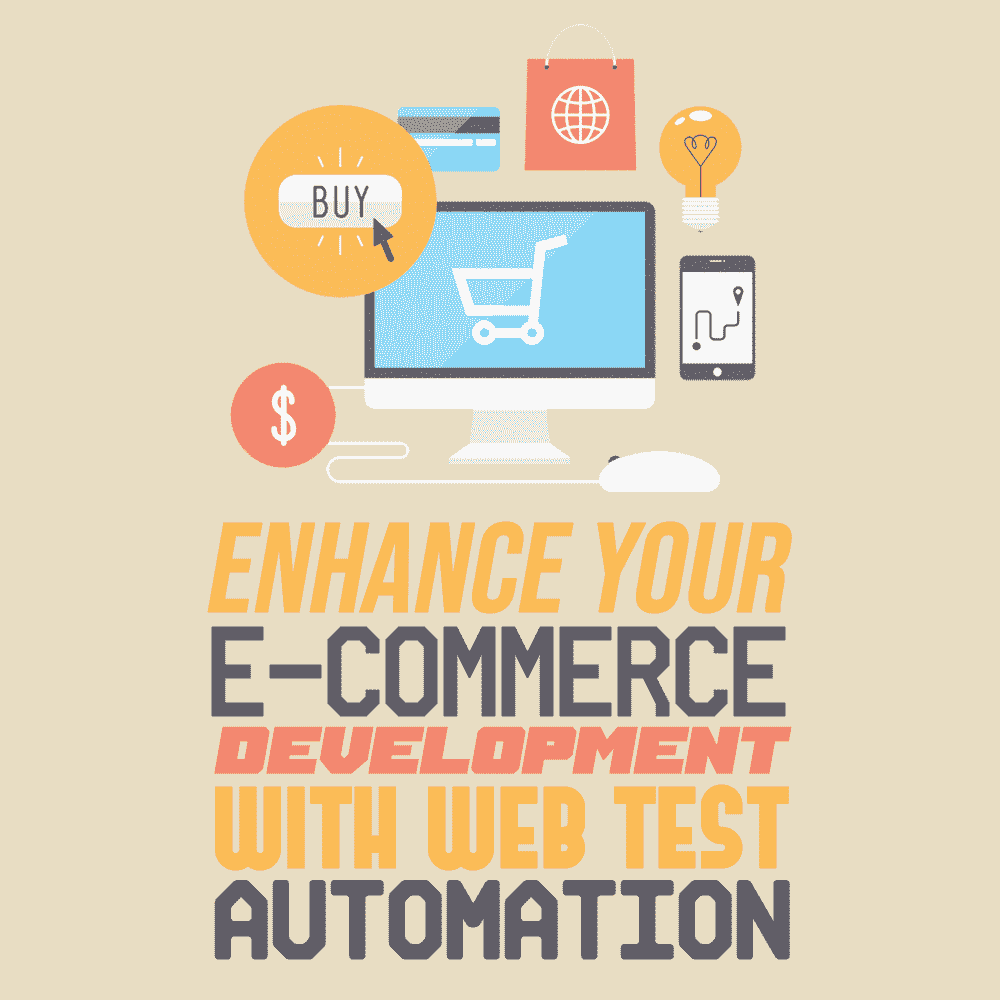

# 用 Web 测试自动化增强您的电子商务开发

> 原文：<https://simpleprogrammer.com/e-commerce-development-web-test-automation/>

Сompetition in the e-commerce market is [growing by leaps and bounds](https://wpforms.com/ecommerce-statistics/). So if you want to stand out from the crowd, build your online shop with users in mind.

为了确保您在可用性、可访问性、功能性和安全性方面满足最迫切的客户需求，使用 [web 测试自动化](https://www.oxagile.com/services/automation-testing/web-testing/)将您的电子商务商店开发提升到一个新的水平。借助自动化，您不仅可以通过消除手动错误以 100%一致的方式执行测试，还可以在不牺牲质量的情况下加快电子商务产品的上市时间。

此外，QA 自动化将帮助您优化开发成本。也就是说，您可以根据需要在多个设备、平台和浏览器上同时运行多次自动化测试——而不需要一次又一次地为手动测试付费。

这里有一些方法，你可以在你的电子商务开发中使用 web 测试自动化来改善用户体验，节省时间和精力。

## 改善网站外观和感觉

你永远不知道消费者会用什么设备和浏览器来购物，所以无论如何都要准备好提供安慰。

充分利用自动化的跨设备[兼容性测试](https://simpleprogrammer.com/guest-post-the-cross-browser-compatibility-myth/)，使您的 UI 适应各种分辨率、屏幕方向、操作系统、移动网络事件等。跨大量真实浏览器及其配置并行运行自动化跨浏览器测试，以发现并及时消除 bug。

此外，利用围绕 UI 回归测试的自动化来确保在任何主要调试之后，按钮、工具栏和菜单等窗口控件组织良好，标记有意义，拼写和语法本地化，并且链接、背景和字体中的样式和颜色一致。

## 确保电子商店的可访问性

目前，全球约有 6 . 5 亿残疾人，占世界人口的 10%。在开发你的网上商店时，你考虑过这些信息吗？

网页可访问性测试将帮助您确保您的解决方案符合可访问性标准，反过来，有听觉、语言、视觉和其他残疾的人可以轻松地在您的网站上购物。

有了强大的 web 测试自动化，您将能够在可读性和导航方面优化您的电子商店。这通常意味着:

*   使用文本颜色、背景颜色和文本大小的最佳组合。
*   避免复杂的复制。
*   添加详细的图像描述。
*   启用屏幕阅读器和语音命令。
*   确保强大的键盘导航。

虽然[易访问性测试自动化](https://www.amazon.com/Advanced-Selenium-Web-Accessibility-Testing-ebook/dp/B07Q47FWHH)至关重要，但不要低估实时用户测试的力量。通过让真正的残障购物者来查看您的在线商店，您将站在网络内容可访问性指南(WCAG)合规性的最前沿。

## 执行关键路径测试

你也可以使用自动化可用性测试来确保你的电子商务系统的所有关键功能都顺利运行。例如，应该避免顾客在订购商品时遇到困难——购物车中商品的尺寸、颜色和数量应该符合顾客的要求。

正确实施后，web [测试自动化](https://simpleprogrammer.com/ultimate-automation-testing-guide/)还将帮助您彻底检查金融交易的准确性，包括支付网关选择、验证码检查、通过电子邮件确认订单以及交付方式。

根据 Nextiva 的调查，89%的客户在糟糕的客户体验后倾向于转向竞争对手。要成为最重要的企业之一，就要通过自动化功能测试仔细检查客户支持功能。也就是说，无论是人与人之间的互动，还是与智能机器人助手的聊天，都要确保顾客对产品的疑问能得到即时回复。

## 保护客户数据

为了巩固客户对你的品牌的忠诚度，让你的电子商务解决方案成为一个安全的去处。使用同类最佳的开放 Web 应用程序安全项目(OWASP)测试工具来成功应对已知和未知的漏洞。

[自动化安全测试](https://www.amazon.com/Practical-Security-Automation-Testing-techniques/dp/1789802024#)将帮助您完全符合 PCI DSS、GDPR 和其他行业领先的安全标准，防止客户数据落入他人之手。也就是说，您将能够检测并及时解决防火墙配置、端到端数据加密、网络监控等方面的错误和轻微不一致。

此外，利用 web 测试自动化的力量来检查系统访问管理的健壮性。具体来说，确保您拥有坚如磐石的访问控制和双因素身份验证(包括基于生物特征的访问)。

## 测试自动化带来直接的价值——去做吧

与手动测试相比，除了节省您的时间和精力，自动化 web 测试还有可能通过优化跨浏览器和设备的网站导航、实现可访问性、完善所有功能以及确保坚如磐石的安全性，显著提高您的电子商务解决方案的质量。

良好的系统运行将保证更多的客户满意，更多的销售，结果是银行里有更多的钱。