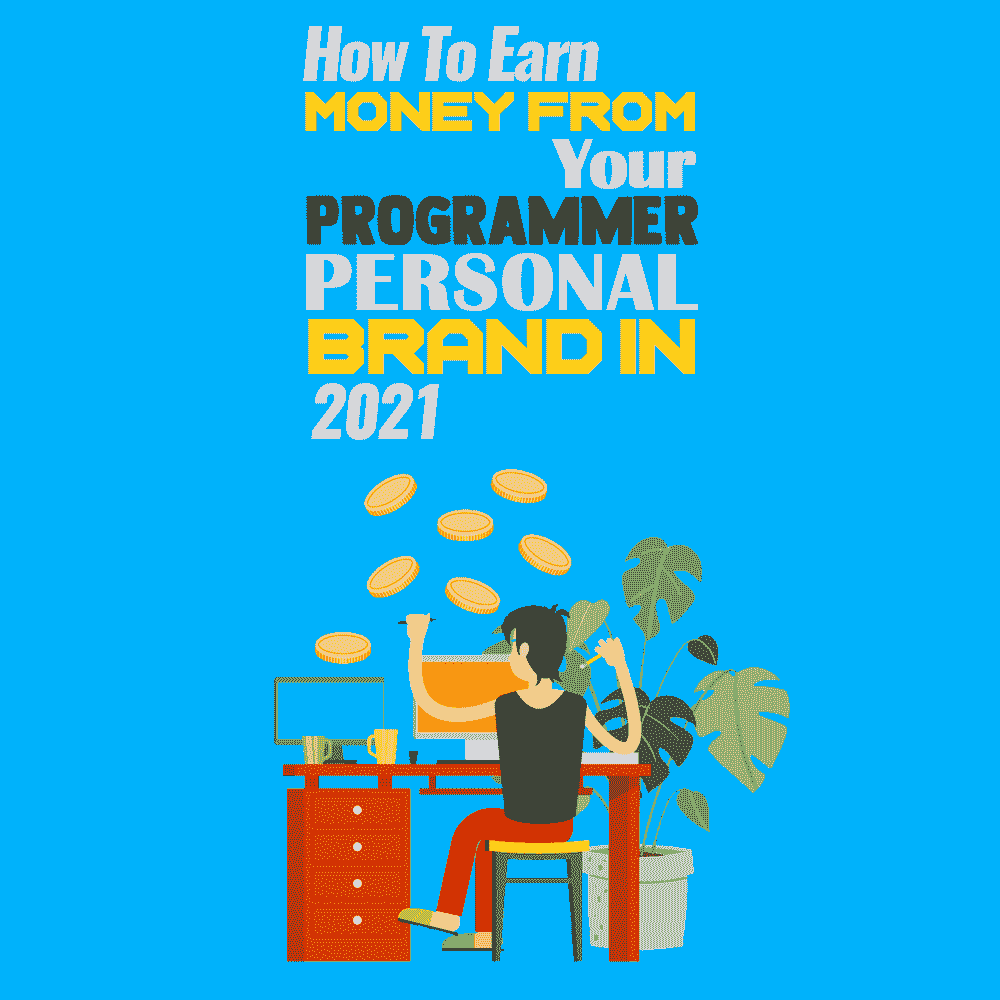

# 2021 年如何从你的程序员个人品牌中挣钱

> 原文:[https://simple programmer . com/earn-money-programmer-personal-brand/](https://simpleprogrammer.com/earn-money-programmer-personal-brand/)

In this day and age, when a personal brand is a widely acknowledged space where you can display your unique identity, personal branding is critical to showcase your expertise and establish an audience. As a developer you may have other immediate priorities, but a personalized outlet is still an exciting way to advance your career and networks.

在你开始整理关于品牌的想法之前，想想你为什么要创建自己的品牌。赚钱是拥有一个成功的个人品牌的巨大好处，尽管它不应该是你的唯一目标。领导一个创意品牌的关键是投入你的时间和热情。如果你致力于影响观众并听取反馈，那么从这个品牌中赚钱就不是问题。

在这篇文章中，我将向你提供一些简单而有效的想法，这样你不仅可以开发自己的程序员个人品牌，还可以从中赚钱。双赢的局面！

## 创立品牌前需要考虑的事情

虽然在网上建立自己的品牌很容易，但要确保你用正确的方式去做——有大量的网上资源可以帮助你开始。社交媒体是最受欢迎的基础平台，尽管这只是第一步。在你发布你的网站或博客之前，考虑一下你想发布的内容。作为一名程序员，在开始你的品牌时，这里有一个你可能想要考虑的简单事情的列表。

**定义品牌目标:**清楚地定义推出品牌后你想要达到的目标。作为一名自由职业者，你是想要建立一个强大的关系网还是仅仅想要更多的机会？不管你做什么决定，关键是保持专注。大多数程序员在建立品牌时犯的一个主要错误是过分逼迫自己。接受你不能立刻做所有事情的事实，你也不应该试图这样做。

**获得可见性:**你可以用最简单的代码成为最好的开发人员，但由于缺乏可见性，你仍然没有得到你想要的东西。人们很容易迷失在信息的洪流中，尤其是在网上。从正确的平台开始。即使在选择社交媒体渠道时，也要小心选择合适的媒体来发布合适的内容。接下来，打磨你的技能，获得认证，参加会议，建立关系网，传播信息。

不要低估自己:即使你觉得自己没有很好的公共演讲技巧，也可以尝试通过视频或互动图像来展示内容。低估自己会让你失去很多原本可以帮助你品牌成长的好机会。要有信心，你可以做你作为一个品牌开始做的事情。作为一名程序员，你拥有建立品牌所需的知识和技能；你只需要找到合适的动力和灵感。

## 从你的个人品牌中获利的方法

你发现了自己的激情，并花时间将它转化为一个能与人交流的个人品牌。这意味着你建立了一个有意义的品牌。现在是下一步——从你的品牌中获利。虽然这一开始看起来势不可挡，但不要不尽力就放弃。如果你不知道如何开始，这里有一些简单的想法可以帮助你开始。

### 举办虚拟峰会

虚拟峰会是由来自世界各地的多人在线举办的活动。峰会基本上是在网上进行的会议，因此更容易联系和管理人们。一个很好的例子是[开发者周峰会](https://www.developerweek.com/global/about/)，这是每年举行的最大的全球发展峰会之一。本次峰会包括管理、云计算和企业最新趋势等有趣的主题。

为了举办一场成功的虚拟峰会，你需要决定几个关键因素:知道你为什么要举办虚拟峰会，是为谁举办的，你要谈什么。根据你的品牌，你可以很容易地决定虚拟会议或网上研讨会是否会影响你的观众。

例如，如果你认为自己精通编程语言，你可以继续下去，并围绕这一点安排一次峰会。你可以谈论即将到来的编程语言和现在市场上的主流语言。选择让你的观众兴奋的东西。缩小话题范围；不要把事情拖到最后一分钟。人们想要一个精简的活动，尤其是如果他们付钱给你的话。

为了获得出色的虚拟体验，请研究如何选择合适的技术平台。你还需要确保及时通知到合适的受众——一个很好的方法是使用电子邮件和社交媒体营销。最后，制定一个策略来赚钱。关键是让赞助商入伙，主要是帮你出成本。其他方式包括:

*   以更低的价格吸引更多的观众。这是你需要考虑的事情，尤其是如果这是你的第一次虚拟活动。
*   通过**分层包装创造收入。**这一想法旨在为高收入观众创造独家进入活动或高级舞台的机会。
*   **延长事件寿命，达到**。不要仅仅在几天后就结束虚拟峰会。在相关在线市场发布活动视频。
*   提供**组访问**。这最适合学生或办公室职员，因为整批可以以更低的成本注册。

### 提供咨询服务

如果你真的对软件开发充满热情，咨询服务是将你的品牌货币化的好方法。软件工程师顾问一般都是有多年经验的资深开发人员。他们受雇于公司，为商业问题提供建议、制定策略和设计软件。由于工作的性质，软件顾问需要与各种利益相关者互动来收集需求。

如果你有丰富的经验和无可挑剔的软技能，那么你绝对应该考虑提供咨询服务，作为你个人品牌业务的一部分。然而，在你考虑进入市场之前，[确保你已经准备好接受客户](https://simpleprogrammer.com/effective-software-consultant/)。一旦你确信你可以开始提供专业的咨询，就制定一个行动计划。

挑一个你想专攻的小众，坚持下去。分析竞争对手在做什么。这应该给你一个探索途径的想法。一些主要的咨询服务包括移动和 web 开发、DevOps、云咨询、区块链咨询、机器学习和数据科学。

获得无缝任务管理的专业建议，必要时外包自由职业者。这样你就能专注于你的核心竞争力。最大化收益的关键是最小化启动成本。主要费用包括获得网站域名、商业工具、应用开发者账户和广告。在花钱之前，彻底研究市场，投资合适的选择。

### 创建在线课程

Perhaps one of the easiest ways to gain authority for your personal brand is to register for an online course. Doing so does not require years of professional experience. You just have to be good at what you do. It can be as simple as teaching beginners how to code. If you are passionate about launching a course, polish up on your skills by taking a few [training sessions](https://www.codecademy.com/learn/paths/web-development?utm_source=pepperjam&utm_medium=affiliate&utm_term=229159&clickId=3594768052&pj_creativeid=2-438169&pj_publisherid=229159).

虽然开发一门课程看起来是一项简单的任务，但教授在线编程也有其自身的挑战。作为一门技术学科，如果让学生孤立地学习，编程可能很难在网上教授。此外，在线课程往往缺乏从教师那里灌输反馈的能力。

为了提供互动的学习体验，选择一种最能与你的主题产生共鸣的教学方法。如果你想教一门编程语言，那么一个好主意是使用 live board。使用正确的教学策略和工具，您可以开发协作作业来增强学生的学习。

一些推出在线课程的好平台包括 [Teachable](https://teachable.com/) 和 [Udemy](https://www.udemy.com/) 。在大多数教学网站上，在线课程最重要的方面是大纲。记得设计一个吸引学生并提供全面概述的课程大纲。

接下来，制定一个营销计划，把它介绍给你的追随者。如果你有一个个人品牌网站，将课程整合到网页上，这样你的观众就可以看到了。在你的社交媒体平台上为课程做广告，并在发布日期前进行宣传。把你的课程放在首位，学习自动化营销和销售。

### 出版电子书

电子书需要大量的辛勤工作和承诺，以交付一个值得购买的最终产品。如果你正在寻找短期赚钱的东西，那么博客是一个更好的选择。对于一本电子书，你必须在整个写作过程中保持一致，并有足够的信心为你的内容表明立场。你应该意识到，一本电子书的最终卖点是它在帮助他人方面有多有效。

如果电子书是关于你的个人品牌，那么你已经有了一个关于利基的想法。作为一名开发人员，试着写一些你从中学到的东西。例如，如何将学习编码作为一项有趣的活动，或者你应该发展什么样的技能来成为一名成功的程序员，这些都是一些电子书的想法。做你的研究，并提出为什么你的电子书会有用，以及它如何适应技术世界的理由。

由于写作可能会让人不知所措，你需要有一个像 [Trello](https://trello.com/en) 这样强大的任务管理系统来帮助你坚持到最后期限。从第一章开始，为这本书的其余部分草拟提纲。专注于布局、先决条件和摘要。读者在购买前应该能够理解这本书的内容。让你的电子书被同侪顾问编辑和审查。一旦电子书准备好了，设计一个吸引人的封面，并在网络平台上发布。

亚马逊 Kindle 直接出版和 [Leanpub](https://leanpub.com/) 是展示你的电子书的两个很棒的平台。不要仅仅停留在网上出版这本书。做成个人品牌活动。在社交媒体上大肆宣传，举办网络研讨会与读者互动。

### 专注于联盟营销

联盟营销可能是最古老的赚取额外收入的方式之一。据统计，到 2022 年，美国的联盟营销支出预计将达到 82 亿美元，是 10 年前的三倍。这种快速增长的原因是人们在购买之前信任客户评论。

如果你作为一个程序员有很强的个人品牌，那么会员制营销有无数的机会。简单来说，联盟营销需要你将流量重定向到某个网站，以增加客户或购买量。对于你帮助网站的每一笔销售，你都会得到报酬。通过这种方式，你的个人品牌可以帮助你赚钱，同时你工作的网站得到推广。

作为一名开发人员，你可能会被要求为一个网站提供专业的托管建议，或者被要求推广云平台测试。根据你的品牌所处的领域，你可以选择加入一家公司。

对于开发者和程序员来说，有无数的联盟程序可供选择。然而，联盟营销是一种技能，需要你有创意。如果你有诀窍为你的个人品牌创造吸引观众注意力的杀手级内容，那么联盟营销将为你工作。

为了向观众提出一个新的想法，你需要建立一个搜索引擎优化(SEO)策略。这将有助于你了解你的目标客户在寻找什么。一旦你有了一个关于你想要生成的内容的想法，考虑一下链接的位置。

会员链接应该可以在你的网站、博客或社交媒体上看到。标注可用于将读者重新引导至您希望他们购买的产品。“最佳选择”、“编辑选择”或“最新趋势”都是引人注目的标注。

最后，如果你对任何联盟计划有疑问，做你的研究并提出问题。知道自己在做什么，为什么做，才能赚钱！

## 专注于创造影响力——不仅仅是金钱

A personal brand can be used to generate insightful conversations that not just attract viewers but also allow you to build a community. With the right resources and effort, you can turn your [personal brand into a passionate avenue](https://www.amazon.com/dp/014312885X/makithecompsi-20) that helps you generate some income on the side.

经营一个成功品牌的关键规则是集中精力——不要试图一次做所有的事情。开拓一个利基市场，然后让你的信息始终如一地被社区记住。

成功不会一蹴而就，当然也不能保证让你快速赚钱。要坚持你的品牌业务，保持一致，不要逃避失败。失败是学习曲线的一部分，让你知道自己哪里做错了。看看一个老牌开发商和他们的个人品牌。他们遵循什么策略？要产生影响，你需要成为潮流的引领者。

留下积极的遗产。无论你的品牌、信息或激情是什么，都要引导它进入良好的氛围。讲述你的故事来激励他人，并影响他们在生活、事业或个人发展方面做得更好。