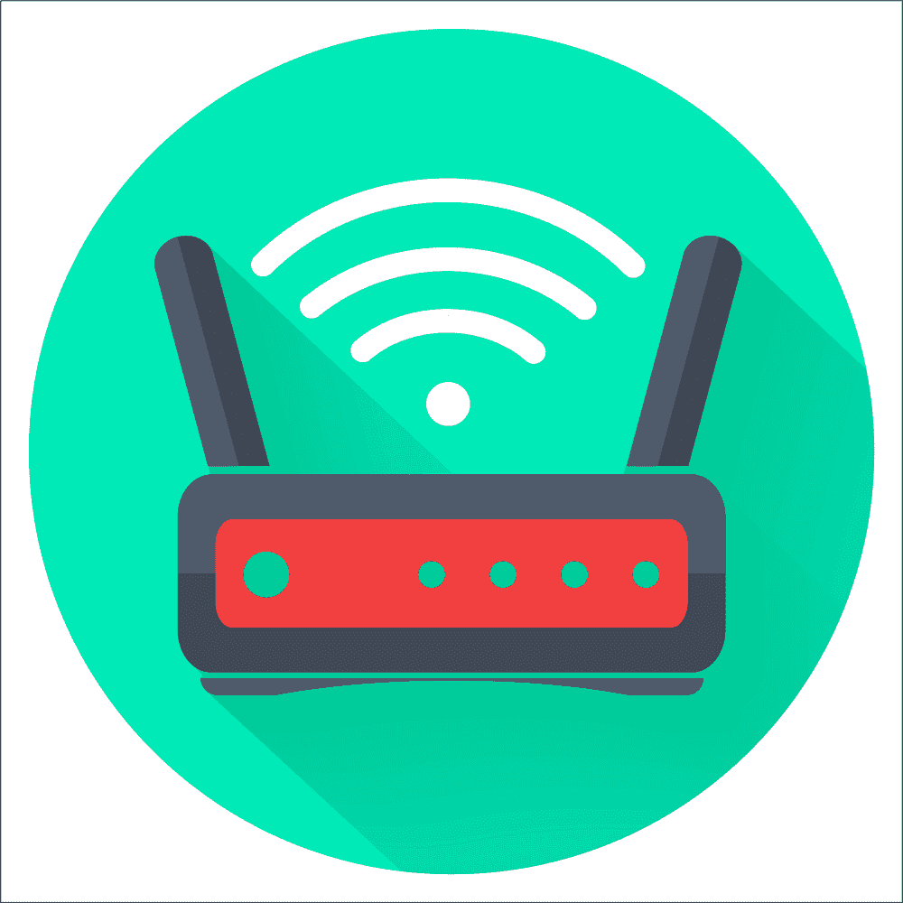

# 高效远程工作需要什么

> 原文：<https://simpleprogrammer.com/effective-remote-work/>

*这是即将出版的书*“远程工作-完全指南”*中的一章，我们将首先在简单程序员上出版这本书。你可以用会员优惠价买到这本书，只要点击这里。*

<figure class="alignright is-resized">

</figure>

如果你的老板允许你远程工作，你可以只用你的电脑和其他家用设备来完成。然而，这可能是个坏主意。

当[建议长期远程工作](https://simpleprogrammer.com/remote-work-companies-advantage/)时，这个想法不仅仅是允许这样做一天，而是证明远程工作是对办公室工作的改进。如果你想有效地做到这一点，你需要做的最后一件事就是让设备故障或其他可预见的问题发生。这样的事件不仅会有压力，而且如果事情发展得足够糟糕，你可能会破坏雇主对远程工作的印象。

为了有效地为远程工作做准备，您需要确保您的家庭工作环境至少与现场工作环境一样好，如果不是更好的话。做好这一点会让你将来更有可能被允许在家工作，而准备得不好还不如根本不做。请记住，这种远程工作的实验将会被管理层看到，并且可能会在很长一段时间内影响他们对远程工作的看法。当我在过去建议远程工作时，我有过至少 10 年前的管理相关故事，如果你没有做好充分准备，那么要等很长时间才能消除一个坏印象。

远程工作需要的不仅仅是合适的设备。你还需要确保你有足够的工作空间、合适的软件工具以及在工作环境和家庭环境之间同步数据的能力。

最后一点尤其重要，因为您需要能够在家庭和工作环境之间无缝传输有用的数据。毕竟，你不希望无法从你的工作网站上获得你需要的信息来完成你的工作..

如果准备家庭工作环境的任务让你感到难以承受，不要担心！在这篇文章中，我将为你提供一份你需要的所有东西的综合清单，这样你就有了一个好的开始。

## 如何确保弹性互联网连接

远程工作最重要的事情之一可能就是你的互联网连接。虽然这些年来住宅宽带变得越来越好，但它肯定远非完美。

您可能不会注意到在高峰使用时间(如晚上或晚上)有很多中断，但在白天，您的互联网连接可能会时好时坏。这有多种原因。

第一，很多住宅互联网连接的维护都发生在白天。这可能是任何事情，从更换线路到有人在街上试图解决邻居的电缆问题时搞乱了连接。

简而言之，你很容易对你的住宅网络连接的不稳定性感到惊讶。

此外，当你正努力集中精力工作时，突然断网了，你可能也会对你的网络提供商解决问题的速度感到非常失望。

当我第一次尝试定期远程工作时，在我的互联网连接突然中断的几周前，我做到了。当我在周一早上就这个问题联系康卡斯特时，他们告诉我，他们最早可以在下周的周四早上派人出来。

如果我没有其他的选择，那就意味着仅仅因为他们找不到人来现场解决问题，我就要错过 9 个工作日。

现在，我不是简单地接受我将不得不要么用完我所有的假期时间，要么回到康卡斯特的办公室，而是最终得到了一个到房子的商务层连接，而不是住宅。当时，拥有商业互联网意味着提供商可以在四小时内对中断做出响应。

四小时的停机时间比九天的停机时间更容易处理。首先，取决于你要做什么样的工作，你完全有可能在完全没有联系的情况下工作几个小时。

虽然您可能无法在这种情况下编写代码，但是如果您做好了准备，您可能能够做一些事情，比如编写规范。如果你非常幸运，你可能仍然能够写代码，但不能与房子外面的任何东西互动。

从一开始，你就需要有一个如何处理各种互联网问题的可靠计划。为了保持这种有序性，我们将从你的电脑开始，通过互联网向外工作，直到找到你的雇主。

在每一层，都有几个可能出错的地方，如果你想让你的互联网连接继续工作，你需要能够处理好每一个问题，这样*你*才能继续工作。你应该为每一件可能失败的事情做好计划，并把这些计划放在某个不依赖于有效互联网连接的地方。这意味着既要把计划写在某个地方，以便在没有互联网连接的情况下可以检索，又要有能力在没有互联网连接的情况下做一些有成效的事情。

### 你的网卡

<figure class="alignright is-resized">

</figure>

你电脑的网卡是你需要学习如何处理的第一个网络故障点。有的时候卡死，有的时候强制操作系统更新(感谢，微软！)可以破坏您的网络驱动程序，使您无法连接到互联网。这使得解决机器问题变得更加困难。

这可能是您可能遇到的所有网络问题中最难准备的问题。坦率地说，没有一种真正廉价的方法来规避这个问题。然而，有一些事情可以帮助。这些修补程序旨在作为权宜之计，但如果事情变得足够糟糕，你可能会坚持一段时间。

显而易见的答案是准备一张备用网卡，如果主卡出现故障，可以快速安装。这并不一定意味着在出现问题时你必须打开电脑外壳，因为有相对便宜的外部 USB 卡就足够了。

如果你有一台便宜的笔记本电脑，你也可以换台机器。我几乎总是同时拥有一台台式机和一台笔记本电脑，这种方式让我省去了很多麻烦。

如果您的系统既有无线功能又支持有线网络连接，如果您通常依赖无线连接，可以考虑准备一根长的以太网电缆。

您还应该确保定期在您的计算机上创建还原点，以便在更新损坏您的计算机时可以轻松恢复。

### 你家局域网

在外工作，下一个可能出错的是你的家庭网络。这方面有几个常见的问题会让你离线。首先，如果您使用以太网，您的物理布线可能会以某种方式损坏，而无线网络可能会由于干扰或配置更改而出现故障。

就像你的网卡一样，你很难完全准备好网络布线或无线网络的故障。但是，这里有一些预防措施会有所帮助。

第一是手边要有备用的网线，这样万一出现故障，你可以在另一个房间(或者直接在路由器上)接入你的网络。这些电缆在排除网络问题时也很有用，因为使用多根电缆进行测试可以快速显示问题是出在电缆上还是设备上。

无线问题让事情变得更糟糕。我个人不喜欢在工作时使用无线连接，因为这些年来我已经遇到了太多的问题，所以我尽量避免使用无线连接。

不过，无线网络确实很方便，尤其是如果你喜欢偶尔在餐桌上工作，而不是整天呆在办公室里。你将会遇到的最大问题是无线网络很容易受到干扰和微弱信号的影响。

除了简单地搬到房子里信号更好的另一个地方，或者可能在你的办公室里找一个无线扩展点来放大信号，你也没有太多办法。

除此之外，如果您的无线或有线网络出现问题，您可以经常从一个网络切换到另一个网络，在不得不中断连接之前完成一个工作日的工作。

或者，如果你用笔记本电脑工作，你可以去咖啡店工作几个小时。如果你打算这样做，你会想确保你知道附近的咖啡店在哪里，以及他们是否有足够好的互联网连接使用。

你不想开车去别的地方，却发现他们的网络连接极其缓慢或者他们不想让你用几个小时。

### 你的路由器

您的路由器是下一个具有恼人故障模式的项目。路由器可能会发生一些事情，您需要做好准备:

*   路由器可能会停止工作。这可能是由于恶意软件，雷击，或只是年老。
*   路由器上一个或多个面向局域网的端口可能会停止工作。
*   面向 ISP 或电缆调制解调器的端口可能会出现故障。
*   路由器固件更新可能会使连接慢得令人无法忍受。
*   电涌或温度管理问题可能会使路由器变得“脆弱”

上述大多数问题都可以通过更换路由器或重启路由器来解决。大多数情况下，最快的恢复方法就是拔掉路由器，等一两分钟，然后再插上。这通常足以让设备再次正常工作。

然而，在更病态的情况下，路由器重启并不能解决问题。在这些情况下，您需要能够将您的路由器换成备用的，并且您需要能够快速地这样做。

不幸的是，除非你准备充分，否则更换路由器不是一个很快的过程。为了确保一个严重的路由器问题不是一个问题，你需要确保你手头有一些东西。

<figure class="alignright is-resized">

</figure>

首先，你需要一个备用路由器。我建议此路由器尽可能与您现有的路由器相似，以便您可以快速配置它。把这个备用的放在手边，定期取出它并更新它的配置以匹配你现有的路由器。

其次，您需要将现有路由器的配置信息保存在某个不需要互联网连接的地方。这应该包括现有路由器的各种配置屏幕上的所有信息。

如果您的备用路由器配置不是最新的，或者如果您最终在紧急情况下购买了新路由器，这可能会有所帮助。相信我，世界上最糟糕的感觉就是在宝贵的时间一分一秒流逝的时候，努力回忆你之前是如何配置你的系统的。

此外，您应该确保您的路由器和其他网络设备上有良好的备用电池和电涌保护器。一天内可能会发生多次电涌，因此您不希望仅仅因为电源暂时不可靠而不断地干扰路由器。

你可能还有一些其他的事情要担心，这取决于你的网络提供商。首先，你应该确保你的互联网服务提供商的技术支持热线号码就在手边。

您还应该确保您有任何其他可用的身份信息，如您的帐号、密码和附带的帐单电话号码。如果你安装了一个新的路由器，但仍然不工作，你可能需要打电话给你的 ISP。把这些信息放在手边是让这种经历压力小很多的好方法。

### 您的家庭网络布线(通过路由器)

在您的电缆连接(或电话)和您的互联网服务提供商之间也可能会出现许多问题。这可能是任何事情，从你家里的电线松动到一场风暴(或一个随机的醉汉)把 3 英里外的电信杆弄倒。

像这样的情况很大程度上超出了你的控制，你不能简单地储备备用设备来应对。总的来说，你必须在某个地方接入一个工作网络。

谢天谢地，这个问题可以在短期内用手机解决。如果你能把你的设备和手机连接起来，你也许可以暂时使用移动网络。

另一方面，如果你需要更多的带宽(并且不想以蜂窝费率支付)，那么你可能需要一个备用的工作地点。这可以是任何事情，从你平常的办公室，到咖啡店，到一个信任的朋友的家。

无论您选择哪种方案，您都需要能够相当快速地到达目的地，并且您需要确保他们不会像您一样遭遇网络中断。

几年前，当我的家庭网络出现故障时，我开车到街上附近的一家咖啡店，我才痛苦地认识到这一点。事实证明，失败是在我们两个的上游，所以我不得不开车到处跑，试图找到其他地方工作。

当您遇到似乎不是源自家庭网络的重大网络中断时，您有许多选择。

你可以先打电话给你的互联网服务提供商，看看他们是否知道停电。如果幸运的话，这是一个提供商可以远程解决的问题。有时，这只是一个简单的配置问题，他们可以远程重启您的电缆调制解调器。

第二，你应该在手机的浏览器上有一个书签，显示你的提供商报告的该地区互联网中断的地图。您可以使用此地图来确定在哪里可以获得有效的互联网连接。

在头脑中有三个或四个可以获得有效互联网连接的位置是一个好主意。在您需要它们之前，您应该在您的笔记本电脑中配置好它们的无线接入点。你最不想做的事情就是因为网络中断而感到紧张，并且不得不试图找出为什么你当地咖啡店的无线网络不能工作。

此外，您还应该有一些低优先级的工作，这些工作可以在本地计算机上没有互联网连接的情况下完成。当你在家等待技术人员出现时，这是很方便的。虽然这不像完成高优先级任务那样让管理层高兴，但它确实能让你在网络中断时保持高效。

最后，您应该确保您需要的任何资源尽可能地在您的本地机器上可用，而不是假设 internet 会在您需要时工作。

如果你按照上面所说的去做，即使是大范围的网络中断对你来说也不是什么问题。虽然互联网中断永远无法完全避免，但它们造成的中断可以大大减少。如果做得正确，你的雇主甚至不会注意到你停电了。

### 您的提供商提供的服务

<figure class="alignright is-resized">

</figure>

您也可能遇到这样的情况:您的互联网接入表面上正常，但您的 ISP 提供的各种服务却不再正常工作。这里最有可能导致问题的原因是域名系统(DNS)。

DNS 是一种服务，当您在互联网上时，您的电脑和其他联网设备使用它来计算您所连接的各种机器的 IP 地址。当我第一次远程工作时，我惊讶于我的互联网服务提供商(Comcast)经常出现这种问题。

当他们突然无法访问几个网站时，通常会注意到他们遇到了 DNS 问题。根据经验，当您的 ISP 的 DNS 服务器部分工作或非常慢时，会出现最恼人的问题。

在这种情况下，您可能会看到您无法访问 GitHub 或 Confluence，但您可以访问福克斯新闻频道或必胜客的网站。虽然必胜客网站肯定非常有用，但你更可能需要 Git。

为此，您需要配置您的个人计算机，将您的路由器用作您的 DNS。然后，您需要一些备用 DNS 服务器的列表，以防 ISP 提供的服务器无法工作。我个人使用以下内容，并发现它们是可靠的(因为它们是由 Google 提供的):

*   对于 IPV4，使用服务器 8.8.8.8 和 8.8.4.4
*   对于 IPV6，请使用 2001:4860:4860::8888 和 2001:4860:4860::8844

确保您将备份 DNS 服务器地址保存在一个即使没有可靠的互联网连接也能获取它们的地方。当你的 DNS 不能正常工作时，你不会想浪费时间去搜索这些东西。

除了 DNS 之外，如果您正在为您的家庭电话服务使用 IP 语音(VOIP ),您可能需要制定一个计划，以防服务失败。你通常可以不用使用手机，但是你可能需要通知你的同事你家里的 VOIP 电话坏了。

### 您使用的云服务

此外，当您用于工作的一个或多个云服务出现故障时，您需要知道该怎么办。

在工作中，管理层通常理解这个问题，但当你在家工作时，他们可能会也可能不会这么宽容。即使您使用的各种云服务出现故障，您也需要确保您仍然可以完成工作。

如果你认为你的网络连接是不可靠的，并做好相应的计划，你通常能比办公室里的人更好地应对网络中断。

根据您使用的工具，您应该使用哪些策略来为服务中断做准备。虽然每种情况都是独一无二的，但有几条宽泛的规则可以帮助您比办公室里的同事更好地应对中断。

对于像 Git 这样的分布式源代码控制工具，只需提交到您的本地存储库，并在可能的时候向上推主存储库。这些工具是为适应不可靠的慢速网络而设计的，所以它们不会给你带来太多麻烦。

唯一的例外是当你需要一个别人创建的提交或分支时。在这种情况下，您可能会一直等到服务恢复。幸运的是，这些服务的中断很少发生，而且通常是短暂的。

对于 Confluence 之类的文档工具，您可能希望在不同的编辑器中离线完成大部分工作，然后在完成后将文件移到系统中。您必须做一些额外的工作来清理格式问题，但是您不会因为停机而丢失工作。

至于聊天、电子邮件和其他通讯工具，停电可能意味着你不能和同事见面。一般来说，对于聊天和视频会议工具，最好在你的机器上有几个可用的选项，以防你真的需要它们。

有时，聊天工具会失败，或者更新在您的机器上不起作用。有时，公司防火墙会让你的同事无法使用某个特定的工具。最好考虑聊天工具至少比电话不可靠一个数量级，并据此制定计划。如果你完全离线，事先商定好多个可用的工具也可以让你更有可能在需要时使用手机上的应用程序。

对于电子邮件，你最好使用桌面电子邮件客户端。一般来说，中断是转向使用更多异步通信方法而不是中断性通信方法的绝佳理由。

总的来说，如果你依赖基于云的服务，你仍然应该尽量少依赖互联网连接。你在办公室的同事可能没有为云服务中断做好充分准备，所以如果你做好准备，你增加的弹性将使你比他们更有效率。

当您能够证明断电不会影响您的工作时，远程工作讨论就容易多了。

### 你雇主的互联网连接

<figure class="alignright is-resized">

</figure>

如果你运气不好，你的雇主可能会要求你连接到公司网络来完成你的工作。通常，这是通过虚拟专用网络(VPN)完成的。

虽然这种连接是安全的，但它们会受到严重和频繁的干扰，因为它们依赖于你的房子和办公室之间的一切都处于良好的工作状态。此外，VPN 软件本身通常会引入一个额外的故障点，这是您需要考虑的。

你的雇主可能会采取这样的措施，因为他们有理由担心安全问题。因此，通过制作所有内容的本地副本来降低 VPN 中断的风险可能是不明智的。相反，你所能做的就是确保手头有网络管理员和备份管理员的相关联系信息。

要求 VPN 进行远程连接实际上保证了在某个时候中断会阻止您有效地工作。除了在出现问题时报告问题之外，您没有太多办法来缓解这种情况。然而，如果你在远程工作时足够高效，也有可能这对你的雇主来说无关紧要。

### 你的办公室电脑

最后，也是最糟糕的失败原因，是你办公室电脑的故障。如果您被要求使用 VPN 连接到您的办公室，然后被要求使用远程访问软件，以便您可以像坐在办公室里一样使用您的办公桌面，那么您还有另一个故障点。

您的办公机器可能会因为各种原因离线，从软件问题到硬件问题，再到办公室的断路器跳闸。此外，如果您是远程访问机器，您也将不得不花一些时间来找出问题所在。

办公室电脑的故障会让你完全孤立无援，你没有多少选择来阻止它毁掉你的一天。但是，有些事情可以降低工作时间中断的可能性。一些简单的事情可以给你很大的帮助，使你的工作电脑在你远程时不太可能出现故障。

虽然您可能无法完全控制您的办公机器，但您应该尽可能确保它在您不在办公室时保持稳定。以下是一些你应该问自己的问题:

*   我的工作机器有备用电池吗？它能工作吗？你会惊讶于公司如此频繁地克扣备用电池，导致机器在电源出现问题时关闭。
*   我可以控制我的计算机何时进行软件更新吗？如果可以的话，试着禁用更新，只在你在现场或者没有迫在眉睫的最后期限时运行它们。
*   我是否有机器附近人员的联系信息，以便在无法联系到机器时可以快速联系到他们？
*   我手头有关于我的机器的相关信息吗？如果你不得不与办公室的人交谈来解决你的计算机的网络问题，至少，你会想知道机器的名称和 IP 地址(如果你分配的 IP 地址是静态的)。

如果这些事情都在你的控制之下，你的办公机器就不太可能成为停机的原因。然而，如果你坚持远程使用你的办公机器，你会有更多的问题。远程使用办公机器使得实现可持续的远程工作环境变得更加困难。

## 创建有效的工作空间

当你在家工作时，你也需要一个像样的工作空间。虽然你可能认为坐在客厅的沙发上可以提高工作效率，但现实是这样的环境会让人分心，通常人体工程学较差，并且从长远来看不是舒适的工作空间。此外，如果你有宠物或孩子在跑来跑去，在这样的空间里有效地参与会议几乎是不可能的。

我曾经有一个同事坚持让他在家工作几天，但他不愿意建立一个真正的办公室来工作。公司允许他远程工作，但他也应该参加我们董事会的会议，向他们展示他一直在做的工作。

他尽职尽责地睡在客厅的沙发上，开始工作。我们叫他来参加 9:00 的 scrum 站立会议。我们不仅可以听到芝麻街和孩子们在背景中争吵，而且他不得不不断地将音频静音，以便对孩子们大喊大叫。

此外，当他后来与董事会通话时，他的猫在他说话时跳上了他的键盘，并将其背部指向屏幕。每当我们中的任何人主张被允许在家里办公室工作时，这个故事就会出现。

<figure class="alignright is-resized">

</figure>

你不希望你的雇主将远程工作与向付款人展示一只焦躁不安的猫的臀部联系在一起。凭经验我可以告诉你，这种联想很难克服。

拥有一个体面的工作空间最大的好处就是当你离开它的时候。它不在“娱乐”区的正中央，而是在一个专用于工作的区域。有一个专门的工作区域可以减少非工作问题打断你一天工作的频率，并且当你完成一天的工作时，也更容易离开你的工作。

这个界限是有效工作时间的关键，也是在工作和生活之间取得平衡的关键。

除非你一个人住，否则我一般会建议你的工作区有一扇门，把它和你住所的其他部分隔开。这里的想法是在你工作的时候让它非常明显和明确，这样别人就不会误解它。这让你更容易与和你住在一起的人划清界限。

总的来说，你也应该尽量保持工作空间至少像你在办公室的工作空间一样整洁有序。这将有助于你保持效率，结束视频电话会议前尴尬和匆忙的整理工作。

此外，你需要注意工作场所的一些其他事情，以减少分心。你应该试着在远离住所主要步行区域的地方工作。

与此同时，你要远离嘈杂和分散注意力的噪音，如电视、洗碗机、烘干机、洗衣机和空调。确保你能在季节极端情况下也能保持这个空间在一个合理的温度。尝试在一个因为极端温度而不舒服的办公室里工作真的很烦人。

你也应该尽力确保你能控制房间里的灯光。特别注意朝东或朝西的窗户，因为它们在白天容易产生眩光。

如果你的窗户朝向赤道，请注意(换句话说，如果你在北半球，请朝南；如果你在南半球，请朝北)，因为在一年中的某些时候，你也会从那个方向获得大量的光线和眩光。

确保你有关闭的窗帘或百叶窗，这样你就可以在需要的时候阻挡其他的视觉干扰。

最后，确保你的工作场所不会变得满是灰尘或过于潮湿，因为这样的条件可能会对设备造成损害，也可能会给你带来健康问题。请记住，你在这个房间里工作的时间几乎和你在卧室里睡觉的时间一样多，因此要做好相应的计划。

### 书桌和座椅

你可能认为你在办公用品店买的一张便宜的桌子就足够远程办公了。这样的办公桌可以工作一段时间，但你可能最终会发现自己因重复性劳损或简单的坐姿不良而疼痛。

此外，虽然你可以在普通的厨房椅子上坐一两天，但这些椅子不适合长时间坐着工作，几个小时后往往会变得非常不舒服，更不用说更长时间了。

合适的电脑桌和电脑椅对于可持续的长期远程工作安排至关重要。获得远程工作的能力对你没有任何好处，只会发现自己处于持续的痛苦之中，无法享受新提高的生活质量。你的桌子、座位、鼠标和键盘的布置是做好这件事的关键。

对于您的办公桌，您应该有一个至少可以容纳两台显示器和一台笔记本电脑的办公桌。即使您在日常开发工作中使用台式电脑，您仍然可能需要额外的桌面空间来放置平板电脑、规格的打印版本，甚至第三台显示器。

此外，通常最好有一个良好的铰接键盘托盘，因为当键盘直接放在桌子上时，它通常太高，以避免肩膀出现问题。

对于你的椅子，我建议要么买一把高质量的办公椅，要么买一把游戏椅。虽然你可以用一把便宜的办公椅过一段时间，但随着时间的推移，你会发现它们变得相当不舒服。

<figure class="alignright is-resized">

</figure>

从个人经验和许多朋友的经验来看，最常见的疼痛原因之一是座位不好。无论是由于背部支撑不佳，无法调整座椅的角度，还是无法让头部休息，糟糕的办公椅都会导致长期疼痛。

虽然关于人体工程学的长篇讨论可以自成一本书，但有一些通用指南可以帮助你做出更好的选择:

*   下背部或腰部支撑是必要的。你希望能够调整椅背，这样你就可以长期避免坐骨神经痛，短期避免背痛。
*   您需要能够调节椅子扶手的高度以及扶手之间的可用空间。被塞进一把感觉尺寸不对的椅子里会非常不舒服。
*   你的椅子需要能一直旋转。当试图长时间工作时，有一把不能做到这一点的椅子是令人讨厌的。
*   你应该确保椅子上有合适的轮子。这些对于地毯来说与对于较硬的表面来说是不同的。
*   椅背应该有透气的布料。虽然当你在商店里试用时，没有这种功能的产品很舒服，但如果你的办公室太热，它们会很快变得又热又脏。
*   你应该可以舒服地把脚放在地板上，或者你需要一个脚凳(我个人使用脚凳)。
*   垫子应该是耐用的泡沫，不会很快磨损。许多舒适的椅子磨损很快，很快就变得不舒服。

为你的家庭办公室选择合适的椅子非常重要。虽然它可能很贵，但与持续的背部、颈部和肩部问题的成本相比，这算不了什么。

## 确保你有一台像样的电脑

接下来，你的电脑可能会影响或破坏你的远程工作。如果你幸运的话，你可能有一台由你的工作提供的足够强大的电脑。然而，也很有可能你不会。

如果是后者，那么你需要确保你的个人电脑能够胜任这项任务。如果到了可以在家工作的地步，却只有一台功能严重不足的家用电脑，让你无法高效工作，那就太糟糕了。

当我第一次获得写代码的报酬时，我使用的是一台配有 266 MHz 处理器和一个巨大计算机硬盘的计算机，如今，对于一个孩子来说，这不会被视为一个体面的 USB 驱动器。

今天被认为是功能过于强大的计算机，几年后将仅仅是“OK”10 年后会被认为动力极度不足。考虑到合适的计算机规格变化如此之快，在这里推荐任何好的建议几乎是不可能的，即使是几年后。

令人欣慰的是，你通常可以通过查看工作中的设备来了解应该使用哪种机器。仔细注意 CPU 速度、内核数量、RAM 容量、显卡类型以及系统中驱动器的类型和速度。

现在，在出去买一台类似的机器之前，也要注意这台机器满足你需求的程度。在决定买什么的时候，试着把这台机器的规格作为你家里机器的最低规格。一台更强大的家用机器是对较慢的互联网连接的极好补偿，即使你的工作没有为此付出代价，它也是值得的。

此外，好好看看你的显示器(一般应该至少有两个)。你会想要至少和家里一样好的东西。如果你在工作时配备了一台工作笔记本电脑和额外的显示器，也是如此——你应该试着至少在家里做得一样好。

这些建议可能有一个价格标签，最初似乎很高。然而，要意识到这是一项投资，它将很快被你在家工作时体验到的更低的成本和更好的生活质量所抵消。如果你真的想远程工作，你应该尽可能使用最好的硬件。

## 时间跟踪工具

<figure class="alignright is-resized">

</figure>

除了合适的桌子、像样的电脑和可用的工作空间，我还强烈建议使用工具来记录你的时间。虽然你的雇主可能有他们自己的时间系统，但获得一个便宜的时间系统是个好主意，它可以让你跟踪一天中的活动，包括休息。

远程工作时，很容易养成工作过少或过多的习惯。对于远程工作的前几周，如果你记录下所有的时间，包括下班后的时间，以确保你在家庭和办公室之间保持合理的平衡，通常会有很大帮助。

无论你发现自己快累垮了还是效率不够高，记录下这些信息将有助于你解决问题。

## 文件和便笺同步

如果您正在远程工作，并且在办公室有一台计算机，您还需要一个良好的机制来在两个位置之间移动文件。此外，您需要一种在不同地点之间同步笔记的好方法。

实现这些目标的最佳方式有很大不同，这取决于您的雇主有什么样的安全限制、您如何与您的团队沟通以及您更换位置的频率。

所有这些的主要目标是确保您的工作流程的输入(如规范、注释和文档)可以以不受位置限制的方式获得。

虽然这可能简单到你总是把一个笔记本带到你的办公桌上，也可能复杂到像 Evernote 这样的工具，但你需要有某种方法来确保你可以在需要时获得信息。

即使您使用办公室计算机进行远程工作，有时您也需要在家庭桌面上获得信息，否则这些信息会出现在工作桌面上。

例如，如果您正在使用 Skype 或其他视频会议工具进行电话会议，您可能会在您的家庭计算机上使用该软件，而不是通过远程桌面等方式。

因此，如果您在会议中需要笔记或其他项目工件，您将需要能够从您的家庭桌面上获得它们，即使您在办公室的机器上完成所有其他工作。

最重要的是，你的主要目标应该是消除任何可能会在你远程时减慢你工作速度的东西。这使得您的远程工作环境更容易与您的办公室环境相媲美。

## 可以通过电话联系到

虽然我认识的大多数程序员真的不想回电话，但有时候还是有必要的。一些公司会给你提供一个 IP 电话，你可以简单地把它插入有线网络。

这些电话让别人给你打电话变得容易和透明。然而，对于没有远程办公经验的公司，你需要采取额外的措施来确保你可以通过电话联系到。

一个简单的选择是将你工作时的桌面电话转移到你的私人手机上。因为大多数人倾向于大部分时间都带着手机，所以这是一个很好的方法来确保你是可联系的。

此外，如果你没有办公用的桌面，或许有必要修改你的电子邮件签名，把你的个人手机号码也包括进去。虽然你不希望在你的私人手机上接到很多工作电话，特别是如果公司不为那部手机付费的话，但为了能够在家顺利工作，这可能是值得的。

此外，您应该确保无论您的公司使用什么样的聊天程序，都可以方便地联系到您。如果你很容易在聊天中联系到，大多数精通技术的人无论如何都不会给你打电话。

我个人非常不喜欢电话造成的干扰，我试图通过其他容易联系到的方式来尽量减少这些干扰。你可能还会发现，改变你的语音邮件信息，以表明其他联系你的方式是有用的，因为至少有些人也希望避免使用电话。

## 网络摄像头和耳机

最后，你需要确保你有一个像样的网络摄像头和一个带麦克风的耳机。当你经常参加电话会议时，你需要确保你的声音和外表都尽可能的好。

虽然你可能认为这与你的语气或外表有关，但真正的问题是当你在开会时，你的形象和声音应该尽可能真实。

这里的想法是双重的。首先，如果人们听不到你或看不到你的面部表情，当你在会议的背景下讨论某事时，就更容易被误解。

此外，如果人们在与你通话时几乎没有注意到你在远处，这就减少了有人开始催促你进办公室的可能性。

对于你的网络摄像头，如果你有一个的话，你可以用你的笔记本电脑上的网络摄像头。如果没有，试着买一个你能在大多数电器商店买到的便宜但有高清功能的网络摄像头。你不需要一台专业级相机，但你需要一台在使用时输出相当好看的相机。

<figure class="alignright is-resized">

</figure>

其次，我推荐一款通话用耳机。没有什么比和没有耳机的人通话更烦人的了。如果没有耳机，你的电脑扬声器将会发出会议噪音，而这些噪音很快就会被你的麦克风接收到。

以这种方式产生的回声非常分散注意力，容易让你的团队对你非常恼火。同样，如果你的麦克风让你听起来像是在锡罐里广播，人们将很难理解你。在家工作需要一副好耳机。

选择耳机时，大多数[无线游戏耳机](https://www.amazon.com/Logitech-G533-Wireless-Gaming-Headset/dp/B01MXE0FKC/ref=sr_1_3?keywords=wireless+gaming+headset&qid=1569601369&sr=8-3)足以满足您的需求。你需要一个无线耳机，这样你就不用经常用电缆处理问题了。

有一个带好的吊杆麦克风的耳机也很好，这样当你移动头部时，你的声音不会突然变得更小或更大。理想情况下，这款麦克风的设计不会拾取过多的背景噪音。

大多数游戏耳机似乎在这方面做得足够好，但如果你生活在一个特别嘈杂的环境中，你的体验可能会有所不同。

手头有好的视频会议设备会让你更有可能继续远程工作。请记住，电话会议和视频会议是人们对你的家庭工作环境形成印象的主要方式。你希望这个印象尽可能的正面。

## 为您的家庭办公室配备良好的设备以提高工作效率

你应该花些时间和金钱来确保你的家庭办公室适合工作。如果你想说服你的老板让你在家工作，你必须证明这里的环境至少和办公室环境一样好，如果不是更好的话。

此外，你必须能够在你的环境中有效地工作，至少达到你在办公室环境中所期望的程度。在你试图说服任何人让你远程工作之前，把这些事情做好是值得的，因为当你还没有留下坏印象时，人们通常更容易被说服。

此外，如果你有任何职业道德，你应该希望你的家庭工作环境是富有成效的，这样你会觉得有效率。

如果你知道你在办公室可以更有效率，远程工作不会让你自我感觉良好。如果你在开始之前做好了适当的准备，你可以确保远程工作对每个人都是一种积极的体验。

