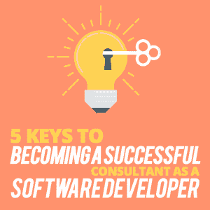

# 成为一名成功的软件开发顾问的 5 个关键

> 原文：<https://simpleprogrammer.com/effective-software-consultant/>

## 为什么我会成为一名顾问

When I left my chief information officer (CIO) position in 2007, I wanted to return to the purity of software development. The work of software development—programming—was my first love by a very wide margin, and after a few years as a CIO, I came to hate the day-to-day tediousness of budgeting and more budgeting, and defending that budget; performance evaluations; personnel management; endless meetings to plan and organize, and then scheduling the next round of meetings to ultimately arrange yet another series of meetings. Rinse and repeat.

在我更早的高级管理日子里，我欣喜若狂地参与指导公司和我们部门的步骤。我喜欢参与软件和硬件采购的决策过程、高级业务规划以及随后的人员配备和项目开发过程，以最终实现业务目标。所有这些都很有趣和令人兴奋。一段时间。

然而，过了一段时间后，我意识到我不是那种可以完全或舒适地脱离软件开发的人。我知道很多人都很乐意放弃他们的编程工作，转而从事管理工作。这对他们来说很好，但我不是那种人。

我发现我再也不能参与那些最初推动我事业发展的事情了。那些让我晋升到我渴望的职位的事情正是我不得不放弃的事情。成为一名优秀的软件开发人员让我在成为软件开发人员后立即得到了提升。过了一会儿，我觉得没什么意义了。

比起我喜欢的地位、金钱和责任，我更怀念软件开发。我开始问自己到底想做什么。我或多或少地实现了我认为的软件专业人员的终极目标。见鬼，我是首席信息官。还剩下什么？

在相当长的一段时间里，这是一个空洞的想法。我很痛苦。

到那时，我已经雇佣顾问、合同程序员、自由职业者——随你怎么称呼——好几年了。这些年来，我也曾在合同和咨询工作中进进出出。

然后我突然想到。为什么不咨询？为什么不开始我自己的咨询和承包业务？这不就是我一直以来的梦想吗？

我很兴奋！我沉思，我绘图，我做白日梦:我将为各种各样的客户写代码。我会帮助公司做出好的系统决策，然后帮助他们开发软件。我会把我作为软件开发人员和高级经理的经验结合起来，帮助公司实现他们的软件和技术目标。我会再次开心起来！我会很擅长的！他们会喜欢我的！

这一切都很合理。看起来很简单。

就一个问题:*怎么做？*我从哪里开始呢？

## 如何开始，从哪里开始？

正如我所想的，有无数的“方法”需要处理:

*   我如何保持足够的忙碌来生存和发展？
*   我如何营销和销售？
*   找到客户后，我如何达成交易？
*   我如何为我的产品定价？
*   我如何找到额外的编程资源？
*   我如何管理财务、税务？
*   我如何处理法律问题？
*   我如何发展我的公司？
*   我如何管理合同？
*   我如何在技术上保持相关性？

这只是 10 个问题！我可以无限增加这个列表。

在每一个“如何做”的问题中，都有一个无穷无尽的问题列表。

吞咽…

早在 2007 年，当我们第一次创办我们的公司 Pinch Hitter Solutions 时，网上没有大量关于如何开办软件开发咨询公司的信息。

我的职业是软件开发人员，也有担任高级经理和首席信息官的经历。我知道购买资产和服务是什么样的。我是一名熟练的 Java 和 JavaScript 开发人员，我有大量的 AS/400 和 RPG 经验；我知道如何编写代码、管理团队和管理项目。

即使我有到那时为止的所有经验，考虑到上面的“如何做”的问题列表，我开始的技能远远不够。差远了。

Nevertheless, I began my journey with what I had to work with, which was really just myself. My wife and family believed in me, and my experience in corporate America was certainly helpful, but ultimately I had a lot to learn. A whole lot. And that is a vast understatement as I look back.

到 2017 年底，我开始反思我在作为顾问的旅程中所学到的所有经验教训。而且有很多！

我问自己如何能对别人有所帮助。对于那些可能考虑走上同样道路的人，我能做些什么呢？这将是一条离开美国公司相对稳定的生活，到咨询、合同编程、自主创业和企业所有权的狂野西部生活的道路。对了，还有营销和销售。

今年早些时候，在对我如何做这件事进行了大量思考、考虑和研究之后，我开了一个博客和一个同名的 YouTube 频道(下面是激励代码 Pro 的链接)。这两者都在一定程度上受到了 John Sonmez 的工作的启发和鼓励——他在 SimpleProgrammer.com 的博客和 YouTube 频道对我帮助极大。

出于对空间和时间的兴趣，我已经将许多经验浓缩为五个关键，这将帮助你成为一名成功的软件开发顾问，并且我在下面包含了他们的[相应视频](http://bit.ly/2mn2hqO)的链接。

## 1.你的技能和经验

很明显，对吧？我们根据自己的技能和经验向潜在客户展示自己。我希望你在向潜在客户推销你所选择的技术之前，至少有五年的工作经验。

经验是不可教也不可急的东西。时间需要时间，日复一日、一步一步的努力才能让你获得这种体验。投入时间是无可替代的。

使用您的服务的公司都指望您高效地完成时间敏感的项目。我从许多合同的买方的多年经验中了解到，在他们的学科中至少有五年扎实经验的人往往对他们所选择的语言、框架和技术有丰富的知识。他们能够解决复杂的问题，独立工作或在团队中工作，并能快速学习新的学科。

公司会根据你的经验(以及你销售和展示这种经验的能力)来雇用你，但他们也希望你能非常迅速地消费和应用新信息。

也许他们工作的行业和你来的地方不一样。例如，卡车运输而不是医疗保健，所以你需要在一个对你来说陌生的商业环境中运用你的技术技能。你需要头脑灵活，渴望学习新事物，并迅速应用你所知道的。

不仅如此，对于所有的 Java、PHP、Python 和 JavaScript 框架——更不用说许多其他语言、设计模式和使用它们的人数——您肯定会遇到与您所习惯的不同的常见问题的技术和解决方案。快速吸收新事物是乐趣的一部分，也是挑战的一部分。

也就是说，总有诱惑让你偏离正道，去学习一些全新的、性感的东西。你可能想学习它，因为它受到了很多压力，因为它是热门的新事物，当今的技术。

暂停！停下来。

不要那样做。等到购买客户开始使用这项技术，你才可以花费无数的时间去学习一些可能不会成功，因此也不会让你得到回报的东西。

记住，你现在是在做生意。你需要用你的才能和时间做出明智的商业选择。明智地决定把钱花在哪里；根据什么能让你得到报酬来做出选择。句号。

至于进一步强化你现有的工具，明智的做法是每个工作日至少花 30 分钟提升你的技能——例如，学习一个新的框架(可能对你来说是新的，但在市场上是可靠的)，用你的一种主要语言。这很重要，也是一项不错的投资。

我喜欢深入学习那些已经让你获得报酬的技能。例如，如果你现在从事 web 开发，学习另一个流行的 JavaScript 框架是一个好主意。

明智地选择，如果你决定挖掘一些全新的东西，我知道你们中的一些人会，只要确保这是值得你的时间和才华的投资。记住:你是一家企业。

技能和经验会让你得到报酬，但时间是你最大的财富。像对待金钱一样对待它。

YouTube 上的 [*键 1*](http://bit.ly/2ux3LDp)

## 2.为博客写作并在社交媒体上发帖

让你的名字出现在那里是很重要的。写博客和在社交媒体上发帖是让潜在客户甚至现有客户知道你是谁，你做什么，你真的了解你的东西的好方法。

主动写信也能让他们看到你用书面语言交流的能力。尽管生活在一个通过文本和聊天工具进行高度简化的交流方式的世界里，但如果你要成为一名顾问，具备有效写作的能力是非常有价值的——依我拙见。*浅见。*

对于现代社会来说，这是一种很好的老式营销方式。

When I first started as a consultant, I wrote an article for a popular AS/400 magazine—still in paper form in those days—encouraging their audience to try Java and to try the NetBeans IDE. It was a guest post, about 500 words.

文章发表后，田纳西州的一家公司联系了我，向我提出了一大堆与 Java 相关的问题。在几个电话和一次现场访问之后，我们开始了将近两年的咨询工作，如果没有那篇文章，这是不可能发生的。

有时，为你或他人的博客写作，感觉就像把一杯水倒入大海，但我从经验中知道，这些对数字媒体海洋的微小贡献可以给你带来巨大的变化。你永远不知道谁可能在看，谁可能在读。

如今，所有的社交平台都被用于商业。至于我，我使用 LinkedIn，我有一个 YouTube 频道、一个个人博客和一个脸书商业页面。

我鼓励你开一个博客，为其他博客写稿；在你的空间的 LinkedIn 或其他网站上写短文；考虑创建一个 YouTube 频道，在那里你可以向可能使用你的服务或在你的空间工作的人提供帮助和信息。

做一些家庭作业。你所在空间的成功人士都在做些什么来吸引关注和帮助他人？

开始永远不会太早或太晚。这是你应该注意的事情，即使你不认为自己在各种社交平台上很精明。

我为十年来对社交媒体的漠不关心感到内疚，直到最近我才真正地、真正地试图获得关注。那是在我们的生意建立之后。别等了。

把社交媒体和博客看作是信任这个过程的一个步骤。你的努力永远不会白费。要有信心。

社交媒体和博客是对你未来的投资，但它们是你今天必须做的事情，没有回报的保证——再次，这是一个信念的练习。立竿见影的回报不是目标；创建一个在线的存在需要时间和努力，而没有直接的薪水。这是对你自己和你的企业的投资，最终将帮助你找到工作并保持忙碌。

[*YouTube 上的键 2*](http://bit.ly/2Nj1H8I)

## 3.能够找到工作

作为顾问或合同制程序员，人们失败的最大原因是找不到工作。具体来说，第二份及以后的合同更难获得。当有人离开全职工作去咨询时，他们通常会在另一家公司等待安排。当第一份合同结束时，困难就来了。

关于合同，我想分享的一件有趣的事情是:这些年来，我签订了多份有固定期限的合同。比如说 90 天或者 6 个月。这不是很多时间，我不建议你辞去全职工作。

然而，我从来没有签过只持续规定期限的合同。(如果你仔细听，可以听到我敲木头的声音。)我的观点是，合同期限通常是合同的起点。从来没有一个保证，但这是我的经验和许多其他顾问的经验。

**[记住合同工作是为了结束](http://bit.ly/2LmJ7Mr)。**这可能是本文中最重要的陈述。从某种意义上说，你在那里是为了让自己失业。考虑到这一点，你应该着眼于在你目前的工作结束后，工作将从何而来。

Let me say it a different way: You need to look for future work and future relationships, and tend to your current relationships, your social media platforms, and yours and other blogs, or you will be out of business. Finished.

参加用户组是一个很好的方式，可以结识在你的空间工作的人，他们做的事情和你差不多。在这里，你可以交到朋友，潜在地帮助他人，并结识有影响力和雇佣能力的人。

与全国各地提供与你相同类型服务的咨询公司建立联系是建立有价值关系的好方法。如你所知，这不仅仅是找工作，也是为工作配备人员。其他咨询公司也面临这一挑战，他们会寻找像你这样的人来满足客户需求。这是一个很大的双赢，因为你可以找到工作，并有可能获得他们的资源，为你可能出售的项目提供人员。

通过其他咨询公司工作时要考虑的一点是，你不会从直接客户那里得到同样的报酬——这可能会被视为不利因素。积极的一面是，你通常不需要等很久才能拿到报酬。你也从他们的销售努力中获益。

与直接客户合作利润更高，但更难销售。此外，向直接客户开账单可能会很痛苦，并给已经繁忙的工作生活增加了另一项任务。

我们公司从没有因为我们的咨询关系而得到报酬，但是我经常不得不打电话、发邮件等等。提醒我们的直接客户我们还没有收到付款。

和多年来和你一起工作的人保持联系。人们四处流动，接受新的工作，学习新的技能，可能需要像你这样的人来帮助他们的项目、他们的公司和他们的软件产品。保持你的联系人温暖。电话、电子邮件、午餐和其他友好的姿态让这些关系保持活力。

你会感觉到收费工作的引力试图分散你对未来的注意力。这是一个危险的陷阱。是的，你今天需要工作和付账，但是时间会流逝，你也需要为此做好准备。

努力平衡你现在的工作和未来的可能性。合同是为了结束而建立的。适应变化。保持联系！

[*YouTube 上的键 3*](http://bit.ly/2LmJ7Mr)

## 4.一个好的注册会计师和商业律师

把你的注册会计师(CPA)当成你团队不可或缺的一部分，即使你是一个人的团队。注册会计师由他们开展业务的州许可，可以帮助你解决当地、州和联邦的税务问题。

你的注册会计师可以为你做很多事情。

你的注册会计师:

*   将帮助你选择正确的公司名称:有限责任公司、S 公司、C 公司、独资企业——这可能会随着时间的推移因各种原因而改变，如果到了改变名称的时候，你的注册会计师将会提供帮助。

*   是你入门时的一个很好的建议来源；当你收缩或成长时；如果你在经济上挣扎；当你想借钱、购买设备或做其他财务决定时。以下是一些我问过无数次的问题:
    *   “x 事”可以抵扣吗？
    *   我应该现在购买这个设备还是等到明年？
    *   根据我的总收入，我应该为税收留出多少钱？
    *   根据我的收入，我能以 x 的工资水平雇佣一个人吗？
    *   我应该雇用这个人作为 W2 员工还是 1099 承包商？

*   [可以在国内税收署(IRS)审计或回复 IRS 查询](http://bit.ly/2mosaGp)(或 nasty-grams)中为您提供支持。这是巨大的。注册会计师知道如何与国税局打交道，而你不知道。不要试图独自应付国税局。

*   注册会计师通常与你所在社区的人有联系，他们可以在簿记、银行、信贷、工资和直接存款、401(k)甚至医疗保健方面帮助你。你的注册会计师可能自己不做这些事情，但他们通常知道谁是某一学科的合适人选。

The time to hire a CPA is when you first start your business. Interview a few local CPAs as you’re getting started. Tell them you’re a new business owner and that they should assume you know nothing about accounting for a small business.

除非你有会计学位或实际的会计背景，否则不要认为你接触大公司的企业会计会让你过关。记住，你是软件专业人士，不是会计。不要把宝贵的时间花在别人的专长上。

你的注册会计师可以指导你或引导你找到有用的资源，从税务和会计的角度来看，这些资源可以让你有一个正确的起点，并在你成长的过程中为你提供指导。确保你潜在的注册会计师容易获得；及时回复电话、短信和电子邮件；是你喜欢的人。我不能过分强调这一点。随着时间的推移，你的注册会计师是你会有很多接触的人。如果每次他们出现在你的来电显示上时你都抱怨，那你就找错注册会计师了。

商业律师有点遥远，但仍然是你的团队不可或缺的一部分——再说一次，即使团队一开始只有你一个人。

作为一名软件开发顾问、承包商或自由职业者——随你怎么称呼——你是自由职业者，当然你会向客户、潜在客户、供应商以及合同工或顾问提交建议和合同。

有时候，你的客户会坚持让他们来写合同。对于你的 1099 专业人士和供应商来说，同样的事情可能是真的。所有这些都很好，但你不是律师，因此你没有资格审查合同的法律术语。你的商业律师可以也应该为你做这件事。

顾问需要达成或同意的一些常见协议:

*   NDA–保密协议
*   承包商协议
*   分包商协议
*   知识产权

在大多数情况下，这些协议将是样板文件或样板文件中的一次性文件，因此您不必一次又一次地编写和重写这些文件。有一个律师来快速审查你的客户、供应商和 1099 专业人士要求的协议和变更对你的内心平静是至关重要的。

在结束这一部分之前，我想提醒您，您是一名软件专业人员。你不是注册会计师或律师。花时间和你的客户、潜在客户、软件产品、博客、社交媒体等在一起。你已经有很多事要做了。把会计和律师工作留给专家，而你则专注于自己的专长。

*[YouTube 上的键 4](http://bit.ly/2mosaGp)*

## 5.欢迎来到销售和市场营销

这就是成为一名自主创业者的真正意义所在。在这五把钥匙中，这将是对你要求最多的，也是离你的舒适区最远的。

这是阻止有能力和才华的软件专业人士成为独立顾问的一个因素。这些年来，我和许多人交谈过，他们只是简单地说，“我不能卖。”

让我们面对现实吧，如果你不得不拿你的家和家庭生活以及你到目前为止努力工作的一切去冒险，那么很有可能会有一段时间没有工作。

留在自己喜欢的公司，做自己热爱的工作，在生活中保持较低的风险，并不是一件坏事。这没有错。

企业家这个词带有魅力和成功的含义。虽然对某些人来说这是事实，但对所有人来说残酷的事实是这是一项极其艰苦的工作。深夜、清晨、金融风险和被抛弃的个人生活是企业家精神的几个更广为人知但很少被讨论的风险。

让我这么说吧:有时候这很糟糕，每一盎司的成功都意味着一磅的压力。

Being an entrepreneur is not for everyone. Taking a risk like this with your livelihood takes a close examination of who you really are at this point in your life, your tolerance for risk in general, and a super long look at the reality of your skill set in the marketplace.

你至少有五年经验的“建议”现在完全有意义吗？

一些软件人选择为一家成熟的咨询公司工作。这通常被视为传统的朝九晚五工作和自主创业之间的完美中间地带，但风险较小，也不需要“要求销售”，因为销售专家可能会处理这种情况。这是一个不错的选择，也许是一个很好的尝试方式。也许是一个度过职业生涯的好地方。

[如果你想成为一名企业家，并以独立软件专业人士的身份自主创业，那么你需要推销自己、你的服务和你的公司](https://simpleprogrammer.com/professional-services-programmer-career/)。

像很多事情一样，销售是一项需要时间和耐心的技能，对于精通技术的人来说，这并不容易。它必须被开发。就像学习编码一样，它需要练习，练习，再练习。

我认为我得到的最好的建议是做我自己，像和新朋友交谈一样和潜在客户交谈。最终，他们买的是你，而不是你的某个销售版本。

你无法控制潜在客户对你的回应方式；有些会很有趣和吸引人，有些会很难，但是你完全可以控制你自己和你的反应。所以做你自己。这是你最了解的。这是你已经拥有的。

即使你有点笨手笨脚，你的真实感也会表现出来，而且比一个超级完美、排练过度的金克拉版的你更容易让人接受。

综上所述，尽可能多的学习营销和销售知识并没有错，但是最终，当你应用你所学的技巧和课程时，做你自己就好了。

最后，说到销售，在这个过程中的某个时刻，你将不得不要求销售，比如说花费 x 金额，需要 x 长时间来完成，付款条件是这样的，你是帮助他们的合适人选。请在这里签名。

你为这一刻的准备可能需要几周或几个月，但你需要做好准备。

在这个过程的这个点上，最重要的是要知道一切都是谈判。我是说一切。它可能看起来像这样:

你抛出一个还算合理的数字，但他们说很高(而且喉咙在肚子里)。

他们用一个很低的数字来反击(现在你已经不咽口水了)。

你向中间谈判。

有时候，你做得恰到好处，但其他时候，你会听到这样的话，“这超出了我对这个项目的财政拨款，”或者“这超出了我向我的老板推销的范围。”这可能是任何事情，但它总是一个谈判，你需要为这个过程做好心理准备。你需要知道你的底线是什么。

这是达成交易的核心，也是你需要长期努力的事情。你不会每天都达成交易，正是这些时刻创造了像*越接近这样的短语。*

如果可能的话，这些对话需要当面进行，或者至少通过电话进行。电子邮件不是处理严肃谈判的媒介。我这样说是基于真实的经历和真实的金钱。声音对声音，或者最好是面对面的谈话的价值不能被夸大。

为了总结这一部分，我想提醒你销售对于软件开发专业人员来说是一个奇怪的伙伴，它需要练习，练习，再练习。你必须真的想要。

说到营销和销售，这口井很深。网络和书籍上有无限的资源。我在这里的目标是从一个软件专业人员的角度出发，触及表面，呈现销售和营销的现实，这个软件专业人员实际上每天都在经历这些。

YouTube 上的 [*键 5*](http://bit.ly/2LduzCa)

## 迈向成功的咨询

Stepping into your own consultancy is a big step indeed—one to be taken with care and caution. Make sure you are ready and that the timing is right with the rest of your personal priorities.

经过多年的软件工作，是你的技能和经验让你来到这里。保持敏锐，更深入地进行为您铺平道路的软件开发选择。

写博客和在社交媒体上发帖会让你留在这里。为这项活动留出时间，让它成为你日常业务流程的一部分。

与你的软件开发朋友保持联系，保持你的商业联系，将会让你寻找新工作的前景保持热情。

优秀的企业像团队一样运作。你的注册会计师和商业律师将保持你的企业健康和负责。

最终，你营销和销售的意愿不仅会让你继续做生意，还会让你的咨询业务发展壮大。你必须得到报酬才能成功，所以你要求销售的能力将使你成为一名真正的企业家和一名成功的软件开发顾问。

正如我在本文开始时所推断的，这五个关键中的每一个都是一个深刻的主题，值得比我在这里洒的更多的笔墨。

最后，我希望你受到启发，深入挖掘并问自己一些关于成为一名成功的软件开发顾问的重要问题。