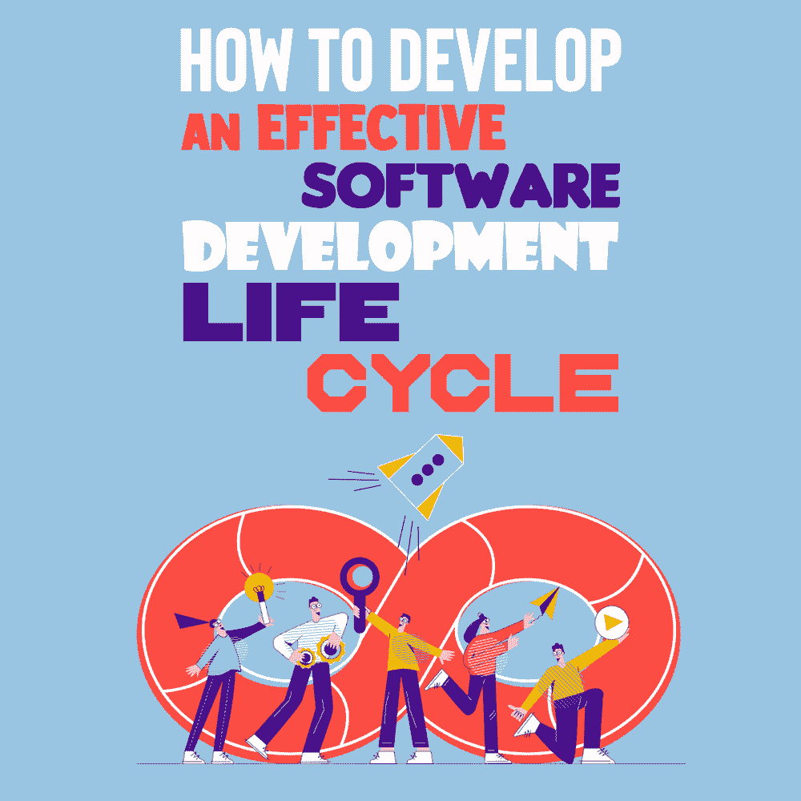
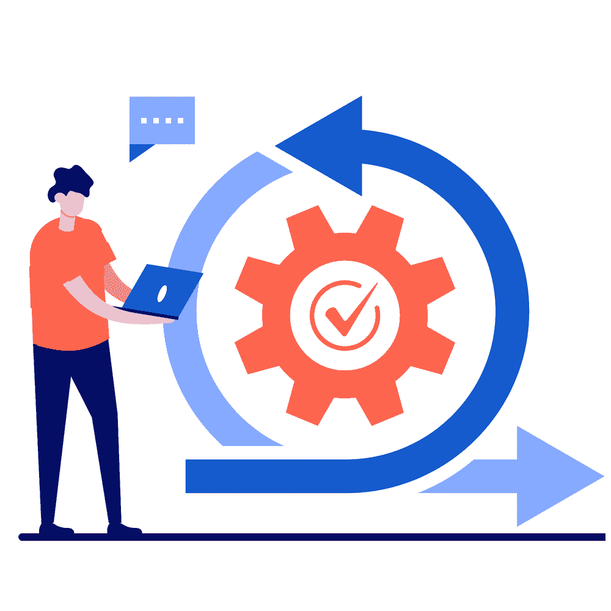

# 如何开发有效的软件开发生命周期

> 原文:[https://simple programmer . com/effective-software-development-life-cycle/](https://simpleprogrammer.com/effective-software-development-life-cycle/)

The early 1940s to 1960s was the beginning of the era of the information system and its development. Before that, Frederick Taylor and Henry Gantt came up with the idea of managing projects in 1910, drawing the first project management diagram in an attempt to define a working pattern for repetitive tasks. Their approach toward introducing a procedure for performing tasks enabled us to improve the productivity of our industrial sector. Developers follow the same process for software development.

软件危机之后，专家们发现有必要以更有组织的方式管理软件开发过程。他们的主要焦点是开发一个系统化的结构来简化流程，提高开发的成功率。因为这个行业是如此的动态，所以需要不断地更新我们的开发过程，使之成为新的和改进的版本。

因此，我们有许多方法来开发软件，从而提高效率。这些方法包括[瀑布模型](https://simpleprogrammer.com/software-development-methodologies/)、[敏捷模型](https://simpleprogrammer.com/agile-implementation/)等等。许多开发人员认为，敏捷模型是最可靠、最流行的软件开发模型。

开发过程中没有良好模式的开发人员不得不花费很多时间来创建一个成功的工具。他们需要一个合适的框架来管理他们的任务、财务和资源。因此，该领域的专家强烈建议您遵循软件开发生命周期(SDL)。在这篇文章中，我将为你提供一个全面的指导，告诉你如何通过一个可靠的过程来开发有效的软件。

## 什么是 SDL？

软件开发生命周期是一个标准的过程，它通过详细的步骤来设计有效的软件。许多开发团队遵循这种方法来在给定的时间框架内满足客户的需求，同时减少成本和资源。

正如我将在本文后面向您展示的，生命周期包括 6 到 8 个步骤——尽管根据项目的不同，开发人员可能会添加、删除和组合这些步骤。这些步骤的最终目标是让您在整个开发过程中保持高度集中，使您能够评估和提高软件的质量。

因为这个过程会产生有价值的结果，所以许多开发人员会在上面花费数小时，以便他们的工具能够按照预期顺利运行。除了上述所有好处之外，软件开发生命周期还包括识别低效、降低成本和修复错误的测试。

## SDL 是如何运作的

软件开发生命周期是一种提高质量，同时减少生产时间的方法。SDL 提供了一个帮助你评估项目和实现目标的计划。此外，它定义了项目的需求。当你理解了你的项目的必要性，你就可以预见错误并找到最好的解决方案。

关注 SDL 的根本原因是为了测试你的项目开发过程的可操作性，行动计划如何运作，以及你如何改善团队中同事之间的合作。

完成开发过程后，您可以运行 SDL 过程并识别潜在的问题。一旦你发现了问题，你就会找到解决方案并付诸实施。由于这是一个重复的过程，您必须重复生命周期，直到工具符合预期。许多开发团队没有意识到，通过额外的努力，他们可以节省大量的金钱、时间和资源。

在您实现任何软件开发生命周期模型来开发和分析您的软件之前，您需要[确定该工具对于您的项目是否是正确的](https://simpleprogrammer.com/best-test-management-tool/)。当你选择一个过程时，考虑你的团队的规模，他们的能力和经验，项目的规模和复杂性，以及你的团队将如何使用它。

## SDL 的阶段

为了使开发过程高效、顺利和多产，需要遵循特定的步骤——软件开发生命周期的各个阶段。它们如下。

### 规划

SDL 的第一阶段包括头脑风暴或计划。从一个想法开始这个过程，并与团队讨论实现这些想法的方法。仔细评估项目，考虑各种条件，包括将成员分配到团队，设计领导计划，根据目标安排计划，以及评估劳动力和材料成本。向您的团队解释该流程的所有基本要素，以便他们关注相似的目标并避免混淆。

### 需求定义

在这个阶段，您必须定义项目是关于什么的，以及如何使开发过程更加可行。除了开发引人注目的设计和干净的代码，找到一个可行的解决方案需要你的团队对项目有一个更好和全面的理解。

### 设计和原型制作

一旦你的团队成员对他们正在开发的东西有了透彻的理解，就该开始设计了。工程师和设计师将定义[工作流](https://creately.com/blog/diagrams/what-is-a-workflow-guide-and-templates/)和流程，以利用数据库结构和设计提供解决方案。在这个阶段，团队的主要焦点是为下一步设计一个[原型](https://creately.com/blog/diagrams/what-is-prototyping-techniques-process/)。

### 发展

The development process includes coding and converting the prototype into the final software. This is the longest process in the software development life cycle. A single developer can write a small project; however, for larger projects, you should break down the coding process and divide the writing tasks between different developers or teams.

您可以通过源代码或访问代码来跟踪开发人员的更改。这个阶段还包括文档，文档是解释开发人员为什么使用特定代码的快速指南。文档可以是视频指南、书面指南或源代码注释。

### 测试

一旦你的团队完成了开发过程，他们[开始测试](https://simpleprogrammer.com/advanced-software-testing/)。质量保证团队将进行测试，包括系统集成、功能和互操作性。此外，他们通过用户验收测试确保代码是干净的。他们的主要目的是满足业务目标。

### 部署

这一过程涉及项目的数据和其他组件的实际安装和实现。完成这一阶段所需的时间和精力取决于工具的复杂程度。

### 操作和维护

一旦您在市场上实现了该软件，您必须及时更新该工具并运行维护。这是软件开发生命周期的最后阶段，它包括通过添加新功能和定期升级来提高性能，从而满足最终用户的需求。

## SDL 的不同模式

在软件开发生命周期中，有许多模型可以帮助您，每一个模型都包括软件开发过程成功的不同步骤。下面，我将解释一些流行的模型和它们各自的优缺点。

### 瀑布

瀑布是用于软件开发的第一个模型。这个模型由不同的阶段组成，包括需求收集、设计、构建、测试、开发和维护。简单易用，瀑布使您能够为每个阶段生成特定的输出以及评审。

选择这种顺序生命周期模型的另一个原因是，它适合有明确说明的小项目。这种模式适应性强，但成本高。在这个模型中，你可以评估软件的可行性和连续性。

### 敏捷

敏捷模型解决了许多传统模型无法解决的问题。它包括不同的增量和迭代过程模型，侧重于客户满意度和过程适应性。使用该工具的主要目的是根据客户的需求开发软件。

如果你的团队技术高超，并且你想避免文档以加速他们的开发过程，那么最好的选择就是[敏捷模型](https://www.amazon.com/dp/1628251999/makithecompsi-20)。这些工具灵活且适应性强，但需要大量的经验来理解，因为将产品分成不同的小部分来交付特定的功能是一项艰巨的任务。

### DevOps

与敏捷模型相似， [DevOps](https://simpleprogrammer.com/devops-code-apocalypse/) 将通过结合不同的工具和实践来增强软件的可用性和相关性。DevOps 的主要特点是它加快了软件开发过程，因此您可以在竞争激烈的市场中生存下来。

该模型包括您可以收集和评估来自最终用户的反馈的阶段。使用 DevOps 的一个缺点是，它不能增强您的沟通和协作过程，所以您必须花费额外的资金在这个过程中包括类似的工具。

### 螺旋模型

该模型是顺序线性开发模型和迭代开发过程模型的组合。螺旋模型是最灵活的模型之一。在使用螺旋模型时，你必须一次又一次地经历这个过程，直到你找到想要的结果。每一次重复都会进一步提高你的工具。

螺旋模型有四个阶段，包括识别需求、设计基线、生产实际软件和分析风险。螺旋模型使运营团队和开发人员能够将工作流结合起来，节省时间并降低效率。

### Scrum 方法论

Scrum 是敏捷管理系统的进化。适应之后，你可以提高你的[软件开发过程](https://www.amazon.com/dp/148423944X/makithecompsi-20)的生产力。通过保持信息和需求透明，它使您能够生产更高质量的产品和开发更好的团队动态。

scrum 流程包括分析和组织待办事项清单，冲刺计划。Scrum 是一个简单易懂的框架，它使你能够管理复杂的任务，并为软件开发过程带来透明度。

## 有效的 SDL 有助于你实现目标

You can achieve your business goals and future growth by thoroughly implementing the required phases of the software development life cycle.

通过利用软件开发生命周期，您有机会开发工作流。然后，您可以选择您的开发团队应该知道的详细程度——无需提供所有信息。借助项目管理工具，您可以进一步改进工作流程。请记住，SDL 模型不是永久的。随着团队的成长、环境的变化和业务的扩展，您可以改变流程。

请记住，有效的软件开发生命周期决定了工具的用途，因此您可以开始开发过程。您选择的软件开发过程将帮助您实现您的战略和目标。此外，SDL 帮助确定在一定时间内有效利用资源的最佳方式，并确定最有利的解决方案。