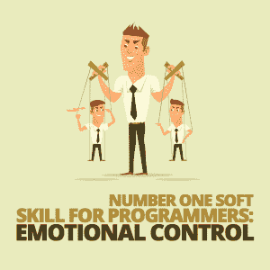
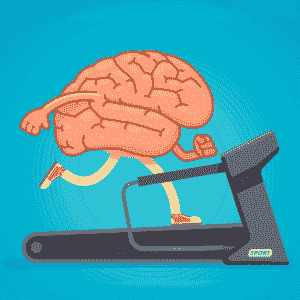

# 程序员的头号软技能:情绪控制

> 原文：<https://simpleprogrammer.com/emotional-control-programmers/>

If you are a follower of Simple Programmer, you probably have heard of John Sonmez’s book, *[Soft Skills: The Software Developer’s Life Manual](https://amzn.to/2Kd7T0z)*. In it, he explains some life skills you need as a developer in order to be a better person and developer overall.

我在这里要告诉你的是[大师级的开发者软技能，我相信它取代了其余的](https://simpleprogrammer.com/soft-skills-for-programmers/) : [学习如何处理](https://www.youtube.com/watch?v=1-Im7Kao16Y)和控制你的情绪以及导致情绪的问题。作为人类(不像有些人认为的机器人)，程序员也是有情感的生物。

今天我想和大家探讨一下，作为一个程序员为什么要学会控制自己的情绪，以及提高这种大师级技能必须要养成的一些技巧。

## 为什么情绪控制对程序员很重要？

在我教你提高情绪控制能力的技巧之前，我想确认我们的观点是一致的，你真的相信发展这种技巧是非常重要的。

首先，作为程序员交给我们的工作和任务(或者我们自己分配的工作和任务)通常涉及高水平的逻辑思维和推理。大多数编程都是纯粹的逻辑任务。我们不希望情绪来把我们带离逻辑的道路。

当情绪开始起作用时，它可以做出一个 100%合乎逻辑的决定，并使其部分情绪化，部分合乎逻辑。在某些情况下，情况甚至会更糟:它可能会做出完全合乎逻辑的决定，并使之完全情绪化。

看看这个例子:高级工程师 Bob 负责为 Antonio Inc .的后端构建支付系统。他的那部分申请本周末到期，但是他刚刚听说他交往三年的女朋友欺骗了他。这让他陷入情绪的恶性循环。这导致他在工作中注意力不集中，做出糟糕的工程决策(比如没有建立一个完全安全的支付系统)，并使他拖延完成自己的后端工作。

如果他的决策完全符合逻辑，他将能够毫无问题地集中精力，Bob 将能够做出适当的可持续工程决策，这些决策是长期支持应用所必需的。然而，如果他继续做出糟糕的决定，这可能会影响他在公司的未来。在这种情况下，情绪控制对你的程序员生涯的成功至关重要。

现在让我们来分解情绪控制的技巧，这样你就可以学习如何提高它。

## 提高情绪控制力的三件事

作为一个大半辈子都在与情绪斗争的人，我把情绪控制分成了三个技巧，你可以在情绪发生时努力识别它们，减少它们对你的影响，并最小化情绪风暴的长期影响。

### 精神韧性

我想讨论的第一个技巧是情绪的预防措施。我把这归类为精神韧性。精神韧性，听起来就是这样:能够在精神上承受一定程度的挣扎或痛苦。这是你能处理任何情绪问题，不让它影响你的程度。

你听过这句话吗:“一盎司的预防抵得上一磅的治疗”？这正是精神韧性和情绪控制的工作原理。如果你心理坚韧，处理每天产生的随机的小情绪真的很容易。更大的情绪问题或风暴肯定会影响你，但如果你没有建立这种程度的心理韧性，它们会影响你。

你会问，如何提高自己的心理韧性？这很简单，但同时也很难。

你需要做一些让你精神坚韧的活动。你认为你做不到的事情。让你挣扎的任务，但是你通过努力和决心克服了它们。例如，做一些激烈的运动，让你的身体达到极限。这样做迫使你挖掘你的思想，把你的身体推向从未面对过的不适水平。

另一个是剥夺你自己喜欢的东西，比如食物。这些活动迫使你真正站起来反对自己，并决定做一些引起不适的事情。

这就是为什么它如此简单——你通过做让你表现得意志坚强的事情来建立它。难的是，精神上坚韧不是一件容易的事；它包括你与舒适做斗争，并要求在一定时间内不舒适。

作为一名程序员，具备坚韧不拔的精神至关重要。它允许你尝试以一种新的和创造性的方式实现一个算法，通过把你对批评的恐惧放在一边来推动你的应用的边界。在精神上让自己变得坚强，可以让你比其他竞争对手更加努力地工作(无论是竞争你职位的公司还是程序员)。

### 精神意识

你必须建立的下一个技能是心智觉知。这是一种当你拥有自己的想法时看到它们的能力。能够从第三人称的角度看待自己。例如，也许你意识到你即将开始没有明确需求的编程，所以你停下来定义需求。这项技能将帮助你注意到你拥有的情绪。一旦你注意到这种情绪，并能给它贴上标签，那么你就能对这种情绪采取行动。

The key fact that you need to realize is that we experience emotions due to our reaction to an event. Our mind is trying to tell us something when we feel sad, angry, or happy. It is saying that we must do something to handle this emotion. There is some action you must do in order to get through this problem.

你如何变得有意识？任何能让你集中注意力的活动都有助于提高这项技能。例如，想象、冥想和任何形式的自我分析都会让你洞察自己的想法。

通过观想和冥想，你可以看到你的思想在转变，你在想什么。当你知道自己在想什么的时候，你就能明白自己在任何时刻的感受。

作为一名程序员，意识现在比以往任何时候都更重要。关注你是如何影响你的队友的，这对任何一个与他人密切合作的人来说都是极其重要的。编程时注意确保测试每一个测试用例对于构建一个健壮的应用程序也是非常重要的。

通过自我分析，你可以看到在某一段时间内你的想法，看看你的注意力去了哪里。做这些活动会让你更有当下感，帮助你实时注意到那些情绪。

### 精神状态

你必须培养的最后一项技能是心态。具体来说，积极的心态是任何人、任何事都无法从你身上夺走的。这是一种保持积极的能力，尽管你面临着一个消极的环境。

如果你是一个消极的人，那么消极的情况会比积极的人影响你更久更坏。原因是，一个积极的人会花时间试图找到他们可以从这种情况中获得的好处。消极的人会把注意力集中在他们对问题的消极看法上，从而使问题变得更大。我们想成为找到解决方案的积极的人，而不是关注问题。

建立这个技能归结为给自己洗脑，让自己成为一个积极向上的人。做一些事情，比如想象你生活中的目标和积极的环境，会有所帮助。

作为一名程序员，你能为自己做的最好的事情之一就是积极向上。当给定看起来不可能的需求时，态度积极的程序员会找到方法去做，而态度消极的程序员会找到做不到的方法。被认为是一个不管成败与否都能完成工作的开发人员将会帮助你提升你的职业生涯。

使用一系列有助于强化你想成为的人(可能是一个自信、熟练、积极的程序员)的肯定可以帮助训练你的思维，让你看到自己是一个努力在某种情况下寻找积极方面的人。

## 今天控制你的情绪！

让我们来看看鲍勃的生活在阅读了我的(安东尼奥·库奇涅罗的)[关于情绪控制的书(《云:抵御你的情绪风暴)】](http://acucciniello.com/books/)和这篇博客文章后发生了怎样的变化。

鲍勃首先采取措施变得意志坚强。他开始做一些激烈的举重和禁食。这使他对通常影响他的小事免疫。但不会了。他现在精神上更坚强了。

然后，他努力提高自己的精神感知能力。他开始每天冥想。这样做了几个星期后，他注意到自己的想法正在发生。当他生气、悲伤或高兴时，他能控制住自己。

最后，他努力改变自己的心态，从消极转为积极。他现在总是在各种情况下寻求生活中的巨大进步。他不允许负面的情况让他沮丧。

结果，鲍勃在事业上一飞冲天。他升到了管理职位，负责制定公司成败的决策，因为他非常善于消除各种情况下的情绪因素。

你想像鲍勃一样吗？太棒了，那就把你在这里学到的东西拿出来开始练习吧。如果你能学会控制你的情绪，不让你的情绪控制你，那么你就能花更多的时间去创作，成为一个更快乐的程序员和人。