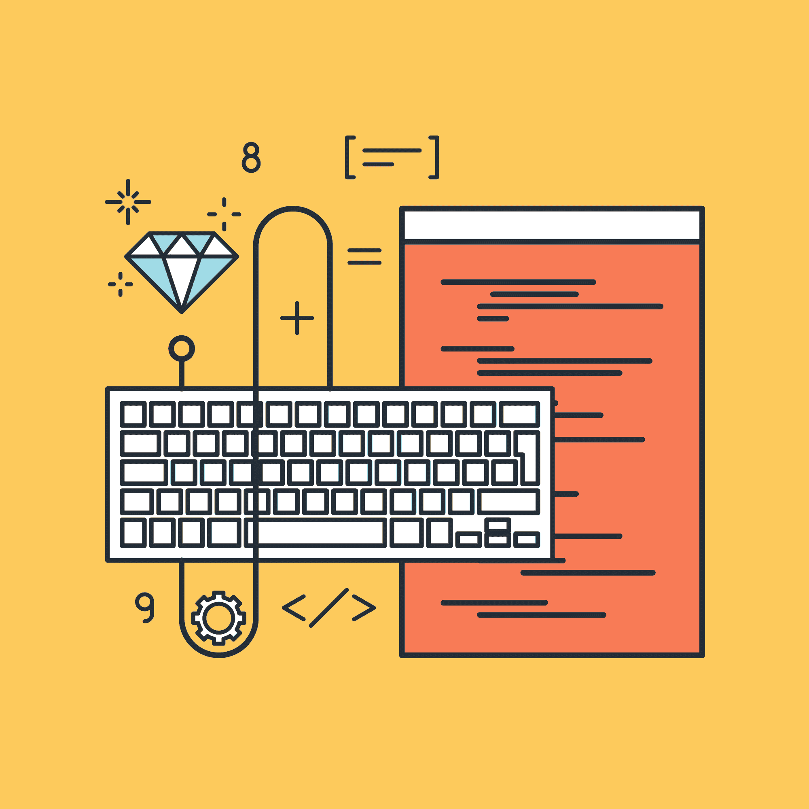

# 移情如何成为软件开发人员的超能力

> 原文：<https://simpleprogrammer.com/empathy-software-developers/>

有时很难记住最终会使用我们产品的男人、女人，甚至网络流氓。但重要的是能够从他们的角度看问题，最终了解他们的想法和感受。这很重要，因为作为开发人员，它可以帮助您做出更明智的决策。

不，同理心不是热门的新编程语言。但是同理心可以作为软件开发者的一种超能力。

在四种情况下，移情可以成为软件开发人员的秘密武器。但首先，我们先从一个定义开始。

## 什么是共情？

同理心是对他人经历的理解和敏感。最大的问题是能够理解那些没有明确传达给你的经历。

移情研究专家布琳·布朗博士在她的书《T2 大冒险》中写道:“移情是一种奇怪而强大的东西。没有剧本。做这件事没有对错之分。这只是简单的倾听，保留空间，保留判断，情感上的联系，以及传达“你并不孤独”这一令人难以置信的治愈信息"

所以有了同理心，你就能理解别人，而不用他们直接告诉你他们的感受。它是识别他人的情绪，并能够设身处地为他人着想。冷静的收银员会先倾听愤怒的顾客，而不会打断他们的解决方案。

作为软件开发人员，我们可以将同理心应用到我们的工作中，所以让我们来看看你可以同理心的四种方式。

## 软件开发人员的同理心

如果你正在开发软件，它几乎总是为其他人或者和其他人一起开发。因为软件开发涉及到其他人，同理心可能是有用的。

它可以帮助我们解决问题，抓住对用户和开发人员来说重要的核心。当你把同理心放在技术的中心时，人类的联系会变得更强。

在开发人员方面，这些联系促进了协作和员工保留。这为每个相关人员创造了一个更好的工作空间。

这有助于我们创造更好的产品，因为我们更好地了解将使用它们的人。

同理心在用户体验测试中有一个合理的位置，但也可以在这四个领域中找到。

### 1.收集需求时

软件开发人员在为他们的项目收集需求时应该运用同理心。我们为人们开发软件；通过使用同理心，你会对与你的软件交互的人有更好的理解。

移情是成功软件的必备要素。软件是一种思想的表达。编码是将这个想法构建成一个工具，其他人将使用它来实现一个目标。通过同情别人，甚至是未来的自己，你就能建立一个更有效的工具。

有了同理心，你就能更快地理解使用你软件的人。其他开发人员可能会选择采用逻辑方法来充实需求。但是，通过使用移情作为你的秘密武器，你将有一个清晰的方法来专注于最重要的人——你的最终用户。

### 2.在编码过程中

软件开发人员在与其他人一起开发软件时应该运用同理心，因为你更有可能预测到你的队友的反应。同理心是团队工作中很重要的一部分。

代码是另一种交流形式。当设计和开发一个系统时，我们应该努力与那些与我们的代码进行交互的人分享我们的理解。同理心可以帮助我们设身处地为他人着想。

此外，有了同理心，你更有可能构建可维护的代码。其他开发人员可能不会考虑同理心给他们带来的优势。他们很快为了速度而牺牲可维护性。他们不会在系统的组件层面考虑其他开发者或者未来的自己。通过使用同理心作为你的秘密武器，你将会用适当的文档写出更干净的代码。

### 3.同时支持我们创建的程序

软件开发人员在操作我们创建的软件时应该使用同理心，因为团队中的每个人都应该对交付有价值的软件负责。

软件团队中有多个角色。一个人可能身兼数职，但通常每个角色都由一个单独的团队成员执行。

一些开发人员乐于将问题抛给 QA、IT 或客户支持。他们觉得代码合并后他们的工作就完成了。

同理心帮助我们在更深层次上与队友合作并理解他们。同理心允许开发人员理解别人收拾他们的烂摊子是什么样的，反过来让他们想给别人制造更少的烂摊子。它帮助开发人员对他们自己的工作负责。

将同理心作为你的秘密武器，你将能够打破隔阂，更好地帮助他人，从而成为一名更有价值的团队成员。

### 4.当领导的时候

软件开发人员在领导时应该运用同理心。领导力与我们每个人都息息相关，因为我们总是在影响他人，即使我们并不想这样做。

软件开发领导中的同理心是自由和责任之间的平衡。你会更有效地说服别人你的观点，但同时，你更有可能看到技术辩论的双方。

这种从他人角度看问题的能力是领导时的一项关键技能。

一些开发者乐于单干，只关注自己的需求。但是通过把同理心作为你的秘密武器，你将能够理解你的同事的需求，并给予他们成为一个伟大团队所需的领导力。

## 同理心可能是你的超能力

作为软件开发人员，我们通常被技术所束缚。对于外界来说，典型的优秀开发人员往往看起来像数据驱动的斯波克式的人物，有时我们作为开发人员很容易陷入这种思维模式。

但是对于软件开发人员来说，拥有或实践同理心可能是一个秘密武器。因为同理心帮助我们从别人的角度看问题，当我们收集需求时，在编码过程中，当我们支持我们的工作时，当我们领导时，它允许我们解决问题。

将移情作为你的超能力，你将成为你的团队、用户和雇主的英雄。