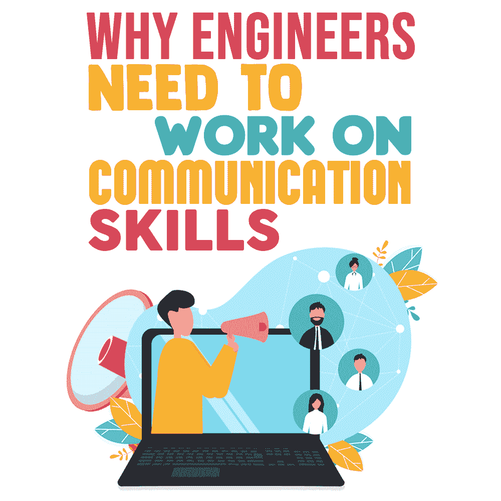

# 为什么工程师需要提高沟通技巧

> 原文:[https://simple programmer . com/engineers-communication-skills/](https://simpleprogrammer.com/engineers-communication-skills/)

Engineers are known as the big brains of the career world. We are known as problem solvers, and that’s a good thing. What we are not known for is our ability to speak. Well, at least not in terms that regular humans can understand. That’s too bad because we, as engineers, have a lot of good knowledge we could share if we could just learn how to get out of our own way.

不一定非要那样。他们在工科学校没有教我们有效沟通的知识，并不代表我们就不能自己学。

你可能想知道为什么你要花时间去学习如何成为一个更好的演讲者。你认为花时间学习另一种编程语言会更好。

让我给你一些理由，为什么学习如何成为一个更好的沟通者是值得的。

## 更好的演讲者赚更多的钱

不相信我？想一想世界上有多少程序员。根据[埃文斯数据](https://evansdata.com/press/viewRelease.php?pressID=278)，2019 年有 2390 万程序员。现在想想那些程序员中有多少人发展了追随者；你可以用双手数一数。这些和其他的有什么区别？为什么有些工程师似乎领先了，而有些却落后了？

更高的智力并不能保证事业成功。是的，你绝对必须了解你的主题，但并不总是最聪明的工程师能拿到最高的薪水。我认识一些工程师，我相信你也认识，他们非常聪明，但似乎从未真正取得成功。

在我大学毕业后工作的第一家公司，有一位程序员已经在那里工作了好几年。当我问他的一位同事，为什么那个程序员一直没有得到提升时，他的回答是“他不擅长面试。”他显然非常了解这个软件，而且他在那里呆了足够长的时间来展示他的技能。然而，他无法提升到下一个层次，因为他与他人沟通的能力没有达到标准。

能把他们的技术技能和良好的表达能力结合起来的工程师是那些有更高收入潜力的人。只要看看“鲍勃叔叔”马丁的任何一个“干净的编码者”视频，你就会明白为什么他如此受欢迎。他是否写了一本关于坚实的软件原理的伟大著作[？绝对的。他有几十年的经验吗？当然了。但我合作过的许多其他工程师也是如此，他们中没有一个人能像“鲍勃叔叔”那样拿高薪](https://www.amazon/dp/0132350882/makithecompsi-20)

一些程序员认为学习如何说得好在某种程度上有失身份，好像良好的沟通是只适用于销售人员的天赋。有些人会说他们不需要更好的沟通，因为他们不愿意“玩办公室政治”。他们对那些能言善辩的工程师有点不屑，认为其他人是奉承者或出卖者。

如果你愿意，你可以这么想，但从我的观察来看，擅长演讲的工程师永远不用担心发出简历。能够有效沟通自己想法的工程师会为自己创造更多机会。你已经很努力了；为什么不在你的技能中加入良好的沟通，增加你获得更好职业的机会呢？

## 你通过教学学得更快

当我在技术支持部门工作时，我经常需要向客户解释软件失败的原因。结果，我不得不学习软件的底层工作方式。我了解了端点如何将信息传输到主服务器，以及如何解密信息文件并检查其内容。

这些信息都不在技术文档中。很多都是我不得不从开发人员那里了解到的部落知识。

我这样做是因为我想尽可能多地教育客户。当然，客户不必知道得像我一样多，但我想做好准备，以防他们问我更多的试探性问题。为客户做准备迫使我学习比平时更多的软件知识。

Now, you’re probably thinking “I’m a programmer who never has to interface with the customer, so I don’t have to worry about teaching anyone.” I can tell you that I’ve done more training for fellow engineers than I have for external customers. Just because speaking is not in your job description, that doesn’t mean you will never be called on to do it.

假设您向老板申请一个新的集成开发环境(IDE)。请求被批准，您就可以在计算机上安装新的 IDE 了。当你的老板带着一个要求来找你时，你正在愉快地编写和调试代码。她要求您为团队的其他成员准备一份关于如何最好地使用新 IDE 的快速演示文稿。

你会即兴表演吗？你会不会只是把你的屏幕投影到大家面前，然后开始点击 IDE 界面上的按钮，而不解释你在做什么或者为什么？我认为不是。

我认为您应该花时间准备一些您将使用该工具的最常见的场景。然后你可能会走完每一个场景，仔细解释你在做什么，为什么它是相关的。你甚至可以提供一张幻灯片供小组参考。

在准备演示的过程中，您会对该工具及其工作原理有更好的理解。您会熟悉该工具的优点和缺点。简而言之，你会成为主题专家。都是因为你不得不把你知道的教给别人。所以下次你被要求谈论某个话题时，不要抱怨；心存感激。你就要成为专家了。

## 世界需要听到你的信息

作为一名工程师，解决世界问题是你的工作。永远不要低估你的贡献的影响力。在这个过程中的某个地方，你会有一个改变生活的想法。

也许它不能治愈癌症，但在你职业生涯的某个时刻，你会获得一些洞察力，可能会让其他人的生活变得更好。

你可能会在一个软件中发现一个错误，这个错误可能会导致自动驾驶汽车在没有警告的情况下坠毁。您可能会发现危及银行安全的漏洞。或者，您可能会发现一种减少测试一个软件所需时间的方法，这样只需要几分钟而不是几个小时。

无论如何，你将有一个重要的信息与世界分享。

然而，仅仅有一个伟大的想法是不够的。记住好主意多如牛毛。良好的沟通不仅仅是展示信息；这是关于与你的观众联系。

你的信息很重要，你必须以一种你的听众会接受的方式来表达。这就是你需要磨练说话技巧的原因。如果你不能让人们支持你的想法，它还不如不存在。

《杀死圣牛 的作者加勒特·冈德森(Garrett Gunderson)将你带给世界的价值定义为你的精神资本和关系资本的函数。你无法靠自己获得成功。你需要与能帮助你传播信息的人建立关系。没有良好的沟通技巧，你就无法建立关系。

所以帮你自己一个忙。帮这个世界一个忙。学习如何成为一个好的沟通者。因为你有一个信息要分享，世界需要听到它。

## 更好的沟通者获得更好的利益

这与加薪并不完全相同，但不要低估让雇主为你的培训买单的好处。如果你不能以有利于雇主的方式提出要求，你也不可能让雇主为你的培训买单。正如科斯塔·兰普鲁在他的文章《T2》中所说。large-mobile-banner-2-multi-119 { border:无！重要；显示:屏蔽！重要；浮动:无！重要；行高:0；边距-底部:15px！重要；左边距:0！重要；右边距:0！重要；margin-top:15px！重要；最大宽度:100%！重要；最小高度:250px 最小宽度:250 像素；填充:0；文本对齐:居中！重要}

…[I]如果你的雇主决定投资于你的技能，这对你和他们都有好处。向他们展示这一事实，突出他们的优势。

Knowing how to phrase things in a way that benefits others is key to getting what you want. I worked with a man who wanted to buy a very expensive saw. He knew his wife wouldn’t approve of the purchase, so he explained to her that the new saw would equip him to build that new dining room table she’d been wanting. He got his saw, and she got her dining room table, it’s a win-win situation.

这里有一个警告:这不是关于操纵人。优秀的沟通者不应该仅仅为了从别人那里得到他们想要的东西而使用他们的权力。我认为丹妮拉·佩特洛娃写这封信的时候一针见血:

这是关于倾听你周围的世界，并为了你的公司和同事的利益做出适当的回应。

是的，成为一名优秀的沟通者可以帮助你爬上公司的阶梯，但是你不想让你的同事成为阶梯上的横档。

## 不要害怕交流

我要鼓励你磨练你的沟通技巧。如果你还不习惯，这会让你很不舒服，但是通过练习可以克服。作为工程师，我们并不经常考虑我们如何才能有所作为，因为我们认为我们将永远在幕后。

这里有一个方法，即使我们这些幕后的人也可以有所作为:学习如何交流，这样你就可以分享你的知识。你会从中受益，因为它会迫使你成为一个主题专家。你周围的人会受益于学习一种新的做事方式。它可能不会改变地球的轴心，但它肯定会为你打开一个全新的世界。